# Alpha Bank — Week 23 周报（2026-06-08）

---

## 📋 周报摘要（可直接贴）

**BTC 1s 高频 Alpha 挖掘 — Week 23 进展**

本周完成三条主线工作：

**① Return 口径确认**：调查内网 `close_1s` 与本地 `ret_1000` 的差异，确认两边分别是 trade-tape 差分和 log mid-quote 差分，66% 的秒对不上、均值偏差 0.41 bp，非 bug 而是机制不同。已坐实本地侧算法（浮点精度内一致率 83.5%），内网侧验证待 Test B 闭环。行动项：1s 模型必须固定一个 ground truth，≥10s 跨源安全（corr=0.898）。

**② Bar 数据因子评估**：对 BTC 永续 12.18M 行 bar 数据构建 33 因子，IC 维度——bar 对 LOB 边际 IC≈0（OLS +0.0002，LGBM −0.005）。但 PnL 维度出现分叉：**OLS 上加 21 个 bar 成交流/动量因子，net PnL +17%、Sharpe 16.4→18.4**，机制是信号更平滑→换手↓→费用↓，而非预测精度提升。LGBM 上反转成有害（换手+624/20天，net↓）。

**③ 基础模型 IC Sweep + Backtest**：16 个 tabular 模型完成，GBDT 类 IC≈0.30 稳定复现，发现 **IC 高≠Sharpe 高**——OLS（IC=0.264，Sharpe=16.8）远优于 LGBM（IC=0.299，Sharpe=7.5）。根因：回测赚的是极端信号（top 0.01%）的钱，OLS 在该区间方向准确率 71% vs LGBM 54%。同时完成 return 结构分析，**推荐 horizon 60s**（AC1=−0.020，三项可研究性指标最干净），跨资产建模从 ≥10s 起。

**关键结论**：下一步优先推进 60s mean-reversion alpha baseline + RNN（待内网数据到位）+ bar 因子在 OLS 路线的生产化。

---

---

## 一、Return 口径调查（内网 vs 本地）

> 文档：`trading_1s_dump/report/report.md`

### 背景
模型线上回报不符合预期，怀疑内网 1s return 定义与本地训练用的不同，系统排查差异原因（2025-12 全月 BTC，2.5M 样本）。

### 核心数字

| 指标 | 数值 | 说明 |
|---|---:|---|
| 29天总秒数 | 2,502,055 | 全量 |
| diff ≠ 0 占比 | **66.2%** | 三分之二对不上 |
| 均值 \|diff\| | **0.41 bp** | 本地 1s std≈1bp 的 60% |
| p99 \|diff\| | 3.38 bp | 极端日里 4-5× 平均波动 |
| 非零秒精确相等数 | **0** | 整月没有一秒真正对得上 |

### Zero-set 拆解（中位，29天稳定）

| 类别 | 占比 | 含义 |
|---|---:|---|
| both zero | 30.9% | 两边都认为没动 |
| **only local zero** | **37.2%** | 本地=0、内网非零 ← 核心证据 |
| only internal zero | 7.5% | 内网=0、本地非零 |
| both nonzero | 23.9% | 都非零但数值不等 |

### 散点图：两边逐秒对比（20251201）

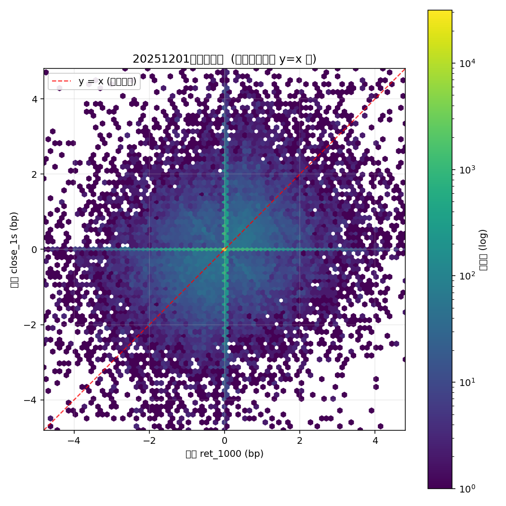

*X 轴本地 `ret_1000`，Y 轴内网 `close_1s`（bp）。红线 y=x 是"两边相等"的理想线。实际密度明显偏离，且大量点落在两坐标轴上（一边=0、一边非零），直接证明两边是不同的序列。*

### Zero-set 逐日堆叠（29天）

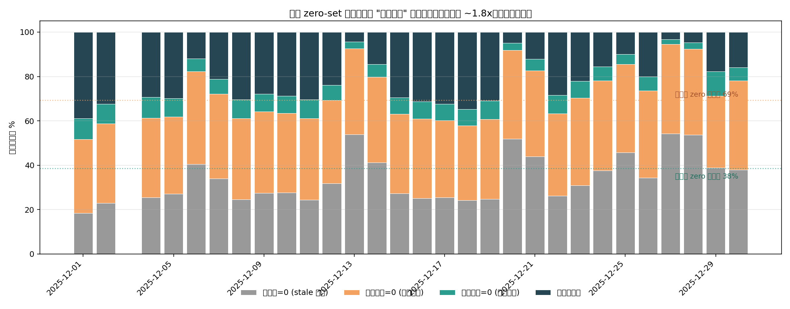

*橙色块（only local zero）每天稳定占 ~30%：本地认为没动的秒里，内网在动。本地总 zero 率中位 69% vs 内网 38%，**1.8× 比例全月不变**，是机制层的结构性差异，不是噪声。*

### 结论与行动

- **本地** = log mid-quote 差分，quote 不更新则 ffill → 高 zero 率
- **内网** = trade-tape 最后成交价差分 → 低 zero 率
- ✅ Test A（本地=log mid）已坐实：浮点精度内一致率 **83.5%**
- ⚠️ Test B（内网=trade-tape）待跑（≈30分钟，qrdev 上跑）
- **行动**：1s 模型 ground truth 必须选定一边；≥10s 跨源安全（实测 corr=0.898 @ 10s，0.963 @ 60s）

---

## 二、Bar 数据因子库

> 文档：`samson_alpha_zoo.md`（含 §7 PnL 复检增补，2026-05-29）

### 数据链路
```
bar@110200172@1_{date}.parquet（17 列）
  → bar_factor_panel.parquet（33 因子，全部 shift+1 causal）
  → lob_bar_combined_panel.parquet（53 LOB + 33 bar）
```

### 因子分类与 IC

| 类别 | 代表因子 | 单变量 IC | 结论 |
|---|---|---:|---|
| 流量不平衡 | `buy_vol_ratio` | 0.064 | ✅ 最强，被 LOB OFI 覆盖 |
| 价格动量 | `mom_1s` | 0.052 | ✅ 次强，被 LOB TrdPP 覆盖 |
| VWAP 压力 | `vwap_dev` | 0.033 | ✅ 弱信号 |
| 波动率 | `hl_range` | ≈0 | ❌ 无方向性 |
| 衍生品独有（OI/funding/taker/liq） | — | ≈0 | ❌ 1s 尺度全无效，需 ≥60s |
| 跨市场基差 | `basis` | — | ⛔ 删除（价格水平泄漏） |

### Combined IC 对比（53 LOB vs 53+bar）

| 模型 | IC LOB-only | IC LOB+bar | 边际 |
|---|---:|---:|---:|
| OLS | 0.2593 | 0.2593 | **+0.0000** |
| LGBM | 0.2883 | 0.2820 | **−0.0063** |

**IC 维度结论：bar 对 LOB 无边际增量。**

### PnL 复检：21个细粒度 bar 因子，OLS net PnL +17%

21 个因子分组：

| 组 | 个数 | 代表因子 |
|---|---:|---|
| 成交流 flow | 8 | `bvr`、`bvr_ma3/5/10`、`qimb`、`qimb_ma5`、`imb_sq`、`vol_surge` |
| 动量 momentum | 8 | `mom_1/2/3/5/10`、`vwap_dev`、`hl_range`、`mom1_x_bvr` |
| 额外 extra | 5 | `dollar_ofi`、`dollar_ofi_ma5`、`clpos`、`body`、`vwap_in_rng` |

### OLS net PnL 对比：LOB vs LOB+bar

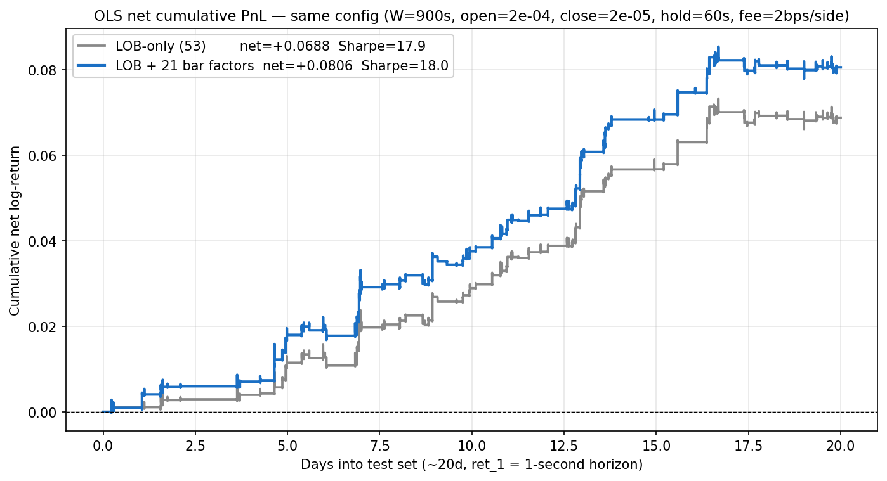

*蓝线（LOB+bar OLS）整条稳定压在灰线（LOB-only OLS）之上。同部署操作点（W=900s, open=2e-4, close=2e-5, hold=60s）net PnL: 0.0688→0.0806（**+17%**），Sharpe 17.9→18.0；各自独立调到最优稳健 Sharpe：16.4→18.4（**+2.1**）。IC 同期仅 +0.0002（几乎为零）。*

### 机制：降换手，不是涨 IC（OLS vs LGBM 960/780 配置配对对比）

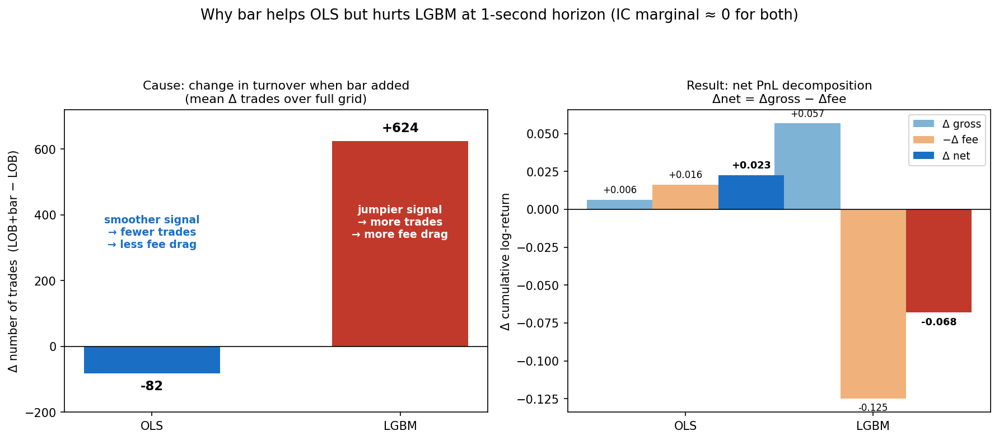

| 模型 | Δ换手/20天 | Δ费用 | Δgross | Δnet | net 胜率 |
|---|---:|---:|---:|---:|---:|
| **OLS** | **−82** | **−0.016** | +0.006 | **+0.023** | **70%** |
| **LGBM** | **+624** | **+0.125** | +0.057 | **−0.068** | 28% |

- **OLS**：bar 系数小而稳定 → 信号更平滑 → 换手↓ → 费用↓ → net↑
- **LGBM**：bar 被过拟合成跳动信号 → 换手暴增 → 费用反噬 gross，净 PnL 下行

### 诚实边界
- 提升集中在低换手、高阈值操作点；全部盈利配置（n=320）平均仅 wash（net 赢 56%）
- 强模型依赖：**只在 OLS 成立，LGBM 反转成有害**
- 测试期仅约 20 天，相对对比可信，绝对数字参考意义有限

### 主要坑点记录

- **时间对齐泄漏**：bar[t] 与 ret_1[t] 同区间，未 shift 时 IC 虚高 4.7×（0.30→0.06）；诊断法：单因子 lag+1 后 IC 暴跌即确认泄漏
- **自造 target 自相关**：用 bar close 算 target → momentum 出现 +0.0165 虚假提升；换成 mid-price target 后立即消失
- **combined IC 上限**：combined IC 不能超过 √(IC_lob² + IC_bar²)；一度虚高到 0.605（上限 0.377），排查发现价格水平特征泄漏

---

## 三、基础模型验证（IC Sweep + Backtest）

> 文档：`alpha_bank_mid_result.md`

### 16 模型 IC Sweep（n_test=3,494,402，chronological split）

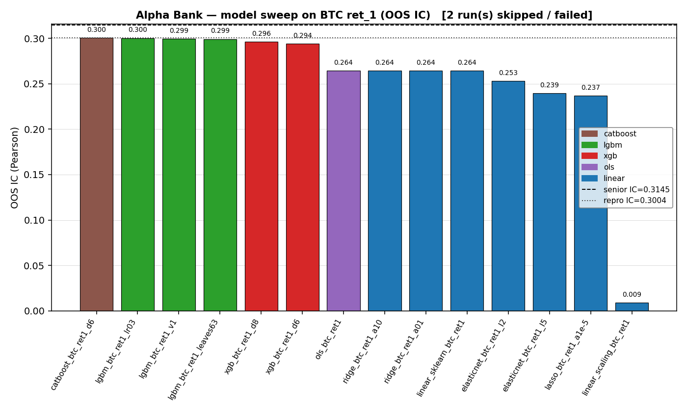

*GBDT 类（CatBoost/LGBM/XGB）稳定在 0.294–0.301，线性类（OLS/Ridge）约 0.264，稀疏正则（Lasso/EN）进一步下降。53 因子全部有效，过度压缩有损；GBDT 非线性建模带来约 +0.036 IC 增益。*

完整 IC 表（选主要模型）：

| 模型 | IC | 状态 |
|---|---:|---|
| CatBoost_d6 | **0.3005** | ✓ |
| LGBM_lr03 | 0.3002 | ✓ |
| LGBM_v1 | 0.2993 | ✓ anchor |
| XGB_d8 | 0.2961 | ✓ |
| **OLS** | **0.2645** | ✓ |
| Ridge_a01 | 0.2645 | ✓ |
| ElasticNet_l2 | 0.2529 | ✓ |
| Lasso_1e-5 | 0.2368 | ✓ |
| MLP / RNN | — | ⏳ 待内网数据+GPU |

### OLS 回测（最优模型）

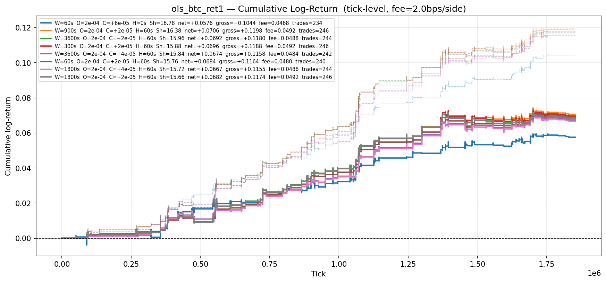

*OLS @2bps/side，top-8 参数组合净值曲线。最优（W=60s, open=2e-4, close=6e-5）20天净收益 +5.8%，单调向上，最大回撤 −0.5%。*

OLS 费率敏感性：

| fee | 最优参数 | Sharpe | net 20天 | trades |
|---|---|---:|---:|---:|
| 2 bps/side | W=60s, O=2e-4, C=6e-5 | **16.8** | +5.76% | 234 |
| 2.5 bps/side | W=60s, O=2e-4, C=6e-5 | **14.4** | +4.59% | 234 |
| 5 bps/side | W=300s, O=3e-4, C=6e-5 | **5.8** | +1.75% | 102 |

OLS 逐日 IC：

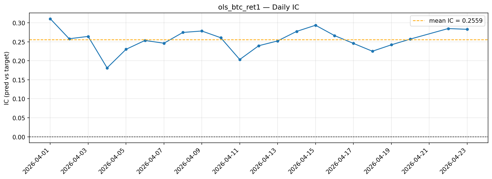

*均值 0.256，全程正值，无断崖，测试窗口内信号稳定有效。*

### GBDT 回测对比

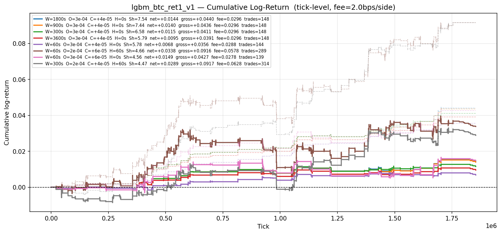

*LGBM @2bps，最优参数 W=1800s, open=3e-4，net=+1.44%，Sharpe=7.5，trades=148/20天。每天约 7 次，每次持续约 30 分钟。*

四模型综合对比（**IC 与 Sharpe 排序倒置**）：

| 模型 | IC | Sharpe @2bps | 最优 W | trades/20天 |
|---|---:|---:|---:|---:|
| **OLS** | 0.264 | **16.8** | 60s | 234 |
| LGBM | 0.299 | 7.5 | 1800s | 148 |
| XGBoost | 0.296 | 6.9 | 1800s | 168 |
| CatBoost | 0.301 | 6.4 | 1800s | 142 |

**OLS IC 最低，Sharpe 是 LGBM 的 2.2×。**

---

## 四、IC 低但 Sharpe 高的根因分析

> 文档：`pred_smoothness_analysis.md`

### 初始假说（pred 平滑性）→ 实测否定

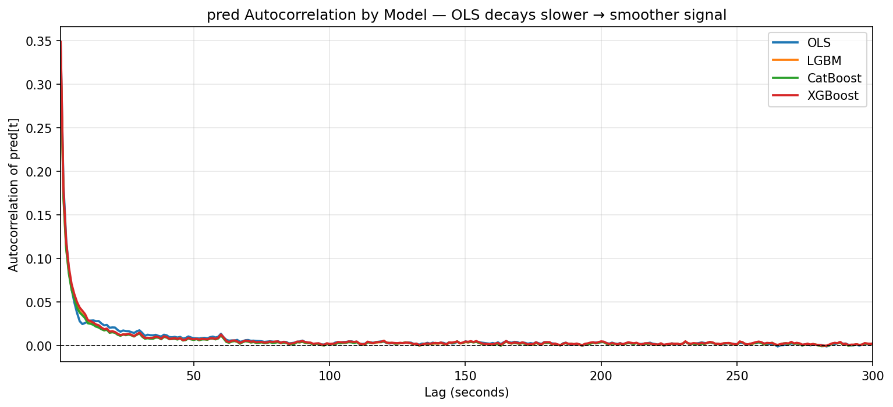

*四个模型 pred 在 lag=1..300s 的自相关曲线几乎重叠。lag=60s 时所有模型均约 0.012，差异不足 0.002。pred 平滑性假说不成立。*

| 模型 | autocorr(lag=60s) |
|---|---:|
| OLS | 0.0133 |
| XGBoost | 0.0124 |
| LGBM | 0.0116 |
| CatBoost | 0.0116 |

### 信号越阈值后持续时长

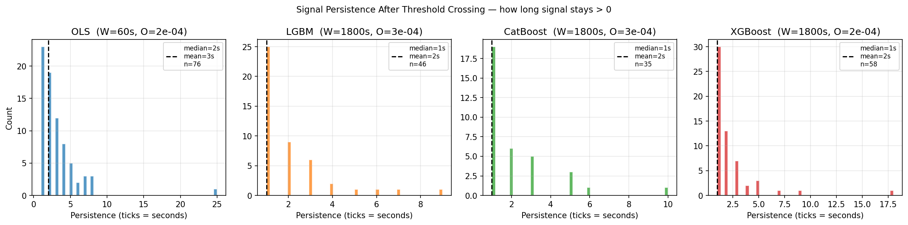

*OLS 中位持续 2s，GBDT 类均为 1s，差异极小。信号持久性假说同样不足以解释 2.2× 的 Sharpe 差距。*

### 修正结论：极端信号区的条件方向准确率

| 模型 | 穿越次数 | gross/trade | **方向正确率** |
|---|---:|---:|---:|
| **OLS** | 76 | 3.49e-4 | **71.1%** |
| CatBoost | 35 | 3.87e-4 | 65.7% |
| XGBoost | 58 | 2.73e-4 | 58.6% |
| LGBM | 46 | 2.54e-4 | **54.3%** |

**一句话**：IC 测的是全量 n=3.5M 样本的平均相关，回测赚的是极端信号 top 0.01% 时刻的钱。OLS 在该区间 53 个因子同时对齐，是高置信事件；GBDT 在树分裂边界区域可能产生假极端信号，方向正确率仅 54%。

---

## 五、Return 结构分析（BTC/ETH/SOL，162天）

> 文档：`final_analysis_v2/report.md`

### 市场结构总览

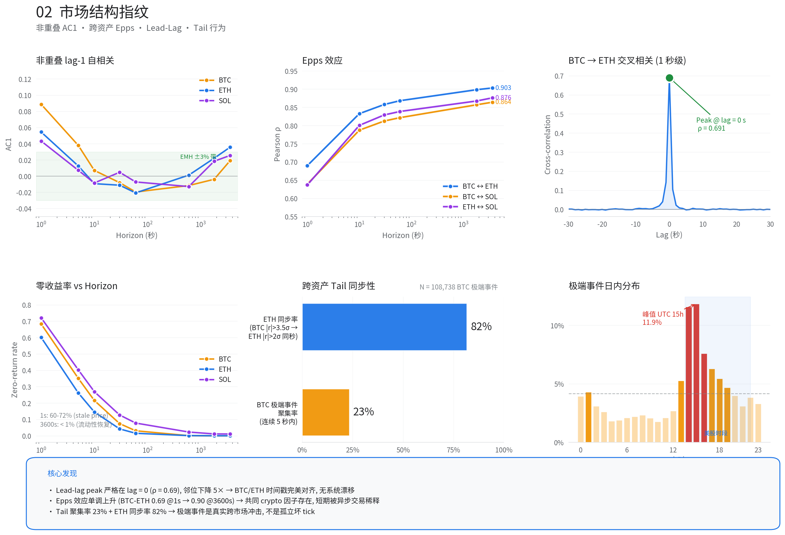

*AC1、Epps、lead-lag、零率、tail、日内分布六块。AC1 在 60s 最干净（−0.020，z=−9.4σ）；跨资产 corr 在 1s→10s 一跳完成 80% 增量（Epps 效应）；UTC 14-15h 极端事件密度 5.6× 凌晨。*

### Horizon 推荐矩阵（三项可研究性指标）

| Horizon | N（非重叠）| 零率 | AC1 | AC1 z-score | 推荐 |
|---|---:|---:|---:|---:|---|
| 1s | 13.9M | 68.4% | +0.089 | +331σ | ⚠ 禁直接回归（stale-price 污染） |
| 5s | 2.78M | 35.1% | +0.038 | +63σ | ⚠ 过渡区，需 zero-mask |
| 10s | 1.39M | 21.6% | +0.007 | +8.5σ | ✅ 跨资产起点 |
| 30s | 464K | 7.5% | −0.008 | −5.4σ | ✅ mean-reversion 入口 |
| **60s ★** | **232K** | **3.1%** | **−0.020** | **−9.4σ** | ✅✅ **主战场** |
| 600s | 23.2K | 0.1% | −0.012 | −1.8σ | ✅ 持仓周期评估 |
| 1800s | 7.7K | 0% | −0.004 | −0.3σ | ⚠ funding 主导 |
| 3600s | 3.9K | 0% | +0.019 | +1.2σ | ⚠ funding 主导+样本不足 |

三条判断线：信号显著（|AC1|·√N > 3）+ 样本充足（N≥5×10⁴）+ 零率可控（≤10%）**→ 三项全满足的只有 60s**。

### Funding Bridge（内网 vs 本地）

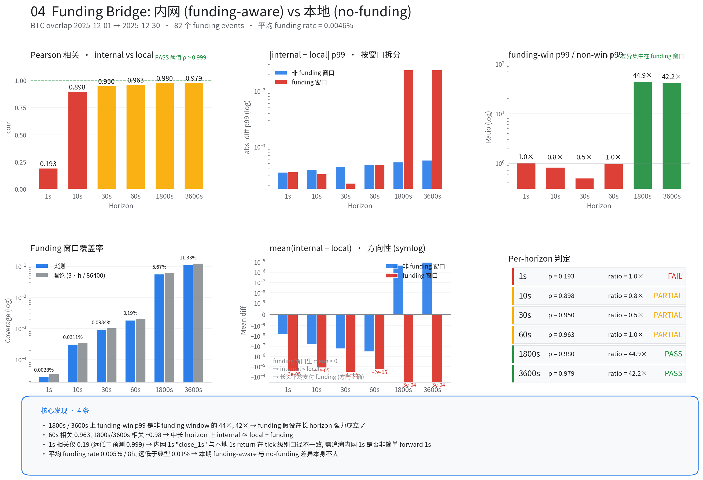

*funding 窗口 p99 vs non-window p99：60s 两者 ratio≈1（funding 影响可忽略），1800s 比值高达 **44×**（funding 窗口是完全不同的分布）。结论：<600s 完全忽略 funding；≥1800s 必须单独建模。*

### 6 个可执行 Insights

1. **Mean-reversion 主战场 60s**：AC1=−0.020，z=−9.4σ，是全部 horizon 中信号最干净的
2. **跨资产 feature 从 ≥10s 起**：80% 信息增量发生在 1s→10s 这一跳（Epps），10s 之后边际递减
3. **UTC 14-15h 极端事件密度 5.6×**：高频策略需 session-conditional 调参；14-18 UTC 实际 vol 是凌晨 2×，需缩仓 √2
4. **Funding 在 ≥1800s 把 regime 一切两半**：需要 funding-aware 建模或 mask
5. **风险模型用 Student-t（df≈7）**：p99/σ≈2.9，Gaussian VaR 低估尾部 30–50%
6. **等风险权重稳定**：BTC:ETH:SOL = 1.49:1.09:1.00，σ/√h 跨所有 horizon 不变；SOL idio var 最高（32.5%），alpha 载体；ETH-BTC 是套保首选

---

## 六、下一步优先级

| 优先级 | 任务 | 依赖 | 预计耗时 |
|---|---|---|---|
| P0 | 内网训练数据到位 → 启动 RNN（LSTM/BiLSTM/GRU） | 数据负责人交付 | — |
| P0 | Test B：坐实内网=trade-tape，完成 return 口径闭环 | qrdev 访问 | ≈30min |
| P1 | bar 因子 OLS 路线生产化（21 因子，shift+1 causal） | 已有代码 | 半天 |
| P1 | 60s mean-reversion alpha baseline（BTC/ETH，OLS/Ridge） | 本地可跑 | 1天 |
| P1 | GBDT 类 qyas 完整回测（上传 pred_test.npz） | HPC 访问 | 半天 |
| P2 | Session-conditional 模型（UTC 00-12 / 12-20 / 20-24 分段训练） | — | 2天 |
| P2 | bar 数据换 horizon 到 ret_60（OI/funding 在分钟级才可能有效） | — | 1天 |
