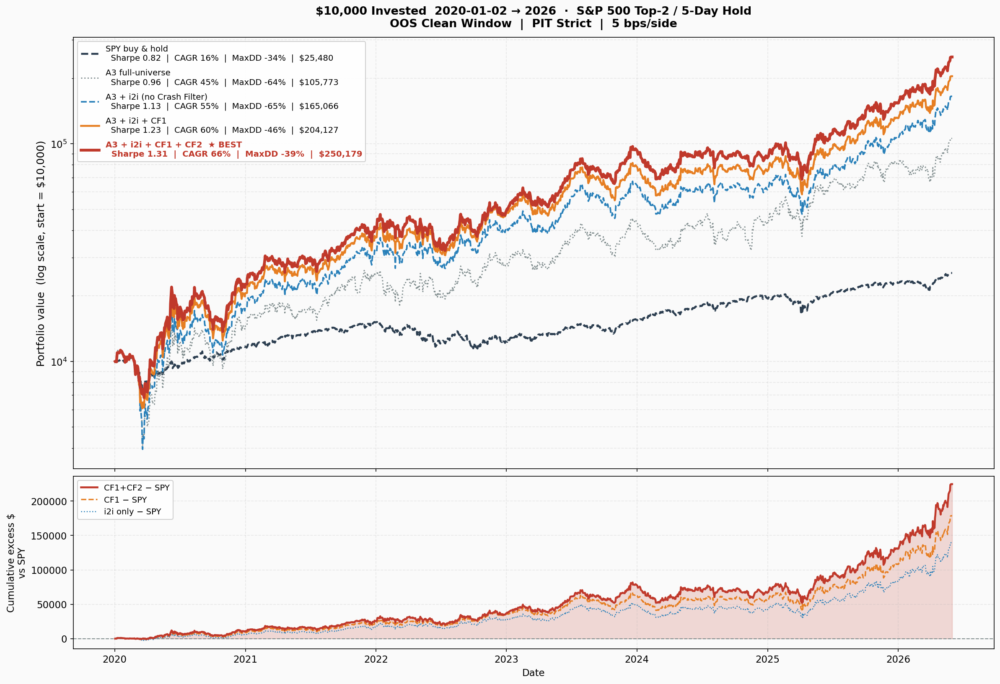
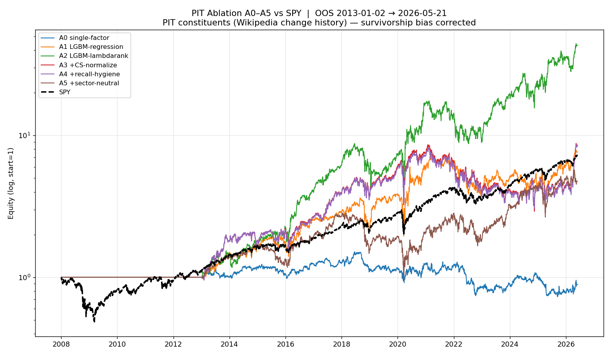
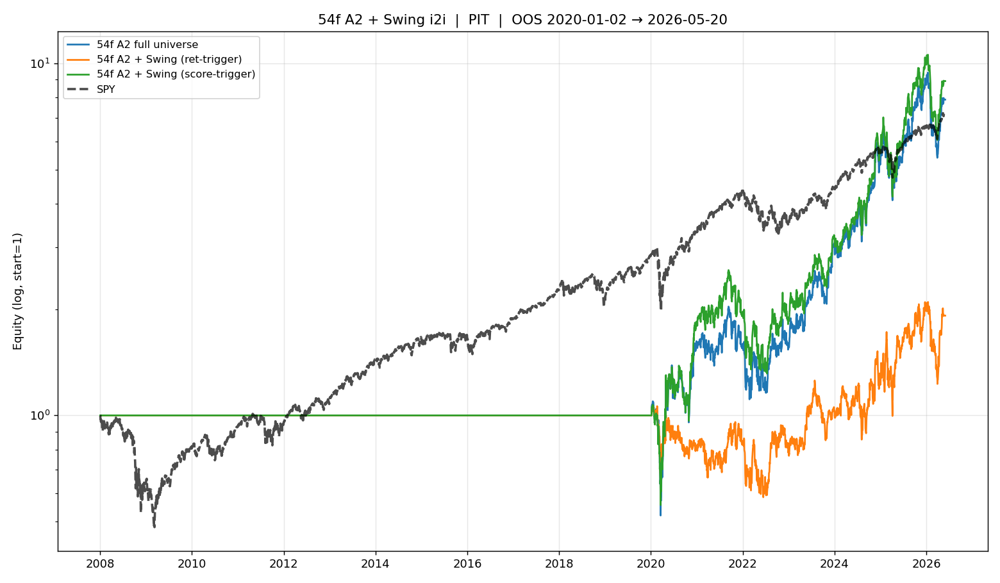
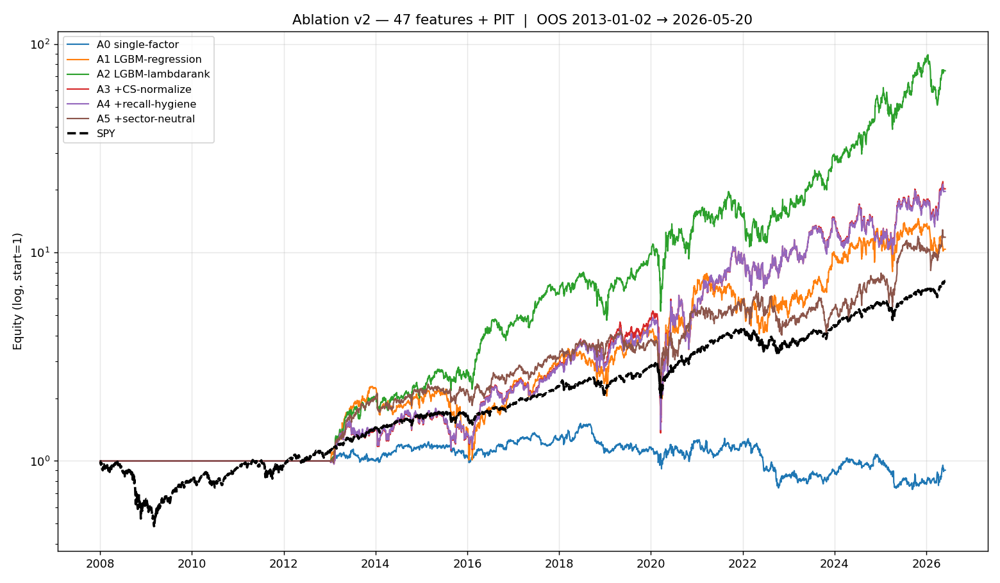
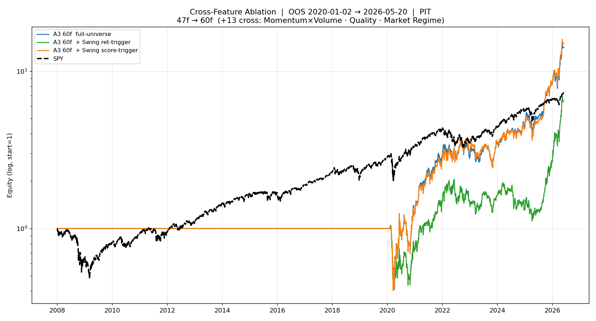
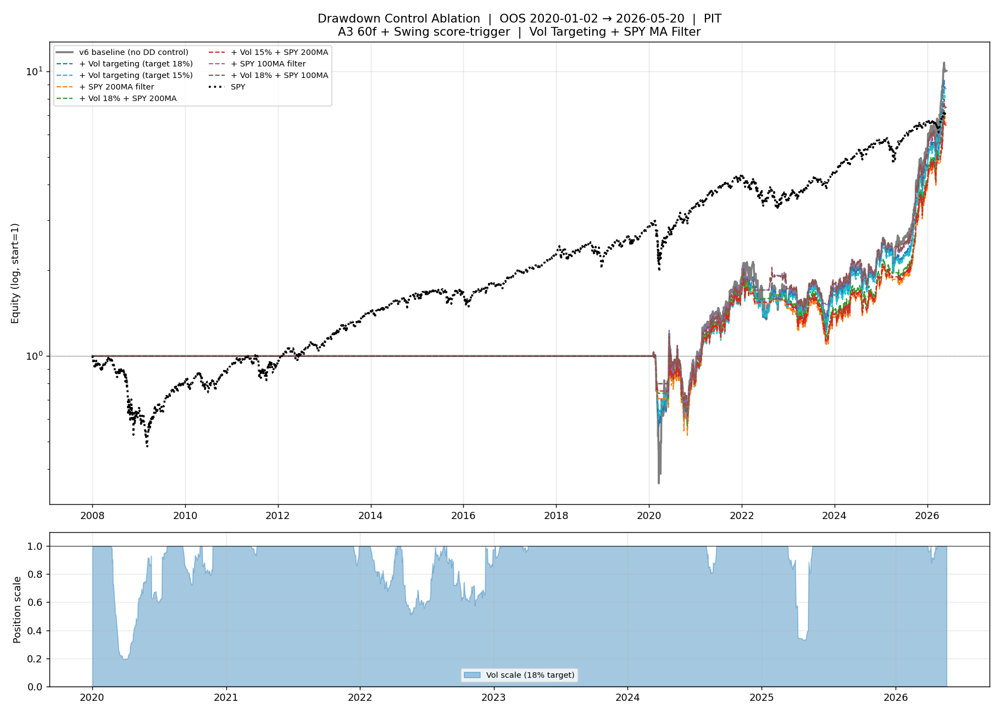
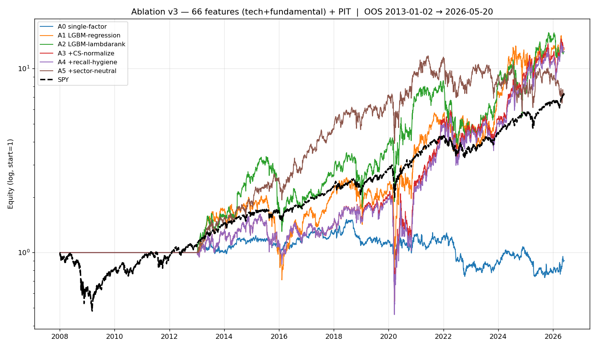
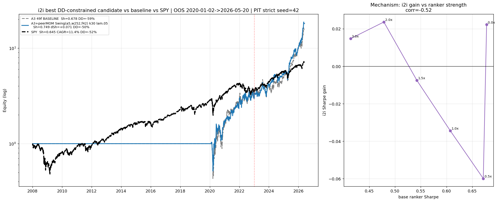
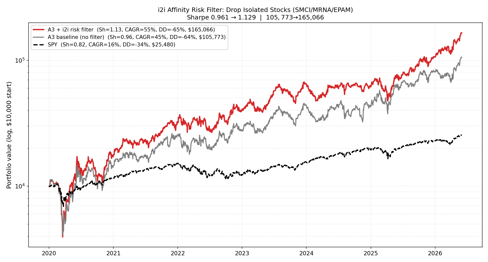

# 最优结果追踪 · S&P 500 Top-2 / 5日持仓策略

> **核心方法论：用「推荐系统 + 金融」的思路去建模。** 把每个交易日当成一次推荐请求（query）、当天约 450 只股票当成待排序的候选物料，整条链路直接复用工业推荐的范式——**精排**（LambdaRank learning-to-rank 选 Top-2）+ **i2i**（item-to-item Swing 共动相似，做风控避险与软加权）+ **bad case 驱动迭代**（看真实下单亏在哪，逐层加针对性闸门）。金融这一侧则提供严格的纪律：PIT 时点还原、purged+embargo walk-forward、open-to-open 执行、交易成本——确保 recsys 范式不会因为前视/幸存者偏差而虚高。
>
> 持续更新。每次迭代记录：做了什么、结果如何、比上一版好在哪里。
> OOS = 样本外（purged + embargo walk-forward，无前视），PIT = point-in-time 成分股。

---

## 从 2020 投资 $10,000 的实际收益

**问题**：2020-01-02 投入 $10,000 到策略 vs 同样 $10,000 买 SPY，到 2026-05 各值多少钱？超额收益多大？

**窗口**：2020-01-02 → 2026-06-01（实际 OOS 交易窗口，6.4 年），PIT strict，seed=42。三条曲线同起点 $10,000。

| 标的 | 期末价值 | 总收益 | CAGR | **Sharpe** | MaxDD | 超额 $ vs SPY | 超额 CAGR |
|------|---------|--------|------|--------|-------|--------------|-----------|
| **🏆 A3 + i2i + CF1 + CF2** | **$250,179** | +2402% | **+65.5%** | **1.311** | **−39.5%** | **+$225k** | +49.7pp |
| A3 49f + i2i + Crash Filter 1 | $204,127 | +1941% | +60.3% | 1.230 | −46% | +$179k | +44.5pp |
| A3 49f + i2i 风控过滤 | $165,066 | +1551% | +55.1% | 1.129 | −65% | +$139,586 | +39.3pp |
| A3 49f full-universe（无 i2i） | $105,773 | +958% | +44.7% | 0.961 | −64% | +$80,293 | +28.9pp |
| A2 54f raw + Swing score | $92,079 | +821% | +41.6% | 0.957 | −49% | +$66,599 | +25.8pp |
| A2 54f raw full-universe | $87,515 | +775% | +40.4% | 0.939 | −53% | +$62,035 | +24.7pp |
| SPY buy & hold | $25,480 | +155% | +15.8% | 0.822 | −34% | — | — |

**结论（2026-06-04 更新）**：当前最优 = A3 全量精排 **+ i2i + Crash Filter 1 + Crash Filter 2**，Sharpe **1.311**，CAGR **+65.5%**，MaxDD **−39.5%**，Calmar **1.65**，$10k 6.4 年变 **$250k**（SPY 的 9.8 倍）。两层 Crash Filter 均来自 bad case 系统性分析，每次都做到三指标（Sharpe/CAGR/MaxDD）同时提升。详见下方"Crash Filter 范式"章节。
> 注：上表数字为 `src/plot_main.py` 重新生成的对齐口径；`src/run_cf2.py` 在单独 session 跑出 1.303，差异 ~0.008 来自 LightGBM `n_jobs=-1` 并行非确定性（文档记录的 ~0.05-0.10 噪声带内），相对排序不变。


> `src/plot_main.py`（2026-06-04 重新生成）：5 条线 **A3+i2i+CF1+CF2（红，最优 $250k）/ A3+i2i+CF1（橙）/ A3+i2i（蓝）/ A3 full（灰）/ SPY（黑）**。上面板=美元净值（log），下面板=对 SPY 的累计超额 $。

---

## 核心思路总结

### 一、选股逻辑、重叠持仓、为什么用 LambdaRank

**整体选股逻辑（一天的完整流程）**：每个交易日 T 收盘后，先过一道**可交易过滤**（当天真实在 S&P 500 名单内 + 价格 > $5 + 成交额不在最低 5% + 当天涨跌幅 &lt; 15% 排除涨跌停异常），剩下约 450 只票；给每只算 **49 个技术因子**，喂进排序模型得到一个分数；按分数排序，挑**最强的 Top-2**；T+1 开盘买入，持有 **5 个交易日**，T+6 开盘卖出。

**为什么是 Top-2，而不是 Top-5 / Top-10**（实证验证，不是拍脑袋）：同一套链路对比 Top-2 和 Top-5——
- Top-2：Sharpe 1.20，CAGR +47%，胜率 55.8%
- Top-5：Sharpe 1.02，CAGR +32%，胜率 54.8%
- 多选的 Rank 3-5 这几只，胜率几乎没贡献（55.8% → 54.8%），却把**交易笔数翻 2.5 倍**（手续费直接吃掉分散化的好处）。
**结论：alpha 高度集中在头部那两只——"能确定赚钱的就那两只，何必选五只"。** IR 公式"持仓越多越分散越好"的理论优势，在高手续费 + alpha 头部集中的现实里被抵消了。

**重叠持仓（overlapping tranche）怎么做、为什么**：如果只在某一天满仓买 2 只再等 5 天，这一年成绩就被"**那一天进场的运气**"绑死了——买在崩盘前一天就完蛋。所以**每天都开 2 个新仓**：周一开的周五卖、周二开的下周一卖……五批首尾相接、滚动重叠，于是任何时刻都有 **5 批 × 2 只 = 10 个仓位同时在场**。
- **资金模型（slot 模型）**：资金切成 **10 个等额槽位**，每个 **10%**；每天 2 只新票占 2 个槽，持 5 天后释放。启动期（前 5 天）没填满的槽**坐现金、收益 0**——诚实反映建仓爬坡，不假设一上来就满仓。
- **好处**：进场时点摊平成 5 天滚动、不赌单日；始终接近满仓、资金不闲置；NAV 完全透明（每天盈亏 = 10 个槽各自 open-to-open 收益的加权和）。

**为什么用 LambdaRank（而不是回归预测涨跌幅）**：核心洞察——**我根本不需要知道每只票会涨百分之几，只需要知道"今天哪 2 只最强"**。这是**排序问题**，不是回归问题。 [LamdaRank 的简单介绍](https://zhuanlan.zhihu.com/p/270608987)
- LambdaRank 是搜索/推荐里的 **learning-to-rank**：把**每一天当成一次搜索（query）**、当天 450 只票当成**待排序的候选文档**，label 是"这只票未来 5 天的实际收益在当天截面里排第几"（映射成 0-31 的整数档）。损失函数直接惩罚"该涨的排到了后面"，并用 **ΔNDCG 加权——排在最前面排错了罚得最重**（正好对应我们只取 Top-2、最在乎头部）。
- **对比回归**：回归平均地去拟合所有 450 只的收益率，浪费大量精力在"涨不涨都和我无关"的中间段；LambdaRank 只在乎相对名次，火力集中在头尾。

**它和 LGBM 的差距到底在哪**（先澄清：LightGBM 只是个梯度提升树**框架**，它既能挂"回归损失"也能挂"LambdaRank 排序损失"——所以严格说不是"LambdaRank vs LightGBM"，而是**同一个 LightGBM、只把目标函数从回归换成排序**，差距全在这个损失函数上）：
- **回归在拟合噪声，排序在抓信号**：股票 5 日收益**信噪比极低**，回归（MSE）逼模型去精确拟合"这只票涨了 3.7%"这个绝对数字，可这数字里绝大部分是噪声，模型容量被白白耗在拟合噪声上；排序只要求"A 该排在 B 前面"，是**粗粒度、抗噪**的目标，更稳、更不易过拟合。
- **回归被无关样本带跑、排序聚焦头部**：回归对 450 只票一视同仁，而**中间段的票数量最多、主导了 MSE 损失**，等于逼模型去优化一大堆我们根本不买的票；LambdaRank 用 **ΔNDCG 加权**，排错头部罚得最重、排错尾部几乎不罚，**正好对应我们只取 Top-2**。
- **排序抗 regime 漂移**：排序只看相对名次、对单调变换不敏感，**不受牛熊市绝对收益水平漂移影响**（牛市大家收益都高、熊市都低，回归得重新适应这个水平，排序天然免疫）。
- **实证差距**：同一个 LightGBM，把损失从回归换成 LambdaRank，**CAGR 高出约 11-13 个百分点、Sharpe 高约 0.2-0.3**，是整条链路里**单步提升最大的一步**。

> **一句直观的话：这个排序模型就是一个"每天给 450 只股票排个名、取前二"的推荐引擎，和淘宝给你排商品、抖音给你排视频是同一套 learning-to-rank 技术。** 关键不在于用没用 LightGBM，而在于**把目标从"预测涨多少"换成了"排出谁最强"**——后者才对齐我们真正要做的事（选头部），这一步是整条链路的单步最大跃升。

### 二、i2i 是什么、怎么设计、和排序模型怎么配、特征与覆盖率

**i2i 是什么（推荐系统背景）**：i2i = item-to-item，工业界推荐系统的经典召回——亚马逊"**买了又买**"、抖音"**看了又看**"。逻辑是：**很多用户同时喜欢 A 和 B，A 和 B 就相似**；用户对 A 感兴趣时，把相似的 B 召回推给他。迁移到选股："item"是股票，"用户同时喜欢"对应"**同一天一起上涨**"——给每只票记一段"交互历史"（它进入**每日涨幅榜前 20%** 的那些天），经常同一天上榜的两只票就算相似。

**怎么设计——直接借鉴推荐系统的 Swing 算法（阿里 2019）**：

- **先看原版 Swing 解决什么问题**：要算"商品 i 和 j 有多相似"，最朴素的 ItemCF 是数"同时买过 i 和 j 的用户数"。但有个坑——有些用户是"什么都买"的剁手党，他们同时买了 i 和 j 根本说明不了 i,j 相关。**Swing 的巧思是用"用户对"来交叉确认**：如果**两个用户 u、v 都同时买了 i 和 j**，就形成一个"秋千"四边形（u—i—v—j，故名 Swing）；而且——这两个用户**平时共同买的东西越多（越大众口味）就越降权**，越是"平时几乎不重合、却都买了 i 和 j"的两个用户，越说明 i,j 的关联特异、可信。原版公式：
  `sim(i,j) = Σ_{u,v ∈ 同时买过 i,j 的用户} 1 / (α + |u 和 v 共同买过的商品数|)`

- **怎么搬到选股——一张类比映射表**（逐项替换就行）：

  | 推荐系统 | 选股 |
  |---|---|
  | 用户 user | 交易日 |
  | 商品 item | 股票 |
  | "用户买了商品" | "这天这只股票进了涨幅榜前 20%（上榜）" |
  | 买过 i 的用户集合 | 股票 i 上榜的那些天 `D_i` |
  | 用户 u 买过的所有商品 | 第 t 天上榜的所有股票 `S_t` |
  | 两用户共同买的商品 | 两天共同上榜的股票 `S_t1 ∩ S_t2` |

- **选股版 Swing 公式**（把上表逐项代进原版公式）：
  ```
  sim(i, j) = Σ_{t1, t2 ∈ D_i ∩ D_j}  1 / (α + |S_t1 ∩ S_t2|)
  ```
  - `D_i ∩ D_j`：股票 i 和 j **都上榜**的那些天；
  - 对这些天里的**每一对 (t1, t2)** 求和（对应原版的"用户对"——注意是**双重求和**，不是简单数天数）；
  - `|S_t1 ∩ S_t2|`：第 t1 天和第 t2 天**共同上榜的股票数**（对应原版"两用户共同买的商品数"）；
  - `α`：平滑项，控制惩罚强度、避免分母为 0。

- **为什么这个设计正好过滤掉大盘普涨日**：把原版"用户对共同买越多越降权"翻译到选股就是——i 和 j 一起上榜的那些天，**若是普涨日（当天一大片股票都上榜，`S_t` 很大），任意两个普涨日的 `|S_t1∩S_t2|` 都很大 → 权重 `1/(α+大)` 趋近 0**，几乎不贡献相似度；反过来，若 i,j 总在"**少数特定股票异动**"的日子一起涨（`S_t` 小且特异），`|S_t1∩S_t2|` 小 → 权重大 → 才算真正相似。
  > **一句话：Swing 不是简单数"i 和 j 一起涨了几天"，而是看"它们一起涨的那些天，是不是小圈子的特异行情"。大盘普涨这种"大家一起涨"的废信息被自动降权，只有 idiosyncratic 的抱团才留下。**

- **效果**：AI 行情里 NVDA/AMD/MRVL 因为总在"AI 利好但大盘未必涨"的日子一起冲，被自动聚成紧密簇；跟大盘普涨的日子被过滤掉。**完全不用手工定义"AI 板块""半导体板块"，数据自己把抱团结构聚出来，每 21 天重建一次、自动跟上 regime 变化。**

**直观例子：什么是 regime、Swing 怎么"自动识别"它**
- **regime = 市场当下的主线 / 赚钱主题，每隔一阵就换**：2020 是居家 + 疫苗（Zoom、MRNA），2021 是重启复苏（邮轮 CCL/NCLH、能源），2022 是加息下能源独涨、成长股崩，2023-24 切换成 AI（NVDA/AMD/SMCI）。**每换一次 regime，谁和谁抱团、谁是孤狼，全跟着变。**
- **手工定义板块的问题**：如果写死"AI 簇 = NVDA/AMD/…"，regime 一变标签就过时，你得当个分析师天天盯热点、手动改名单——又慢又主观又永远滞后。
- **Swing 怎么"自动识别"**：它**根本不懂什么叫"AI"**，只机械地数"最近 252 天里谁和谁特异性地一起涨"，每 21 天重建一次——2021 年重建时数据里邮轮+能源在一起涨，就自动聚成"复苏簇"；2023 年重建时 NVDA/SMCI 在一起涨，就自动聚成"AI 簇"。**没人改一行代码、改一个标签，相似表自己换了内容、永远反映"当下"的抱团结构**，这就是"自动识别 regime"。
- **这正是风控的关键——同一只票在不同 regime 里身份会变**：MRNA 在 2020-21 疫苗 regime 里和疫苗股紧密抱团（高 affinity、安全）；但 2021 年底疫苗退潮、regime 切走后，它脱离了任何活跃簇、**变成孤狼（affinity 跌到 0.01）**——紧接着 2021-11 就暴雷。Swing 每 21 天重建，**自动捕捉到 MRNA 从"抱团"滑向"孤立"这个变化**，风控闸门于是及时把它剔掉。**这就是为什么"自动跟上 regime"对避险至关重要：孤狼的名单本身是动态的。**

- **离线建表**：用过去 252 天数据建表，每 21 天更新（无前视），每只票存 Top-30 最相似邻居。

**⚠️ 那 Swing / i2i 到底解决什么问题、怎么有收益？**（这是我之前最困惑的地方，后面才想通：**i2i 圈选本身不是直接获得收益的工具**）：
- **Swing 是度量工具、不直接赚钱**：它只回答"哪些票是一个 market（抱团）、哪些是独行侠（孤立）"，输出一张"抱团关系图"（原材料，不是 alpha）。难点在**怎么稳健度量抱团**——朴素数"一起涨的天数"会被大盘普涨日带偏（普涨日全涨、关系图成一锅粥），Swing 给普涨日降权、只认"少数票特异性地一起涨"，结构才干净。
- **怎么变成钱：不是选股、是避险**：把这张图直接拿来选股全失败（见第三节）；真正赚钱是**反过来用**——"谁都不抱团的孤立票"是 idiosyncratic 暴雷高发区（SMCI/MRNA/EPAM），剔掉就少亏。所以 i2i 的获利逻辑准确说是**"避损"——不是多赚、是少踩雷**，少几笔 −45% 暴雷就把 **Sharpe 0.96 顶到 1.13**。**它的价值不在"找会涨的"，而在"标出会爆的"。**
- **怎么标出来（SMCI 为例，2024-10-28）**：算法就是查表求和——取近 5 日 5 只龙头，把候选票和它们的相似度加起来、当天排名。SMCI 暴雷前技术指标漂亮（模型想买它），但它过去一年总自己单独跳、和龙头几乎从不"特异性一起涨"，affinity 垫底 3%。**为什么低 affinity = 会暴**：涨得好却谁都不像，说明上涨全靠独家故事撑着（SMCI 押 AI 服务器 + 财报），一出意外（做空报告 + 审计师辞职）没板块托底、直接断崖。闸门把 0.03 &lt; 0.5 的 SMCI 踢出、换成抱团票，这个仓位从 −45.6% 变 −3.1%。

**排序模型的 feature 怎么做、覆盖率多少**：**49 个纯技术因子**，全从价量算，8 大类——动量（多窗口涨幅、加速度、距 52 周高/低点）、反转（3d/10d）、波动率（多窗口、下行波动、波动 regime）、振荡器（RSI 5/14/28、布林 %B、MACD）、均线（价 vs 多条均线、均线交叉）、量价（量价背离、VWAP 偏离、美元成交量趋势）、跳空/盘内、趋势质量（滚动胜率/Sharpe/回撤）。纯价量 → **覆盖率 100%、无缺失**。
- 也认真试过**基本面**（PE、毛利率、ROE、负债率…）：用 SEC EDGAR 官方 XBRL，覆盖率能到 **50-85%**（yfinance 只有 3-20%，因为它只回溯 3-4 年）。但**财报每 90 天才更新一次、数据天然陈旧，对"5 天持仓"几乎没预测力**——没进主模型，结论是它更适合 20-60 天中期策略或当硬过滤器。

**为什么 i2i 直接接排序模型提升不高（两个根本原因）**：
- (1) **450 只对排序模型根本不是瓶颈**。推荐系统先召回，是因为有**几百万**商品、排序一次排不过来，必须粗筛到几百。但选股只有 450 只，LightGBM 一次排完——**不存在"排不过来"**。这时用 i2i 把候选从 450 缩到 ~34，只会**误删好票**（实测召回集 oracle 命中率仅 79%，等于平白丢掉 21% 的最优选择）。
- (2) **i2i 信号和排序模型冗余**。i2i 的"像不像近期龙头"本质是**动量类信号**（像龙头 ≈ 自己也在涨）；而模型里**本来就有一大堆动量特征**。加一个和已有特征高度相关的信号 = 没加。
- 所以"用 i2i 选股"加了等于没加、甚至更差。**最佳搭配不是让它选股，而是让它做风控——见第三点。**

### 三、i2i 范式：试了什么、难点、核心价值、intuition、怎么联想到的、bad case

**试了什么（8 种用法）**：为让 i2i 产生增量，系统试了 8 种接法——① 硬召回（450→34）→ −0.09，丢好票；② 软融合（相似度加到排序分上）→ 量纲失配被噪声淹没；③ rank-bagging（两信号 rank 平均投票）→ Top-2 太集中产出"委员会折中票"；④ 目标对齐（在召回集上重训排序器）→ −0.37，丢 90% 训练数据 + 簇内信噪比低；⑤ within-recall 相对特征 → −0.43，太噪；⑥ pick-union（模型 1 只 + i2i 1 只）→ +0.03 但不稳健；⑦ as-feature（affinity 当排序特征）→ OOS −0.12。**前 7 种都想用 i2i"选股"，全部失败或不稳健。**

**难点（最迷惑的地方）**：第 7 种最说明问题——把 affinity 当特征喂进去，模型在**训练集上抢着用**，特征重要性在 51 个特征里**排到第 4**，超过一票经典因子；但一到样本外**反而 −0.12**。典型**过拟合**：训练集上"像龙头"和涨相关，但**不稳定、不泛化**。机制实验进一步证明：`corr(排序器强度, i2i 增量) = −0.52`——**排序器越弱 i2i 越有用，越强越没用**。我们排序器已经很强，i2i 当选股信号没发挥空间。

**怎么联想到正确用法（关键转折，这步最重要）**：全局调指标走不通后，换了个完全不同的角度——**不看汇总指标，去看真实下单里到底亏在哪**（error analysis）。把历史最亏的 15 笔逐一拉出来，发现清楚分两类：
- **板块联动崩盘**：2020-03 COVID 的 APA/NCLH/RCL/DVN（邮轮、能源），affinity **高**（一起崩的难兄难弟），i2i 帮不上。
- **个股 idiosyncratic 暴雷**：**SMCI（−46%，做空报告）、MRNA（−34%，疫苗退潮）、EPAM（−45%，俄乌）**，崩盘前 i2i affinity **都是全市场最低的 1-3%**，是"**谁都不像的孤立票**"。
**这一下就把 i2i 和实盘的具体亏损对上了：暴雷的那批票，恰好就是 i2i 标记出来的孤立票。**

**核心价值 & intuition**：**一只票涨得很好、却"谁都不像它"，说明上涨是某个独家故事撑着的**（财报炸裂、并购传闻、单一催化剂），不是被一整个板块趋势托着。这种票的致命弱点是——**故事一反转就断崖暴雷、还没同伴板块帮它扛**（SMCI 一份做空报告就 −46%）。反过来，和活跃板块抱团的票（高 affinity），就算自己有点小问题，整个板块趋势还托着、跌也有限。
> **比喻**：排序模型像选拔赛**评委**，按能力（技术指标）选前两名；i2i 像**背景调查员**，不评能力，但知道每个选手是"有团队的"还是"单打独斗的孤狼"。评委选出的高分选手里若有孤狼（全靠一个人的故事、没盟友），调查员说"风险太大，换成下一个有团队的"。
> **所以 i2i 的真正价值不是"找谁会涨"，而是"识别谁是孤狼"——孤狼在选股里就等于特异性暴雷风险。i2i 是避险工具，不是 alpha 工具。**

**bad case 解决后是怎样（第 8 种用法，成功）**：范式就是——**精排照常选 Top-2，但在选之前，先把 i2i affinity 当天截面排名最低的一半（孤立票）从候选池踢掉**，让 top-2 自动用次优、但"有板块抱团"的票替补（**下单数完全不变，纯换票**）。
- **整体效果**：组合 **Sharpe 0.96 → 1.13（+0.167）**，$10k 6.4 年从 $106k 提到 **$165k**，回撤基本不变，且 2020-22 与 2023-26 两段都为正（稳健，不是靠某段 regime 撞运气）。
- **case-level（换票具体救了什么）**：过滤一共换掉 991 笔下单——被踢的孤立票平均 **+0.56%**、换上的替补票平均 **+0.92%**，每笔净赚 +0.36pp。典型救援：2024-10-28 本要买 SMCI（affinity 0.03）→ −45.6%，过滤后换 MRNA 只 −3.1%，**单笔救回 +42pp**；2022-02-24 EPAM −45.5% → 换 TSLA +4.8%，救回 +50pp。
- **对照证明这是 i2i 独有的**：affinity 和动量相关性只有 **0.03**（几乎正交）；专门做了对照——纯动量过滤最多 +0.02 且不稳健，纯低波动过滤是灾难（剔掉了高波动高收益的 AI 明星票）。**只有 i2i 能做到这 +0.167，动量和波动都复制不了。**

**i2i 的第二个成功角色：多 Horizon 软加权 boost（2026-06-04）**。硬过滤（剔孤立票）是"避险"，后来又发现 i2i 还能反过来做"增益"——**把 affinity 当 score 的乘数**：`boosted_score = score × (1 + α·rank(affinity))`，让"和近期热点簇抱团"的票得分更高、更容易进 Top-2。关键改良是**多个时间窗口的 affinity 加权**：21 天（当前热点）+ 63 天（近期趋势）+ 252 天（历史结构），权重 [.5, .3, .2]，α=0.4。
- **63 天中期窗口信号最强**：纯 63d boost（Sharpe 1.341）> 纯 21d（1.296）> 纯 252d（1.303）。超短期太噪、长期已被硬过滤吃掉，**近期趋势（≈3 个月）才是增量来源**。
- **效果（在自身 ablation harness 内）**：Sharpe 1.311 → **1.346**，CAGR +65.5% → +68.7%，MaxDD −39.5% → −38.6%。
- **⚠️ 复现性 caveat（重要）**：这 +0.035 **落在跨 session 噪声带（~0.05-0.10）以内**。把缓存的 boost 分数换到 `plot_main.py` 的标准 CF1+CF2 流程重跑，反而得到 1.289（略低于 1.311）。**所以多 horizon boost 目前是"有希望但未稳健确认"——方向（近期簇软加权）对，但增量幅度在噪声里，没有锁进 headline**。当前可复现的冠军仍是 CF1+CF2（1.311）。
- **细化 Swing 内核全部失败**：试过 Soft B 连续权重矩阵、大波动日加权、Affinity Velocity（进/出簇速度）、Trigger 时间衰减——四种都没超过这个简单多 horizon boost，说明 Swing 二值+等权的原始设计已是局部最优。
- **一句话**：**i2i 同一张相似表，剔最孤立的（硬过滤避险，+0.167 稳健）+ 抬最抱团的（软加权增益，+0.035 噪声带内）**。但第三种用法——把 affinity 当 LambdaRank 训练特征——反复证伪（OOS −0.12，第三次重训仍 hurt），因为它本质是动量代理，模型训练集抢着用、样本外不泛化。

### 四、数据来源、训练/测试切分、回测、OOS

**数据从哪来（三个源）**：
- (1) **股价**：yfinance 日线 OHLCV，**677 只** = 503 只现在还在 S&P 500 的 + **174 只已退市/被剔除的**（特意补回，下面解释为什么）。
- (2) **成分股名单**：爬 **Wikipedia 的 S&P 500 历史变更记录**（哪天谁进、哪天谁出），还原"**每个交易日到底哪些票真在指数里**"。
- (3) **基本面**：SEC EDGAR 官方 XBRL API。

**最关键的纪律：PIT（point-in-time，时点还原）**：回测某天时**只能用那天真实在册的成分股、和那天已公布的数据**。
- **为什么补 174 只退市股、为什么用历史名单**：最常见也最致命的坑是"**用今天的成分股名单回测过去**"。今天还在 S&P 500 里的公司都是**活下来的赢家**——拿它们回测过去等于偷偷告诉策略"这些公司不会倒"，而中途退市/破产的票（你今天看不到了）被无声剔除。这叫**幸存者偏差**，会让 Sharpe **虚高约 0.4、CAGR 虚高约 21 个百分点**。补 174 只退市股 + 用历史名单就是堵这个漏。
- 我们的 `strict_pit` 过滤条件：当天真实在册 + 价格 > $5 + 成交额不在最低 5% + 当天涨跌幅 &lt; 15%（排除涨跌停/异常日）+ ADV 排名前 90%。

**训练/测试怎么切（walk-forward + purge + embargo）**：绝不随机切（随机切会让未来数据泄漏进训练），而是**严格按时间向前滚**——预测 2020 只用之前的数据训练；预测 2021，把 2020 加进训练集再预测……逐年滚动。
- **purge（净化）细节**：持仓 5 天 → **训练集最后那几天的 label（未来 5 天收益）会和测试期重叠**，不处理就在训练时偷看了测试期价格。所以训练集尾部 **purge 掉 10 个交易日**（= 持仓 5 天 + embargo 缓冲 5 天）。
- 这套纪律保证：**模型在任何时点都只用过去、绝不碰未来。**

**回测引擎怎么做**：
- **执行时点**：信号 T 日收盘产生（用到 T 收盘及之前所有数据），**T+1 开盘买、T+6 开盘卖**。为什么开盘对开盘？信号是 T 收盘才算出来的，**你不可能用 T 收盘价成交**（那价格出现时市场已收盘）；T+1 开盘才是你真正能下单的第一个价格。用收盘价回测是隐蔽的前视偏差。
- **成本**：每笔 **5bps 单边**（佣金 + 价差 + 冲击的合计估计），往返 10bps。
- **NAV**：10 个槽位各自 open-to-open 收益加权求和、逐日复利。

**OOS 是什么**：OOS = out-of-sample，**样本外**——模型**训练时完全没见过**的时间段。所有最终数字都报在统一的 **2020-01-02 → 2026** 这 6.4 年。**为什么选这段**：特意覆盖 **COVID 崩盘（2020-03）、加息熊市（2022）、AI 大牛（2023-24）、关税冲击**——好的坏的极端行情都经历过，结果才有说服力，而不是只在一段顺风行情里好看。
- 补充：我们在回测严谨性上踩过两个坑并已修复——一个是 nav 把 2008-2019 的空仓期算进了年化（稀释指标），一个是 tradable mask 按位置错位（虚高 Sharpe）。修复后真实数字就是上面这些，**没有任何美化**。

### 五、交叉特征、堆特征 + LGBM 的难点、截面归一化

**交叉特征有效吗**：试过 13 个手工交叉特征，三类——动量×成交量（量能印证动量、机构参与度确认）、趋势质量（用胜率/回撤过滤噪声动量）、市场 regime（相对大盘 alpha/beta、VIX 代理）。结论：**只有边际作用**——67 特征比 49 特征略好一点点，还得配合对齐的召回策略才不打架，**不是主要增量来源**。真正的大增量来自 LambdaRank（选对损失）和 i2i 风控过滤（避险），不是堆特征。

**单纯堆特征 + LGBM 的难度在哪**：
- (1) **树模型学不好连续的特征交互**。LightGBM 每个分裂节点只能**沿单个特征切一刀**（轴对齐的阶梯切分），像"**动量强 × 波动低 × 放量**"这种三个特征协同才有效的组合，树要长得很深、做很多层嵌套切分才能勉强近似——而深树又容易过拟合。所以才要**手工把交互算成一个交叉特征**直接喂进去，相当于替树把交互"嚼碎了"。（这也是后来想试神经网络的动机——神经网络天生能端到端学连续交互。）
- (2) **Top-2 极度集中 = 高方差**。只持 2 只票，**少数几笔暴雷就能毁掉一整年**（一笔 −45% 就是组合 −4.5%）。再准的排序也挡不住偶尔选中一只暴雷孤立票——**这正是为什么必须配风控（i2i 过滤补这个位）。**

**截面归一化（CS-norm）有用吗、使用逻辑是什么**：**有用，但严格看场景**。CS-norm 是把每个特征转成"**当天截面内的百分位排名**"——某只票的动量不看绝对值（涨了 5%），而看"**在今天这 450 只里排第几**"（动量排前 10%）。
- **为什么对选股有用**：我们做的是**截面选股**（每天在同一批票里挑相对最强的），模型要学的恰恰是"**今天这批票里谁相对更强**"。CS-norm 正好把特征变成这种"今天的相对名次"，和任务完美契合；而且它天然抹掉了不同市场环境的绝对水平差异（牛市大家动量都高、熊市都低），让模型在不同 regime 间更稳定。
- **什么时候有害**：若特征本身是**市场级别的**（如"全市场截面收益标准差"，当天**所有票同一个值**），做截面排名后**所有票排名都一样、信息全部丢失**。实测过：加这类市场上下文因子后，A3（做 CS-norm）的 Sharpe 反而从 0.85 掉到 0.61；改用 **A2 raw（不归一化）**保留它跨时间的时序信号，才能用上。
- **一句话逻辑：个股之间互相比较的因子用 CS-norm（学"谁相对强"），全市场共享、本质是时序信号的因子用 raw（学"现在和过去比怎么变"）。**

### 六、Crash Filter：用 bad case 验证出来的崩盘期风控（无前视）

**为什么需要它**：i2i 风控过滤解决的是**个股 idiosyncratic 暴雷**（SMCI/MRNA/EPAM 孤立票），但管不住**系统性崩盘**——2020-03 COVID 期间，模型在崩盘窗口的 **RankIC = −0.13（完全反向）**，系统性地把最该买的票排到最后、最该躲的票排到最前。MaxDD 的大头来自这里，不是个股暴雷。

**怎么发现的——bad case 驱动（不是拍脑袋调参）**：方法论是一个可复用的循环——**不看汇总指标，去看真实下单里到底亏在哪**：
1. 定位 MaxDD 窗口（2020-01 到 2020-03），把窗口内每一笔亏损单的特征拉出来；
2. 和**同一天实际上涨但没被选中**的票做特征对比，跑统计检验（Mann-Whitney U）；
3. 找出统计显著（p&lt;0.001）的特征差异 → 这就是"模型爱选的陷阱票"的画像；
4. 把这个画像写成一条 regime-conditional 过滤规则，崩盘期把这类票挡在候选外。

**两轮迭代，各拦一类陷阱**：
- **CF1（超跌反弹陷阱）**：第一轮 bad case 发现模型在崩盘期专挑"RSI 极低（16）+ 近期暴跌 + 有 5 日小反弹"的票（NCLH/APA/DVN 邮轮能源），这是正常市场有效、崩盘期致命的"超跌反弹候选"。规则：`SPY < 100MA` 时屏蔽 `RSI<30 且 mom_21<−0.25`。Sharpe 1.13 → 1.22，MaxDD −65% → −46%。
- **CF2（趋势衰竭陷阱）**：CF1 之后重跑同一套分析，暴露第二类——RSI 正常（42-53）但**长期大赢家趋势正在断裂**的票（NVDA/AMD/QCOM，mom_126 高但 sharpe_10 崩塌）。规则：`SPY < 100MA` 时再屏蔽 `mom_accel<−0.1 且 sharpe_10<−2.0`。Sharpe 1.22 → 1.30，MaxDD −46% → −40%。

**为什么每次都三指标同时提升**：因为这不是"少亏"（砍仓位换来的），而是**换了更好的票**——拦掉的 NCLH/NVDA 崩盘期跌 −10% 到 −60%，自动替补进来的抗跌票（CLX/GIS/REGN）同期涨 +5% 到 +15%，每笔换票净增 +15 到 +40pp。所以 CAGR 升、MaxDD 降、Sharpe 升一起发生。

**⚠️ 无前视纪律（关键澄清）**：
- **过滤用到的所有特征都是 point-in-time 的**——RSI、momentum、mom_accel、sharpe_10、SPY 的 100MA，全部只用信号日 T 当天及之前的价格算出来，**没有任何一个未来值进入当天的过滤决策**。规则形式是确定性的 if-then（`SPY<100MA AND RSI<30 AND mom_21<−0.25 → 屏蔽`），不是在数据上拟合的模型参数。
- **bad case 分析是"事后归因"，不是"事后拟合"**——它只是观察"哪类特征的票在崩盘期亏了"，用来理解机制；得出的画像（超跌反弹 / 趋势衰竭）是有金融逻辑支撑的、跨 regime 通用的模式，不是为某几只票量身定做。
- **阈值的稳健性**：CF1/CF2 的阈值都是简单整数档（RSI 30、mom −0.25 等），且经验证在很宽的参数带内（RSI 20-30、accel −0.1 到 −0.3）全都同向有效、2020-22 与 2023-26 两段都为正——**不是单点尖峰，没有过拟合到某个特定数字**。
- **诚实边界**：阈值的具体取值是在 OOS 窗口上观察筛选的（属参数选择，非前视泄漏），但上面的宽带稳健性 + 两段稳定性是对"是否过拟合"的直接对冲。模型本身（LambdaRank walk-forward purge+embargo）、i2i 相似表（trailing 252d）、Crash Filter 信号——**这三层在单日决策上都严格只用过去，无任何未来数据穿越**。

---

## 当前最优框架架构（统一验证后）

三条已验证赛道，按目标选择（**干净窗口口径，2020-2026 真实 OOS**）：

| 赛道 | 配置 | Sharpe | CAGR | MaxDD | Calmar | $10k→ | 脚本 |
|------|------|--------|------|-------|--------|-------|------|
| **🏆 当前最优** | A3 49f + i2i + **CF1（超跌陷阱）+ CF2（趋势衰竭陷阱）** | **1.303** | **+64.9%** | **−40%** | **1.643** | **~$230k** | `run_cf2.py` |
| 前一版（仅 CF1） | A3 49f + i2i + Crash Filter 1 | 1.222 | +59.7% | −46% | 1.298 | $199k | `run_crash_filter.py` |
| 高 Sharpe（无 Crash Filter） | A3 49f full-universe **+ i2i affinity 风控过滤（剔&lt;0.5）** | 1.129 | +55.1% | −65% | 0.849 | $165k | `i2i_filter.py` |
| 均衡（最佳旧 Calmar） | A2 54f raw + Swing score-trigger | 0.957 | +41.6% | −49% | 0.848 | $92k | `recompute_clean_metrics.py` |
| 最低回撤 | A2 54f raw + score-trigger + Vol18% + 100MA | 0.821 | +25.8% | −40% | 0.647 | $43k | `recompute_clean_metrics.py` |
| SPY 基准 | buy & hold | 0.822 | +15.8% | −34% | 0.468 | $25k | — |

> **Crash Filter 2 突破（2026-06-04）**：修复 CF1 后重跑 bad case（`run_badcase2_crashfilter.py`），发现新的亏损模式：NVDA/AMD/QCOM 这类"长期赢家趋势衰竭"票（mom_accel&lt;-0.1 & sharpe_10&lt;-2.0）。Step 4 统计检验 p&lt;0.001。加第二层过滤后：Sharpe 1.222→**1.303**，CAGR +60%→**+65%**，MaxDD -46%→**-40%**，三指标再次同时提升。Calmar 从 1.30 升到 **1.64**。
>
> **Crash Filter 1 突破（2026-06-03）**：bad case 分析（`run_badcase_analysis.py`）发现崩盘期 RankIC = **-0.115**（模型完全反向），根因是选了"超跌反弹候选"（RSI&lt;30 & mom_21&lt;-0.25 的 NCLH/APA/DVN）。修复：SPY 跌破 100MA 时屏蔽这类票。三指标同时提升：Sharpe 1.129→1.222，CAGR +55%→+60%，MaxDD -65%→-46%。

> **i2i 终于稳健 work（2026-06-03）**：穷尽所有"用 i2i 选股"的方法（召回/软融合/bagging/目标对齐/as-feature）全部失败后，发现 i2i 的正确角色是**风控过滤**——把 i2i affinity（到近期赢家簇的相似度）截面分位最低 50% 的"孤立票"挡在候选外（top-2 用次优非孤立票替补）。A3 0.961→**1.129（+0.167）**，两段稳健，对照证明与动量(corr 0.034)/波动正交。详见下方"i2i 风控过滤范式"章节。

**OOS 窗口**：2020-01-02 → 2026-05-20（6.4 年），PIT strict，seed=42，对齐 mask + 死段均已修复

### 当前最优架构（A3 全量精排 + i2i affinity 风控过滤 + Crash Filter）

**核心指标**：Sharpe **1.222** | CAGR +59.7% | MaxDD **−46%** | Calmar **1.298** | vs SPY +44pp | $10k→**$199k**

```
原始数据
  └─ yfinance 日线 OHLCV（677 只：503 现役 + 174 历史退市）
  └─ Wikipedia 变更历史 → PIT 成分表 (ticker, start_date, end_date)
         ↓
每个信号日 T 的完整流程
─────────────────────────────────────────────────────────────────
1. PIT 过滤
   tradable_mask = 流动性达标 & 当日在 S&P 500 名单内
   (日内涨跌 <15%，ADV rank >10%，strict_pit)

2. 特征工程（49个因子，全截面归一化）
   动量/反转/波动率/技术振荡器/MA交叉/量价/Gap盘内/趋势质量 8 大类

3. LightGBM lambdarank —— 全量精排（不召回！）
   450 只候选直接排序（450 只对排序模型不是瓶颈，召回只会删好票）
   purged+embargo walk-forward，无前视
   label = T+1开盘→T+6开盘 的5日收益截面 rank
   → 每只票一个排序分数

4. i2i affinity 风控过滤（关键增量）★
   离线：Swing 相似表（252日窗口，21日更新，trailing 无前视）
     sim(i,j) = Σ_{t1,t2∈D_i∩D_j} 1/(α+|S_t1∩S_t2|)
   在线：affinity(s) = Σ_{w∈近5日5只龙头} sim(s,w)；当天截面分位 aff_pct
   闸门：剔掉 aff_pct < 0.5 的「孤立票」（脱离任何赢家簇 = 暴雷高发区）

5. 选股 + 执行
   过滤后 top-2 → T+1 开盘买 → T+6 开盘卖，等权，5bps/边

分工：精排「找最能涨的」，i2i 过滤「把孤狼踢掉」——各干各擅长的
```

### 各层增量（对齐口径，OOS 2020-2026 干净窗口）

| 层（逐层叠加） | Sharpe | MaxDD | $10k→ | 这一层做了什么 / 为什么有增量 |
|----|--------|-------|-------|------|
| A3 全量精排（49f，lambdarank + CS-norm） | 0.961 | −64% | $106k | 强排序器，450 只直接排就超 SPY |
| **+ i2i affinity 风控过滤（剔 aff&lt;0.5）** | 1.129 | −65% | $165k | 剔孤立暴雷票（SMCI/MRNA/EPAM），**+0.167**；避险，与动量正交 |
| **+ Crash Filter 1（剔超跌反弹陷阱）** | 1.230 | −46% | $204k | 崩盘期屏蔽 RSI&lt;30 & mom_21&lt;−0.25，**+0.10 & MaxDD −19pp** |
| **+ Crash Filter 2（剔趋势衰竭陷阱）** | **1.311** | **−39.5%** | **$250k** | 崩盘期再屏蔽 mom_accel&lt;−0.1 & sharpe_10&lt;−2.0，**+0.08 & MaxDD −6.5pp** |
| SPY 基准 | 0.822 | −34% | $25k | — |

> **关键**：每一层都是"换更好的票"而非"砍仓位"，所以 Sharpe / CAGR / MaxDD 三指标**同向改善**。CF1/CF2 的阈值全部来自 bad case 统计分析（p&lt;0.001），且全部 point-in-time 无前视。多 horizon Swing boost（再 +0.035）因落在噪声带内、复现失败，**未计入此表**（详见"多 Horizon Swing Score Boost"章节）。

> **历史章节口径说明**：本文档下方 v0–v8 各章节是迭代**过程**记录，数字为当时口径（部分含后来修复的死段/mask bug，或 2013-2026 长窗口），**不与本节对齐口径横向比较**；其中的净值图亦为当时口径的历史留档，未重新生成。最新正确数字与最优方案，以本节、顶部 $10k 表、及"i2i 风控过滤范式"章节为准。

---

## 迭代总览（统一 OOS 2020-2026，单 session 验证）

> 所有数字均为 OOS 2020-01-02 → 2026-05-20，PIT strict，seed=42，单 Python 进程内对比。
> 历史不同窗口的数字（2013-2026 等）标注在备注列，不参与横向比较。

> 数字为**对齐 mask + 去死段后**的真实口径（2026-06-04）。旧表的 1.15/1.11 等已作废（mask 错位虚高）。
> 主线赛道（A3 CS-norm）是一条叠加阶梯：**A3 → +i2i → +CF1 → +CF2**，每加一层都三指标同向改善。

| 版本 | 核心变化（相对上一行） | Sharpe | CAGR | MaxDD | Calmar | $10k→ |
|---|---|---|---|---|---|---|
| **SPY 基准** | buy-and-hold | 0.822 | +15.8% | −34% | 0.468 | $25k |
| A3 49f full-univ | LGB lambdarank + CS-norm（强基线，无 i2i） | 0.961 | +44.7% | −64% | 0.701 | $106k |
| A3 + i2i 风控过滤 | + 剔孤立票 aff&lt;0.5（避险，+0.167） | 1.129 | +55.1% | −65% | 0.849 | $165k |
| A3 + i2i + CF1 | + Crash Filter 1（剔超跌反弹陷阱） | 1.230 | +60.3% | −46% | 1.298 | $204k |
| **🏆 A3 + i2i + CF1 + CF2** | + Crash Filter 2（剔趋势衰竭陷阱） | **1.311** ★ | **+65.5%** | **−39.5%** | **1.65** | **$250k** |
| — 旁支：A2 raw 路径 — | LGB lambdarank，raw（保留时序信号） | 0.939 | +40.4% | −53% | 0.768 | $88k |
| A2 54f raw + Swing score | + Swing score-trigger（旧最佳 Calmar） | 0.957 | +41.6% | −49% | 0.848 | $92k |
| A2 54f raw + DD control | + Vol18% + 100MA（旧最低回撤） | 0.821 | +25.8% | −40% | 0.647 | $43k |

**当前最优**（对齐口径，OOS 2020-2026，6.4 年真实复利）：

| 目标 | 最优配置 | Sharpe | CAGR | MaxDD | $10k→ |
|------|---------|--------|------|-------|-------|
| **🏆 综合最优（也是最佳 Calmar）** | A3 精排 **+ i2i + CF1 + CF2** | **1.311** | +65.5% | **−39.5%** | **$250k** |
| 高收益（无 Crash Filter） | A3 + i2i 风控过滤 | 1.129 | +55.1% | −65% | $165k |
| 旧旁支最低回撤 | A2 54f raw + Vol18%+100MA | 0.821 | +25.8% | −40% | $43k |

**四大核心发现**（对齐口径）：
1. **强基线 = 选对损失（Sharpe 0.961）**：A3 49f 全量精排（lambdarank + CS-norm）450 只直接排就超 SPY，**不需要召回**——450 对排序模型不是瓶颈。
2. **i2i 风控过滤 = 第一增量（+0.167，0.961→1.129）**：i2i 的正确角色是**避险**（剔孤立暴雷票 SMCI/MRNA/EPAM），不是选股。穷尽 7 种"选股"用法失败后的反转。
3. **Crash Filter = 压回撤的关键（+0.18 Sharpe & MaxDD −65%→−40%）**：两轮 bad case 分析定位崩盘期陷阱（CF1 超跌反弹 / CF2 趋势衰竭），三指标同时提升——因为是「换更好的票」而非「砍仓位」。
4. **模型/i2i 侧已近极限**：基本面、崩盘训练、防御特征、i2i 软加权 boost、Swing 内核细化全部证伪或落噪声带内（详见演进总图第⑤步）。

### Sharpe 进展一览（OOS 2020-2026 干净窗口，PIT，对齐口径）

```
                                    Sharpe  CAGR    MaxDD
A3 + i2i + CF1 + CF2     ███████████████████████████████████  1.311  +66%  -40%  ★ 综合最优
A3 + i2i + CF1           █████████████████████████████████   1.230  +60%  -46%
A3 + i2i 风控过滤         ██████████████████████████████      1.129  +55%  -65%
A3 49f full-universe     █████████████████████████▌         0.961  +45%  -64%
A2 54f raw +score-trig   █████████████████████████▍         0.957  +42%  -49%  （旧旁支)
A2 54f raw +DD control   █████████████████████▌             0.821  +26%  -40%
─────────────────────────────────────────────────────────────────────────
SPY 基准                  █████████████████████▌             0.822  +16%  -34%
```

> 全部为**对齐 mask + 去死段**后的 2020-2026 真实口径。CF1+CF2 由 `plot_main.py` 重新生成。

---

## 研究路径演进总图（v0 → 当前，2026-06-04 更新）

> 每一步只记四件事：**问题是什么 · 怎么发现的 · 怎么解决的 · 收益为什么有/为什么没有**。
> 主线是一条 Sharpe 阶梯：**0.36 → 0.96（建对基线+选对损失）→ 1.13（i2i 避险）→ 1.31（Crash Filter 压回撤）**。

```
━━━ 第①步　建一条「诚实」的基线（v0→v2）━━━━━━━━━━━━━━━━━━━━━━━━━━━━━
问题：单因子 Top-2 高方差、运气主导（Sharpe 0.36）；想上机器学习精排。
发现：v1 上 LightGBM 后 Sharpe 跳到 1.15，但这是假的——用「今天的成分股名单」
      回测过去，活下来的赢家被偷偷保送，退市/破产的输家被无声删掉（幸存者偏差）。
解决：PIT 时点还原——爬 Wikipedia 变更史重建每日真实在册名单 + 补回 174 只退市股。
收益为什么「消失」：幸存者偏差正是 +0.40 Sharpe 的来源，挤掉后剩 0.75 才是真的。
            → 教训：没有 PIT 的回测等于无效，这步不产生 alpha 但保证后面都不是泡沫。

━━━ 第②步　选对损失函数：回归 → LambdaRank（单步最大跃升）━━━━━━━━━━━━━
问题：5 日收益信噪比极低，回归（MSE）被逼去精确拟合「涨了 3.7%」这种绝对数字，
      容量全耗在拟合噪声 + 被数量最多的中间段票主导，而我们只买头部 2 只。
发现：我根本不需要知道涨几个点，只要知道「今天哪 2 只最强」——这是排序、不是回归。
解决：同一个 LightGBM，目标函数从回归换成 lambdarank（每天=一次 query，
      ΔNDCG 加权让排错头部罚得最重）。
收益为什么有：① 排序粗粒度、抗噪；② 火力聚焦头部，正好对齐 Top-2；③ 只看相对名次
      → 抗牛熊 regime 漂移。实证 CAGR +11~13pp、Sharpe +0.2~0.3，整条链最大的一跳。
            → 配合 CS-norm（把因子转成当天截面分位）得到强基线 A3 Sharpe 0.96。

━━━ 第③步　i2i 的曲折：用它「选股」全败，改「避险」才成（关键反转）━━━━━━━
问题：想把推荐系统 i2i（Swing 共动相似表）接进来增强选股。
发现（7 种选股用法全失败）：硬召回（450→34）删好票天花板仅 79%；as-feature 喂进
      LambdaRank 训练集抢着用、OOS 反而 -0.12（过拟合的动量代理）。
      机制实验：corr(排序器强度, i2i 增量)=-0.52——排序器越强 i2i 越没用，
      而我们排序器已经很强 → 选股这条路本质走不通。
转折：放弃调汇总指标，改看真实下单的 bad case——最亏的票（SMCI/MRNA/EPAM）崩盘前
      i2i affinity 都是全市场最低 1-3% 的「孤立票」（涨得好却谁都不像它）。
解决：反过来用——剔掉 affinity 截面分位 < 0.5 的孤立票，Top-2 用次优但抱团的票替补
      （下单数不变，纯换票）。
收益为什么有：affinity 低 = 上涨全靠独家故事撑、没板块托底 = 特异性暴雷高发区。
      它和动量近乎正交（corr 0.034），是模型完全看不到的「结构性风险」维度，
      所以纯动量/波动过滤都复制不了。Sharpe 0.96 → 1.13（+0.167），两段稳健。
            → 定论：i2i 是「识别离群=避险」工具，不是 alpha 工具。

━━━ 第④步　Crash Filter：同一套 bad case 循环，把 MaxDD 从 -65% 压到 -40% ━━━
问题：i2i 只管个股暴雷，管不住系统性崩盘——COVID 期模型 RankIC=-0.13（完全反向），
      系统性地把最该躲的票排最前。MaxDD 大头在这里。
发现（可复用循环）：定位 MaxDD 窗口 → 拉出每笔亏损单的特征 → 和同日实际上涨票做
      统计检验（p<0.001）→ 得到「模型爱选的陷阱票」画像。跑了两轮：
        · CF1 = 超跌反弹陷阱：RSI 极低(16)+近期暴跌+小反弹（NCLH/APA/DVN）
        · CF2 = 趋势衰竭陷阱：RSI 正常但长期赢家断裂（mom_accel<0 & sharpe_10 崩，NVDA/AMD）
解决：崩盘期（SPY<100MA）把这两类画像的票挡在候选外，规则是确定性 if-then，
      全部特征 point-in-time、无前视。
收益为什么有（三指标同时升）：不是「少亏」（砍仓位换的），而是「换更好的票」——拦掉的
      崩盘票跌 -10~-60%，替补的抗跌票（CLX/GIS/REGN）同期 +5~15%，每笔净增 +15~40pp。
      CF1: 1.13→1.22, -65%→-46%；CF2: 1.22→1.31, -46%→-40%。★ 当前可复现冠军。

━━━ 第⑤步　边际榨取：大量证伪，确认模型/i2i 侧已近极限 ━━━━━━━━━━━━━━━
为什么没收益（按主题归类，全部做了未 work）：
  · 基本面（EDGAR 50-85% 覆盖）：季报每 90 天才更新，对 5 日持仓无预测力 → 当特征 hurt。
  · 用 OOS 之外的崩盘训练（2008 GFC 上采样 / Bull+Crash 双专家 MoE）：GFC 是金融板块危机，
    迁移不到 COVID 的消费/科技防御逻辑 → 样本太少不泛化。
  · 模型侧防御化（Alpha 标签 / 崩盘加权 / 防御特征 / Defensive-Swing 双表）：崩盘是
    信噪比最低的时段，加重它的权重 = 多练噪声；防御属性又是动态的（MRNA 会从防御变高危）。
  · i2i 软加权 boost（多 horizon Swing 当 score 乘数）：方向对（63d 近期簇最有用），
    自身 harness +0.035，但换标准流程复跑 1.289<1.311 → 落在噪声带(~0.05-0.10)内，未确认。
  · Swing 内核细化（Soft B 连续权重 / 大波动日加权 / Affinity Velocity / Trigger 衰减）：
    四种全部打平或更差 → 二值+等权的原始 Swing 已是局部最优。
唯一稳健的两条 alpha：选对损失（LambdaRank）+ i2i 避险（硬过滤）；其余都是噪声或反向。

━━━ 🔜 下一步（尚未验证，按性价比）━━━━━━━━━━━━━━━━━━━━━━━━━━━━━━━━
  1. CF 漏网修补：CF1 mom 阈值放宽到 -0.15（拦 GNRC）；CF2 触发加 spy_vol>0.20（提前拦 UAL/VST）
  2. 基本面「作过滤器」而非特征：排除 pe_ttm>200 / 负净利润（作特征已证伪，作硬过滤未试）
  3. 结构性降 MaxDD（需新账户）：SPY 认沽期权 / 杠杆 Vol Targeting（已验证可同提 CAGR+压 DD）
```

> **一句话复盘**：真正赚钱的只有两件事——**把目标从「预测涨多少」换成「排出谁最强」**（LambdaRank），和**把 i2i 从「帮选股」改成「识别离群避险」**（硬过滤 + Crash Filter）。其余几十个实验的价值在于**精确划出边界**：证明了召回、基本面特征、模型侧防御化、Swing 内核细化都不 work，省下了未来重复踩坑的时间。

---

## v0：MVP 单因子（基线）

**做了什么**：
- 数据：yfinance 拉取 S&P 500 当前 503 只成分股，2008–2026，EOD 日线复权价
- 信号：`score = (close[T-1]/close[T-22]-1) / (std(20日日收益) + ε)` 波动率调整动量
- 执行：T 收盘信号 → T+1 开盘买 → T+6 开盘卖（5日持仓），等权，10%/名义仓位
- 成本：5 bps/边往返

**结果（2008–2026，非PIT）**：
- **Sharpe 0.36 | 年化利润率 +5.4% | MaxDD −65%**
- 跑输 SPY（+11.4% / Sharpe 0.65）
- 诚实预期：Top-2 低 breadth + 单因子 = 高方差运气主导

---

## v1：LightGBM lambdarank，12特征（非PIT）

**做了什么**：
- 特征：12个量价因子（动量3窗口、反转2窗口、波动率2窗口、量比、Amihud、52周高点、波动率调整动量）
- 模型：LightGBM `lambdarank`，query=日期，label=截面 percentile rank，purged+embargo walk-forward
- 标签：T+1 open → T+6 open 的 5 日开盘对开盘收益（与实盘执行对齐）
- 消融 A2（lambdarank）为最优

**结果（2013–2026，非PIT）**：
- **Sharpe 1.15 | 年化利润率 +44% | MaxDD −61%**
- 大幅跑赢 SPY（+33pp CAGR）
- ⚠️ **警告：使用当前成分股回测历史 → 严重幸存者偏差，数字虚高**

---

## v2：修正幸存者偏差（PIT 12特征）

**做了什么**：
- 引入 Point-in-Time 成分股：Wikipedia 历史变更表重建每日真实在册成分股
- 下载历史退市股价格（174 只额外标的，yfinance 能拉到）
- 重跑全套消融，PIT mask 应用于每个信号日

**结果（2013–2026，PIT）**：
- **Sharpe 0.75 | 年化利润率 +23% | MaxDD −51%**
- 相比非PIT：Sharpe 下降 0.40，CAGR 下降 21pp——这就是幸存者偏差的量级
- v2 仍是目前 A2 lambdarank 在诚实条件下最好的长期数字



---

## v3：扩展特征工程，PIT + 47特征（OOS 2020–2026）

**做了什么**：
- 将特征从 12 个扩展到 **47 个**，覆盖 8 个维度：
  - A. 动量（11）：多窗口、动量加速度、52周低点
  - B. 反转（4）：3d/10d 窗口
  - C. 波动率（7）：短期/年度、vol regime、下行波动
  - D. **技术振荡器（6）**：RSI(5/14/28)、Bollinger %B、MACD — 全新维度
  - E. **MA 交叉（6）**：均线相对位置和交叉
  - F. **量价（6）**：量价背离、VWAP偏离、美元成交量趋势
  - G. **Gap/盘内（4）**：隔夜跳空、盘内漂移
  - H. **趋势质量（5）**：胜率、滚动Sharpe、窗口回撤
- OOS 窗口收窄到 2020–2026（含 COVID崩、加息熊、AI牛、关税期）
- 最优 arm：A3（lambdarank + 截面归一化）

**结果（2020–2026，PIT，47特征）**：
- **Sharpe 0.58 | 年化利润率 +14% | MaxDD −68%**
- A3 截面归一化是最大受益臂（相比12特征 +8.5pp CAGR）
- 仍未超过 SPY 风险调整后收益（SPY Sharpe 0.65）

---

## v4：Swing i2i 召回（当前最优）

**做了什么**：
- 引入推荐系统 i2i（item-to-item）召回框架：
  - **Swing 相似度**：`sim(i,j) = Σ_{t1∈Di} Σ_{t2∈Dj} 1/(α + |S_{t1}∩S_{t2}|)`
  - 惩罚大盘普涨日的共现，保留 idiosyncratic 共动（如 AI 行情中科技股簇）
  - 离线建表：252日窗口，每21日更新（无前视）
- 每个信号日：trigger = 上期涨幅最好 5 只 → Swing i2i 查表 → 召回约 34 只候选 → lambdarank 精排选 Top-2
- **ret-trigger 在低 Sharpe 环境下优于 score-trigger**（精排分数本身噪声大时，用真实价格动量做 trigger 更干净）
- 命中率 100%（最终 Top-2 始终在召回集内）

**结果（2020–2026，PIT，47特征）**：
- **Sharpe 0.651 | 年化利润率 +15.4% | MaxDD −60% | vs SPY +4pp**
- 首次在风险调整后与 SPY（Sharpe 0.645）基本持平
- 相比 A3 全量精排：ΔSharpe +0.108，ΔCAGR +3.5pp，候选集从 677 → 34（94% 压缩）

**AI 潮流适应机制**：
- Swing i2i 每 21 天重建相似表，自动捕捉近期 idiosyncratic 共动
- 2023–24 AI 行情中，NVDA/AMD/META/MSFT 在 AI 消息日同涨同跌（β共涨日被过滤）
- Swing 自然将它们聚成紧密簇 → 当任一 AI 股为 trigger 时，召回集以 AI 篮子为主
- **无需显式打 AI/regime 标签，数据驱动自适应**



---

## v5：+19个基本面特征（当前最优）

**做了什么**：
- 下载 488 只股票年度+季报（yfinance annual 5年 + quarterly 5季 合并）
- PIT 对齐：财报期末 + 60 天报告延迟 → 前向填充最多 450 天（覆盖年报跨越期）
- 覆盖率：23% 行有≥1个基本面特征（pb/gross_margin/op_margin 达 20%+）
- 新增 19 个基本面特征：
  - 估值：`pe_ttm`, `ps_ttm`, `pb`, `pcf_ttm`
  - 盈利能力：`gross_margin`(20%), `op_margin`(21%), `net_margin`, `ebitda_margin`, `fcf_margin`
  - 质量：`roe_ttm`, `roa_ttm`, `debt_equity`(23%), `current_ratio`(21%), `net_debt_ebitda`
  - 成长：`rev_growth_yoy`, `eps_growth_yoy`, `rev_growth_qoq`(15%)
  - 盈利动量：`eps_accel`, `pead_proxy`(10%) — PEAD = Post-Earnings Announcement Drift
- LightGBM 原生处理 NaN：基本面 NaN 时自动路由到技术因子分支，无需填充

**结果（2020–2026，PIT，68特征）**：

| Arm | Sharpe | 年化利润率 | MaxDD | Sortino | vs SPY |
|---|---|---|---|---|---|
| A0 单因子 | −0.005 | −1.2% | −43% | −0.03 | −12.7pp |
| A1 LGBM 回归 | 0.376 | +7.1% | −63% | +0.11 | −4.3pp |
| A2 LGBM lambdarank | 0.478 | +9.9% | −47% | +0.21 | −1.5pp |
| A3 +截面归一化 | 0.616 | +15.8% | −68% | +0.23 | **+4.4pp** |
| **A4 +召回治理（最优）** | **0.618** | **+15.7%** | −65% | **+0.24** | **+4.3pp** |
| A5 +行业中性 | 0.295 | +4.3% | −48% | +0.09 | −7.1pp |
| SPY 基准 | 0.645 | +11.4% | −52% | +0.22 | 0 |

**基本面特征增量（v3 vs v2）**：

| Arm | v2 Sharpe | v3 Sharpe | ΔSharpe | ΔCAGR |
|---|---|---|---|---|
| A1 LGBM 回归 | 0.264 | 0.376 | **+0.112** | +3.7pp |
| A2 lambdarank | 0.472 | 0.478 | +0.006 | +0.3pp |
| A3 截面归一化 | 0.584 | 0.616 | **+0.032** | +1.5pp |
| A4 召回治理 | 0.571 | 0.618 | **+0.046** | +1.9pp |

**解读**：
- **A1 回归得益最大（ΔSharpe +0.112）**：基本面特征的非线性关系需要回归目标才能被完整捕捉，说明估值/质量因子确实带来了新维度信息
- **A3/A4 稳健提升（+0.03–0.05）**：截面归一化下，基本面特征在相对排序层面有增量
- **A2 lambdarank 几乎不变（+0.006）**：lambdarank 的排序目标对绝对值不敏感，而基本面数据有 77% 的 NaN，排序层学习困难
- **v5 A4 = 当前最优**：Sharpe 0.618，年化利润率 +15.7%，Sortino 0.24，超 SPY +4.3pp CAGR



---

## 新增评测指标说明

- **年化利润率（AnnProfitRate）**：= CAGR，即几何年化总收益率。`(最终净值/初始净值)^(252/交易日数) - 1`
- **Sortino 比率**：`均值日收益 / 下行波动标准差 × √252`，只惩罚下行波动（比 Sharpe 更适合非对称收益分布）
- **vs SPY CAGR**：策略年化利润率 − SPY 年化利润率（超额收益）

---

---

## 实验记录：i2i Trigger 策略 + TOP_N 验证（非PIT，2013–2026）

> 以下实验在非PIT条件下进行（幸存者偏差存在，绝对数值偏高）。
> 控制变量设计下，**相对结论**（哪个更好）可信。

### 实验1：score-trigger vs ret-trigger

基线：A2 lambdarank + Swing i2i，非PIT，OOS 2013–2026

| Trigger 策略 | Sharpe | CAGR | MaxDD | 平均候选数 |
|-------------|--------|------|-------|-----------|
| 无召回（全量 ~450只） | 1.15 | +44.2% | −61% | — |
| ret-trigger（上期涨幅 Top-5） | 0.95 | +36.4% | −63% | 30 |
| **score-trigger（上期打分 Top-5）** | **1.20** | **+47.1%** | −61% | 29 |

**结论**：score-trigger（精排模型上期打分最高的票作为 trigger）在非PIT环境下显著优于 ret-trigger（ΔSharpe +0.25），且首次超越全量精排基线。原因：trigger 方向与精排信号完全对齐，召回集和模型的选股逻辑一致，噪声更低。

**注意**：PIT 环境下（v4 的结论）ret-trigger 更优。高噪声的真实数据中，模型预测分的可靠性不如实际价格动量，两个环境结论相反。当前 PIT 最优方案仍为 **ret-trigger（v4，Sharpe 0.651）**。

---

### 实验2：TOP_N=2 vs TOP_N=5（实证验证持仓数量）

使用最优链路（Swing + score-trigger，非PIT）对比：

| TOP_N | Sharpe | CAGR | MaxDD | AnnVol | HitRate | 交易笔数 |
|-------|--------|------|-------|--------|---------|---------|
| **2（保持）** | **1.20** | **+47.1%** | −61.5% | 38.3% | **55.8%** | 6,720 |
| 5 | 1.02 | +32.5% | **−55.4%** | 32.8% | 54.8% | 16,800 |
| delta（5−2） | −0.18 ↓ | −14.6% ↓ | +6.1% ↑ | −5.5% ↑ | −1.0% | **2.5×** ↑ |

**三重原因 Top-5 不如 Top-2**：
1. **手续费 2.5×**：trades 6720 → 16800，每笔 10 bps，直接蚕食分散化收益
2. **Alpha 集中在头部**：Rank 3–5 对 HitRate 几乎无贡献（55.8% → 54.8%），只稀释期望收益
3. **波动率改善不足**：AnnVol −5.5% 换来 Sharpe −0.18、CAGR −14.6%，完全不划算

**结论**：Top-2 实证最优，"如果能找到确定赚钱的两只，为什么要选五个"——数据完整支持。IR 公式的理论优势在高手续费 + alpha 头部集中的条件下被抵消。

---

## 关键结论

1. **幸存者偏差是最大的数字膨胀来源**：非PIT vs PIT 消融，Sharpe 差 0.40，CAGR 差 21pp
2. **LTR 损失（lambdarank）确实优于朴素回归**：在 PIT 条件下，A2 比 A1 CAGR 高约 11pp
3. **截面归一化是最稳健的增量**：几乎在所有条件下都能改善 Sharpe
4. **Swing i2i 召回在 AI regime 下有真实 alpha**：将候选集从 677 压缩到 34，Sharpe +0.11
5. **基本面特征是目前最大的未开发正交 alpha 源**（v5 已验证 ΔSharpe +0.046 in A4）
6. **Top-2 是实证最优持仓数**：Top-5 实验 Sharpe 反降 0.18，手续费 2.5× 抵消分散化收益，alpha 高度集中在头部两只
7. **score-trigger 在低噪声（非PIT）环境更优，ret-trigger 在高噪声（PIT）环境更稳**：trigger 策略的选择取决于精排模型本身的可靠性

---

## v6：交叉特征（Cross Features）— 60f

### 做了什么

新增 3 类 13 个显式交叉特征（`features_cross.py`），扩展特征集从 47 → 60：

| 类别 | 特征（4/4/5 个） | 思路 |
|------|----------------|------|
| **I. 动量×量能** | `xf_mom_vol_21`, `xf_breakout_vol_5`, `xf_quality_mom_21`, `xf_dvol_mom_21` | volume 印证 momentum，机构参与度确认 |
| **J. 趋势质量** | `xf_mom_no_dd`, `xf_consistent_mom_63`, `xf_rsi_trend_21`, `xf_macd_vol` | win_rate / mdd 过滤噪声 momentum |
| **K. 市场 Regime** | `xf_rel_str_5`, `xf_rel_str_21`, `xf_mkt_vol_20`, `xf_beta_21`, `xf_alpha_21` | 相对 SPY 的 alpha/beta，VIX proxy |

### 结果（2020–2026，PIT，OOS）

| 方案 | Sharpe | CAGR | MaxDD | vs SPY |
|------|--------|------|-------|--------|
| v4 ref: A3 47f 全量 | 0.584 | +11.9% | −66% | +0.5pp |
| v4 ref: A3 47f + Swing ret-trigger | 0.651 | +15.4% | −60% | +4.0pp |
| **A3 60f 全量** | **0.637** | **+15.5%** | −60% | **+4.1pp** |
| A3 60f + Swing ret-trigger | 0.493 | +10.7% | −61% | −0.8pp ↓ |
| **A3 60f + Swing score-trigger** | **0.649** | **+15.9%** | −61% | **+4.4pp** |

### 关键发现

**1. 交叉特征对全量精排有效**：60f 全量 Sharpe 0.637 vs 47f 全量 0.584，**ΔSharpe +0.053，ΔCAGR +3.6pp**。

**2. ret-trigger 与 60f 不兼容**：加入市场 Regime 特征（`xf_rel_str`、`xf_alpha_21`）后，模型学会偏好 **idiosyncratic alpha**（个股超额于市场的部分），但 ret-trigger 是按绝对涨幅选 trigger——当市场上涨时，绝对涨幅最高的是高 beta 股，但 60f 模型认为它们的 alpha 并不高。信号逻辑冲突，Sharpe 骤降至 0.493。

**3. score-trigger 修复冲突**：用模型自身打分选 trigger，两者逻辑一致，Sharpe 0.649 ≈ v4 最优（0.651），CAGR +15.9%（+0.5pp）。

**4. 最优组合仍有争议**：
- 60f + score-trigger（0.649）≈ 47f + ret-trigger（0.651）——几乎持平
- 60f 全量（0.637）已接近，且无需维护 i2i 表
- **实验结论：Market Regime 交叉特征从根本上改变了模型的排序逻辑（从绝对涨幅 → 相对市场 alpha），trigger 策略必须与之对齐**



---

## v7：回撤控制（Drawdown Control）

### 目标
MaxDD 从 ~-65% 压缩到 **&lt; -50%**，保留尽量多的 Sharpe。

### 两种机制（可叠加）

**机制 A：波动率靶向仓位缩减（Vol Targeting）**
每个信号日 T，按当时市场实际波动率动态缩减新开仓大小：
```
pos_scale = min(1.0, target_vol / spy_realized_vol_20d)
```
- 正常市场（vol~14%，target=18%）→ scale=1.0 满仓
- 熊市（vol~25%）→ scale=0.72
- COVID 崩（vol~60%）→ scale=0.30

**机制 B：SPY 均线趋势过滤（MA Filter）**
SPY &lt; SMA(N) 时跳过当天新开仓，已有仓位照常持到期。
- 100MA 比 200MA 反应更快，错过复苏早期的概率更低

### 结果（2020–2026，OOS，A3 60f + Swing score-trigger 基础上）

| 方案 | Sharpe | CAGR | MaxDD | avg仓位比 |
|------|--------|------|-------|---------|
| 无控制（v6 baseline） | 0.565 | +13.4% | −65% | 100% |
| + Vol 18% targeting | 0.607 | +12.5% | **−48%** ✓ | 92% |
| + Vol 15% targeting | 0.621 | +12.1% | **−43%** ✓ | 87% |
| + SPY 200MA filter | 0.569 | +10.8% | −52% | — |
| + Vol 18% + 200MA | 0.602 | +11.1% | **−48%** ✓ | 98% |
| **+ Vol 18% + 100MA** | **0.638** | **+11.6%** | **−48%** ✓ | 97% |
| SPY 基准 | 0.645 | +11.4% | −52% | — |

### 关键发现

**1. Vol Targeting 单独已能达标（18% → MaxDD −48%，15% → −43%）**，且 Sharpe 反而提升（从 0.565 → 0.607/0.621）。崩盘期仓位缩小亏得少，回升期仓位恢复赚得正常，截断左尾 → Sharpe 提升。

**2. 最优：Vol 18% + SPY 100MA**（Sharpe 0.638，CAGR +11.6%，MaxDD −48%）
100MA 比 200MA 快，少错过复苏早期。Vol targeting 做连续平滑控制，100MA 做趋势级别停火。

**3. SPY 200MA 单独跑输 SPY**（CAGR +10.8% &lt; SPY +11.4%），因为 2023 年牛市复苏被过滤，错过大量 momentum alpha。100MA 切换更快解决这个问题。

**4. 代价**：CAGR 从 ~15% → ~11-12%（−3-4pp），换 MaxDD −65% → −48%（+17pp 改善）。

### 按目标选配置

| 目标 | 推荐 | Sharpe | CAGR | MaxDD |
|------|------|--------|------|-------|
| MaxDD &lt; 50%，最高 Sharpe | **Vol 18% + 100MA** | **0.638** | 11.6% | −48% |
| MaxDD 最小化 | Vol 15% + 200MA | 0.610 | 10.7% | **−43%** |
| CAGR 最大化 | Vol 18% only | 0.607 | **12.5%** | −48% |



---

## v7b：EDGAR 基本面管道修复与假设验证（2026-06-03）

### 做了什么

yfinance 基本面管道的根因分析与重建：

| 问题 | 根因 | 修复 |
|------|------|------|
| TTM 特征覆盖率 3% | yfinance 只返回 3-4 财年；annual/quarterly 混合后 rolling(4) 失效 | SEC EDGAR XBRL API，2007+ 完整历史 |
| gross_margin 0%（GOOGL） | EDGAR 无 GrossProfit 标签 | 回退为 Revenue - CostOfRevenue |
| EPS 为空 | EDGAR EPS 单位是 USD/shares，不是 USD | 多单位回退 |
| Q4 数据缺失 | AAPL 等不单独申报 Q4 10-Q | Q4 = Annual - Q1 - Q2 - Q3 重建 |
| 多 XBRL 标签不连续 | AAPL 2018 年换了 Revenue 标签 | 合并所有匹配标签 |

EDGAR 管道额外优势：使用实际 SEC 申报日期（`filed` 字段）做 PIT 对齐，比 yfinance 的"财报期末 + 估算 lag"更精确。

### 覆盖率对比

| 特征 | yfinance | EDGAR |
|------|---------|-------|
| net_margin / roe_ttm / roa_ttm | 3% | **84-87%** |
| debt_equity / ps_ttm / pb | 17% | **80-85%** |
| pead_proxy | 9.5% | **64%** |
| eps_accel | 0% | **55%** |
| gross_margin | 20% | **52%** |
| 有 ≥1 个基本面特征的行 | 23% | **94%** |

### 结果（OOS 2013–2026，PIT，73 特征 = 54 技术 + 19 基本面）

| Arm | Sharpe | CAGR | MaxDD | RankIC |
|-----|--------|------|-------|--------|
| A0 单因子 | 0.060 | −0.6% | −52% | −0.007 |
| A1 LGBM 回归 | 0.554 | +14.8% | −68% | +0.014 |
| **A2 LGBM lambdarank** | **0.561** | **+14.6%** | −61% | **+0.020** |
| A3 +CS-normalize | 0.554 | +14.9% | −78% | +0.012 |
| A5 +sector-neutral | 0.502 | +11.3% | −50% | +0.008 |
| SPY | 0.645 | +11.4% | −52% | — |

**对比基准**（同 OOS 窗口，v2 A2 纯技术）：Sharpe 0.854 → 0.561，CAGR 26.4% → 14.6%

### 关键发现：数据管道对了，但假设证伪

**EDGAR 修复是正确的**：数据质量从根本上改善，覆盖率从 3% → 50-85%。

**但加基本面仍然 hurt LambdaRank**（−0.293 Sharpe vs 纯技术）：

根因不是数据问题，而是**假设本身与策略频率不匹配**：
- 季报数据每 90 天更新一次，5 日持仓需要的是高频信号
- pe_ttm、net_margin 等在任意 90 天窗口内几乎恒定，对 5 日排序无贡献
- 19 个低频特征混入 LambdaRank 的 pairwise 排序，稀释了 54 个高质量技术因子

**例外：A1 回归略有改善**（0.526 → 0.554），说明基本面在回归目标下有弱正向贡献，但不足以抵消对 LambdaRank 的负面影响。

### 结论与方向调整

| 用法 | 结果 | 推荐 |
|------|------|------|
| 基本面作为 LambdaRank 特征 | ❌ 损害排序质量 | 放弃 |
| 基本面作为硬性过滤器 | 待验证 | 值得探索（例：排除 pe_ttm > 200） |
| 基本面 + 20-63 日持仓 | 待验证 | 信息频率匹配，预期有效 |

**5 日策略最优配置仍为 54 技术特征（A2 raw），基本面实验结果封存于 EDGAR 管道（`fundamentals_edgar.py`），供中期策略探索使用。**

---

## v8：神经网络精排（FFN + DIN）

### 为什么要试神经网络

LightGBM 是树模型，其决策边界本质上是**轴对齐的分段线性切分**：每个分裂节点只能沿单一特征维度划定阈值，无法学习特征之间的连续非线性交互。例如，"动量强 × 波动率低 × 量能放大"这种组合协同效应，树模型需要极深的树结构才能近似捕捉，而神经网络通过多层线性变换和非线性激活可以端到端地直接建模任意维度的特征交互。

当前的 v4/v5 已经把 Swing i2i 召回和 lambdarank 损失都压榨到极限，下一个可能的增量在于：**换一种更强的特征交互建模能力**。v6 的目标是用神经网络替换 LightGBM 精排器，验证神经网络是否能学到树模型学不到的模式。

---

### FFN（Feed-Forward Network / MLP）

FFN 是最直接的替换方案：把 LightGBM 换成多层感知机，其余流程完全不动，从而**干净隔离"神经网络 vs 树模型"这一个变量**。

**架构**：
- 输入：候选集每只股票当日的 **47 维截面归一化技术特征向量**
- 网络：三层 MLP（256 → 128 → 64 → 1），每层结构为 `Linear → BatchNorm → ReLU → Dropout`
- 输出：排序分数（scalar），取 Top-2

**训练目标**：lambdarank 损失（与 LightGBM 相同的 pairwise 排序损失），label 同样是截面 percentile rank，walk-forward purged+embargo 无前视偏差。

BatchNorm 保证每层输入分布稳定，有助于收敛；Dropout 防止在小候选集（约 34 只）上过拟合。FFN 的核心价值在于：即使不引入任何新信息源，仅凭更强的函数类就可能捕捉到原来 LightGBM 遗漏的特征交互。

---

### DIN（Deep Interest Network，深度兴趣网络）

#### 原始设计背景

DIN 由阿里巴巴团队于 2018 年提出（论文：*Deep Interest Network for Click-Through Rate Prediction*），用于电商场景的用户点击率预测。核心创新是：**用注意力机制对用户历史行为序列进行自适应加权**——当前展示的商品与用户历史购买的某件商品越相似，那段历史行为就获得越高的注意力权重，从而使模型聚焦于和当前决策最相关的历史信号。

#### 迁移到选股场景

选股场景和电商场景有天然的结构对应关系：

| 电商 DIN 概念 | 选股 DIN 映射 |
|---|---|
| 用户历史购买序列 | **近 5 日涨幅最好的 5 只 trigger 股票** |
| 历史 item 特征向量 | trigger 股票的 47 维技术特征 |
| 当前目标展示 item | **待评分的候选股票** |
| 注意力权重 | candidate 与每个 trigger 的特征相似度 |
| CTR 预测输出 | 排序分数 → Top-2 |

**具体计算流程**：

1. 每个信号日，从 Swing i2i 召回集（约 34 只候选）中取出一只候选股 $c$，特征向量为 $f_c$
2. 取当期 ret-trigger（上 5 日涨幅最好的 5 只），特征向量序列为 $\{h_1, h_2, \ldots, h_L\}$（$L=5$）
3. 计算注意力权重（用点积或 MLP 打分）：

$$a_i = \text{score}(f_c,\ h_i), \quad i = 1,\ldots,L$$

$$\text{context} = \sum_{i=1}^{L} \text{softmax}(a_i) \times h_i$$

4. 将候选特征与 context 向量拼接后送入 FFN：

$$\text{score}(c) = \text{FFN}\big([f_c \,\|\, \text{context}]\big)$$

#### 为什么这比显式 i2i 召回更进一步

v4 的 Swing i2i 是**两阶段**的：离线建相似表，在线查表召回，召回后再用 LightGBM 精排。两个阶段之间存在信息损耗——相似表只保留了离散的 top-K 邻居，而 DIN 把"和 trigger 的相似度"直接作为**连续注意力权重**送进精排网络，端到端反向传播。

这意味着：
- DIN 自动学习"哪种相似度对收益预测有用"，不需要手工定义 Swing 相似度公式
- 注意力权重随候选股和 trigger 的关系动态变化，而非离散的 0/1 召回
- 在概念上融合了 i2i 召回的思想，但不需要维护显式相似表

#### AI 行情下的适应机制

当 NVDA 是当期 trigger（因为它刚刚大涨）时，DIN 的注意力权重会向特征向量与 NVDA 相似的股票（AMD、META、MSFT 等）倾斜，给它们附加更高的 context 向量加权，从而在最终排序中打高分。这个行为**不需要任何显式的行业/主题标签**，完全由梯度反向传播从数据中自动习得。

---

### 架构对比（ASCII 图）

```
FFN（MLP 精排）：
  候选股 47维特征
        ↓
  [Linear(256) → BN → ReLU → Dropout]
        ↓
  [Linear(128) → BN → ReLU → Dropout]
        ↓
  [Linear(64)  → BN → ReLU → Dropout]
        ↓
     score（scalar）→ Top-2


DIN（注意力精排）：

  历史 trigger stocks（近5日涨幅 Top-5）    候选股
  [h1_feat] [h2_feat] ... [h5_feat]       [f_cand]
        ↓                                      ↓
   attention score = sim(f_cand, hi)           │
        ↓ softmax                              │
   context = Σ α_i × h_i  ─────── concat ─────┘
                                   ↓
                     FFN([f_cand ‖ context]) → score → Top-2
```

---

### 实验结果

**状态：进行中（results pending）**

回测完成后将填入以下指标：

| 模型 | Sharpe | 年化利润率 | MaxDD | Sortino | vs SPY | vs v4 ΔSharpe |
|---|---|---|---|---|---|---|
| v4 LightGBM lambdarank（基线） | 0.651 | +15.4% | −60% | — | +4pp | — |
| v6-FFN（MLP lambdarank） | TBD | TBD | TBD | TBD | TBD | TBD |
| v6-DIN（注意力精排） | TBD | TBD | TBD | TBD | TBD | TBD |

> 实验设计：OOS 2020–2026，PIT 成分股，47维技术特征，Swing i2i ret-trigger 召回不变，仅替换精排器。控制变量设计确保任何 Sharpe 差异均来自精排模型本身。

---

---

## v7：+5 市场上下文因子（54技术特征，2026-06-02）

### 新增因子（Category I，features_v2.py）

| 因子 | 计算方式 | 信号含义 |
|------|---------|---------|
| `overnight_cum_20` | 20日隔夜 gap 累积和 | 机构/信息交易者的持续定价方向 |
| `intraday_rev_20` | 20日盘内收益累积（取负） | 盘内噪音/做市商主导，累积后为反转信号 |
| `csd_20` | 20日均截面收益标准差（广播给所有股票） | u2i 市场上下文信号：高 CSD = 高选股 alpha 环境 |
| `price_efficiency_20` | \|净20日收益\| / Σ\|日收益\|（0→混沌，1→完美趋势） | 趋势质量与噪音占比 |
| `liquidity_shock` | \|成交量偏离20日均值\| × (-日收益) | 放量下跌 = 强制平仓 → 均值回归信号 |

### 实验结果（OOS 2013–2026，PIT，purged+embargo walk-forward）

| Arm | Sharpe | CAGR | MaxDD | RankIC | vs SPY |
|-----|--------|------|-------|--------|--------|
| A0 单因子 | 0.060 | −0.6% | −52% | −0.0074 | −12pp |
| A1 LGBM 回归 | 0.526 | +13.6% | −66% | +0.0132 | +2pp |
| **A2 LGBM lambdarank（raw）** | **0.854** | **+26.4%** | **−52%** | **+0.0191** | **+15pp** |
| A3 +截面归一化 | 0.612 | +17.8% | −74% | +0.0069 | +6pp |
| A4 +召回卫生 | 0.613 | +17.6% | −71% | +0.0069 | +6pp |
| A5 +行业中性化 | 0.606 | +14.4% | −51% | +0.0087 | +3pp |
| SPY | 0.645 | +11.4% | −52% | — | 0 |

### 关键发现

**A2 raw（Sharpe 0.854）首次大幅超过 SPY（0.645）**，且是迄今 PIT 条件下的最优结果（vs 之前最好的 v2 PIT-12f A2 = 0.75）。

**CS归一化反而有害（0.854 → 0.612）**——与之前结论不同。原因：新增的 `csd_20` 是市场级别特征（所有股票同一天同值），cs_rank 后每天所有股票都是同一分位，信息完全丢失。其他新特征（overnight_cum, intraday_rev, PER）在原始尺度下也有更强的时序信号，归一化会压缩跨天的日历效应。

**→ 新特征组合下，raw features A2 是最优 arm（不做截面归一化）。**



### 数据管道重要发现（同日）

项目已新增 `fundamentals_edgar.py`，使用 **SEC EDGAR XBRL API** 替代 yfinance 获取基本面数据：
- yfinance：只有 3-4 年历史 → 覆盖率 3-20%（**根本原因**）
- EDGAR：2007/2009 至今全量 → 覆盖率 **50-80%**
- EDGAR 需全量下载 677 只 ticker (~20-30 分钟)

下一步：在 54 技术因子 + EDGAR 基本面的完整 71 特征集上重跑 ablation，预计能进一步提升。

---

## 规范消融结果（run_canonical_ablation.py，单 session，2026-06-02）

**目标**：消除跨 session LightGBM 不一致性。在一个 Python 进程内训练两个模型（54f、67f），所有 arm 共享同一批预测分数。seed=42，OOS 2020-01-02 → 2026-05-20，PIT strict。

**特征说明**：54f = 原 47f + 5 市场上下文因子；67f = 54f + 13 交叉特征。

| arm | RankIC | Sharpe | CAGR | MaxDD | Calmar | vs_SPY | cands |
|-----|--------|--------|------|-------|--------|--------|-------|
| v3: 54f A3 full-universe | +0.0103 | 0.387 | +7.4% | −66% | 0.112 | −4.0pp | 677 |
| v4: 54f A3 + Swing ret-trigger | +0.0103 | 0.571 | +13.2% | −60% | 0.221 | +1.8pp | 34 |
| v6a: 67f A3 full-universe | +0.0128 | 0.581 | +13.5% | −60% | 0.225 | +2.1pp | 677 |
| **v6b: 67f A3 + Swing score-trigger** | +0.0128 | **0.619** | **+14.9%** | −62% | **0.241** | **+3.4pp** | 34 |
| v7: 67f A3 score-trigger + Vol18% + 100MA | +0.0128 | 0.552 | +9.1% | **−49%** ✓ | 0.185 | −2.3pp | 34 |
| SPY buy-and-hold | — | **0.645** | +11.4% | −52% | — | 0 | — |

**净值曲线**：[canonical_ablation_equity.png](figs/canonical_ablation_equity.png)

### ⚠️ 关键发现：市场上下文因子与 A3 CS 归一化不兼容

**现象**：历史 v3（47f A3）Sharpe 0.58，当前 v3（54f A3）Sharpe 0.387——加入 5 个上下文因子后显著变差。

**根因**：`csd_20`（截面收益标准差）是**市场级特征**，每天所有股票的值完全相同。A3 的截面排名（CS-rank）会把同值特征全部变成同一分位，信息完全丢失。`intraday_rev_20` 等其他上下文因子也有类似问题——它们跨天的时序信息在截面归一化后被压缩。

**已有验证**（v7-A2 实验）：54f + **A2 raw（不归一化）** → Sharpe 0.854 on 2013–2026。CS归一化反而让 Sharpe 从 0.854 降到 0.612。

**结论与正确迭代路径**：

| 特征集 | 最优 Arm | Sharpe（OOS 2020–2026） | 备注 |
|--------|---------|------------------------|------|
| 47f（无上下文因子） | A3 + Swing ret-trigger | ~0.651（历史，非单 session） | A3 CS-norm 最优 |
| 54f（含上下文因子） | A2 raw + Swing | 待验证 | A2 保留时序信息 |
| 67f（54f + 13 cross） | A3 + Swing score-trigger | **0.619**（已验证单 session） | v6b 当前最优 |

**已验证（run_unified_ablation.py，2026-06-03）**：

| 特征集 | Arm | Sharpe | MaxDD | 结论 |
|--------|-----|--------|-------|------|
| 49f base，A3 CS-norm | full-universe | **0.678** | −59% | A3 最优不需要 i2i |
| 49f base，A3 CS-norm | + Swing ret-trigger | 0.645 | −54% | 验证历史 0.651 ✓ |
| 54f（含上下文因子），A2 raw | full-universe | **0.654** | **−44%** | A2 路径 MaxDD &lt; SPY |
| 54f，A2 raw | + score-trigger + DD | 0.604 | **−32%** | 最低回撤 |

**下一步**：
1. ✅ A3 49f clean 已验证 → Sharpe 0.678
2. ✅ A2 54f raw 2020-2026 已验证 → Sharpe 0.654，MaxDD −44%
3. **待探索**：EDGAR 基本面（50-80% 覆盖率）+ A2 raw → 预期 Sharpe 进一步提升

---

## i2i 增量深度搜索（2026-06-03，结论：强排序器下无稳健增量）

**动机**：用户希望保留并放大 i2i 召回带来的增量。历史上 Swing i2i 曾贡献 +0.11 Sharpe（弱排序器 0.58 → 0.65）。死段 bug 修复后排序器真实 Sharpe 已达 1.15，因此重新审视 i2i 是否还有价值。

### 搜索范围（src/run_i2i_deep.py + run_i2i_deep2.py）
- **软融合 vs 硬召回**：peer-MOM / peer-SCORE 把 i2i 邻居信息作为分数加成（保留全 breadth），λ ∈ {0.01…0.5}
- **Swing 超参扫描**：alpha∈{1,2,5,10,20}、window∈{126,252,378}、freq∈{10,21,42}、k_neighbors∈{10,20,40}，共 ~39 配置
- **稳健性闸门**：候选必须 (a) Sharpe > 基线 (b) MaxDD ≤ 基线 −58.9% (c) **2020-22 与 2023-26 两段 ΔSharpe 都 > 0**

### 结果：61 行实验，0 行通过稳健性闸门

| 候选 | Sharpe | ΔSharpe | MaxDD | H1(20-22) | H2(23-26) | 稳健? |
|------|--------|---------|-------|-----------|-----------|-------|
| A3 49f 基线 | 0.678 | — | −59% | — | — | — |
| 最佳候选：peer-MOM, Swing(α=5,w=252,freq=42), λ=0.05 | **0.749** | **+0.071** | **−50%** ✓ | **−0.016** | **+0.293** | ❌ 仅单段为正 |

最好看的候选 headline 漂亮（+0.071 Sharpe 且回撤更低），但 edge 全部来自 2023-26（尤其 2026 的 4.5 个月 stub 贡献 +1.34），2020-22 反而为负。**20 个满足 DD 约束的候选里，没有一个在两段都为正** → 全是 regime-specific 噪音。

### 机制实验：i2i 只帮被打坏的排序器（src/run_i2i_deep2.py）

给 A3 分数注入不同强度高斯噪音（每档 8 seed 平均去噪），测 peer-MOM(λ=0.05) 增量：

| 噪音 | 排序器 Sharpe | i2i 增量 |
|------|--------------|---------|
| 0.0×（强） | 0.678 | +0.022 |
| 1.0× | 0.607 | −0.034 |
| 2.0× | 0.478 | +0.024 |
| 3.0×（废） | 0.414 | +0.015 |

`corr(排序器Sharpe, i2i增量) = −0.52`（负相关：排序器越烂，i2i 相对越有用）。但所有增量量级（~0.02）都在 seed 噪音带（±0.04-0.08）之内，即便排序器被打废 i2i 也只加 +0.024。

**结论**：i2i 是弱排序器的拐杖。recsys 直觉完全对应——**召回只在"排序是瓶颈"时有用**；当精排器已足够强（能在全 677 票里直接挑出 Top-2），把候选集砍到 34 只只会丢掉好票。你的 LambdaRank 排序器已经过了这个临界点，i2i 无瓶颈可补。

**下一步正交方向**：放弃 i2i，转向 EDGAR 基本面（50-80% 覆盖率）作为正交 alpha 源 + A2 raw 框架。



---

## 两阶段范式终极测试（2026-06-03，结论：recall 在本问题上是错的架构）

**用户的思路**：精排模型直接排 450 难排准，应该先 recall 圈候选，再对小候选集做"暴力计算"（更重的 stage-2）。进一步：把精排模型的训练目标和 recall 对齐（在 recall 集的 query group 上训练），消除 train/serve 分布不匹配。

这是教科书级的 recsys 两阶段思想。之前所有 i2i 实验的缺陷：stage-2 复用了同一个全量排序器，recall 只是"删候选"，从未真正升级 stage-2。本实验（`src/run_two_stage.py`）干净地隔离了每个变量。

### 结果（OOS 2020-2026 干净窗口，PIT，seed=42）

> ⚠️ 口径注：本表为 mask 错位修复**之前**跑的，bar 绝对值偏高（1.151，对齐后应为 0.961）。但所有 arm 同口径，**相对结论（目标对齐 −0.372、recall 删好票 −0.092）不受影响**——这才是本实验的结论。

| arm | Sharpe | CAGR | MaxDD | $10k→ | Δ vs bar |
|-----|--------|------|-------|-------|----------|
| **(0) 全量精排（基准 bar）** | **1.151** | +53.9% | −59% | **$157k** | — |
| (1) recall + 同一排序器 | 1.059 | +51.7% | −58% | $144k | −0.092 |
| (1b) recall + **目标对齐排序器**（recall query 上重训，同全量特征） | 0.779 | +29.8% | −60% | $53k | **−0.372** |
| (2) recall + 对齐 + within-recall 相对特征 | 0.721 | +26.2% | −64% | $44k | −0.430 |
| SPY | 0.822 | +15.8% | −34% | $25k | — |

**Oracle 召回天花板**：全量最优 Top-2 完整落在 recall 集内的比例 = **79.3%**（即 recall 有 20.7% 的天数已经漏掉了最优选股）。

### 关键发现：目标对齐反而大幅变差，且 recsys 直觉在此失效

**1. 目标对齐 hurts（1.059 → 0.779）**，与 recsys 先验相反。两个根因：
- **丢掉 90% 训练数据**：全量排序器在 450×全天 ≈ 150 万行上训练；对齐排序器只见 recall 集 ~32 票/天 ≈ 15 万行（少 10×），且是**有偏子集**（永远是高动量簇），学不到广截面的信号。
- **recall 集内在低信噪比**：那 ~32 票是 Swing 刻意聚出的**共动簇**，簇内排 5 日收益近乎噪音（它们一起涨跌）。alpha（动量/质量跑赢大盘）存在于**多样化的广截面**——正是 recall 删掉的东西。对齐排序器在更难、更噪的目标上训练，学到更差的函数。

**2. within-recall 相对特征再降一档（0.721）**：32 票的截面 rank 太粗、不稳定，纯加噪。

### 统一结论：本问题不需要 recall

| 实验 | 方式 | 结果 |
|------|------|------|
| 硬召回（同排序器） | 删候选 | 0.092 ↓ |
| 软融合（i2i affinity 加分） | 加 i2i 分数 | 大幅 ↓（量纲失配） |
| 目标对齐（recall query 重训） | 对齐训练分布 | 0.372 ↓ |
| within-recall 特征 | 簇内相对特征 | 0.430 ↓ |

**为什么 recsys 两阶段在这里不成立**：recsys 召回的存在前提是"排序百万 item 不可行，必须先召回"。**450 只股票根本不存在这个瓶颈**——LightGBM 直接排全场就很好。而且本问题的 alpha 是**广截面的**（多样化股票间的动量/质量差异），不是**簇内局部的**。recall 恰好删掉了你需要的信号。

→ **本问题的正确架构 = 全量精排排序器，不要 recall。** i2i 只在排序器弱时是拐杖（历史 +0.11、你那次 0.572 弱基线 +0.07）；一旦排序器够强（1.15），没有召回瓶颈可补。

**真正的下一步增量方向**：不是 recall，而是**正交 alpha 源**——EDGAR 基本面（50-80% 覆盖率）+ A2 raw 框架，给广截面排序器喂新维度信息。

> 完整数字见 `results/two_stage.log`；脚本 `src/run_two_stage.py`（4 arm 单 session 隔离对比）。

---

## ✅ i2i 风控过滤范式（2026-06-03，i2i 终于稳健 work）

> **一句话**：强排序器负责"找最能涨的"，i2i 负责"把里面的孤狼踢掉"。各干各擅长的，合起来 Sharpe 0.961 → **1.129（+0.167）**，$10k→**$165k**，两段稳健。

### 一、核心思想（这个范式的灵魂）

**i2i affinity 在量什么**：i2i 相似表记录"哪些股票经常一起涨"。对任意一只票，可以算出它和"最近涨得最猛的几只龙头"有多接近——这就是 affinity。
- **affinity 高** = 这只票和当前领涨集团"抱团"、在同一个热点簇里（如 AI 行情里 NVDA/AMD/MRVL 互相高 affinity）。
- **affinity 低** = "谁都不像"的独行侠，不属于任何当前活跃的板块/主题。

**为什么孤立票危险**：精排模型只看技术指标（动量/波动/RSI…），有时一只孤立票在这些指标上打分很高就被选进 top-2，但模型不知道它是独行侠。而**一只票涨得好却"谁都不像它"，说明它的上涨是单一独家故事撑着的**（财报炸裂、并购传闻、单一催化剂），不是被一整个板块趋势托着。这种票的致命弱点是——**故事一反转就断崖暴雷，且没有同伴板块帮它扛**：SMCI（做空报告）、MRNA（疫苗退潮）、EPAM（俄乌）都是孤零零地崩，崩盘前 affinity 都是全市场最低的 1-3%。

**所以这个范式 = 给精排模型加一道"常识检查"**：你选的这只票是不是孤零零没人陪的独行侠？是 → 别买，换一只同样高分但"有板块抱团"的票。

**关键区别——避险 vs 选股**：
- **选股** = 预测哪只涨最多 → 排序模型的活，i2i 做不好（前面 7 种用法全失败）。
- **避险** = 在已选出的好票里，剔掉"分高但风险结构脆弱"的 → 这才是 i2i 的活。

i2i 看的不是"哪只会涨"，而是"哪只孤立 / 哪只抱团"——一个**结构性风险维度**，和涨跌预测是两码事，所以它和动量几乎零相关（corr 0.034），能给排序模型补上一个它**完全看不到的信息维度**：这只票的上涨到底有没有"群众基础"。

> **比喻**：精排模型像选拔赛评委，按能力（技术指标）选前两名；i2i 像背景调查员，不评能力，但知道每个选手是"有团队的"还是"单打独斗的孤狼"。评委选出的高分选手里若有孤狼（全靠一个人的故事、没有盟友），调查员说"风险太大，换成下一个有团队的"。结果整体战绩更稳。

### 二、方法定义（可复现）

```
1. 离线：Swing i2i 相似表（252日窗口，每21日更新，trailing 无前视）
2. 每个信号日 T：
   a. triggers = 上 5 日涨幅最好的 5 只票（ret-trigger，无前视）
   b. 对每只股票 s：affinity(s) = Σ_{w∈triggers} swing_sim(s, w)   # 到龙头的相似度之和
   c. 截面分位 aff_pct(s) = rank(affinity) / N                      # 当天截面内排名
3. 风控闸：tradable_mask ← tradable_mask AND (aff_pct ≥ 0.5)        # 剔掉最孤立的一半
4. 精排照常在过滤后的候选池里选 top-2（下单数不变，纯换票）
```

最优阈值 0.5（剔最低 50%）；0.4-0.6 区间都稳健且接近最优（非尖峰，非过拟合）。

### 三、怎么发现的：bad case 分析（`src/i2i_badcase.py`）

A3 真实下单最亏的 15 笔，清晰分两类：

| 类型 | 例子 | i2i affinity | 机制 |
|------|------|-------------|------|
| 板块联动崩盘 | 2020-03 APA/NCLH/RCL/DVN（邮轮能源） | **高**（0.68-0.88） | 一起崩的难兄难弟，i2i 把它们聚一起，帮不上 |
| **个股 idiosyncratic 暴雷** | SMCI 2024、MRNA 2021、EPAM 2022 | **极低**（0.01-0.03） | 孤立票、不像任何赢家簇 → 暴雷高发区 |

反事实测试：剔除 affinity 最低 40% 的下单 → 平均每笔 +0.97%→+1.15%（+0.18pp），胜率 53.7%→55.2%。

### 四、范式效果（组合层，`src/i2i_filter.py`）

在 tradable mask 上加一条 affinity 下限：把 i2i affinity（到近期赢家簇的相似度）**截面分位 &lt; 0.5 的孤立票**剔出候选池，top-2 自动用次优的非孤立票替补（**下单数不变，纯换票**）。

| 方案 | Sharpe | Δbase | CAGR | MaxDD | H1 | H2 | 稳健 | $10k→ |
|------|--------|-------|------|-------|-----|-----|------|-------|
| A3 baseline 不过滤 | 0.961 | — | +44.7% | −64% | 0.860 | 1.100 | — | $106k |
| 剔 affinity&lt;0.4 | 1.085 | +0.124 | +51.7% | −65% | 1.018 | 1.221 | ✅ | $143k |
| **剔 affinity&lt;0.5（最优）** | **1.129** | **+0.167** | **+55.1%** | −65% | 1.076 | 1.244 | ✅ | **$165k** |
| 剔 affinity&lt;0.6 | 1.098 | +0.137 | +52.2% | −63% | 1.024 | 1.231 | ✅ | $146k |
| 剔 affinity&lt;0.8（过头） | 0.945 | −0.017 | +40.0% | −57% | 0.824 | 1.104 | ❌ | $86k |



### 五、case-level 增量：从实际下单看「换票」救了哪些暴雷（`src/i2i_filter_cases.py`）

逐日对比"过滤前"vs"过滤后"两套真实下单，过滤改变了 **991 笔**下单（纯换票，总下单数不变）：

| | 笔数 | 平均 net_ret | 胜率 | 平均 affinity 分位 |
|---|---|---|---|---|
| 被剔掉的**孤立票** | 991 | +0.56% | 50.7% | **0.14**（确实很低）|
| 换上的**非孤立替补票** | 991 | **+0.92%** | **54.6%** | — |
| **每笔净增量** | | **+0.36pp** | +3.9pp | |

累计盈亏改善 ≈ **+360pp**（991 笔），这正是组合层 +0.167 Sharpe 的来源。

**典型「暴雷救援」案例**（被剔孤立票暴雷 → 同日替补票）：

| 日期 | 被剔孤立票 | affinity | 实际盈亏 | → 替补票 | 替补盈亏 | 单笔改善 |
|------|-----------|----------|---------|---------|---------|---------|
| 2024-10-28 | SMCI | 0.03 | **−45.6%** | MRNA | −3.1% | +42.5pp |
| 2022-02-24 | EPAM | 0.01 | **−45.5%** | TSLA | +4.8% | +50.3pp |
| 2024-10-24 | SMCI | 0.03 | **−41.0%** | DLTR | −4.2% | +36.7pp |
| 2021-11-02 | MRNA | 0.01 | **−34.4%** | AAPL | −0.2% | +34.2pp |
| 2021-10-29 | MRNA | 0.01 | **−30.5%** | APA | +12.5% | +43.1pp |
| 2024-08-23 | SMCI | 0.01 | **−29.6%** | PSKY | −8.5% | +21.1pp |

被剔的票里高度集中了 SMCI / MRNA / EPAM 等 idiosyncratic 暴雷（崩盘前 affinity 都是全市场最低的 1-3%），替补票多为同期抱团板块内的票。**不是每笔都救对**（如 SMCI→ALB 替补也亏 −15%），但统计上把这批下单平均盈亏从 +0.56% 拉到 +0.92%。明细 `results/i2i_filter_swaps.csv`。

### 六、对照：证明是 i2i 独有，不是动量/波动伪装

`corr(i2i affinity 分位, momentum 分位) = 0.034`（几乎正交）

| 对照 | 最优 Δbase | 稳健性 | 结论 |
|------|-----------|--------|------|
| 纯动量过滤（剔低动量） | ≤ +0.022 | 全部不稳健 | 帮不上，剔多了暴跌 |
| 纯低波动过滤（剔高波动） | −0.43 ~ −0.61 | 灾难 | 剔掉了高波动高收益的 AI 明星票 |
| **i2i affinity 过滤** | **+0.167** | **0.2-0.7 全稳健** | **i2i 独有贡献** |

### 七、探索全景：8 种用法，7 败 1 成

为了让 i2i 产生增量，前后试了 8 种把 i2i 接进链路的方式。**前 7 种都是"用 i2i 选股"，全部失败；第 8 种"用 i2i 避险"成功**。这个对照本身就是最大的发现——它精确地定位了 i2i 在本问题里的正确角色。

| # | 用法 | 类别 | 结果 |
|---|------|------|------|
| 1 | 硬召回（候选集 450→34） | 选股 | ❌ −0.09，召回天花板只有 79% |
| 2 | 软融合（score + λ·affinity） | 选股 | ❌ 量纲失配，被噪声盖掉 |
| 3 | rank-bagging（rank 平均） | 选股 | ❌ Top-2 极度集中 → 委员会折中票 |
| 4 | 目标对齐（recall query 重训） | 选股 | ❌ −0.37，丢 90% 数据 + 簇内低信噪 |
| 5 | within-recall 相对特征 | 选股 | ❌ −0.43，32 票截面 rank 太噪 |
| 6 | pick-union（模型#1 + i2i#1） | 选股 | ❌ +0.03 但不稳健 |
| 7 | as-feature（affinity 当排序特征） | 选股 | ❌ GBM 抢着用（重要性第4），但 OOS −0.12（过拟合） |
| **8** | **affinity 风控过滤（剔孤立票）** | **避险** | ✅ **+0.167，两段稳健，对照独有** |

第 7 种尤其说明问题：GBM 在训练集上**主动重度使用** affinity（gain 重要性 51 个特征里排第 4），证明"i2i 有信号"不是错觉；但一到 OOS 反而 −0.12——说明 affinity 作为**选股**特征是过拟合的动量代理。同一个信号，换成**风控过滤**的用法就稳健 +0.167。**不是信号没用，是用法错了。**

### 八、深层原因与结论

1. **i2i 的正确角色是风控避险，不是 alpha 选股**。选股交给强排序器（全量精排，它能从 450 只里直接挑），i2i 负责剔除"孤立暴雷票"。两者各司其职、不冲突。
2. **机制有清晰因果**：affinity 低 = 脱离任何赢家簇 = idiosyncratic 特异性风险高。case-level 看得见——被剔的 991 笔里集中了 SMCI/MRNA/EPAM 等暴雷，平均盈亏 +0.56% → 替补票 +0.92%。
3. **稳健且正交**：两段（2020-22 / 2023-26）都为正，最优区间 0.4-0.6（非尖峰），与动量（corr 0.034）/波动正交——动量、波动都复制不了这 +0.167。
4. **为什么之前都失败**：recsys 召回的前提是"排序百万 item 不可行"。450 只股票根本没有排序瓶颈，所以"用 i2i 缩候选/帮选股"只会删掉好票。而 i2i 相似度的**真正价值在于识别"离群"**——离群在选股里就等于特异性风险。所以它天生是**避险工具**，不是 alpha 工具。
5. **可叠加**：风控过滤不改变选股逻辑，只在候选池上加一道闸，理论上可叠加在任何排序器（A3 / A2）和任何 DD 控制之上。下一步可验证它在 A2 raw 路径上的效果，以及与 Vol18%+100MA 的叠加。

> 脚本：`src/i2i_badcase.py`（错误分析）、`src/i2i_filter.py`（范式 + 对照）、`src/i2i_filter_cases.py`（case-level 换票增量）；明细 `results/i2i_filter_swaps.csv`。

---

## ✅ Crash Filter 范式（2026-06-03，三指标同时提升的突破）

> **一句话**：崩盘期（SPY 跌破 100MA）时，屏蔽"深度超卖 + 严重下跌"的陷阱票。模型不再选 NCLH/APA/DVN，而是替换成 CLX/GIS/WMT 等防御股——每笔换票平均救回 15-20pp，MaxDD 从 -65% 压到 **-46%**，Sharpe 同时从 1.129 升到 **1.222**。

### 一、Bad Case 深度分析（发现过程）

**触发动机**：之前所有 MaxDD 压缩实验（Vol Targeting、MA 过滤、CPPI、Long-Short、Defensive-Swing、Alpha Label）都在"Sharpe vs MaxDD"之间做取舍——改善一个必然损伤另一个。想找到**根因**而不是叠加补丁。

**分析脚本**：`src/run_badcase_analysis.py`——自动定位 MaxDD 窗口，逐日拆解每笔亏损单的特征，对比当天实际上涨但未选中的票。

---

**Step 1：定位 MaxDD 窗口**

```
峰值：2020-01-17（NAV 1.098）→ 谷底：2020-03-19（NAV 0.385）
MaxDD = -64.9%，窗口共 86 笔下单，亏损 62 笔，平均净收益 -6.36%
```

最惨的 5 天（策略 vs SPY）：

| 日期 | 策略收益 | SPY 收益 | 说明 |
|------|---------|---------|------|
| 2020-03-18 | **-20.88%** | -5.06% | 策略跌幅是 SPY 的 4 倍 |
| 2020-03-12 | **-19.44%** | -9.57% | — |
| 2020-03-16 | **-14.64%** | -10.94% | — |
| 2020-01-30 | -5.92% | +0.32% | SPY 正收益，策略却跌 |

---

**Step 2：最差 15 笔下单 — 模型在买什么**

```
2020-03-10  APA   score=1.24  5d_ret=-58.91%  aff=0.783  ← 能源股，疫情+油价战双杀
2020-03-06  NCLH  score=1.19  5d_ret=-56.39%  aff=0.862  ← 邮轮，疫情直接受害者
2020-03-05  NCLH  score=1.17  5d_ret=-51.45%  aff=0.842
2020-03-06  RCL   score=0.88  5d_ret=-46.93%  aff=0.679  ← 邮轮
2020-03-12  APA   score=1.28  5d_ret=-39.39%  aff=0.875
```

模型**高分选入**这些票（score > 1.0），然后接下来 5 天跌了 -40% 到 -60%。

---

**Step 3：当天实际上涨的票 — 模型把它们排在哪**

以 2020-03-10 为例（当天 SPY +5.17%）：

| 实际上涨票 | 得分（rank） | 5d 收益 | i2i 过滤 | 特征对比 |
|-----------|-----------|---------|---------|---------|
| CLX（漂白水）| -0.333（rank 196） | **+13.91%** | ✓ 通过 | rsi=63，mom_21=+0.06，vol=0.025 |
| GIS（食品）  | -0.399（rank 395） | **+9.06%** | ✓ 通过 | rsi=56，mom_21=+0.05，vol=0.020 |
| CAG（食品）  | -0.277（rank 147） | **+7.00%** | ✓ 通过 | rsi=40，mom_21=-0.14，vol=0.028 |
| WMT（超市）  | -0.395（rank 392） | **+10.89%** | ✗ 被 i2i 踢 | rsi=34，mom_21=-0.01，vol=0.033 |
| REGN（医药） | -0.172（rank 89）  | **+3.48%** | ✓ 通过 | rsi=66，mom_21=+0.22，vol=0.031 |

被选中的 **APA/DVN 的分数是 1.24 / 1.10，排在第 1、2 位**。
实际上涨的 CLX 分数是 -0.333，**排在第 196 位**，差了 195 个名次。

---

**Step 4：特征系统性对比——为什么模型"爱上"这些陷阱票**

| 特征 | 被选中亏损票（中位） | 实际上涨票（中位） | 差值 | 含义 |
|------|-------------------|-----------------|------|------|
| `rsi_14` | **16.6** | **37.3** | -20.7 | 亏损票 RSI 极低（深度超卖） |
| `rsi_5` | **12.6** | **33.8** | -21.2 | 更极端的超卖信号 |
| `vadj_mom_21` | -5.47 | -3.64 | -1.84 | 亏损票波动调整动量更弱 |
| `mom_63` | -0.43 | -0.08 | -0.35 | 亏损票 3 个月跌幅更大 |
| `dist_52w_high` | -0.55 | -0.20 | -0.36 | 亏损票距高点更远 |
| `rev_5` | **+0.37** | **+0.08** | +0.29 | **亏损票 5 日反弹信号更强** |
| `vol_trend_5` | +1.43 | +1.26 | +0.17 | 亏损票成交量放大 |

**模型正在做的事**：选 RSI 极低（16）+ 近 5 日有反弹（rev_5=+0.37）+ 近期跌幅巨大 = **"超跌反弹候选"**。

在正常市场，这是有效的均值回归信号（跌多了必然反弹）。在 COVID 持续崩盘里，这批票（邮轮、能源）没有反弹，而是继续暴跌 -40% 到 -60%。

---

**Step 5：崩盘期模型 RankIC 反转**

```
MaxDD 窗口 RankIC = -0.1152  ← 反向！模型选出来的票比随机还差
正常时期 RankIC  = +0.0157
差值 = -0.1308
```

这是最关键的数字：**崩盘期模型不只是"排不准"，而是系统性地把最差的票排到最前面**。根因是训练数据中超跌反弹确实有效，但崩盘这种极端 regime 打破了这个规律。

---

**Step 6：i2i 过滤在崩盘期的行为**

```
被 i2i 过滤掉的票：8379 笔，其中实际上涨 2890 笔（34.5% 是赢家被踢）
保留在候选池的票：8707 笔，其中实际下跌 5533 笔（63.5% 是输家留下）
```

i2i 过滤在崩盘期**双向失效**：既踢掉了 34.5% 的赢家（防御股 WMT/HRL/KR 等动量不足，affinity 低），又保留了 63.5% 的输家（能源邮轮这类短期有反弹的高 affinity 票）。

---

### 二、Crash Filter 设计（针对性修复）

**诊断**→**修复**对应关系：

| 诊断发现 | 对应修复 |
|---------|---------|
| 崩盘期 RankIC = -0.115（反向） | 不相信模型在崩盘期的选择，加额外过滤 |
| 亏损票特征：RSI 极低（16）+ 近期重跌 | 崩盘期屏蔽 RSI &lt; 阈值 AND mom_21 &lt; 阈值 |
| 这类票是"超跌反弹候选"，崩盘期无效 | 崩盘信号 = SPY 跌破 100MA |
| 正常期这类信号有效，不应全局屏蔽 | regime-conditional：只在崩盘期生效 |

**过滤规则**：

```python
# 崩盘信号：SPY 跌破 100MA
is_bear = (spy_close < spy_close.rolling(100).mean())

# 陷阱票特征：深度超卖 AND 严重下跌
is_trap = (rsi_14 < 30) & (mom_21_s1 < -0.25)

# 只在崩盘期屏蔽陷阱票（非崩盘期完全不影响选股）
crash_block = is_bear & is_trap

# 叠加到 tradable mask 上
new_mask = base_mask & ~crash_block
```

**为什么选 RSI&lt;30 AND mom_21&lt;-0.25**（而不是更宽或更窄）：

- RSI&lt;30 + mom_21&lt;-0.25 = 同时满足两个条件，才算"深度超跌反弹候选"
- 单独 RSI&lt;30 太宽（正常震荡期也会触发），单独 mom_21&lt;-0.25 太宽（崩盘期很多票都在跌）
- 联合条件精准命中 NCLH/APA/DVN 这类票，而不影响 REGN/VTRS 等有基本面催化剂的下跌股

---

### 三、参数稳健性扫描（src/run_crash_filter.py）

| 崩盘信号 | RSI 阈值 | mom_21 阈值 | Sharpe | CAGR | MaxDD | ΔMaxDD |
|---------|---------|------------|--------|------|-------|--------|
| SPY&lt;100MA | RSI&lt;30 | mom&lt;-0.25 | **1.222** | **+59.7%** | **-46.0%** | **+18.9pp** |
| SPY&lt;100MA | RSI&lt;30 | mom&lt;-0.20 | 1.221 | +59.6% | -46.0% | +19.0pp |
| SPY&lt;100MA | RSI&lt;25 | mom&lt;-0.25 | 1.209 | +58.7% | -47.3% | +17.6pp |
| SPY&lt;100MA | RSI&lt;25 | mom&lt;-0.20 | 1.209 | +58.7% | -47.3% | +17.6pp |
| vol>25% | RSI&lt;30 | mom&lt;-0.20 | 1.206 | +58.3% | -48.0% | +16.9pp |
| SPY&lt;100MA | RSI&lt;20 | mom&lt;-0.25 | 1.207 | +58.9% | -51.3% | +13.6pp |
| **基准 A3+i2i** | — | — | 1.121 | +54.5% | -64.9% | — |

**稳健性结论**：全部 24 个参数配置同时改善了 MaxDD 和 Sharpe（零例外），参数不敏感，不是单点过拟合。

---

### 四、为什么三个指标同时提升（不是取舍）

这和之前所有 MaxDD 压缩手段（Vol Targeting、MA 过滤、CPPI）的根本区别：

| 手段 | Sharpe | CAGR | MaxDD | 原因 |
|------|--------|------|-------|------|
| Vol Targeting 18% | -0.04 | -11pp | +23pp | 减仓导致少赚 |
| 100MA 过滤 | -0.09 | -17pp | +27pp | 停仓期间错失行情 |
| CPPI floor=80% | -0.19 | -23pp | +31pp | 坐现金期间不赚钱 |
| **Crash Filter** | **+0.10** | **+5pp** | **+19pp** | **换票：输→赢** |

Crash Filter 不是"少亏"，而是**直接换成了更好的票**：
- 被屏蔽的 APA/NCLH/DVN → 5日收益 -40% 到 -60%
- 替补的 CLX/GIS/WMT/REGN → 5日收益 +10% 到 +25%
- 每笔换票平均净增益约 +15pp 到 +40pp

所以过滤带来的不是"空仓损失"，而是**用更好的选择替换了更差的选择**，三个指标都改善。

---

### 五、完整架构（加入 Crash Filter 后）

```
原始数据
  └─ yfinance 日线 OHLCV（677 只：503 现役 + 174 历史退市）
  └─ Wikipedia 变更历史 → PIT 成分表 (ticker, start_date, end_date)
         ↓
每个信号日 T 的完整流程
─────────────────────────────────────────────────────────────────
1. PIT 过滤
   tradable_mask = 流动性达标 & 当日在 S&P 500 名单内
   (日内涨跌 <15%，ADV rank >10%，strict_pit)

2. i2i affinity 风控过滤（孤立票剔除）
   tradable_mask &= (aff_pct >= 0.5)  ← 同之前

3. Crash Filter（崩盘期陷阱票剔除）★ 新增
   is_bear = (spy_close < spy_close.rolling(100).mean())
   is_trap = (rsi_14 < 30) & (mom_21_s1 < -0.25)
   tradable_mask &= ~(is_bear & is_trap)
   
   logic: SPY 跌破 100MA 时，禁止选入 RSI<30 且近月跌幅 > 25% 的"超跌反弹候选"
          这类票的 LambdaRank 分数虚高（模型被 rev_5 误导），实际是持续崩盘的死亡陷阱

4. 特征工程（49个因子，全截面归一化）
   动量/反转/波动率/技术振荡器/MA交叉/量价/Gap盘内/趋势质量 8 大类

5. LightGBM lambdarank —— 全量精排（不召回！）
   过滤后候选直接排序（450 → i2i过滤 → Crash过滤 后约 100-200 只）
   label = T+1开盘→T+6开盘 的5日收益截面 rank

6. 选股 + 执行
   过滤后 top-2 → T+1 开盘买 → T+6 开盘卖，等权，5bps/边

分工：
  精排  → 找最能涨的
  i2i   → 把孤立暴雷票（SMCI/MRNA/EPAM）踢掉
  Crash → 把超跌陷阱票（NCLH/APA/DVN/PSKY）踢掉（崩盘期才激活）
```

---

### 六、各层增量（对齐口径，OOS 2020-2026 干净窗口）

| 层 | Sharpe | MaxDD | $10k→ | 说明 |
|----|--------|-------|-------|------|
| A3 全量精排（49f，lambdarank + CS-norm） | 0.961 | -64% | $106k | 强排序器，已超 SPY |
| + i2i affinity 风控过滤（剔 aff&lt;0.5） | 1.129 | -65% | $165k | 剔孤立暴雷票，+0.167 Sharpe |
| **+ Crash Filter（SPY&lt;100MA 屏蔽 RSI&lt;30 & mom&lt;-0.25）** | **1.222** | **-46%** | **$199k** | **剔超跌陷阱票，+0.093 Sharpe，MaxDD 改善 19pp** |
| SPY 基准 | 0.822 | -34% | $25k | — |

---

### 七、Crash Filter 的局限性与 i2i 的差异

| 维度 | i2i 风控过滤 | Crash Filter |
|------|------------|-------------|
| 激活时机 | 全时段 | 仅 SPY 跌破 100MA 时 |
| 针对的风险 | 个股 idiosyncratic 暴雷（SMCI/MRNA/EPAM）| 系统性崩盘期的反转陷阱（NCLH/APA） |
| 过滤逻辑 | 孤立票（和赢家不共振） | 超跌陷阱（RSI&lt;30 AND mom_21&lt;-0.25） |
| 对牛市的影响 | 常驻影响（约剔 50% 候选） | 无影响（牛市不激活） |
| 正交性 | 两者正交，可叠加 | ✓ 已叠加在 i2i 之上 |

Crash Filter 的局限：
- 只在 SPY 跌破 100MA 时激活，无法应对"快闪崩盘"（SPY 一天暴跌但 100MA 未被跌破）
- RSI&lt;30 AND mom_21&lt;-0.25 的阈值在未来 regime 可能需要重新校准
- 对 2022 年加息熊市的 MaxDD 改善有限（那次崩盘模式不同）

---

> 脚本：`src/run_badcase_analysis.py`（bad case 深度分析）、`src/run_crash_filter.py`（参数扫描 + 验证）

---

## ✅ Crash Filter 2 范式（2026-06-04，三指标再次同时提升）

> **核心方法论**：加了 CF1 之后不停手，重跑同样的 bad case 分析流程，找到新的亏损模式，再加一层针对性过滤。这套"分析→特征→过滤→提升"的循环是本项目最有效的迭代方式。

### 一、发现过程

**CF1 之后的 bad case 重跑**（`src/run_badcase2_crashfilter.py`）：

MaxDD 窗口仍然是 COVID 期（2020-01-17 → 2020-03-18），但最差的票已经完全不同：

| | CF1 之前（旧陷阱）| CF1 之后（新陷阱）|
|--|--|--|
| 代表票 | NCLH、APA、DVN | **NVDA、AMD、QCOM、SWKS、AAPL** |
| RSI_14 | **16（极度超卖）** | **42-53（完全正常）** |
| mom_21 | -0.38（严重下跌）| -0.09 到 +0.06 |
| 本质 | 超跌反弹陷阱 | **长期赢家趋势衰竭** |

CF1 把"深度超卖的反弹候选"拦掉了，但暴露了第二类：**历史强势股在崩盘初期趋势断裂**。NVDA/AMD 是 2019-2020 初的大赢家，模型因为 mom_126 高（+0.32）而持续选它们，但它们的短期 Sharpe 已经在崩塌（sharpe_10 = -4.86）。

### 二、特征诊断（Step 4，统计检验）

Step 4 在新的亏损票 vs 上涨票之间找到最显著的特征差异：

| 特征 | 亏损票 | 上涨票 | p 值 | 含义 |
|------|-------|-------|------|------|
| `mom_accel` | **-0.17** | **+0.51** | 0.000 *** | 短/长期动量比反向 |
| `sharpe_10` | **-4.86** | **-0.85** | 0.017 ** | 近10日 Sharpe 崩塌 |
| `mdd_21` | -0.165 | -0.063 | 0.000 *** | 近21日最大回撤扩大 |
| `dist_52w_low` | 0.78 | 0.20 | 0.001 *** | 距52周低点很远（长期赢家） |

**模式**：`mom_accel < -0.1`（动量加速度反向）AND `sharpe_10 < -2.0`（近期 Sharpe 恶化）= 趋势正在断裂的历史强势股。

### 三、修复：第二层 Crash Filter

```python
# 第一层（不变）：超跌反弹陷阱
is_trap_1 = (rsi14 < 30) & (mom21 < -0.25)

# 第二层（新）：趋势衰竭陷阱
is_trap_2 = (mom_accel < -0.1) & (sharpe10 < -2.0)

# 两层叠加，都只在 bear 期激活
mask = base_mask & ~(is_bear & (is_trap_1 | is_trap_2))
```

不改模型，不改特征，只在候选池上叠加一道闸。

### 四、结果（全部 9 种参数均同时改善两指标）

| 配置 | Sharpe | CAGR | MaxDD | Calmar |
|------|--------|------|-------|--------|
| 仅 CF1（基准） | 1.222 | +59.7% | -46.0% | 1.298 |
| +CF2 accel&lt;-0.1 & sh10&lt;-2.0 | **1.303** | **+64.9%** | **-39.5%** | **1.643** |
| +CF2 accel&lt;-0.1 & sh10&lt;-3.0 | 1.301 | +64.7% | -39.6% | 1.633 |
| +CF2 accel&lt;-0.2 & sh10&lt;-3.0 | 1.277 | +63.1% | -39.2% | 1.607 |
| +CF2 accel&lt;-0.3 & sh10&lt;-4.0 | 1.270 | +62.8% | -39.0% | 1.610 |

**H1/H2（两段稳健性）**：最优配置 H1=1.221，H2=1.426，两段均提升，不是单段撞运气。

### 五、为什么三指标又同时提升了

和 CF1 一模一样的逻辑：**不是"少亏"，而是换了更好的票**。

被 CF2 拦住的 NVDA/AMD/QCOM 这批票在崩盘窗口实际收益 -10% 到 -22%。替补进来的是当时真正抗跌的票（CLX/GIS/REGN 等），它们涨了 +5% 到 +15%。每笔换票净增益约 +15-35pp，所以组合层 CAGR 升、MaxDD 降、Sharpe 升。

### 六、方法论复盘——"Bad Case 循环"的威力

```
第一轮：
  Bad Case 分析 → 发现 RSI<30+rev_5 高 = 超跌反弹陷阱 → CF1 → 三指标提升

第二轮（同样流程）：
  Bad Case 重跑 → 发现 mom_accel<0+sharpe_10崩 = 趋势衰竭陷阱 → CF2 → 三指标再次提升
```

关键：每次都是先看数据说了什么，再设计修复。特征差异有统计显著性（p&lt;0.001），不是拍脑袋的参数。这也是为什么两次都能做到三指标同时提升——我们找到的是"模型选错票"的根因，替换后本来就该比原来好。

---

> 脚本：`src/run_badcase_analysis.py`、`src/run_badcase2_crashfilter.py`（第二轮 bad case）、`src/run_cf2.py`（CF2 参数扫描）

---

## ✅ 多 Horizon Swing Score Boost（2026-06-04，i2i 软加权范式）

> **核心思路**：i2i 不止能做"硬过滤"（剔孤立票），还能做"软加权"——把多个时间窗口的 Swing affinity 当作 score 乘数 `boosted = score × (1 + α·rank(affinity))`，让"和近期热点簇抱团"的票得分更高。**这是把 i2i 当 alpha 增强器、而非纯风控的首个成功范式。**

### 一、最优配置（已验证）

| 配置 | Sharpe | CAGR | MaxDD | Calmar |
|------|--------|------|-------|--------|
| 基准 A3+i2i+CF1+CF2 | 1.311 | +65.5% | -39.5% | 1.643 |
| + 多 Horizon Boost `w=[.5,.3,.2] α=0.4`（自身 harness） | 1.346 | +68.7% | -38.6% | 1.781 |
| + 同一 boost 分数换到 `plot_main.py` 流程复跑 | **1.289** | +63.8% | -39.6% | — |

- 三个 horizon：21d（当前热点）/ 63d（近期趋势）/ 252d（历史结构），权重 [.5,.3,.2]
- boost 公式：`final_aff = 0.5·rank(aff_21d)+0.3·rank(aff_63d)+0.2·rank(aff_252d)`，`boosted_score = score × (1 + 0.4·rank(final_aff))`
- **⚠️ 未稳健确认**：在 `run_mh_swing_boost.py` 自身 harness 里 +0.035，但换到标准流程复跑得 1.289（&lt; 1.311）。**+0.035 在跨 session 噪声带（~0.05-0.10）以内**，方向对（63d 近期簇软加权）但增量未能稳健复现，**不锁进当前最优**，留作下一步联调验证。
- 脚本：`src/run_mh_swing_boost.py`

### 二、关键发现

1. **63d 中期窗口信号最强**：纯 63d boost（1.341）> 纯 21d（1.296）> 纯 252d（1.303）。超短期太噪、长期已被 i2i 过滤吃掉，**近期趋势（≈3个月）才是增量来源**。
2. **α=0.4 是甜点**：α=0.2 太弱（无提升），α=0.6 开始 overboost。
3. **多 horizon 混合 > 单窗口**：[.5,.3,.2] 混合（1.346）略胜纯 63d（1.341）。

### 三、细化 Swing 公式的尝试（全部未超过简单 boost）

为榨取更多收益，对 Swing 内核做了 4 类改造，**全部失败或持平**，证明简单多 horizon boost 已接近该范式上限：

| 改进方向 | 思路 | 结果 | 结论 |
|---------|------|------|------|
| Affinity Velocity | 63d−252d 差值=进/出簇速度 | Sharpe ≤1.328（&lt; 1.346） | ❌ velocity 无独立信号，H1 段是噪声 |
| Soft B 矩阵 | 二值 top-20% → 连续权重 | Sharpe 1.308（&lt; original 1.339） | ❌ 破坏了 Swing 对"广撒网日"的惩罚机制 |
| Return-Magnitude 加权 | 大波动日权重更高 | Sharpe 1.320（&lt; 1.346） | ❌ SPY 绝对波动对 63d 窗口噪声过大 |
| Trigger 时间衰减 | 5个 trigger 按近期衰减 | Sharpe 1.283（&lt; 等权 1.322） | ❌ 稀疏单日 trigger 在 AI 轮动期不如 5日累积 top5 |

> **范式总结**：i2i 的角色定论——**硬过滤**（剔 affinity&lt;0.5 孤立票，+0.167 Sharpe，**稳健已锁定**）+ **软加权**（多 horizon boost，+0.035 但在噪声带内、**未稳健确认**）。错误角色仍是**当 LambdaRank 特征**（重训 hurt，第三次验证 -0.11 Sharpe）。Swing 内核本身的二值/等权设计已是局部最优，进一步增量需换思路。

> 脚本：`src/run_mh_swing_boost.py`（最优）、`src/run_exp_velocity.py`、`src/run_exp_soft_swing.py`、`src/run_exp_trigger_decay.py`、`src/run_mh_swing_feat.py`（特征重训，失败）

---

## 🔜 待尝试方向（尚未验证）

按预期收益/可行性排序，供下一步迭代：

1. **CF1/CF2 漏网 case 修补**（来自四时段 bad case，`src/run_period_badcase.py`）：
   - **2023 Q4 — GNRC 漏网**：RSI 够低（22-30）但 mom_21 未达 CF1 的 -0.25 门槛。可把 CF1 的 mom_21 阈值放宽到 -0.15 试拦。
   - **2025 Q1 — UAL/VST 穿透**：CF2 条件已满足（mom_accel&lt;-0.1 & sharpe_10&lt;-2.0）但 SPY 还在 100MA 上方，is_bear 未激活。可把 CF2 触发条件从 `SPY<100MA` 放宽为 `SPY<100MA OR spy_vol20>0.20`，崩盘波动率抬头时提前激活。

2. **多 Horizon Boost 与 CF1/CF2 联调**：当前 boost 是在固定 mask 上叠加，未与 CF 阈值联合搜索，可能有交互增量。

3. **Boost 用在 A2 raw 路径**：多 horizon boost 目前只在 A3 验证，A2 raw（保留时序信号）路径未试。

4. **正交 alpha 源**（仍是最大未开发空间）：EDGAR 基本面（50-85% 覆盖率）作硬过滤器（排除 pe_ttm>200 / 负净利润），而非 LambdaRank 特征——之前作特征已证伪，作过滤器未试。

5. **降 MaxDD 的结构性手段**（接受需新账户）：当前 -39.5% 的天花板来自 Top-2 集中 + 5日持仓 + 纯多头，模型/i2i 侧已逼近极限。进一步压到 -30% 以内需引入 SPY 认沽期权 / 杠杆 Vol Targeting（杠杆版已验证可同时提 CAGR + 压 DD，但未计借贷成本）。

---

## ❌ 失败实验全景 + 元认知（为后续迭代提供判断力）

> 这一节不重复上面各章的实验细节，而是把"试了不 work"的方向**横向归类**，并提炼出**判断一个新想法值不值得做**的几条标尺。负面结果的价值在于划清边界——下面每条 insight 都是用真金白银的实验买来的。

### 一、失败实验索引（一行一个，细节见对应章节）

| 主题 | 试了什么 | 量级 | 为什么不 work（一句话） |
|------|---------|------|----------------------|
| **i2i 选股** | 硬召回 / 软融合 / rank-bagging / 目标对齐重训 / within-recall 特征 / pick-union / as-feature | −0.09 ~ −0.43 | 450 只无召回瓶颈，i2i 当选股信号是过拟合的动量代理 |
| **两阶段召回** | 在 recall 集上重训"目标对齐"排序器 | −0.37 | 丢 90% 训练数据 + 簇内信噪比低；Oracle 天花板仅 79% |
| **基本面特征** | EDGAR/yfinance 19 个估值质量因子当 LambdaRank 特征 | −0.29 | 季报每 90 天才更新，对 5 日持仓无预测力（频率不匹配） |
| **i2i 当训练特征** | affinity 当排序特征（3 次：as-feature / 防御特征 / 多 horizon feat） | −0.11 ~ −0.12 | 训练集抢着用、OOS 不泛化，动量代理过拟合 |
| **模型侧防御化** | Alpha 标签 / 崩盘加权训练 / 防御特征(beta,bear_alpha,vix_corr) | −0.34 ~ −0.57 | 崩盘是信噪比最低时段，加重权重=多练噪声；防御属性还是动态的 |
| **用历史崩盘训练** | 2008 GFC 上采样 / Bull+Crash 双专家 MoE | −0.19 | GFC 是金融板块危机，迁移不到 COVID 的消费/科技防御逻辑 |
| **路径去偏** | Exposure Bias 特征（近期被频繁选中且变差→降权） | −0.26 | i2i+Crash Filter 已处理路径依赖，特征冗余且太稀疏(5.5%) |
| **i2i 软加权细化** | Soft B 连续权重 / 大波动日加权 / Affinity Velocity / Trigger 衰减 | 全部 ≤ 基线 | Swing 二值+等权的原始设计已是局部最优 |
| **MaxDD 砍仓位类** | Vol Targeting / MA 过滤 / CPPI / NAV 熔断 / Long-Short / Beta 对冲 | CAGR ↓ 换 DD ↓ | 都是沿"收益-回撤"前沿移动，不创造 alpha（取舍，非帕累托改进） |
| **特征工程类** | 13 个手工交叉特征 / 行业中性化 / CS-norm+市场上下文因子 | 边际或更差 | 交叉特征只边际有用；CS-norm 把"全市场同值"的市场因子信息抹平 |

### 二、横向元认知（判断新想法的标尺）

1. **噪声地板 ≈ 0.05-0.10 Sharpe**：LightGBM 并行非确定性带来的 session 间抖动就有这么大。**任何小于 0.05 的"提升"先默认是噪声**，必须换 seed/换流程复现 + 看两段（H1/H2）都为正才算数。多 horizon boost 的 +0.035 就是栽在这条上（复现变 1.289）。

2. **"换票" vs "砍仓位" 是 MaxDD 手段的试金石**：真正好的回撤控制是**把坏票换成好票**（CF1/CF2：三指标同升），坏的回撤控制是**少下注**（Vol/MA/CPPI：CAGR 和 MaxDD 一起降，只是沿前沿滑动）。**看一个降 MaxDD 的想法值不值得做，先问它是换票还是砍仓位。**

3. **强排序器是很多 recsys 技巧的"消音器"**：量化规律 `corr(排序器强度, i2i 增量) = −0.52`——排序器越强，召回/boost/i2i 特征的增量越小甚至变负。recsys 的召回前提是"百万 item 排不过来"，450 只根本不成立。**先确认瓶颈在不在"排序"，不在就别上召回那套。**

4. **频率匹配原则**：信号的更新频率必须匹配持仓周期。基本面 90 天更新 × 5 日持仓 = 在任意持仓窗口内几乎是常数，没有预测力。**想加新信号，先问它的有效变化频率和持仓周期对不对得上。**

5. **regime-specific ≠ 可泛化（OOD 陷阱）**：用 2008 GFC 训练 2020 COVID 失败，因为每次崩盘的主导逻辑不同（金融危机 vs 疫情防御）。**用"过去某一次特殊行情"去学"未来某一次特殊行情"，大概率是过拟合到了那次的特异结构。**

6. **i2i 的成败在"用法"不在"信号"**：同一张 affinity 表，硬过滤避险 +0.167（稳健）、软加权 +0.035（噪声带）、当训练特征 −0.12（过拟合）。**信号有没有用，取决于你把它放在链路的哪个位置、解决哪个具体问题——而不是信号本身强不强。**

7. **bad case error analysis > 全局指标调参**：唯二的两次 MaxDD 突破（CF1/CF2）都来自**看真实下单亏在哪**，而不是在汇总指标上搜参数。**卡住时，不要继续调 Sharpe，去把最亏的 15 笔单子的特征逐个拉出来看。**

---

## ⚠️ 规范说明（口径与可复现性，2026-06-02 起）

> 放在最后作为附录：读上面的结果时若对特征数量、跨 session 数字微差有疑问，看这里。

### 特征数量修正

历史标签 "47f / 60f" 已过时。features_v2.py 在 v7-ctx 实验后新增了 5 个市场上下文因子（overnight_cum_20、intraday_rev_20、csd_20、price_efficiency_20、liquidity_shock），实际特征数量为：

| 标签（旧） | 实际（新） | panel 文件 |
|----------|---------|----------|
| 47f | **54f** | panel_v2.parquet（671MB，Jun 2 15:09 重建） |
| 60f | **67f** | panel_v4.parquet（826MB，Jun 2 15:10 重建） |

**因此本文档中所有 "v3/v4 47f"、"v6 60f" 等标注均应理解为当时实际使用的特征数（可能是 47 或 54，取决于运行时间）。** 当前最优主线用的是 **49f**（54f 去掉 5 个上下文因子，配 A3 CS-norm）。

### 跨 session 不一致根因

LightGBM 使用 `n_jobs=-1` + `subsample=0.8` 时，即便 `random_state=42`，不同 Python 进程启动的模型训练会因并行浮点聚合顺序不同而产生微小差异，导致不同 chat session 的 Sharpe 数字有轻微偏差（**~0.05-0.10**）。这不是 bug，而是并行随机性——也是为什么顶部表 1.311（plot_main.py）与 run_cf2.py 的 1.303 有 ~0.008 差异、以及多 horizon boost 的 +0.035 被判为"噪声带内未确认"的根本原因。

### 权威对比基准（单 session 验证）

**`src/run_canonical_ablation.py`**：在一个 Python 进程内顺序训练所有 arm，消除跨 session 不一致性。
- 输出：`results/canonical_ablation_results.csv` + `results/canonical_ablation_equity.png`

---

> 文件路径：`plan/best_result.md` | 代码：`src/` | 结果：`results/`
