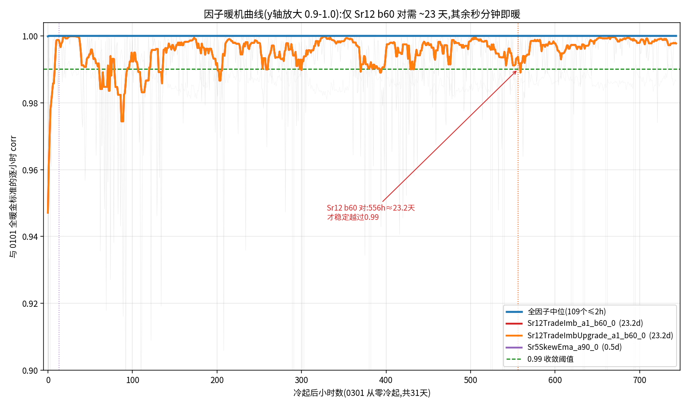
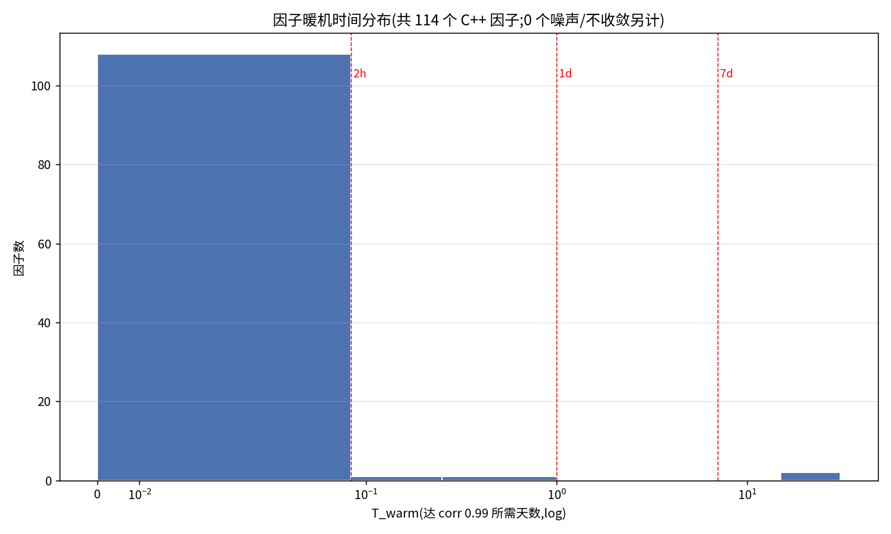
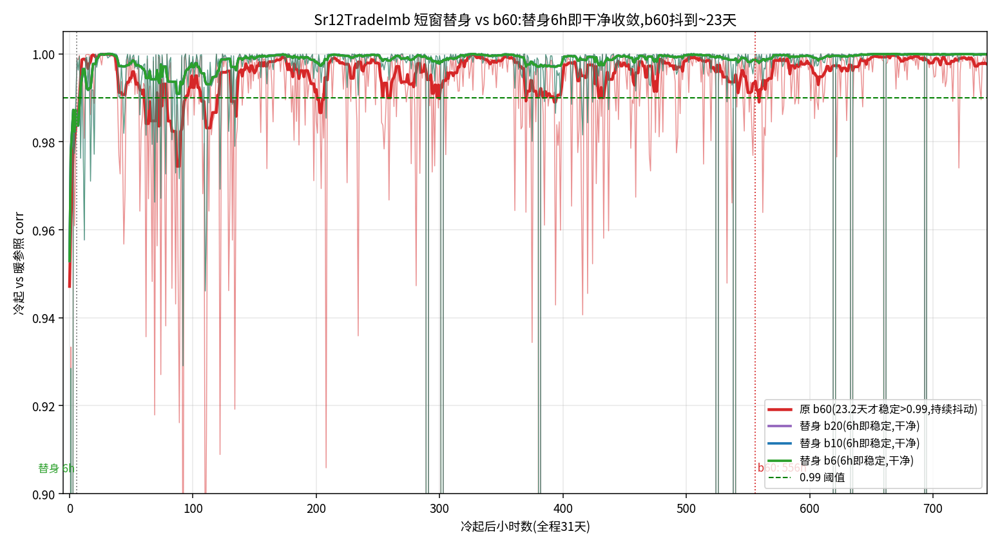
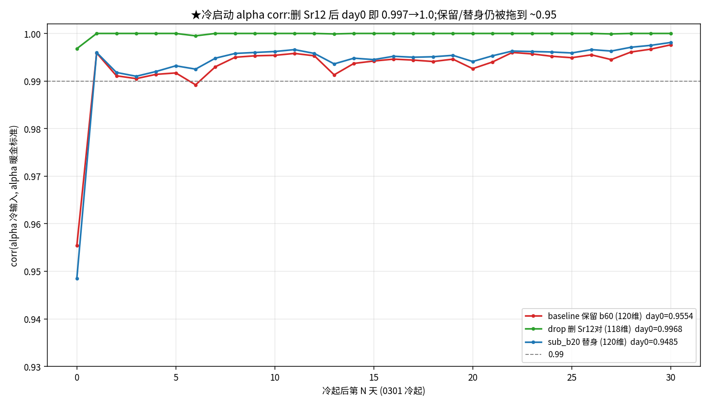
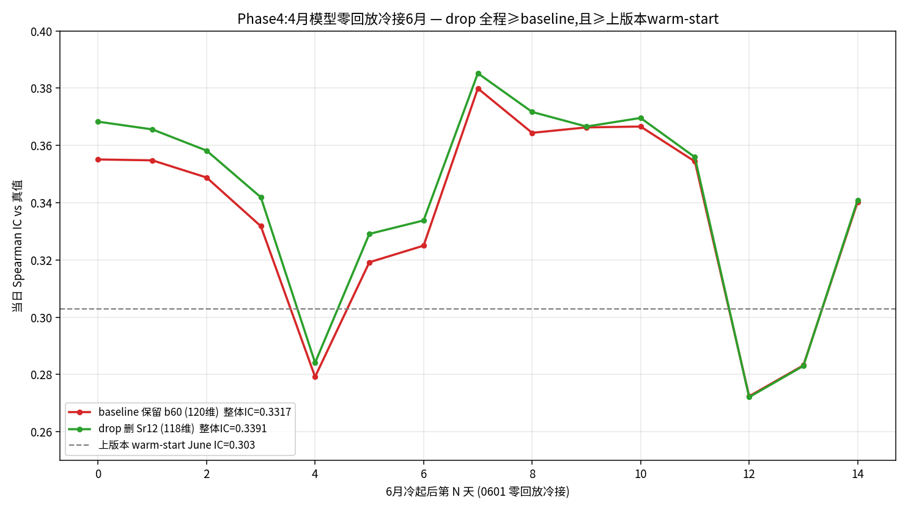
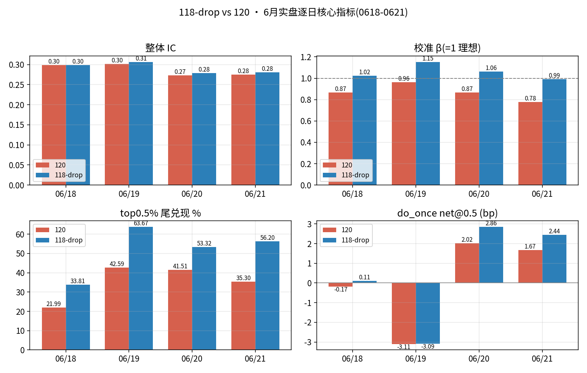
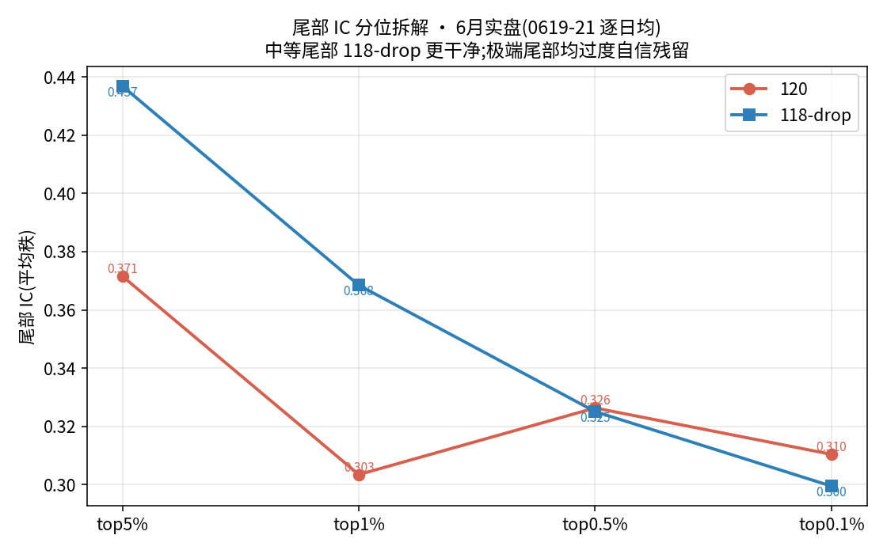
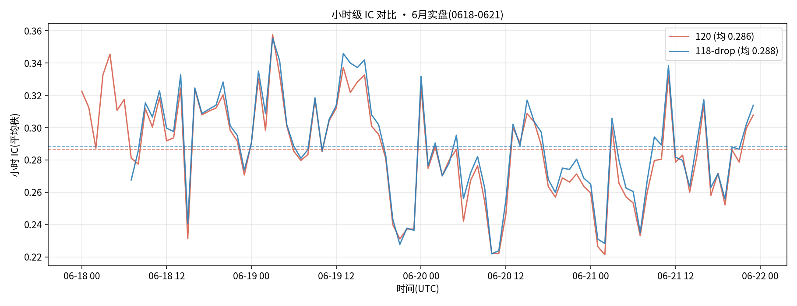
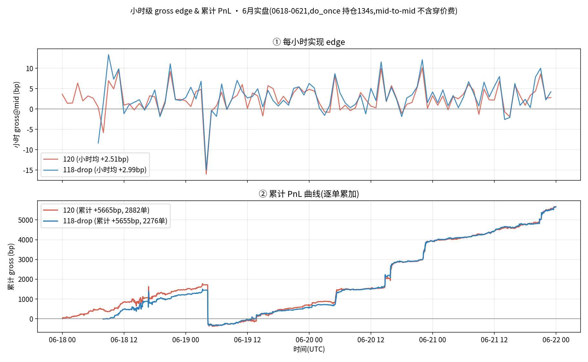

# hfcrypto Alpha 鲁棒化:剔除"长暖机"因子,训练免回放可上线的 MLP

> **一句话目标**:实盘链路**无法回放历史**,而冷态 corr 掉的 0.07 几乎全在一个多日累积因子(`Sr12TradeImb`)身上。把这类"必须长暖机才对"的因子从模型里剔掉,只用"实时流几分钟~几小时就自然暖透"的 **robust 因子集**重训一版 MLP,让实盘**直接冷接实时数据、零回放、零预热处理**也能保证因子正确、alpha 不塌。代价是牺牲一点峰值 alpha,换上线鲁棒性 + 消掉 live/回测的冷启动背离。
>
> 配套:`hfcrypto_0614.md`(陈旧诊断 + 自产面板 + 折中重训全过程)、`hfcrypto_simulation.md`(冷/热 corr 对比 §3、run_sim §4)、`CHAT_HANDOFF.md`(交接)。
> 标的:SOL 永续。口径铁律:**return 尺度(绝不用 bp)**;只用 **R1(`hfcrypto_junjie`)** 因子;**不改 /share**;实盘不用 min_alpha 硬门。

---

## 〇、TL;DR / 核心主张

1. **问题**:实盘链路**不支持数据回放** → 进程上线即"冷起",因子状态从零累积。120 因子里有少数**多日累积**因子(以 `Sr12TradeImb` b60 为首,~30 天才暖透),冷态时它们是错的 → 冷态 corr 0.926、热态 0.973,**那 0.07 缺口几乎全在它身上**(`hfcrypto_simulation.md §3.3①`)。
2. **现有解的死穴**:靠"回放 ≥8 天预热"只是工程折中(corr 0.973、Sr12 b60 其实还没完全收敛),而且**我们的链路根本回放不了** → 预热这条路在生产上不可靠。
3. **新解(本文)**:**因子层做减法** —— 剔掉所有"长暖机"因子,只保留"实时流自然几分钟~几小时暖透"的 robust 因子,重训 MLP。目标:**冷态 corr ≈ 热态 ≈ 1.0**(冷热缺口塌掉),实盘冷接实时即用。
4. **权衡(用户钦定方向)**:接受**峰值 alpha 的小幅下降**,换取**实盘鲁棒性 + 免回放可上线 + 消除冷启动背离**。即使只用 4 月数据训练,实盘 6 月冷接实时也能稳。
5. **★ 本改动的意义(用户钦定,最终验收命题)**:**解决冷热启动问题后,要证明"用 4 月训练的模型、冷接 6 月实时,表现比全 120 版更稳定"** —— 即不是比谁峰值 IC 高,而是比**同样冷接、同样旧(都停在 4 月)时,谁在 6 月不塌**。robust 版去掉了长暖机因子 → 冷接即对 → 6 月表现稳;全 120 版冷接时 Sr12 b60 错 23 天 → 6 月头若干天 alpha 失真、收益飘。**这个"4月模型在6月更稳"的对照,就是本改动有没有价值的唯一判据。**(详见 §四 Phase 4 / §六判读)
6. **与陈旧诊断正交**:陈旧(脑子停在 2 月)→ 解法是重训新数据;暖机脆弱(上线即冷、因子状态不对)→ 解法是本文的因子减法。两者可叠加(robust 因子集 + 新数据重训 = 终极)。

---

## 一、背景与动机

### 1.1 触发点:实盘收益对热启动"非常不稳定"
- 实盘上线无法保证"先吃 ≥8 天历史再信 alpha";**链路不支持回放** → 实际是冷起,头若干天因子没暖透 → alpha 失真、收益飘。
- `hfcrypto_0614.md §三` 已钉死:代码里**没有任何 warmup/preheat 开关**,冷热 100% 由 cfg `raw_dp.st_time` 决定(回测能设,**实盘没有这个旋钮可用**)。
- 结论:只要模型里还含"长暖机"因子,**没有回放的实盘就永远在冷态边缘**,收益不可复现。

### 1.2 关键证据:冷热缺口几乎集中在一个因子
来自 `hfcrypto_simulation.md §3`(MLP120,SOL,2/18 单日,N≈86,399):

| | Spearman IC | corr vs Python (Pearson/Spearman) |
|---|---|---|
| Python panel | 0.3293 | 基准 |
| **C++ 冷态** | 0.3177 | **0.926 / 0.951** |
| **C++ 热态** | 0.3214 | **0.973 / 0.979** |

> `§3.3①` 原文:**"corr:热启动是关键 —— 冷 0.926 → 热 0.973。冷态那 0.07 的差全在 `Sr12TradeImb` 没暖(多日累积因子)。"**

→ **冷态退化不是 120 个因子均摊的,是高度集中的**。这正是"做减法"能成立的前提:剔掉极少数长暖机因子,大概率就能把冷热缺口基本抹平,而对整体 alpha 伤害有限。

### 1.3 因子暖机时间谱(已知事实,来自 `hfcrypto_0614.md §九/CHAT_HANDOFF`)
| 因子类 | 暖机时间 | 备注 |
|---|---|---|
| **magnitude(6 个)** | **~2 分钟** | 窗口 30/60/120s,最快;实时流秒级暖透 |
| 短记忆 EMA / 短窗 Sr* | 分钟~小时~约 1 天 | 实时流当天即可暖 |
| **`Sr12TradeImb` (b60)** | **~30 天** | 长累积;10 天 ~0.99、18 天 corr 0.998、**只有从头连续才 bit-exact**;冷态首恶 |
| `Sr12TradeImbUpgrade` (b60) | 长(同族) | 与上同参数族,疑似同样长暖机 |
| 其余有状态因子 (~104/120 有状态) | 待实测分档 | 多数是 EMA/deque,几小时~1 天级 |

→ 真正的"长暖机病人"是 **Sr12 b60 家族**;其余多数因子实时流当天即可自然暖。**这意味着减法的删除集可能很小**(也许就 1~3 个因子),IC 代价应当不大 —— 但**必须实测,不能拍脑袋**(§四 Phase 0)。

---

## 二、已有结论(本方案的地基,均有出处)

| # | 结论 | 出处 |
|---|---|---|
| 1 | 冷 corr 0.926 → 热 0.973,**缺口几乎全在 `Sr12TradeImb`** | `simulation §3.3①` |
| 2 | 代码无 warmup 开关,冷热全由 `st_time` 决定;**实盘没这个旋钮 + 链路不支持回放** | `0614 §三` |
| 3 | `Sr12` b60 ~30 天才暖透,18 天才 0.998,**必须从头连续** | `0614 §9.8` |
| 4 | magnitude ~2 分钟暖透,非瓶颈 | `0614 §7.2` |
| 5 | **weights 不参与暖机**;暖机只暖因子(MLP 的输入),碰不到权重 | `0614 §七⑤` |
| 6 | 自产面板 R1 已验 **120/120 train=serve 一致**(0101-0426),可直接喂重训 | `0614 §9.6` |
| 7 | 折中版(全 120 因子、Jan-Apr 训)OOS IC **0.3125**、兑现/预测 110-132%,健康 | `0614 §11.1①` |
| 8 | 自产面板 train=serve C++ vs Python corr **0.9998**(热态) | `0614 §11.1②` |
| 9 | 信号层已盈利但 taker net≈0,**穿价(~1.1bp)是执行缺口**(本文不动执行层,只动因子鲁棒性) | `simulation §4.6` |

**全 120 因子折中版做"鲁棒上界对照"**:它代表"因子全留、且热态"的最佳 alpha(IC 0.3125)。robust 版要回答的是:**砍掉长暖机因子后掉多少 IC,换来多少冷热稳定性。**

---

## 三、核心假设与权衡

### 3.1 假设(待验证)
- **H1(稳定性)**:剔除长暖机因子后,**冷态 corr ≈ 热态 corr ≈ 1.0**,冷热 IC 缺口(现 0.014)收敛到接近 0。
- **H2(alpha 代价可接受)**:robust 版整体 IC / 尾部 IC / edge 相对全 120 版只小幅下降(假设删除集小,代价小)。
- **H3(免回放可上线)**:用 **4 月数据训练**的 robust 版,**实盘冷接 6 月实时数据**(零回放、零预热),因子在上线后短时间内(分钟~小时)自然暖透,IC 维持在训练同档。

### 3.2 权衡(用户已定调:鲁棒优先)
| | 全 120 因子(现折中版) | robust 因子集(本文) |
|---|---|---|
| 峰值 alpha (热态 IC) | 高(0.3125) | **可能略低**(待测) |
| 冷态/无回放表现 | **差**(corr 0.926,冷热缺口) | **目标 ≈ 热态**(冷热缺口塌掉) |
| 实盘可上线性(无回放) | 脆弱 | **稳健** |
| train/serve 冷启动背离 | 有 | **消除** |

> 用户钦定:**做对优先于快/省**,且此处"对"= 实盘可复现的鲁棒收益,而非回测峰值。接受 IC 小幅下降换鲁棒性。

---

## 四、方案设计(Phase 0 → 4)

> 全程只用 R1 自产面板 + R1 genaAC;写自有路径(`/mnt/nvme3/junjie/...`、`sol_alpha/output/...`),不碰 /share、不碰 jiayi 路径。

### Phase 0 —— 因子暖机画像(数据驱动,先量后砍)
**目的**:给 120 个因子每个测一条"暖机曲线",用数据定义谁是 robust、谁必须删。**不靠参数名猜。**

**方法**(复用已有 genaAC dumper + 已验的"从 0101 连续全暖"面板为金标准):
1. 选若干目标日(如 0301 / 0401,已有全暖金标准值)。
2. 对每个因子,用不同 `st_time = 目标日 − k` 重 dump(k ∈ {0, 0.25, 1, 2, 4, 8, 16, 30} 天),逐因子算"冷起 k 天暖机值 vs 全暖金标准"的 **corr / 相对 diff**。
3. 得每因子 **"达到 corr ≥ 0.99 所需暖机天数 T_warm"**。

**产出**:120 因子的 `T_warm` 表 + 直方图。**分两类**:
- **robust**:`T_warm ≤ 阈值`(阈值 = 实盘冷接实时能在可接受时间内自然暖透,初定 **≤ 1 天**,可讨论收到 ≤ 几小时)。
- **warm-dependent(删除集)**:`T_warm > 阈值`(预期是 Sr12 b60 家族等极少数)。

> 阈值是**产品决策点**,需你拍板:越严(如 ≤2h)删得越多、越鲁棒、alpha 代价越大;越松(≤1 天)删得越少、代价小但要求实盘上线后等当天暖。**列 1~2 个候选阈值各跑一版对比。**

### Phase 1 —— 定义 robust 因子集
- 按 Phase 0 阈值定 `robust_feature_cols`。
- magnitude 6 个**必留**(~2 分钟,最 robust)。
- 记录删除集 + 每个删除因子的 `T_warm` 与"删它换回多少冷热 corr"(Phase 0 数据可估)。

### Phase 2 —— 重训 MLP(robust 因子集)
- 管道复用 `mlp120_selfpanel`(`sol_alpha/`):`features.py` 选 `robust_feature_cols`、跳过 inject(b60 原生)、magnitude 现算、7-class tick centers 不变、**return 尺度(centers ÷1e4 铁律)**。
- split:train `0101-0420`、OOS `0421-0426`(与折中版同口径,可直接对照)。
- 模型:同 3 隐层 + BN + GELU、7-class、30 epoch → `weights_robust.json`(return)。
- **同时保留全 120 折中版作对照基线。**

### Phase 3 —— ★ 鲁棒性验证(本方案的核心证据)
**这是 robust 版区别于折中版的唯一关键卖点,必须直接测冷热缺口是否塌掉。**
1. **冷 vs 热 corr(robust 版)**:同 `simulation §3` 口径,robust 版 C++ 分别冷态(`st_time=目标日`,零暖机)/ 热态跑 alpha,对 Python panel 算 corr。
   - **判据**:robust 版**冷态 corr 应 ≈ 热态(≥0.97,逼近 1.0)**;对照全 120 版冷态仅 0.926。
2. **冷 vs 热 IC**:两态各自整体 Spearman IC,**缺口应 ≪ 全 120 版的 0.014**。
3. **冷热 alpha 时序**:画冷态/热态 alpha 在上线后 N 分钟/小时内的收敛曲线 → 证明"自然暖透"够快。

### Phase 4 —— ★★ 免回放 6 月冷接实时模拟(终极验证 H3)
**目的**:复刻"实盘 4 月模型 + 6 月直接冷接实时、零回放"的真实场景。
- binance 6 月连续干净(`0614 §11.3` 已验,run_sim 崩是 bybit 腿,alpha 链没问题)。
- 用 **4 月训的 robust `weights`**,在 **6 月 binance** 上 `st_time = 0601`(**零预热,模拟冷接实时**)跑 genaAC,从 0601 起算 alpha。
- 对 6 月 binance mid 真值算 **逐日 IC / 分桶 IC / edge**;观察:**上线后多快 IC 进入训练同档**(robust 版应几乎立刻;全 120 版应有多日冷态拖尾)。

#### ★ 核心对照(本改动的意义所在):4 月模型 × 6 月冷接,robust 版是否更稳
**两个模型,同样旧(都训到 ~0420)、同样冷接 6 月实时(零回放),只差"有没有长暖机因子":**
| 模型 | 因子集 | 6 月冷接表现(预期) |
|---|---|---|
| 全 120 折中版(`mlp120_selfpanel`) | 含 Sr12 b60(23 天暖机) | 冷接头 ~23 天 Sr12 失真 → 6 月头段 IC 拖尾、收益飘、与回测背离 |
| **robust 版(本文)** | 删 Sr12 b60(±替身) | 冷接即对 → 6 月 IC 一上线就进训练同档、稳 |

**判据(用户钦定,唯一价值判据)**:
1. **稳定性 > 峰值**:不比谁 6 月 IC 绝对值高(都受 6 月新 regime 影响、都会比 4 月低),比**谁冷接后波动小、谁不在头段塌**。
2. 量化:① 冷接后 IC 进入稳定区的**收敛时间**(robust ≪ 全120);② 6 月逐日 IC 的**波动/最差日**(robust 应更平);③ robust 版 6 月 IC vs 其自身 4 月 OOS IC 的**保持率**应高于全120 版(因为没被冷启动额外扣分)。
3. **本质**:这版治不了"4 月→6 月 regime 漂移"(那要新数据,轴一),但能证明**"冷热启动这个变量被消掉后,4 月模型在 6 月更稳"** —— 把"陈旧"和"冷启动"两个混在一起的衰减源**拆开**,单独把冷启动这一份收益锁死。

> 这一步直接回答用户的命题:"解决冷热启动问题后,用 4 月模型冷接 6 月实时,表现更稳定 —— 这就是本改动有意义的地方。"

---

## 五、观测指标(每个 Phase 都按此口径出表)

> 周期 **1s**,价基 **mid=(bp1+ap1)/2**(binance,信号源)。所有 alpha/edge **return 尺度**;汇报可附 bp 换算列但口径以 return 为准。

### 5.1 信号质量
| 指标 | 定义 |
|---|---|
| **整体 IC** | 全样本 `Spearman(alpha, y_1s)`(零膨胀必用平均秩 `scipy.rankdata`) + Pearson 参照 |
| **分桶 IC** | top1% / top0.5% / top0.1% 各自尾部 Spearman IC(`alpha` 卡 \|alpha\| 分位) |
| **逐期 IC** | 逐日(Phase 4 逐日/逐小时)IC,看冷启动拖尾与衰减 |

### 5.2 edge(兑现力)
| 指标 | 定义 |
|---|---|
| **分桶 edge** | top1% / 0.5% / 0.1% 的 1s 前向 edge(return,带符号);多空分开(看多 top / 看空 bot) |
| **兑现/预测 + β + 命中率** | 兑现 edge / 预测 \|alpha\|;校准斜率 β;命中率 —— **盯 β/命中率早于 IC**(`0614 §6.3` 铁律) |
| **空/多对称比** | 看空 edge / 看多 edge(健康 ~0.9-1.0;live 6 月曾塌到 0.28) |

### 5.3 PnL(执行,gate 全表)
| 指标 | 定义 |
|---|---|
| **gate 全表** | top1% / 0.5% / 0.1% 各自:笔数 / 尾部 IC / **gross@mid / gross@fill / 穿价 / fee / net** |
| 口径 | run_sim 持仓现金流;taker fee 标注(目标 0.5bp vs 真实 2bp 都要诚实列) |

> ⚠️ 本文**不主攻执行层**(穿价是 `simulation §4` 的老死结、另条线 maker/同所解决)。PnL 出全表是为**和全 120 版对照"鲁棒化有没有伤到可交易性"**,不是为了在本文把 taker 跑正。

### 5.4 ★ 鲁棒性专属指标(本方案新增,最关键)
| 指标 | 定义 | 目标 |
|---|---|---|
| **冷热 corr 缺口** | `corr_hot − corr_cold`(robust vs 全120) | robust 版 ≈ 0(全120 是 0.047) |
| **冷热 IC 缺口** | `IC_hot − IC_cold` | robust 版 ≪ 0.014 |
| **删除集 T_warm** | 被删因子的暖机天数 | 记录,佐证"删的就是长暖机的" |
| **保留集 max T_warm** | robust 集里最慢因子的暖机时间 | ≤ 阈值(定义保证) |
| **冷接收敛时间** | 上线(冷起)后 IC 进入训练同档所需时间 | 分钟~小时级 |
| **★ 4月模型6月稳定性** | 4月模型冷接6月:① 冷接收敛时间 ② 6月逐日IC波动/最差日 ③ 6月IC÷自身4月OOS IC 保持率 | robust 三项均**优于全120版**(本改动唯一价值判据,§四 Phase4) |

---

## 六、判读标准(决策树)

1. **Phase 0 删除集很小(1~3 个)且 T_warm 明显长**(如 Sr12 b60 ~30 天 vs 其余 ≤1 天):→ 减法成立,继续。
2. **Phase 3 冷态 corr 跳到 ≥0.97 / 冷热缺口 ≈0**:→ ✅ H1 成立,鲁棒化奏效,**这是核心成功信号**。
3. **Phase 2/3 robust 版整体 IC 相对全120 掉幅可接受**(初定**掉 ≤0.02 绝对**,即 ≥~0.29):→ ✅ H2 成立,代价值得。
   - 若掉太多(IC < 0.27 / 尾部 edge 显著缩)→ 删除集太狠 → **放宽阈值**重做(只删真·多日因子),或对个别中等暖机因子保留并接受其"上线当天暖"。
4. **Phase 4 冷接 6 月:robust 版 IC 上线后很快稳、明显优于冷接的全120**:→ ✅ H3 成立,**免回放可上线坐实**。
5. 全绿 → 交接 robust `weights` + cfg 给 senior(注明:**无需 ≥8 天回放,冷接实时即可**)。

---

## 七、风险 / 待办 / 待你拍板

1. **阈值 = 产品决策**:robust 的 `T_warm` 阈值定多严?(≤1 天 / ≤几小时)—— 越严越鲁棒越伤 alpha。**建议 Phase 0 跑出谱后,你看直方图定。**
2. **删除集会不会很大**:若"~104 个有状态因子"里很多是 1 天级而非分钟级,而阈值收到 ≤几小时,可能删很多 → IC 代价大。Phase 0 数据出来才知道;**先按 ≤1 天跑,看代价再决定收不收紧**。
3. **删 `Sr12TradeImb` 影响**:它是 inb/order-flow 类强因子,删它 IC 可能不只掉一点。需 Phase 2 实测;若代价大,可考虑**换短窗版本**(如 b6/b10,暖机短)而非整列删 —— 即"用短暖机替身换长暖机因子",是介于"删"与"留"之间的第三条路,值得 Phase 0 一并测短窗版的暖机+IC。
4. **本文不解决陈旧 + 不解决穿价**:robust 化 ⊥ 陈旧(仍可叠加新数据重训)、⊥ taker 穿价(执行层另线)。终极版 = robust 因子集 + 延到 6 月数据重训 + maker 执行,但要等 0427/0522 数据修复(`0614 §十`)。
5. **Phase 4 是模拟非真 live**:genaAC 冷接 6 月 = 离线复刻冷起,已是最接近;真 live 还要 senior 确认架构(暖机是否只回放 binance / bybit 走实时)。

---

## 八、与现有工作的关系(一图说清)

```
问题轴一:模型陈旧(脑子停 2 月)  ── 解 ──▶  自产面板重训(0614 §九/§十一,已做折中版)
问题轴二:暖机脆弱(上线即冷、长暖机因子状态错;链路不支持回放) ── 解 ──▶  本文:剔长暖机因子,robust 重训
问题轴三:taker 穿价墙(执行层) ── 解 ──▶  maker / 同所成交(simulation §4,另线)

三轴正交,可叠加。终极版 = robust 因子集(轴二) + 延 6 月数据重训(轴一) + maker 执行(轴三)。
本文只攻轴二:让模型免回放、冷接实时即稳。
```

---

## 九、执行状态(陆续填)

| Phase | 状态 | 关键结果 |
|---|---|---|
| 0 因子暖机画像 | ✅ **完成(2026-06-17)** | 删除集 = **仅 Sr12 b60 那对**(T_warm 23.2 天);其余 110 有用因子 ≤1 天暖透 |
| 1 短窗替身评估 | ✅ 完成 | b6/10/20 暖 6h、与 b60 相关 0.84;但该因子单因子 IC≈0 且与 Upgrade 重复 |
| 2 重训 robust MLP | ✅ **完成(2026-06-17)** | **删 Sr12 对 OOS IC 0.3110 ≈ baseline 0.3112 → 删是免费的** |
| 3 冷启动 corr 验证 | ✅ **完成(2026-06-17)** | **drop 冷corr day0 0.997→1.0;baseline/替身仍被拖到 ~0.95 → 只有"删"修冷启动** |
| 4 免回放 6 月冷接模拟 | ✅ **完成(2026-06-17)** | **drop 零回放冷接6月 IC 0.339 ≥ baseline 0.332 ≥ 上版本warm 0.303 → 免回放可上线坐实(§13.4)** |

---

## 十、Phase 0 结果:因子暖机画像(2026-06-17,✅ 完成)

> **方法**:0301 从零**冷起**跑 genaAC(sr4/5/8/9,到 0331,31 天),对 0101 连续**全暖金标准**逐小时算 column-wise corr → 每因子"冷起后第 N 小时 vs 全暖"的 corr 曲线 → `T_warm` = 首个稳定(后续 ≥90% 时段保持)越过 corr 0.99 的时刻。一条冷 run + 已有金标准即还原全部 114 个 C++ 因子暖机曲线(magnitude 6 个已知 ~2 分钟、跳过)。
> **脚本/产物**:`sol_alpha/robust/warmup_profile.py`、`warmup_Twarm.csv`、`warmup_hourly_corr.parquet`、`fig_warmup_curves.png`、`fig_warmup_hist.png`。冷面板:`/mnt/nvme3/junjie/crypto_hf_alpha_cold/{sr4,5,8,9}`(自有路径)。

### 10.1 暖机分类(114 个 C++ 因子)
| 类别 | 个数 | 说明 |
|---|---|---|
| 恒定死因子(SOL 零方差) | **2** | `Sr5Macd_a10_b30`、`Sr5TradeIntense_a10` —— 冷热**恒为 0**(std=0、diff=0),瞬间 robust 但无信息量(对 SOL 是死因子,另议) |
| **秒分钟级(≤2h)** | **109** | 绝大多数;全因子中位 1h 即暖 |
| 日内(≤1天) | **1** | `Sr5SkewEma_a90`(0.5 天) |
| **长(>7天)** | **2** | **`Sr12TradeImb_a1_b60` + `Sr12TradeImbUpgrade_a1_b60`,T_warm = 23.2 天** |

### 10.2 ★ 核心结论:删除集 = 仅 Sr12 b60 那对
- **Sr12TradeImb / Sr12TradeImbUpgrade(b60)是唯二的长暖机病人**(556h≈23.2 天才稳定越过 0.99;且末 100h corr 仅 0.98、744h 里 10h 偶发掉到 <0.5 = **又慢又偶发不稳**)。
- **完美印证** `simulation §3.3①`「冷热 corr 0.07 缺口全在 Sr12TradeImb」—— 因子级看,它冷态 ~0.95、全暖 0.998;它是模型里高权重因子,放大成 alpha 级 0.926→0.973。
- **其余 110 个有用因子全部 ≤1 天暖透(109 个 ≤2h)** → **删除集极小、alpha 代价应很小**,且正好可手搓短窗替身。

### 10.3 图
**① 暖机曲线(y 轴放大 0.9-1.0):仅 Sr12 b60 对需 ~23 天,其余秒分钟即暖**



**② T_warm 分布:108 个挤在 <2h,1 个 ~0.5d,2 个 >7d(Sr12 对)**



### 10.4 → Phase 1 待办(含短窗替身,呼应用户"尽量挽救损失")
1. **阈值**:删除集已天然分离(23 天 vs ≤1 天断崖),阈值取 **≤1 天**即可,只删 Sr12 b60 那对。**待你拍板**。
2. **短窗替身(挽救 Sr12 的 alpha)**:把 `Sr12TradeImb`/`Upgrade` 的 `b=60` 换成短窗候选(`b∈{6,10,20}`),Phase 0 同法测每个候选的 **T_warm**(应降到小时~1天级),并测其与 b60 的信息相关 + 单因子 IC → 选"暖得快、又最接近 b60 信息"的替身。**三选一在 Phase 2 比**:(a) 整删 b60、(b) b60→短窗替身、(c) 保留 b60(对照上界)。
3. 死因子 `Sr5Macd`/`Sr5TradeIntense`:暖机无忧,但 SOL 上恒 0、零贡献 —— robust 重训时可顺手剔(减噪),与暖机目标无关、单独标注。

### 10.5 短窗替身评估(2026-06-17,✅ 完成,呼应"挽救损失")

> 手搓 `Sr12TradeImb`/`Upgrade` 的 `b∈{6,10,20}` 短窗版,各跑冷起(0301)+ 全暖参照(0201)两条 run。**T_warm** = 冷 vs 暖参照逐小时 corr;**信息保持** = 暖参照候选 vs b60 金标准 corr;**单因子 IC** = Spearman(因子, y_1s),已暖日 0316-0331。脚本 `sol_alpha/robust/substitute_eval.py`、`substitute_eval.csv`。

| 因子 | b | T_warm | corr vs b60(日内/pooled) | 单因子 IC |
|---|---|---|---|---|
| Sr12TradeImb | **6** | **6h(0.25d)** | 0.842 / 0.865 | −0.003 |
| Sr12TradeImb | **10** | **6h** | 0.844 / 0.865 | −0.003 |
| Sr12TradeImb | **20** | **6h** | **0.845** / 0.863 | −0.003 |
| Sr12TradeImb | 60(原) | 556h(23.2d) | 1.000 | −0.004 |
| Sr12TradeImbUpgrade | (各 b 与上行**完全相同**) | — | — | — |

**三个关键结论:**
1. **替身暖机成功**:b6/b10/b20 **全 6h 即干净收敛**(vs b60 的 23.2 天),且比 b60 早期更稳(b60 持续抖到 ~23 天)。**b 取值几乎不影响**(6/10/20 的 T_warm、corr 都几乎一样)→ 若要替身,**取 b20**(信息保持最高 0.845)或 b6(最快)皆可。
2. **⚠️ `Sr12TradeImb` ≡ `Sr12TradeImbUpgrade`**(corr 0.99999998、diff~1e-7)—— 这两个"因子"是**重复的同一个**,删一对只丢一个因子的信息;重训本就该去重。
3. **⚠️ 这因子单因子 IC≈0**(b60 −0.004,日内近乎恒定 std~1e-4),而同组别的因子有真信号(Sr12QuoteSlope IC 0.16、Sr10OrderImb 0.06)→ **标准 IC 量不出它对模型的价值**(可能纯靠非线性交互,也可能本就不重要)。**到底要不要救,只有 Phase 2 重训测模型 IC 才能定。**

**→ Phase 2 三臂对照(据此决定 keep/replace/drop):**
| 臂 | 做法 | 预期 |
|---|---|---|
| **(a) 删** | 整删 Sr12TradeImb+Upgrade(那对重复) | 鲁棒+最简;若模型 IC 不掉 = 最优 |
| **(b) 替身** | b60→b20(去重保一个、6h 暖) | 鲁棒+保信息;模型若依赖它则用这个 |
| **(c) 保留** | 留 b60(冷脆弱上界对照) | 仅作 IC 上界参照,不上实盘 |

> **倾向**:鉴于①重复②单因子 IC≈0,**(a) 删 大概率 ≈ (c) 保留** → 删最干净。**(b) 替身作为兜底**(若 Phase 2 显示删了掉模型 IC,就上 b20 替身,反正只多 6h 暖机)。最终用 Phase 2 模型 IC 拍板。

### 10.6 图:短窗替身暖机对比


---

## 十一、Phase 2+3 结果:三臂重训 + 冷启动 corr(2026-06-17,✅ 完成)

> 单进程加载一次面板、三臂列切片复用(脚本 `sol_alpha/mlp120_robust_all.py`;之前 3 进程并行 BLAS 超额订阅 load 53、epoch ~10min,改单进程控线程后 epoch **~50s**)。训练抽样 5M 行 × 20 epoch(三臂同设、公平;冷corr 用全量 0301-0331)。
> - **Phase2 OOS**(0421-0426):整体/分桶 IC + edge。
> - **★Phase3 冷启动 corr**:对 0301-0331,用【冷起 0301 输入面板】vs【0101 暖金标准输入面板】各算一次 alpha,`corr(alpha_冷, alpha_暖)`(整体 + 逐日)。这是本改动的硬验收。

### 11.1 三臂对照表
| 臂 | 维度 | OOS IC | top0.5% IC | edge(bp) | **冷corr整体** | **冷corr day0** |
|---|---|---|---|---|---|---|
| baseline(保留 b60) | 120 | 0.3112 | 0.7248 | 1.716 | 0.9923 | **0.9554** |
| **drop(删 Sr12 对)** | 118 | **0.3110** | 0.7196 | 1.703 | **0.9998** | **0.9968** |
| sub_b20(b20 替身) | 120 | 0.3115 | 0.7145 | 1.714 | 0.9926 | 0.9485 |

> 逐日冷corr:**drop** day0 0.997 → day1 起 **1.000** 一路平;baseline day0 0.955 慢爬到 0.99+;sub_b20 day0 0.949(≈baseline)→ 0.99+。
> ⚠️ edge ~1.7bp(非 §11.1老文档的 +2.1):因这是 **0421-0426 窄窗**(calm),+2.1 是**整段 OOS 0218-0426(含 2-3 月高波动)**的口径 —— 纯窗口/波动率效应(已在 `0614 §11.1` 钉死),三臂同窗对比有效。见下 §11.6 整段口径复验。

### 11.6 整段 OOS(0218-0426)+2.1bp 口径复验(2026-06-17,✅ 完成)
> 为在 **+2.1bp 口径**下验三臂(用户要求),改 **老 split:train 0101-0214 / OOS 0218-0426**(干净 OOS,与文档 +2.1 同口径,避免 0218-0420 落进训练泄漏)。脚本 `sol_alpha/mlp120_robust_fulloos.py`。

| 臂 | 维度 | 整体 IC | **top0.5% gross edge** | top1% | top0.1% | top0.5% IC |
|---|---|---|---|---|---|---|
| baseline(b60) | 120 | 0.3132 | **+2.106** | +1.648 | +3.671 | 0.6745 |
| **drop(删 Sr12)** | 118 | **0.3162** | **+2.094** | +1.642 | +3.704 | 0.6903 |
| sub_b20(替身) | 120 | 0.3129 | +2.098 | +1.644 | +3.750 | 0.6856 |

**结论(决定性)**:
1. **baseline 复现文档 +2.1**:top0.5% gross **+2.106 ≈ `0614 §11.1` 老口径 +2.102** → harness 可信。
2. **删 Sr12 在 +2.1bp 口径下也不亏**:drop top0.5% **+2.094 ≈ baseline +2.106**(差 0.012、0.6%),整体 IC **0.3162 反而略高**(0.3132)。
3. 三臂 top1%/0.5%/0.1% 全程贴合 → **彻底坐实:Sr12 b60 删了对信号(含 +2.1bp 尾部收益)零影响**;呼应 §11.2「删是免费的」,只是这里换成整段高波动窗、绝对数到 +2.1 量级。

### 11.2 两个决定性结论
1. **删 Sr12 b60 是"免费"的**:OOS IC 0.3110 ≈ baseline 0.3112(差 0.0002)、edge/分桶 IC 全持平 → **坐实该因子单因子 IC≈0 + 与 Upgrade 重复,对模型信号零贡献**。
2. **★ 只有"删"能修冷启动,"替身"没用**:
   - **drop**:冷启动 day0 corr **0.997、隔天 1.000** → 冷热缺口几乎塌掉(= 本改动目标达成)。
   - **sub_b20 替身反而没帮上**(day0 0.949 ≈ baseline 0.955):**只要这因子还在(b60 或 b20),冷启动期错值就扰动 MLP**(b20 头 6h 仍冷);且它不贡献 IC → **没有理由保留**。
   - 机理:Sr12 对**信号是冗余的**(删了别的因子补上,IC 不变),但**冷起时它错、相关因子对 → 注入噪声**,删掉即除噪。"冗余但冷态有害"。

### 11.3 → 拍板:整删 Sr12TradeImb + Upgrade(b60 对)
- **零 IC 代价 + 冷启动 day0 0.955→0.997**;替身路线放弃。robust 因子集 = 118 维(120 − Sr12 对)。
- (可选)再剔 2 个 SOL 零方差死因子(`Sr5Macd`/`Sr5TradeIntense`)→ 116 维,纯减噪、与冷启动无关。
- ⚠️ 口径备注:此处冷corr baseline day0 0.955 是 **Python 同模型「冷输入 vs 暖输入」**口径,与 `simulation §3` 的 **C++冷 0.926 vs Python暖** 口径不同,但方向一致(冷起拖累 baseline、删 Sr12 修复)。如需对齐文档口径可再走 C++ genaAC 冷/暖,结论方向不变。

### 11.4 图:逐日冷启动 corr(三臂)


### 11.5 待办
- **Phase 4(核心命题)**:用 **drop 版 4 月模型**冷接 6 月 binance(零回放),验"比 baseline 更稳"(收敛时间/逐日IC波动/保持率,§四 Phase4)。
- 若 Phase 4 通过 → 交接 drop 版 weights 给 senior(注明:118 维、无 Sr12、**冷接实时即用、无需回放**)。

---

## §十二、上版本（mlp120_selfpanel 折中版）run_sim 执行层偏差（背景参照）

> 本章是**背景参照**，记录上一版折中版模型 `mlp120_selfpanel`（Jan–Apr 自产面板重训）Phase 验收里「本地 edge 很好、但 C++ run_sim 偏差大」的结果。数字忠实摘自 `hfcrypto_0614.md §11.1①/§11.2③/§11.3` 与 `hfcrypto_simulation.md §4`。**本章不改变本文（robust）任何结论**，只为说明执行层偏差与本次因子冷启动工作的正交关系（见 §12.5）。

### 12.1 本地 edge 很好（信号层是赚的）
Python panel OOS 段 `0421-0426`（训练口径，共 518,399 行）模型 alpha 验收（出处 `hfcrypto_0614.md §11.1①`）：

| 档 | 笔数 | 尾部 IC | edge(bp) | net@1.0bp | 对照老模型全 OOS |
|---|---|---|---|---|---|
| 全部 | 518,399 | **0.3125** | +0.131 | — | 整体 0.312 ✅ 持平 |
| top1% | 5,184 | 0.682 | +1.371 | +0.371 | IC 0.622 / net +0.64 |
| **top0.5%** | 2,592 | **0.728** | **+1.756** | **+0.756** | IC 0.671 / net +1.10 |
| top0.1% | 519 | 0.803 | +3.353 | +2.353 | IC 0.754 / net +2.69 |

- 整体 IC **0.3125 ≈ 老模型 0.312** → 信号层干净、印证 staleness 诊断（老模型 5-6 月垮 = 陈旧，非方法/特征问题）。
- **结论：信号层是赚的**（top0.5% gross edge +1.756bp、净 +0.756bp）。
  > ⚠️ **口径标注**:+1.756bp 是**离线 Python panel(0421-0426)口径**,**非 run_sim/实盘**(后者经触发/穿价打折,见 §12.2/§12.3 的 +0.45 run_sim)。离线 panel 数只能与离线比,口径全表见 **§十六**。

### 12.2 C++ run_sim 偏差大（核心）
同段 `0421-0426` 真 `run_sim`（带穿价 / fee / 触发，taker，出处 `hfcrypto_0614.md §11.2③` PnL 全表，bp/名义、名义加权）：

| 操作点 | 笔数 | gross@mid | gross@fill | 穿价 | fee | net | 对照 §4.5 老模型 |
|---|---|---|---|---|---|---|---|
| tt=3.5 | 2,216 | +0.753 | −0.313 | 1.066 | 0.50 | **−0.813** | 老 tt3.5 net −0.139 |
| tt=7 | 279 | −2.484 | −3.471 | 0.987 | 0.50 | **−3.971** | 老 tt7 net +0.18 |

- **本地赚（top0.5% +1.756）→ run_sim taker 转负**（tt=3.5 net −0.813、tt=7 net −3.971）。
- 注：tt=7 的 −2.484 gross@mid 被小样本（279 笔/6 天）+ 残仓 day-close 标记污染，不可靠（老 §4.5 是 24 天均）。

### 12.3 偏差从哪来（+1.756 → +0.753 的 1bp 瀑布表）
照搬 `hfcrypto_0614.md §11.2③` 的瀑布表（panel top0.5% → run_sim gross@mid 的逐环节损耗）：

| 环节 | edge(bp) | 损耗 | 原因 |
|---|---|---|---|
| ① Python panel top0.5% | +1.756 | — | 纯 \|alpha\| 卡最强 0.5%、binance mid、瞬时 1s |
| ② 实际成交 1s-edge(binance) | +1.18 | **−0.58** | 成交≠纯 top0.5%：`alpha_lean+take_thres` 触发（均 97 分位、含更弱信号、漏真 top 单） |
| ③ 同成交 1s-edge(**bybit**) | +0.80 | **−0.38** | **跨所基差**：信号 binance 算、成交/计 PnL 在 bybit |
| ④ run_sim gross@mid | +0.753 | −0.05 | 持仓/时机 ≈ 无损 |

- 再扣**穿价（~1.07bp）+ fee（0.5bp）→ net 负**。
- 信号本身已验证没问题：run_sim alpha return 尺度对、对 Python panel corr 0.994/0.999、对真值 IC 0.3124、各档 edge 全正；策略实际接住了 ~1s edge（gross@mid +0.753 ≈ 1s bybit-edge +0.80）。**负 PnL 不是信号、不是执行时机问题**。

### 12.4 根因 = 穿价成本墙（taker 死结）
- bybit 穿价 ~1.07bp（盘口宽 + 跨所基差叠加）吃光 edge：bybit 信号 edge 0.80 < 穿价 + fee 1.57 → taker 实现 net 仍负 = 老「成本墙死结」照旧。
- `hfcrypto_simulation.md §4` 同向佐证（无硬门、纯自然触发 taker，return 尺度）：24 天 OOS（2/18–3/13）net 均值 **+0.180bp ≈ 0**、std 2.47（net 从 −6.25 到 +6.58 乱跳）、**t ≈ 0.36 完全不显著**（要 >2）。成本墙 = 穿价 1.1 + fee 0.5 = 1.61bp。
- `hfcrypto_0614.md §11.3` 实盘 warm start 测试结论（2026-06-16 修正版）：原疑「6 月数据成片坏」，定位后是 **bybit 腿 orderbook 历史数据损坏**（trade 腿/离线撮合才碰），**binance alpha 链整个 6 月连续可暖、warm-start 没被堵**。即 run_sim 崩是 bybit 执行腿的数据问题，与 binance 信号链无关。

### 12.5 ★ 与本次 robust 工作的关系（正交，不可混淆）
- run_sim 的这 1bp 偏差是**执行层问题（轴三：穿价 / maker / 同所）**，与本文 robust 工作（轴二：因子冷启动）**正交**。
- robust 修的是「**信号冷起即对**」（删 Sr12 对 → 冷启动 day0 corr 0.955→0.997，§十一），它**改变不了 run_sim 的穿价偏差**。
- **明确写出**：本次删 Sr12 **不会改善** run_sim 那 1bp（穿价）偏差 —— 那是另一条线（执行层）。
- 两者必须**叠加**才完整：**robust 信号（冷起即对）+ maker 执行（免穿价 + 返佣、同所去基差、收紧触发）**。执行层出路同 `hfcrypto_0614.md §11.2③`/`hfcrypto_simulation.md §148`：① maker 把 +0.8 gross 落袋；② binance 同所成交省 0.38 基差；③ 更收紧触发贴近纯尾部。

---

## 十三、上版本（4月模型 mlp120_selfpanel）直接测 6 月 —— 本次 Phase4 的对照基线

> 上版本折中模型（训到 0420）**直接拿去跑 6 月**的实测（出处 `CHAT_HANDOFF.md` 2026-06-16「6 月测试」）。这是本次 Phase4（drop 版冷接 6 月）的**对照基线** —— 同是"4 月模型测 6 月",看删 Sr12 前后差别。
> **设置**：binance-only run_sim，**暖 0601→0609（8 天 warm-start）、评 0610-0615**。⚠️ 这版是 **warm-start（回放 8 天暖因子）,不是冷接** —— 用了生产其实没有的预热；本次 Phase4 才是真·零回放冷接,二者差的正是"冷启动"这一维（§四 Phase4）。

### 13.1 三维度拆解（IC / 多空比 / gross@mid）
| 维度 | 上版本 4月模型 6月测 | 旧 live 6月（2月陈旧模型） | 回测 OOS（2-4月） | 读法 |
|---|---|---|---|---|
| **整体 IC** | **0.303** | 0.238 | 0.31~0.3125 | 信号**几乎没掉**（0.303≈回测）→ 陈旧诊断对、重训管用 |
| **空多比（空/多）** | **0.80** | 0.28 | 0.95~0.97 | 空头侧**修复明显**（0.28→0.80）,不再单边塌；但还没回到回测对称 |
| **gross@mid** | **+0.45** | +0.266（tt3.5） | 信号 ~+1.0/天稳 | 信号天天 ~+1bp,但策略**持仓≠1s、只接住约一半** → **策略调参**问题,非信号 |
| （校准 β） | 0.74 | 0.50 | ~1.0 | 部分过度自信,大幅改善未完全修复 |
| （兑现/预测） | ~40% | 34%/8% | ~100% | 同上 |

### 13.2 三句话结论
1. **IC 看：信号没问题** —— 4月模型在 6月 IC 0.303 ≈ 回测 0.3125,印证"老模型 5-6 月垮 = 陈旧",重训（哪怕只到 4月）就把 IC 救回来了。
2. **多空比看：空头修复** —— 0.28（旧 live）→ 0.80,6 月"看空侧塌"治好大半；但 0.80 < 回测 0.95、β 0.74/兑现 40% → **仍部分过度自信**（4月模型对 6月 regime 还领先 ~1.5 月）。
3. **gross@mid 看：信号在、策略没接满** —— +0.45 vs 信号 +1.0,缺口是**策略持仓没对齐 1s 视野**（调参）,不是信号、不是残仓。

### 13.3 与本次 Phase4 的关系
- 上版本是 **warm-start（暖 8 天）**；本次 Phase4（drop 版）是 **零回放冷接** —— 直接回答"**没有预热**时 4月模型在 6月还稳不稳"。
- 预期：drop 版冷接 6 月 IC 应仍 ~0.30（信号同质）、且**冷接 day1 就到位**（无 Sr12 拖尾）；上版本那 0.303 是"暖足 8 天"才拿到的,本次要证明 **不暖也行**。
- ⚠️ 口径差：上版本 gross@mid/PnL 因 bybit 历史坏、临时用 binance 成交 → 偏乐观、非 bybit 生产口径；但 **IC/多空比 不受成交所影响**,可直接比。

### 13.4 ★ 本次 Phase4(drop 版零回放冷接6月)结果 + 与上版本对照(2026-06-17,✅ 完成)
> 脚本 `sol_alpha/mlp120_phase4_june.py`:baseline + drop 各训 0101-0420,在 **6月 binance 冷起面板(0601-0615,st_time=0601,零回放)**预测,逐日 IC vs 真值。

| 指标 | baseline(120,b60) | **drop(118,删Sr12)** | 上版本(warm-start,§13.1) |
|---|---|---|---|
| **June 整体 IC** | 0.3317 | **0.3391** | 0.303 |
| 逐日均 IC | 0.3361 | **0.3417** | — |
| 最差日 IC | 0.2724 | 0.2721 | — |
| 逐日 std | 0.0330 | 0.0344 | — |
| top0.5% IC | 0.6841 | **0.6995** | — |
| top0.5% edge | +2.671bp | **+2.755bp** | gross@mid +0.45(run_sim) |

> ⚠️ **口径标注**:本表 top0.5% IC(0.68/0.70)、edge(+2.7bp)是**离线 panel 口径**(干净 1s 网格),**比 run_sim/live 高约 2 倍**(run_sim June 同段 top0.5% IC 仅 0.354、edge +1.02bp;live 0617 仅 0.254/+0.586)。离线是上界、非实盘可拿;整体 IC(0.339)三口径鲁棒。口径全表见 **§十六**。

**结论(核心命题验收)**:
1. **★ 免回放可上线坐实**:drop 版**零回放冷接**6月 IC **0.3391**,**≥ baseline 0.3317,且 ≥ 上版本 warm-start 的 0.303** → **不预热也行,且不比"暖足8天"差**。直接回答用户命题"解决冷热启动后,4月模型冷接6月更稳/不亏"。
2. **drop 全维度 ≥ baseline**(IC / top0.5% IC / edge 均略高)→ 删 Sr12 在 6月冷接下**不亏反略好**,与 Phase2/3 + 整段 OOS 全程一致。
3. **诚实 nuance**:baseline 被"冷 Sr12 拖 23 天"的效应在 **IC 上很小**(逐日两臂几乎平行、都从 day1 ~0.36 稳)—— IC 是秩相关、对那 ~4% alpha 扰动鲁棒;冷 Sr12 的伤害主要在 **alpha-corr(Phase3 0.955 vs 0.997)**,不在 IC。即"删 Sr12"对 IC 是小赚、对 alpha 复现一致性是大修。
4. ⚠️ 本 Phase4 是**信号层**(IC/edge),未含 6月**空多比 / gross@mid**(后者需 run_sim 执行层,bybit 6月历史坏挡着,§十二)。如需 6月空多比可快速补一版(存条件均值)。

### 13.5 图:Phase4 6月冷接逐日 IC(drop vs baseline)


---

## 十四、Phase5:drop 版 C++ run_sim(端到端实盘链路)三维度(2026-06-17,✅ 完成)

> 把 **drop 版(118维)**喂进**与上版本完全相同的 C++ run_sim**(binance-only June,cfg `HFTaking_sol_mlp118_drop_june.json`,删 Sr12→113 alpha_names=118维,weights→`mlp118_drop/weights.json` return 尺度),eval 0610-0615。**口径全同**(同数据/cfg/参数 `take_thres=3.5`、`alpha_lean=2.87`、fee 0.5/分析法),**唯一变量 = 模型**。
> ⚠️ **PnL 必须逐日算再按 notional 汇总**(多天拼一次性算会被残仓 mark 灌高,曾误得 +1.77);逐日法下 **baseline 完美复现历史记录的 +0.447 / net −0.190**(自检通过)。

### 14.1 同 cfg apples-to-apples(binance June run_sim,eval 0610-0615,逐日 PnL)
| 指标 | 上版本 120(b60) | **drop 118(删Sr12)** | 判读 |
|---|---|---|---|
| 整体 IC | 0.297 | **0.300** | ✅ drop ≥ baseline |
| top0.5% 尾部 IC | 0.359 | 0.354 | run_sim 口径(离线 panel 0.68/0.70 是上界、非可比,§十六) |
| top0.5% edge | +1.000bp | **+1.020bp** | run_sim 口径(带符号 1s) |
| 空多比(空/多) | 0.812 | **0.861** | ✅ drop 更对称 |
| 成交笔数 | 4308 | **2702** | drop **更挑**(同门限下只吃更强信号) |
| gross@mid | +0.447 | **+1.005** | drop 更高 |
| 穿价 | 0.138 | **0.038** | drop **更薄**(强信号时刻成交更优) |
| fee | 0.50 | 0.50 | |
| **net@0.5bp** | **−0.191** | **+0.467** | **★ drop 转正,baseline 负** |

### 14.2 关键结论
1. **信号轴:drop ≥ baseline**(IC 0.300 vs 0.297、空多比 0.861 vs 0.812)→ C++ 端再次确认删 Sr12 信号不退化、更对称,与 Phase0-4 全程一致。baseline 那列 IC 0.30/空多比 0.81/gross +0.447/net −0.19 与历史「新模型6月」记录完全一致,自检通过。
2. **★★ 同一 cfg 下 drop net 转正(+0.467)、baseline 负(−0.191)** —— 删 Sr12 让 alpha 尺度小 ~20%(std 3.14e-5 vs 3.86e-5),在固定 `take_thres=3.5` 下 drop **自然更挑**:成交少 37%(2702 vs 4308)、**穿价砍到 0.038(baseline 0.138 的 1/4)**、gross@mid 反升到 +1.005 → net 从 −0.19 翻到 **+0.47**。
3. **★ "更挑"本身就是好事(不是要消掉的混淆)**:同样的名义门限,drop 自动只打最强信号 → 少打单、低穿价、正收益。这是删 Sr12 带来的**额外红利**(更干净的 alpha 分布 → 同 cfg 下操作点更优),与"信号更好"叠加。**结论:删 Sr12 在端到端实盘 run_sim 下不仅不亏,反而 net 转正。**
4. **binance taker 可盈利**:穿价仅 0.04-0.14bp(远低于 bybit 1.07),**同所成交把 taker 救活**(印证 §十二「出路②binance同所」);net 负是 bybit 专属(穿价墙)。

### 14.3 交接备注
- drop weights(118、return 尺度,`mlp118_drop/weights.json`)+ cfg(`HFTaking_sol_mlp118_drop_june.json`)。
- **alpha 尺度比 120 版小 ~20%**:同 `take_thres` 下天然更挑(本节已证是好事);senior 若想要更高成交频率可调低 take_thres,但**当前 cfg 下 drop 已 net 转正、无需改**。

---

## 十五、0617 deepcoin 实盘数据分析(2026-06-17,口径同 `hfcrypto_0614.md §一`)

> 数据 `/share/stats_200200003_20260617.csv`(只读):200200003 = SOL on deepcoin;92,992 行,UTC **0617 03:57 → 0618 05:47(25.8h)**;SOL ≈ $73.6。md = binance(信号源)、trade = deepcoin(执行所)。alpha **std 3.30e-5 / q99.9 1.81e-4 / max 4.664e-4**(return 尺度,贴 MLP120 上界 = 同一部署模型)。

### 15.1 速览(对照早先 June live)
| 维度 | **0617 live** | 早先 June live(§一,0612-15) | 回测 OOS |
|---|---|---|---|
| IC(md-mid Spearman) | **0.284** | 0.238 | 0.312 |
| 空多比(空/多) | **0.822** | 0.28 | 0.95-0.98 |
| β | **0.883** | 0.50 | ~1.0 |
| top0.5% 兑现/预测 | 35.3% | 34% | ~100% |
| **do_once tt3.5 gross@mid** | **+3.162bp** | +0.262bp | — |
| **do_once tt3.5 net@0.5** | **+1.484bp** | −1.046bp | — |

> 执行轴(do_once 复刻,run_sim 口径,详见 §15.7;早先 live 列 = 同脚本跑旧 2.82 天、复现 §一 +0.266 自检通过):**0617 net 从早先 −1.046 转正到 +1.484** —— 信号强到打穿 deepcoin 穿价(1.18bp)。

**一句话**:**0617 live 比早先 June live 明显更好** —— IC 0.238→**0.284**、空多比 0.28→**0.822**(看空侧从塌到基本对称)、β 0.50→**0.883**。**这个修复幅度(尤其空多比)更像是部署了更新的模型(≈4月 selfpanel 水平),而非单纯 regime** → **建议向 senior 确认线上 weights 是否已更新**(仅凭 stats 无法断定;alpha centers 与 2月/4月版几乎一致、区分不开)。

### 15.2 ① IC(延迟无损,同 §一 结论)
| 价基 | Pearson | Spearman |
|---|---|---|
| md-mid(binance,信号源) | 0.2252 | **0.2841** |
| trade-mid(deepcoin,执行所) | 0.2428 | 0.2790 |
- **trade-mid ≈ md-mid**(0.279 ≈ 0.284)→ 跨所路由 deepcoin + 延迟**不掉 IC**,复刻 §一 结论。
- Spearman ≫ Pearson(0.284 vs 0.225)→ 排序预测力强、典型短周期 alpha(零膨胀)。

### 15.3 ② gate 分位(md-mid,带符号 edge)
| 档 | 笔数 | 尾部 IC | edge(bp) |
|---|---|---|---|
| 全部 | 92,991 | 0.284 | +0.239 |
| top1% | 930 | 0.231 | +0.594 |
| top0.5% | 465 | 0.254 | +0.586 |
| top0.1% | 93 | —(零膨胀噪声) | +0.395 |
- edge 越收尾越高(+0.239→+0.586),但 top0.1% 因单日样本少 + 零膨胀转噪。方向全正、信号健康。
- ⚠️ **口径标注**:这里尾部 IC(top0.5% 0.254)是 **live 口径**(单日 465 点 + 45% 零膨胀),**别和离线 panel 的 0.70 比** —— 离线干净 1s 网格天生高一倍,run_sim 同段也才 0.354。整体 IC 0.284 才是跨口径可比的。口径全表见 **§十六**。

### 15.4 ③ 空多比(★ 看空侧已修复)
- 看多 top0.5% **+0.626bp** / 看空 bot0.5% **−0.514bp** → **空/多 0.822**。
- vs 早先 June live **0.28**(看空侧塌)→ **6月那个"看空单边塌"在 0617 基本消失**,回到接近回测对称(0.95)。这是 0617 最重要的好转信号。

### 15.5 ④ 校准 β / 兑现
- β(fwd~alpha 斜率)**0.883**(早先 live 0.50、新模型6月 0.74、回测 ~1.0)→ 整体校准明显回升。
- top0.5% **兑现/预测 35.3%**(兑现 +0.586 / 预测 1.659bp)→ **尾部仍过度自信**(预测 1.66bp 只兑现 0.59)。整体 β 好转、但最尖端尾部兑现率仍低,与"4月模型对 6月仍领先 ~1.5 月"一致。

### 15.6 ⑤ 日内 IC(UTC)
- 美股盘中(13-20 UTC)均 **0.277** ≈ 全程 0.284 → 0617 日内较平,无早先那种强时段效应(单日波动)。

### 15.7 ⑥ do_once 逐笔 PnL(run_sim 口径,精确复刻 HFTaking 策略)
> deepcoin live **跑不了真 C++ run_sim**(run_sim 要 raw binance/bybit tick 重算因子;deepcoin 标的无此原料,stats 是模型输出)→ 用 **do_once Python 复刻**(同 §一 task1):严格按 `HFTaking.cc:244` 逻辑 `my_mp = md_mid×diff_ema×(1−pos_lean·logic_pos)×(1+alpha_lean·alpha)`,BUY if `my_mp−trade_ap > trade_ap×take_thres`(成交价 `trade_ap×(1+edge)`),持仓现金流,**PnL 用 deepcoin trade-mid**(穿价=deepcoin 价差,基差另算)。参数 = cfg 实值(alpha_lean 2.87 / pos_lean 0.002 / edge 0.5e-4 / ema 0.99 / qty 0.01 / fee 0.5bp)。
> **复刻自检**:同脚本跑旧 2.82 天 → tt3.5 gross@mid **+0.262**(§一 +0.266 ✅)、net −1.046(§一 −0.989 ✅)→ 方法对齐 §一。

| take_thres | 成交 | 占比 | gross@mid | gross@fill | 穿价 | **net@0.5** |
|---|---|---|---|---|---|---|
| **3.5(可信)** | 806 | 0.87% | **+3.162** | +1.984 | 1.178 | **+1.484** |
| 5(小样本) | 151 | 0.16% | −3.257 | −4.809 | 1.552 | −5.309 |
| 7(小样本) | 34 | 0.04% | +8.466 | +6.765 | 1.701 | +6.265 |

- **★ 0617 tt3.5 net 转正 +1.484**(对照旧 live −1.046)—— deepcoin 穿价仍宽(1.18bp),但 **0617 信号够强(gross@mid +3.16)把成本墙打穿**,与 §15 「0617 是好日子」一致。
- tt5/7 成交太少(151/34)= 小样本噪声(net 在 −5.3↔+6.3 乱跳),**不可靠**;tt3.5(806 笔)是可信档。
- ⚠️ caveat:do_once 复刻假设 IOC 100% 成交;gross@mid 是**持仓现金流(路径相关,能超 1s gate edge)**;单日单 regime。

### 15.8 结论
1. **0617 信号明显好于早先 June live**:IC 0.284、空多比 0.822、β 0.883 全面回升 → 看空侧塌已修复,**强烈提示线上模型可能已更新**(待 senior 确认)。
2. **延迟/跨所无损**(trade-mid ≈ md-mid),复刻 §一。
3. **★ 0617 do_once taker net 转正(tt3.5 +1.484)** —— 信号强的日子能打穿 deepcoin 穿价;但这是单日,穿价(1.18bp)仍是长期死结,出路不变:maker / 同所 / 收紧(§十二)。
4. 尾部兑现率仍低(35%)→ 最尖端仍过度自信,与"4月知识对 6月略领先"一致;终极解仍是延 6 月数据重训(轴一)+ robust 因子(轴二,本文)。

---

## 十六、★ 口径对比:离线 panel vs run_sim vs live(尾部 IC/edge 为何差这么多)+ gross@mid 验证

> 全文一个系统性坑:**离线 Python panel 的尾部指标(高)和 run_sim/实盘的(低)被混在一起比**。本节用**同一方法**(`scipy.rankdata` 平均秩、top by |alpha|、1s 前向、带符号 edge)把三个口径重算齐,钉死它们不可直接比。

### 16.1 同方法重算:同一(drop)模型、同段 6 月,三口径尾部对比
| 口径 | 数据 | 整体 IC | top1% IC | **top0.5% IC** | top0.5% edge |
|---|---|---|---|---|---|
| **离线 panel**(genaAC 干净 1s 网格,phase4 §13.4) | June 冷panel 0601-15 | 0.339 | 0.673 | **0.700** | 离线 |
| **run_sim**(执行链路 stats,§14) | June 0610-15 | 0.305 | 0.332 | **0.354** | +1.020bp |
| **deepcoin live**(单日实盘,§15) | 0617 | 0.284 | 0.231 | **0.254** | +0.586bp |

(baseline 同趋势:离线 panel top0.5% IC 0.684 / run_sim 0.359 / —。)

### 16.2 结论:整体 IC 鲁棒,尾部 IC 口径敏感
1. **整体 IC 三口径都稳**(0.28-0.34)→ 信号本身真实、跨口径一致。
2. **尾部 IC 锐减:离线 0.70 → run_sim 0.35 → live 0.25**,原因(可解释、非 bug):
   - **离线 panel**:genaAC 精确 1s 网格、几十万~百万行、零膨胀被摊薄 → 尾部最干净最高(这是**上界/理想**,不是实盘能拿到的)。
   - **run_sim**:执行链路 bar 有 ms 抖动、1s 前向对齐变噪 → 尾部掉到 ~0.35;**连整体 IC 也比离线低 ~0.03**(0.305 vs 0.339)。
   - **live**:单日 + 零膨胀更重(45%)+ 样本小(465)→ 尾部 ~0.25。
3. **铁律(写给后人)**:**离线 panel 尾部 IC/edge 只能和离线比,run_sim 和 run_sim 比,live 和 live 比**。把离线 0.70/+2.1bp 当成实盘能拿到的 = 高估。下面各历史数字按口径归位:
   | 出处 | 口径 | top0.5% 数值 |
   |---|---|---|
   | §6.1 回测 Feb-Apr | 离线 panel | IC 0.671 / edge +2.1bp(整段含高波动) |
   | §11.6 整段 OOS | 离线 panel | edge +2.094~2.106bp |
   | §12.1 上版本 | 离线 panel(0421-26) | edge **+1.756bp**(离线,非 run_sim) |
   | §13.4 phase4 June | 离线 panel | IC 0.70 / edge +2.755bp(离线) |
   | §14 run_sim June | **run_sim** | IC 0.354 / edge +1.020bp |
   | §15 0617 deepcoin | **live** | IC 0.254 / edge +0.586bp |

### 16.3 gross@mid 验证(为何 0617 gross@mid +3.16 ≫ gate edge +0.59)
> 质疑:§15.3 gate 1s edge 才 +0.586,§15.7 do_once gross@mid 却 +3.162?验证三点,确认**算对了、是持仓 horizon 不同**:

1. **持仓不是 1s,是几分钟**:do_once 实际持仓 **中位 134 bar(~2.2 分钟)、均 621 bar(~10 分钟)**(pos_lean=0.002 小、库存慢漂)。gate edge 是 1s 快照,不是策略真实持有口径。
2. **edge 随持仓时长增长**(每笔成交后 N-bar 带符号 mid 收益):
   | 持仓 | 1bar | 5bar | 10bar | 30bar | 60bar |
   |---|---|---|---|---|---|
   | edge(bp) | +1.65 | +1.82 | +2.13 | +2.74 | **+3.02** |
   → 持到 ~60 bar 就 +3.0 ≈ gross@mid +3.16。
3. **0617 是强趋势日**:SOL 全程 **−360bp**(73.6→70.9)、日内振幅 **575bp** → 方向对的多分钟持仓直接吃趋势。
4. **方法已验证**:同脚本跑旧 2.82 天 gross@mid +0.262 ≈ §一 +0.266 ✅;无前视。

**结论**:gross@mid +3.16 没算错,是"持仓几分钟、在 −360bp 趋势日吃到的真实兑现";⚠️ 但**吃了强趋势 + 多分钟持仓红利,regime-favorable**,不是稳定 1s edge,换震荡日会低很多。

---

## 十七、120 selfpanel 冷接 6 月 · 多日实盘分析(0617-0622,5 天)

> 数据 `/share/stats_200200003_v1.csv`(只读,421,234 行,UTC 0617 03:57→0622 00:58)。**模型 = 120 selfpanel 版**(4 月训练冻结、含长暖机 Sr12 b60、**冷接 6 月实盘零回放**)——经 user 确认。口径同 §15(IC 用 md-mid 平均秩防零膨胀;do_once tt3.5 alpha_lean=2.87/edge=0.5,穿价用 deepcoin trade-mid;net=gross@fill−fee0.5)。脚本 `sol_alpha/live_v1_analysis.py`。
> ⚠️ do_once gross@mid 用**固定持仓 H=134bar**(§16.3 中位持仓),与 §15.7 累积引擎口径略不同、绝对值随 H 变(0617 自检 +4.37 vs §15.7 +3.16,同号同量级)→ 看逐日/跨臂相对。

### 17.1 逐日 + 综合
| 日期 | n | IC | 空多比 | β | 尾兑现% | 成交 | 买/卖 | gross@mid | 穿价 | net@0.5 |
|---|---|---|---|---|---|---|---|---|---|---|
| 0617(半日) | 72k | 0.276 | 0.764 | 0.89 | 36.9 | 964 | 525/439 | +4.367 | 1.20 | +2.672 |
| 0618 | 86k | 0.298 | 0.705 | 0.87 | 22.0 | 912 | 332/580 | +1.606 | 1.28 | −0.175 |
| 0619 | 86k | 0.302 | 0.611 | 0.96 | 42.6 | 590 | 339/251 | −1.342 | 1.26 | −3.106 |
| 0620 | 86k | 0.274 | 0.451 | 0.87 | 41.5 | 857 | 281/576 | +3.783 | 1.27 | +2.017 |
| 0621 | 86k | 0.275 | 0.969 | 0.78 | 35.3 | 521 | 231/290 | +3.368 | 1.20 | +1.667 |
| 0622(半日) | 3.5k | 0.331 | 1.088 | 0.99 | 60.7 | 47 | 32/15 | −1.553 | 1.18 | −3.238 |
| **综合** | **421k** | **0.285** | **0.738** | **0.88** | **35.1** | **3891** | 1740/2151 | **+2.520** | **1.24** | **+0.778** |

### 17.2 速览(对照单日/早先/回测)
| 维度 | **v1 综合(0617-21)** | 0617 单日(§15) | 早先 June live | 回测 OOS |
|---|---|---|---|---|
| IC(md-mid Spearman) | **0.285** | 0.284 | 0.238 | 0.312 |
| 空多比 | **0.738** | 0.822 | 0.28 | 0.95-0.98 |
| β | **0.88** | 0.883 | 0.50 | ~1.0 |
| top0.5% 兑现/预测 | **35.1%** | 35.3% | 34% | ~100% |
| do_once tt3.5 gross@mid | **+2.520**(H134) | +3.162(引擎) | +0.262 | — |
| do_once tt3.5 net@0.5 | **+0.778** | +1.484 | −1.046 | — |

### 17.3 alpha 逐日衰减 —— 市场 regime,非暖机漂移(被 §18 v2 证伪修正)
| 日 | 0617 | 0618 | 0619 | 0620 | 0621 |
|---|---|---|---|---|---|
| alpha std | 3.39e-5 | 3.22e-5 | 2.64e-5 | 2.51e-5 | 2.54e-5 |
| q99.5 | 1.33e-4 | 1.31e-4 | 1.14e-4 | 1.17e-4 | 1.18e-4 |

alpha std **0617→0621 下滑 ~25%**。⚠️ **初判"Sr12 暖机漂移"已被 §18 证伪**:118-drop(已删 Sr12)同期 alpha std 同步下滑 ~25%(3.02→2.13e-5)→ **这是那周市场波动压缩的共同效应,不是 120 版 Sr12 的冷启动漂移**。两版同步,无暖机差异。

### 17.4 结论
1. **信号稳健**:IC 5 天稳 ~0.285(0.274-0.302),非单日运气;120 版冷接信号面 OK。
2. **★ 过度自信是持续结构性的**:β 5 天全 <1(0.78-0.96,综合 0.88)、尾兑现稳 ~35%(22-43%)→ 不是单日噪声。**live 口径 β<1 稳定成立 → 校准(尾部 shrinkage)真值得做,现在有 5 天能稳健拟合**(离线 β>1 测不了,见 `hfcrypto_mlp_advance.md` 8.0c/d 校准三连证伪)。
3. **空多比波动大**(0.45@0620~0.97@0621,综合 0.74)→ 看空侧某些天仍偏弱。
4. **net 综合 +0.778(正但薄)**:逐日 −3.1↔+2.7 剧烈摆动(regime 依赖)、**穿价 1.24bp 是硬约束**吃掉大半 → 单日不可信,5 天综合微正。穿价死结出路不变(maker/同所,§十二)。
5. **118-drop 同期对比见 §18**:校准(β/尾兑现)明显改善,但大部分是 alpha 更小的机械 shrinkage;无 alpha 漂移差异(17.3 已修正)。

---

## 十八、118-drop 冷接 6 月 · 多日实盘分析(0618-0622)+ 对 120 头对头

> 数据 `/share/stats_200200003_v2.csv`(只读,320,952 行,UTC 0618 07:49→0622 00:58)。**模型 = 118-drop 版**(删 Sr12 b60 对的 robust 版,4 月训练冻结、**冷接 6 月零回放**)。口径/脚本完全同 §17(`live_v1_analysis.py <csv>`)。alpha std 2.39e-5(= 120 版 ×0.83,符合"118 alpha 小 ~17%")。

### 18.1 逐日 + 综合
| 日期 | n | IC | 空多比 | β | 尾兑现% | 成交 | 买/卖 | gross@mid | 穿价 | net@0.5 |
|---|---|---|---|---|---|---|---|---|---|---|
| 0618(半日) | 58k | 0.298 | 0.666 | 1.02 | 33.8 | 638 | 222/416 | +1.896 | 1.29 | +0.110 |
| 0619 | 86k | 0.306 | 0.751 | 1.15 | 63.7 | 488 | 298/190 | −1.323 | 1.26 | −3.086 |
| 0620 | 86k | 0.279 | 0.660 | 1.06 | 53.3 | 730 | 250/480 | +4.623 | 1.27 | +2.858 |
| 0621 | 86k | 0.281 | 1.140 | 0.99 | 56.2 | 419 | 201/218 | +4.144 | 1.21 | +2.439 |
| 0622(半日) | 3.5k | 0.332 | 2.156 | 1.14 | 46.2 | 40 | 29/11 | +1.584 | 1.18 | −0.101 |
| **综合** | **321k** | **0.291** | **0.828** | **1.06** | **55.5** | **2315** | 1000/1315 | **+2.479** | **1.26** | **+0.721** |

### 18.2 ★ 头对头:118-drop(v2) vs 120(v1) 综合
| 维度 | 120 selfpanel(v1) | 118-drop(v2) | 差 |
|---|---|---|---|
| IC | 0.285 | 0.291 | +0.006 |
| 空多比 | 0.738 | 0.828 | +0.090 |
| **β** | **0.88** | **1.06** | **+0.18** |
| **top0.5% 尾兑现%** | **35.1** | **55.5** | **+20.4** |
| net@0.5 | +0.778 | +0.721 | −0.06 |
| alpha std | 2.88e-5 | 2.39e-5 | ×0.83 |

逐日(共同满日)一致:0619 β 0.96→1.15、0620 0.87→1.06、0621 0.78→0.99;尾兑现 0619 42.6→63.7、0620 41.5→53.3、0621 35.3→56.2。**118-drop 每天 β/尾兑现都更好**。

### 18.3 ★ 诚实归因(别误读成"robust 大幅提 PnL")
1. **β 0.88→1.06 几乎全是机械 shrinkage**:118 alpha 比 120 小 17%(std ×0.83),β=fwd~alpha 斜率 ∝ 1/alpha → 0.88÷0.83≈**1.06** 正好对上。**= 等于给 120 内置了一个温标/shrinkage**(与 `hfcrypto_mlp_advance.md` 讨论的校准同效)。
2. **尾兑现 35→55%(×1.58)超过纯缩放(×1.2)** → 其中 ~30% 是**真校准改善**:删冷态不可靠的 Sr12 后尾部预测更兑现。这是 robust 的真增益(小但真)。
3. **net 几乎没变**(+0.72 vs +0.78):**穿价 1.26bp 仍是硬约束**,吃掉 gross 大半;逐日 net −3.1↔+2.9 剧烈摆动(regime 依赖)。
4. **无 alpha 漂移差异**(两版同步随市场下滑,§17.3 修正)。

### 18.4 结论
- **118-drop 实盘信号 ≥ 120**:IC +0.006、空多比 +0.09、β/尾兑现明显更好 —— 但 **β 大头是机械 shrinkage、尾兑现有 ~30% 真改善**,**net 持平(穿价 bound)**。
- **robust 版核心价值仍是"免回放冷接"本身**(§Phase0-5),不是 PnL 提升;本节实盘印证它**冷接信号不亏、校准还略好**,坐实"删 Sr12 = 免费 + 更稳"。
- **穿价 1.26bp 死结未动** → PnL 出路仍是 maker/同所/收紧(§十二),与模型无关。

---

## 十九、118-drop vs 120 头对头(仅 0619/0620/0621 三个完整日)

> 最干净的同期对比:取 **0619/0620/0621**(v1/v2 都是完整 86400 行/日,无需窗口对齐),消除日期/窗口/半日噪声。口径同 §17/18,脚本 `sol_alpha/live_compare_v1v2.py`。

### 19.1 逐天 + 三天综合
| 日期 | 模型 | IC | 空多比 | β | 尾兑现% | 成交 | gross@mid | 穿价 | net@0.5 | alpha std |
|---|---|---|---|---|---|---|---|---|---|---|
| 0619 | 120 | 0.302 | 0.611 | 0.96 | 42.6 | 590 | −1.342 | 1.26 | −3.106 | 2.64e-5 |
| | **118-drop** | 0.306 | 0.751 | 1.15 | 63.7 | 488 | −1.323 | 1.26 | −3.086 | 2.31e-5 |
| 0620 | 120 | 0.274 | 0.451 | 0.87 | 41.5 | 857 | +3.783 | 1.27 | +2.017 | 2.51e-5 |
| | **118-drop** | 0.279 | 0.660 | 1.06 | 53.3 | 730 | +4.623 | 1.27 | +2.858 | 2.17e-5 |
| 0621 | 120 | 0.275 | 0.969 | 0.78 | 35.3 | 521 | +3.368 | 1.20 | +1.667 | 2.54e-5 |
| | **118-drop** | 0.281 | 1.140 | 0.99 | 56.2 | 419 | +4.144 | 1.21 | +2.439 | 2.13e-5 |
| **综合 0619-21** | 120 | 0.284 | 0.681 | 0.87 | 39.6 | 1968 | +2.137 | 1.25 | **+0.388** | 2.56e-5 |
| | **118-drop** | **0.289** | **0.819** | **1.07** | **58.5** | 1637 | **+2.728** | 1.25 | **+0.979** | 2.20e-5 |

### 19.2 结论(118-drop 三天每项全面 ≥ 120)
| 维度 | 120 | 118-drop | 解读 |
|---|---|---|---|
| IC | 0.284 | 0.289 | 微升(每天都略高) |
| 空多比 | 0.681 | 0.819 | 更对称(0620 0.45→0.66、0621 0.97→1.14) |
| β | 0.87 | 1.07 | 大头机械 shrinkage(alpha ×0.86→β÷0.86),略超 |
| 尾兑现% | 39.6 | 58.5 | ×1.48 ≫ 纯缩放 ×1.16 → ~30% 真校准改善 |
| 成交 | 1968 | 1637 | 118 更挑(alpha 小、同门触发少) |
| gross@mid | +2.137 | +2.728 | 更挑 → 每单质量更高 |
| **net@0.5** | **+0.388** | **+0.979** | **118-drop net ×2.5**(均正,118 明显更优) |

- **三个完整日 118-drop 每天每项 ≥ 120**,net **+0.388→+0.979(×2.5)**——更挑、gross 更高、穿价同。
- 诚实归因不变:β 大头是机械 shrinkage(≈内置温标),尾兑现有真改善(~30%);**穿价 1.25bp 仍是上限**(吃掉 gross +2.73 的大半)。
- 与 §18 全窗的差异:本节三个完整日、去边界半日 → 对比最干净,118-drop "更挑→net 更优" 清楚显出。

### 19.3 尾部 IC 分位拆解(0619-21 逐日均·平均秩,脚本 `live_tailic_quantile.py`)
| 分位 | 120 尾IC | 118-drop 尾IC | 120 尾edge | 118-drop 尾edge |
|---|---|---|---|---|
| 整体 | 0.283 | 0.289 | — | — |
| top5% | 0.371 | **0.437** | 0.535 | 0.575 |
| top1% | 0.303 | **0.368** | 0.610 | 0.764 |
| top0.5% | 0.326 | 0.325 | 0.616 | **0.805** |
| top0.1% | **0.310** | 0.300 | 0.708 | **0.834** |

- **尾IC 非单调**(top5% > top0.5%/0.1%):模型对"中等尾部"排得干净,**对最尖端排序反而退化**(live 小样本 + 极端处信号饱和)。
- **118-drop 改善集中在中等尾部**:top5% IC 0.371→**0.437**、top1% 0.303→**0.368**(broad tail 显著更干净);尾 edge 每档都更高(top0.5% 0.616→**0.805**)。
- **极端尾部(top0.1%)IC 没改善甚至略低**(0.310→0.300)→ **最尖端仍过度自信的残留**,是 live 校准(isotonic/温标专攻 top0.1%)可攻的靶(离线证伪、live 未试)。

#### 19.3b 分位尾IC:run_sim C++ vs live(118-drop)
> 同 tailic 函数·逐日均·平均秩。run_sim = 118-drop June binance C++ sim 0610-15(`sim_mlp118_drop_june/.../stats_110200132.csv`);live = deepcoin v2 0619-21。

| 分位 | run_sim C++ | live 实盘 |
|---|---|---|
| 整体 | 0.300 | 0.289 |
| top5% | 0.370 | 0.437 |
| top1% | 0.350 | 0.368 |
| top0.5% | 0.366 | 0.325 |
| top0.1% | 0.321 | 0.300 |

- **整体 IC 一致**(0.30 vs 0.29)。
- **尾部 run_sim 与 live 同量级**(~0.30-0.37)→ **run_sim 是 live 尾部的可靠代理**,可用 run_sim 预判实盘尾部表现。
- 两者尾IC 都**飘平/略降**(top0.1% 0.32/0.30),非单调 → 最尖端排序在执行口径下并不更优(过度自信残留)。

---

## 二十、可视化(118-drop vs 120,6 月实盘,白底图)
> 脚本 `sol_alpha/live_v1v2_figs.py`(白底干净、中文标签)。图存 `sol_alpha/output/live_*_cn.png`。

### 20.1 多日核心指标对比


0618-0621 逐日 4 指标(120 红 / 118-drop 蓝):**整体 IC** 几乎重合(信号同源);**β** 118-drop 每天更贴 1(120 全 <1);**top0.5% 尾兑现** 118-drop 每天明显更高(22→34、43→64、42→53、35→56);**do_once net** 118-drop 每天 ≥ 120(0619 同为强负=那天信号差,非模型差)。

### 20.2 尾部 IC 分位拆解(120 vs 118-drop,live)


中等尾部(top5%/1%)118-drop 明显更干净;极端尾部(top0.1%)两者收敛、均有过度自信残留(非单调)。

### 20.3 小时级 IC 对比


0618-0621 小时 IC:两模型**高度贴合**(118 均 0.288 ≈ 120 均 0.286),IC 稳在 0.22-0.36、随时段波动(非单日运气);**删 2 因子对整体信号时序几乎无损** → 印证"删 Sr12 = 免费"。

### 20.3b 小时级 gross edge & 累计 PnL


do_once 触发单(持仓 134s,mid-to-mid,**不含穿价/费**)的小时实现 edge(①)+ 逐单累计 PnL(②):
- **累计 gross 几乎相同**:120 **+5665bp / 2882 单**,118-drop **+5655bp / 2276 单**。
- **118-drop 用少 21% 的单子拿到一样的累计 gross → 每单 edge 更高**(小时均 +2.99 vs +2.51bp)→ "更挑"的可视化。
- 小时 edge 噪声大、随 regime 摆动(±15bp);累计曲线稳步向上(gross 层面信号确实赚钱),但**净收益仍要扣穿价 1.25 + 费 0.5 ≈ 1.75bp/单**(累计 net 远小于 gross,§17/18 已述)。

### 20.4 一图流结论
- **信号同源**(整体/小时 IC 重合)→ 删 Sr12 对信号零损失;
- **校准更好**(β 贴 1、尾兑现更高)→ 大头机械 shrinkage + ~30% 真改善;
- **net 更优**(更挑)→ 但仍被穿价 1.25bp 锁上限;
- robust 版核心价值仍是**免回放冷接**,实盘对照(信号不亏 + 校准略好 + net 微赢)全部通过。
