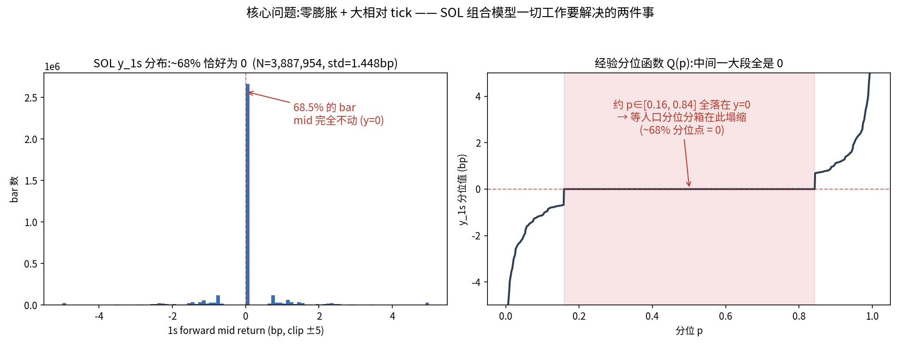

# HF Crypto — SOL 组合模型实验记录

> 标的 **SOLUSDT**(ukey 110200132)· 1 秒前向 taker alpha · 工程在 `hf_crypto/sol_alpha/`
> 配套:数据/数据流 [[hfcrypto_alpha_code]] · 完整分析 [[hfcrypto_result]] · 基线总结 [[hfcrypto_result_baseline_summary]]
> 最近更新 2026-06-05

---

## ★ 核心问题: label return 为 0 的比例 + tick take size 对比 btc 更大

> **SOL 1s taker 组合模型里,我们做的一切(分箱 / loss / target / 集成 / 评估指标),最终都是为了解决下面这两个——而且只有这两个——核心问题。任何实验先问一句:它在解决这两个问题里的哪一个?指不出来就别做。**



*(train 集 20260101–0214 日内 forward return,N=3.89M,无前视;代码 `sol_alpha/eval/fig_zero_inflation.py`,白底。)*

### 问题 1 — label return 为 0 的比例:~68% 的 bar mid 完全不动(y=0)

train 集上 **68.5% 的 1s bar,mid 价 y_1s 恰好 = 0**(0528 的 3 天 OOS 口径更极端,~76%)。这是钱难赚的第一性原因:

- **MSE 回归**:最优解=条件均值,被 68% 的 0 拉到 ≈0 → 预测被压扁(阶段 A-P4 已证 scale 坍缩但排序保留)。
- **分位分箱(等人口)直接塌**:图右——经验分位函数 Q(p) 在 **p∈[0.16, 0.84] 整段平、全 = 0**(~68% 分位点落在 0)。"按分位等分 K 类"在 SOL 上**根本切不出有意义的边界**。← **这就是为什么分箱边界只能 tick 对齐 / 物理动机,不能用分位**(回答「边界是不是人为 hard-code」的方法学问:不是随便拍,是被零膨胀逼成 tick 对齐)。
- **分类(clf)**:绝大多数样本落进"flat"类,模型容易摆烂(全猜 flat 也有 68% 准),信息全在那 32% 非零尾部。

### 问题 2 — 每个 tick 的 take size 波动更大

SOL tick = 0.01 / price≈\$124 ≈ **0.8bp 相对 tick(约 BTC 的 ~10×)**。图左非零部分的**离散梳齿**(质量团聚在 ±0.8/±1.6/±2.4… bp)就是它——mid 不连续微动,而是**按整 tick 跳**。后果:

- 成本结构被它定死:round-trip ≈ 2.4bp(含 ~0.4bp 半价差),单次有效大跳也就 ~0.8–几 bp → **信号要跨过的成本门槛本身就是 tick 量级**。
- 大跳稀少且突然 → 正是"大波动方向 sign_acc 卡 0.68"的来源(阶段 C):跳之前信息少,跳本身离散。

### 两个问题同源,是一枚硬币的两面

**相对 tick 大 → 多数 1s 内 mid 走不满一个 tick → 不动(零膨胀);一旦走满 → 就是一整个 tick 的大跳。** 零膨胀是"大 tick"在时间上的投影,大跳是它在数值上的投影。**解决方案必须同时面对二者,不能只治一个。**

### 每个 C 实验对应在解决哪个问题(评判标尺)

| 实验 | 主攻哪个核心问题 | 机制 |
|---|---|---|
| C6/C7 分箱(clf11_tail/clf15) | **问题 2(大 tick 离散)** | 边界 tick 对齐,把离散大跳切成可学的类(不用分位——问题 1 会塌)|
| C8 magnitude 特征 | **问题 1(零膨胀)** | 给模型"当前是否处在会动的波动 regime"的条件信息,区分"该是 0"和"该跳" |
| C9 quantile reg | **问题 1(零膨胀)** | 绕开被 0 主导的均值,直接估上/下行分位 → 不被 68% 的 0 压扁 |
| C10 异质集成 | 两者 | 让"治零膨胀的成员"和"治大跳方向的成员"低相关互补 |
| 评估指标(overlap / 大波动 sign_acc)| 两者的体检 | 只在那 32% 非零尾部上量"挑得中(治零膨胀)+ 判得对方向(治大跳)" |

> 一句话标尺:**做任何组合模型改动前,先在这张图上指出它动的是左边(零膨胀)还是右边(大 tick),以及怎么动;指不出来的实验不做。**

---

## 整体迭代思路

**基线的问题（两句话）**：前任实习生基于 115 个 sr 因子，以 7 类 tick 分类器（clf7）为最强单模，在 0528 报告里把 edge0.5% 从 1.30 顶到约 1.72bp，这是可信的组合模型起点；但它面临两个结构性困境：SOL 68% 零膨胀（y=0）令 gating 基准线极低，同时 0.8bp 相对 tick（BTC 的 10×）使得往返成本高达 2.4bp，**gross edge ~1.70bp 距盈利门槛始终差约 0.7bp，net PnL 全程为负**。

### 一、分箱 / 目标结构改造（攻「大 tick 离散大跳」）

**为什么想到**：clf7 的 center decode 让每个类内所有样本共用固定均值，幅度无法在类内排序。极端类（大涨/大跌）里样本间幅度差别很大，center 丢掉了这部分信息。两条路：调粒度（C6/C7），或在分类之上加类内回归（C10b 两阶段）。

**做法**：C6（11 类 tick 对齐）/ C7（15 类）只调边界粒度；C10b 先用 clf7 学 P(k|X)，再对每个非 flat 类单独训 MSE 回归器（`α = Σ P(k)·reg_k(X)`），极端类训练集无 y=0，回归器能在类内按幅度排序。

**结论**：C6/C7 在守恒曲线内，调分箱只是在「幅度↔方向」守恒线上挪位。**C10b 是全场唯一打破守恒曲线的结构**：oracle 0.074→0.101（+36%），edge 1.699（>基线），PnL **−$2.76（单模最优）**，成功解决类内幅度无排序的结构性问题。✅

---

### 二、Regime 特征注入（攻「零膨胀」）

**为什么想到**：68% 零膨胀的本质是「大多数时刻市场不动」。若模型在 gating 前就知道「当前 bar 大概率会动」，挑中真大波动的准确率就能提升；y 的滚动统计量（vol/abs_ret 等）正是「是否处于会动的 regime」的天然代理。

**做法**：clf7 配方不变，额外拼入 6 个 y 派生的滚动 regime 特征（全部 train-only fit，无前视），得到 clf7_mag（C8）。

**结论**：✅ edge **1.706（单模全场最高）**，gating 更准，成功给模型注入 regime 感知，部分解决零膨胀导致的 gating 盲区。

---

### 三、Loss / Objective 改造（正面打两个核心问题）

**为什么想到**：标准 softmax/MSE 平等对待 68% 零样本和有价值的尾部大跳，树的分裂容量被浪费。分位回归绕开被零拉平的均值（治零膨胀），rank loss 直接优化排序目标，hurdle loss 显式隔离零/非零样本。

**做法**：C9 分位双头 / C9b lambdarank / L2b hurdle / L2c focal / L2e 方向感知，全部走统一 71d OOS 评估流程。

**结论**：❌ **loss 层无法突破基线**。分位/rank 在离散大跳场景下不如 tick 对齐分箱（C9 edge 1.291 / C9b 1.342）；L2b hurdle oracle +23% 但 edge 仍低于基线（1.663）；L2c focal 存在 3d OOS 假象（71d 退化到 1.465）；方向感知 loss 触发零吸引子（68% 零把梯度锁死 pred≈0，sign 崩 0.533）。根本原因是信息天花板在 115 因子，loss 设计无法凭空创造方向信息。

---

### 四、MLP / 神经网络替换（换归纳偏置，试探信息天花板）

**为什么想到**：LGBM 是 axis-aligned 分裂，看不到因子间的非线性交叉；MLP 全连接能学因子组合的非线性关系，理论上大跳方向的信号若藏在因子高阶交叉里，MLP 能挖出来，从而破 sign ~0.70 天花板。

**做法**：① clf7_mlpemb：MLP 256 维 embedding 拼入 LGBM（371 维），测非线性交叉贡献；② linear_ridge：线性基准，验证信号线性性；③ mlp_strong：修复旧版 MLP 五病根（StandardScaler / clf 7类 / 30ep 等）；④ mlp_clsreg_evt_v2：把 C10b 思路移植到 MLP，用 log 训练压制重尾 MSE 污染共享 encoder 的问题，再用 expm1 解码还原幅度。

**结论**：双重证伪信息天花板——**MLP 因子交叉对 LGBM 零增益**（clf7_mlpemb sign 0.703≈基线 0.706），**线性 Ridge IC 0.301≈LGBM 0.314**（信号本质线性）。mlp_strong 修对五病根只追平基线（1.704≈1.697），mlp_clsreg_evt_v2 经 W→bug→W-EVT→v2 修复链也只追平天花板（1.705）。**换架构破不了天花板，方向信息上限在 115 因子里，不是模型容量问题。**

---

### 五、跨家族低相关集成（variance reduction，挤出集成增益）

**为什么想到**：单模天花板 ~1.70 已被多路证实，但 MLP 和 LGBM 归纳偏置不同，两者方向误差不完全重叠。两个都强的模型等权投票能在不加新信息的前提下降低方向噪声（variance reduction），sign 小幅提升再乘以 mean|y| 放大成 edge 增益。

**做法**：各 alpha 先 z 标准化（必须 z 平均，rank 平均会抹幅度导致 edge 崩到 1.43），再等权相加。最优 4 成员：clf7_mag + C10b + mlp_strong + clf7；stacking（ridge 学权重）没赢过等权（net 结果持平）。

**结论**：✅ **全场最佳 ENS_EQW4：edge 1.776（+4.7% vs 基线），PnL −$2.50（亏损↓13%）**，成功突破单模 ~1.70 天花板。机制是 sign 0.706→0.720（方向误差去相关降噪），非加新信息；家族内集成（corr 0.97+）无增益，必须跨家族。ENS_bigmag（mlp_big512x5 + clf7_mag）edge 更高（1.781），PnL 略弱（−$2.55）。

---

**目前最佳集成**：ENS_EQW4（clf7_mag + C10b + mlp_strong + clf7，等权 z 平均），edge **1.776bp**，PnL **−$2.50/天**，比基线 +4.7%、亏损少 13%，是「115 因子 + 1s horizon + 不加新数据」约束下的当前最优解。net 翻正只剩两条路：降成本（确认真实 taker 费率）或加新信息（原始 LOB）。

---

## 迭代成果总结（向老板汇报）

> yinshuo 给出 clf7 分类器和 reg 回归器两个基础模型（0528 报告）；本次迭代在此基础上的所有超越成果汇总如下。

### 基础结果（正常 LGBM 分类 + Regression）

| 模型 | 类型 | edge0.5% | PnL/天 top0.5% | 说明 |
|---|---|---|---|---|
| **clf7 基线** | LGBM 7类分类 | 1.697 | −$2.86 | yinshuo 最强单模，所有迭代的对照基准 |
| **reg** | LGBM MSE 回归器 | 1.664 | −$2.86 | 基线 regressor（SOL 粗 tick 下弱于分类）|

### 本次迭代所有超越基线的结果（edge0.5% > 1.697，按 edge 降序）

| 模型 | 类型 | edge0.5% | PnL/天 top0.5% | vs 基线 | 一句话 |
|---|---|---|---|---|---|
| **ENS_bigmag** ⭐ | 集成 | **1.781** | **−$2.41 （71d）** | +0.084bp (+5.0%) | edge 最高：mlp_big（更去相关）+ clf7_mag 等权 z |
| **ENS_EQW4** ⭐ | 集成 | **1.776** | **−$2.50** | +0.079bp (+4.7%) | PnL 最优：4 成员跨家族等权 z |
| STACK_ridge4 | 集成 | 1.773 | −$2.54 | +0.076bp (+4.5%) | ridge 权重≈等权，net 略输 |
| Z strong+clf7mag | 集成 | 1.767 | −$2.65 | +0.070bp (+4.1%) | 跨家族 2 成员，sign 0.703→0.727 |
| **clf7_mag (C8)** ⭐ | LGBM 单模 | **1.706** | −$2.79 | +0.009bp (+0.5%) | 单模最高：6 regime 特征攻零膨胀 |
| mlp_clsreg_evt_v2 | MLP 单模 | 1.705 | −$2.95 | +0.008bp | log 训练 + expm1 解码，修复链终点 |
| mlp_strong (clf) | MLP 单模 | 1.704 | −$2.96 | +0.007bp | 修对五病根，MLP 追平 LGBM |
| ENS_AVG_Z | 集成（同质） | 1.703 | −$2.81 | +0.006bp | 同质 LGBM 集成，corr 0.96+，增益有限 |
| **C10b cls_reg_mix** ⭐ | LGBM 单模 | 1.699 | **−$2.76** | +0.002bp | 唯一破守恒曲线，oracle 0.074→0.101，单模 PnL 最优 |

> ⭐ 标记综合 edge + PnL 值得汇报的关键结果。**ENS_EQW4 edge + PnL 双料全场最佳**（ENS_bigmag edge 略高但 PnL 略弱）。所有 net PnL 仍为负（2.4bp 成本墙），但最优集成相比基线亏损减少 13%。

### 表 A —— 迭代全路径(按时间/逻辑顺序)

> 列:阶段/实验 | 尝试 | 思考(假设/动机)| 做法 | 结论(✅成功/❌失败/⚠️守恒曲线/📌天花板)| 关键数字(edge0.5% / sign0.5% / oracle0.5% / PnL0.5%)。详见各行末尾的 §指引。

| 阶段/实验 | 尝试 | 思考(假设/动机)| 做法 | 结论 | 关键数字 |
|---|---|---|---|---|---|
| **A 中间指标**(§3.1)| 拆 reg/clf3/clf5/clf7/ENS 的中间量 | 最终 IC/edge 把"机制有效"和"参数运气"混在一起,先用中间量坐实病根 | 看 oracle 重叠 + 大波动 sign_acc + pred 单调性 | ✅ 坐实「幅度↔方向」此消彼长;reg 挑得最准(oracle 0.090)但方向最差(0.678);整体 Spearman 四模型全≈0.224 分不开 | clf7 edge 1.697 / sign 0.706 / oracle 0.074 |
| **I0 解耦**(§3.2)| gate=reg 的\|α\| top-X% × dir=clf 的 sign,零训练拼 | 若幅度和方向是两种可拆技能,最强 gate×最强 dir 应超单模 | 直接用现有模型输出拼 | ❌ 证伪:所有组合(1.626–1.664)全 < 最强单模 clf7。方向能力不可转移、和"选哪些样本"绑死;真·大波动对所有模型都难判方向 | gate=reg×dir=clf7 = 1.648(<1.697)|
| **C1/C1b/twq**(§3.3)| 训方向专用 / 尾权变体破 0.68 | 干净的方向专用组合器能否在大波动子集破 sign 0.68 | dir2(binary)/dir3_pud(干净3类)/ clf7_twq / reg_twq,同 115 因子 | ⚠️ 5+ 路线全收敛到 sign **0.678**;twq 一致伤 edge;无一超 clf7。**起初判"组合层封顶",§3.4 撤回为过度概括** | C1b 1.429 / 0.678 / 0.035;reg_twq 1.160 / 0.483 / 0.085 |
| **C6 clf11_tick**(§4.1)| 尾部加密 11 类 tick 分箱 | 边界 tick 对齐(攻问题2大tick),不用会塌的分位分箱 | 11 类 multiclass + center decode | ⚠️ 守恒曲线内:edge 1.675<clf7,IC_IR≈7.0 钉死 | 1.675 / 0.682 / 0.083 / −$2.91 |
| **C6b clf11_dynq**(§4.1)| 动态分位边界 11 类 | 试 tick 之外的边界方案 | 11 类 dynq | ⚠️ edge 1.647<clf7,守恒曲线 | 1.647 / 0.699 / 0.065 / −$3.01 |
| **C7 clf15_tick**(§4.1)| 15 类更细 tick 分箱 | 更细分箱是否多挤幅度 | 15 类 multiclass | ⚠️ edge 1.632<clf7;oracle 0.105 升但 sign 0.662 降=守恒 | 1.632 / 0.662 / 0.105 / −$3.01 |
| **C8 clf7_mag** ⭐(§4.1/§5.4)| clf7 + 6 个 y 滚动统计(regime)特征 | 给模型"当前是否在会动的波动 regime"条件信息(攻问题1零膨胀)| clf7 配方 + 6 mag 特征(y 派生,非外部因子)| ✅ **超越基线**:edge **1.706(全场单模最高)**;gating 更准 | 1.706 / 0.703 / 0.074 / −$2.79 |
| **C9 quantile_dual**(§4.1/§5.4=L1)| τ=0.9/0.1 双分位合成有符号 α | 绕开被 68% 零拉平的均值(攻问题1)| 两 booster quantile,合成 alpha | ❌ 全面低于 clf7;离散大跳下分位法不如分箱 | 1.291 / 0.623 / 0.065 / −$4.30 |
| **C9b rank_signed**(§4.1=L3)| \|y\| 的秩 ranking(lambdarank)| 直接学幅度排序=oracle 本身 | lgbm ranking task | ❌ 尾部 IC 极低(0.172)、ranking 丢方向信息 | 1.342 / 0.693 / 0.029 / −$4.38 |
| **C10b cls_reg_mix** ⭐(§4.5)| 两阶段:先分类→类内回归(全期望分解)| center decode 类内无排序;类内单训 MSE 无零污染→能按幅度排序,**破守恒曲线** | clf7 学 P(k\|X) + 每非flat类单训 reg_k(只在该类样本)| ✅ **唯一打破守恒曲线**:oracle **0.101**(>reg 0.090)且 sign 0.688 同时改善;**PnL 全场最优 −$2.76** | 1.699 / 0.688 / 0.101 / −$2.76 |
| **C10b_tw**(§4.5)| 极端类 reg_0/6 加 `\|y\|+0.5` 尾权 | 再压幅度榨 oracle | 极端类 tail-weight | ⚠️ oracle 升 0.114 但 sign 掉 0.665(被 max\|y\|=149bp 异常值主导)=又一守恒 | 1.681 / 0.665 / 0.114 / −$2.80 |
| **C12 特征消融**(§4.10/§6.6)| 三档砍因子(115→109→55→16)| 若信息已榨干,砍冗余因子应不掉 edge | clf7 配方不变,只改输入因子集,全流程同口径 | 📌 **反向坐实信息天花板**:砍因子单调伤 edge,无一追平;连去 6 个 gain=0 因子 edge 都掉 0.12bp。115 因子无可榨冗余 | clean(109)1.579;sr9sr5(55)1.480;top16(16)1.460 |
| **L2a magweight**(§5.4)| 幅度加权梯度 custom fobj | grad/hess 按 \|y\| 放大→树偏向大波动 | 改 lgbm_multi 透传 fobj | ❌ 伤 sign_acc(0.572);pred_std 正常 | 1.431 / 0.572 / 0.096 / −$3.88 |
| **L2b hurdle**(§5.4)| 零膨胀两段(logistic 判 zero/nonzero × 幅度)| 显式零膨胀建模(攻问题1)| custom fobj hurdle | ✅ **oracle 强 0.091(+23% vs clf7)**;但 edge 1.663 仍 < clf7 | 1.663 / 0.702 / 0.091 / −$2.95 |
| **L2c focal**(§5.4)| focal-style 回归近零样本降权 | 容量流向尾部 | custom fobj focal | ❌ **3d OOS 假象**(3d 1.654→71d 退化 1.465);pred_std 正常 | 1.465 / 0.612 / 0.064 / −$3.81 |
| **L2e dir_aware**(§5.4)| 方向感知 loss | 直接惩罚错向 | custom fobj | ❌ 降权错误大波动→反效果,sign 崩 0.533;零吸引子 | 1.044 / 0.533 / 0.130 / — |
| **L2f hurdle+dir**(§5.4)| L2e + hurdle 叠加 | 两机制叠加 | custom fobj | ❌ 更差,无法叠加 | 0.958 / 0.518 / 0.127 / — |
| **L4 SupCon**(§5.4)| confidence-weighted 监督对比表示学习(NN)| 学"大波动 up/down 在 embedding 分开",conf 权重忽略零样本,正面试 0.68 方向天花板 | torch 两阶段:encoder SupCon 预训 → probe | ❌ **embedding 坍缩**(1s SOL 噪音大,5 epoch CPU 不够)| 0.358 / — / 0.014 / — |
| **MLP→LGBM 融合**(§7.2)| MLP 256 维 embedding 拼到 115 因子→LGBM | sign 0.70 天花板是架构还是信息?MLP 学因子非线性交叉,LGBM 看不到 | clf7_mlpemb(371维)| 📌 **信息天花板证据①**:融合零增益(sign 0.703=0.706,edge/oracle 纹丝不动)| clf7_mlpemb 1.683 / 0.703 / 0.073 |
| **linear_ridge**(§7.2)| 标准化+median 填 NaN 的线性 Ridge | 信号是不是线性的? | Ridge 回归 | 📌 **信息天花板证据②**:线性 IC 0.301≈LGBM 0.314→信号本质线性,非线性交叉无额外方向信息 | 1.231 / 0.590 / 0.081 |
| **C11a train/OOS 拆解**(§7.3)| 大波动 sign_acc 的 train vs OOS gap | 拟合不出(换架构有戏)vs 信息不在(天花板)? | 现有 eval 加 train-set 子集 | 📌 train≈OOS(gap≈0):depth11/500 树连训练集大波动方向都只 0.66–0.70→**信息不在 115 因子里**,非拟合问题 | top0.5% train 0.666 / OOS 0.669 |
| **C11b 序列拼接**(§7.3)| 快照 + 过去 10 帧因子→clf7(1265维)| 方向信号是否藏在 rolling 没覆盖的序列演化里 | 横向拼接历史帧 → LGBM | 📌 加 10 帧 OOS sign 纹丝不动、edge 略降→rolling 已榨干时序信息,对因子做 RNN 徒劳 | +10帧 sign 0.669=基线 0.669;edge 1.666<1.697 |
| **mlp_strong (clf)**(§7.4)| MLP 五病根修复版(StandardScaler/center decode/30ep…)| 旧 MLP 废是实现还是容量? | 自包含 mlp_strong.py,7类clf+center decode | ✅ **修对后追平** clf7(1.704≈1.697)→坐实"失败是实现不是容量",但未超越=再证信息天花板 | 1.704 / 0.718 / 0.069 / −$2.96 |
| **mlp_strong (reg,对照)**(§7.4)| 同网络换 reg 任务 | 隔离"clf 赢在幅度标定" | 同数据/训练只换任务形式 | 📌 受控对照:Spearman 几乎同(0.309 vs 0.315)但 Pearson 差 18×(0.0155)→MSE 压扁幅度=零膨胀指纹;reg 非可用 alpha(1.552<基线)| 1.552 / 0.661 / — / −$3.44 |
| **mlp_mse(旧 10ep)**(§7.6)| 早期未修复 MLP | — | 10ep CPU,NaN→0,不标准化 | ❌ 独立推理远弱于 LGBM(实现未修对)| 0.801 / — / 0.042 / −$6.28 |
| **mlp_focal_classbal(旧)**(§7.6)| focal+类平衡 MLP | — | 旧 10ep | ❌ 比 mse 更弱,oracle 更差 | 0.541 / — / 0.014 / −$7.52 |
| **mlp_dir_aware(旧)**(§7.6)| 方向感知 MLP | — | 旧 10ep | ❌ **完全崩溃**:零吸引子(68%零拉梯度向0、方向项梯度消失锁死),与 L2e 同机制 | −0.022 / 0.197 / 0.007 |
| **路径A mlp_hurdle**(§7.5)| 端到端 hurdle(gate×MSE 幅度头),死区0.5bp | MLP 损失可为任意可微目标(树没有的杠杆),焊交易目标 | gate 头 P(动)×MSE 幅度头 | ⚠️ **守恒曲线**:gate 把 oracle 顶到 0.107(选择已解决)但方向全靠 MSE→sign 掉 0.642→edge↓ | 1.513 / 0.642 / 0.107 / −$3.50 |
| **路径A′ mlp_hurdle_clf**(§7.5)| gate×clf 方向头 | 换 clf 头救方向 | gate × clf 方向头 + decode | ⚠️ **守恒曲线反向**:sign 顶到 0.730(全场最高)但 gate×decode 重排伤 oracle→0.064(全场最低)| 1.686 / 0.730 / 0.064 / −$2.93 |
| **方向X mlp_cost**(§7.7)| 成本原生解码(cost=2.4 写进 decode)| 只有跨 ~3tick(≈成本)才赚钱→把成本当一等公民,纯"跨成本"探测器 | 7类clf,`α=Σ P(k)·sign·max(0,\|center\|−cost)` | ⚠️ **守恒曲线第3证**:oracle 顶全场最高(top1% 0.131)但塌成 P(涨)−P(跌)专挑最难判极端跳→sign 0.639→edge 1.609 不赢。教训:追 oracle 是陷阱 | 1.609 / 0.639 / 0.106 / −$3.24 |
| **方向W mlp_clsreg**(§7.6)| MLP 版 C10b(单网络 clf+reg 头)| 单网络内 gate 与回归共训练 | 共享 encoder + clf 头 + 类内 reg 头 | ❌ **有 bug(debug 确诊)**:极端类 reg_0/6 重尾 MSE(+149bp)梯度污染共享 encoder、拖垮 clf 头(clf 头单独 decode 仅 1.382 vs mlp_strong 1.704)| 1.400 / 0.648 / 0.074 / −$3.96 |
| **W-EVT mlp_clsreg_evt**(§7.6)| 极端类用 log 幅度(EVT 思路)修 W | log 压制重尾→encoder 不被污染 | 极端类 log 幅度训练 | 🔧 **修复奏效**:Pearson 0.048→0.175,**sign 0.758/尾部IC 0.690 全场最高**;但 log 把幅度压过头→oracle 塌 0.044→edge 1.629 仍<基线 | 1.629 / 0.758 / 0.044 / −$3.20 |
| **v2 mlp_clsreg_evt_v2**(§7.6)| log 训练 + expm1 解码还原幅度 | 还原幅度救 oracle | log 训(净 encoder)+ expm1 decode | ✅ **修复链终点:追平全场最强**(1.705≈clf7_mag 1.706/mlp_strong 1.704);expm1 把 mean\|y\| 1.886→2.429 救回 oracle。Pearson −0.0004 是解码假象(Spearman/edge 正常)| 1.705 / 0.708 / 0.086 / −$2.95 |
| **mlp_big512x5**(§7.6 扩容探针)| 加宽加深 MLP(512×5)| 加容量能否破天花板 | 大 MLP 全流程 | ❌ 仍 1.676<基线 → 加容量不破天花板,再证信息上限(原标注"跑中"，**已完成**)| 1.676 / 0.704 / 0.071 / −$3.11 |
| **集成:ENS_AVG_Z(同质)**(§4.1)| 同质等权 z 集成 | — | clf 家族等权 z | ⚠️ 同质 corr 0.962→几乎无新意,edge 1.703≈单模 | 1.703 / 0.740 / 0.059 / −$2.81 |
| **集成:Z strong+clf7mag**(§7.8)| 跨家族 2 成员等权 z | 跨家族(MLP×LGBM)方向误差去相关 | mlp_strong + clf7_mag 各 z 标准化相加 | ✅ **突破单模天花板**:edge 1.766;机制=sign 0.703→0.727(降方向噪声,非加信息)| 1.766 / 0.728 / 0.070 / −$2.65 |
| **集成:ENS_EQW4** ⭐(§7.8)| 跨家族 4 成员等权 z(全场最佳)| 4 成员去相关增益叠加 | clf7_mag+C10b+mlp_strong+clf7,各 z 标准化等权 | ✅ **全场最佳**:edge **1.776(+4.7%)**、PnL **−$2.50(亏损↓13%)**,edge 与 PnL 双料第一 | 1.776 / 0.720 / 0.079 / −$2.50 |
| **集成:STACK ridge4**(§7.8)| train 拟合权重(ridge)| 学到的权重能否赢等权 | ridge 拟合 4 成员(含 clf7 −0.41 负权)| ❌ 没赢等权(1.773 vs 1.776,4 子窗仅 2/4>等权)→等权已捕获几乎全部去相关增益 | 1.773 / 0.697 / 0.110 / −$2.54 |
| **集成:RANK 平均**(§7.8)| rank 平均代替 z 平均 | — | mlp_cost+clf7_mag rank 平均 | ❌ **崩到 1.436**:转秩抹掉幅度,oracle/mean\|y\| 全塌→必须 z 平均保幅度 | 1.436 |

**表 A 共 34 行**,覆盖:阶段 A / I0 / C1·C1b·twq;分箱 C6·C6b·C7;mag C8;quantile/ranking C9·C9b;两阶段 C10b·C10b_tw;特征消融 C12;loss L2a·L2b·L2c·L2e·L2f·L4;MLP 线(融合/linear/C11a/C11b/mlp_strong-clf/reg/旧 mse·focal·dir_aware/hurdle A·A′/方向X·W/W-EVT/v2/mlp_big512x5);集成线(同质 ENS_AVG_Z / 跨家族 Z2 / EQW4 / STACK / RANK)。

### 表 B —— 全模型数据总表(按 edge0.5% 降序)

> 列:模型 | 家族 | edge0.5% | edge1% | sign(0.5%)| oracle(0.5%)| mean\|y\|(0.5%)| 尾部IC_Sp(q99)| 整体IC Pe | 整体IC Sp | PnL/天 top0.5% | 一句结论。
> 数字:**edge/sign/oracle/mean\|y\|/尾部IC/整体IC** 来自 `metrics_*.json`(q99.5 与 q99 gate)与附B,逐字搬运;**PnL** 来自 §4.2/§7.6/§7.8/python_sim(无的填"—")。⭐=超越 clf7 基线。

| 模型 | 家族 | edge0.5% | edge1% | sign0.5% | oracle0.5% | mean\|y\|0.5% | 尾部IC_Sp q99 | 整体IC Pe | 整体IC Sp | PnL0.5% | 一句结论 |
|---|---|---|---|---|---|---|---|---|---|---|---|
| **ENS_bigmag** ⭐ | 集成 | **1.781** | 1.487 | 0.729 | 0.073 | 2.305 | 0.581 | 0.293 | 0.318 | **−$2.55**(71d −2.41) | **新全场最佳**:mlp_big(更去相关0.949)+clf7_mag 等权z,4子窗稳健 |
| **ENS_EQW4** ⭐ | 集成 | 1.776 | 1.482 | 0.720 | 0.079 | 2.369 | 0.569 | 0.293 | 0.318 | **−$2.50** | 跨家族4成员等权z,降方向噪声 |
| STACK_ridge4 ⭐ | 集成 | 1.773 | 1.475 | 0.697 | 0.110 | 2.691 | 0.520 | 0.294 | 0.316 | −$2.54 | ridge 权重没赢等权 |
| Z strong+clf7mag ⭐ | 集成 | 1.767 | 1.476 | 0.728 | 0.070 | 2.270 | 0.582 | 0.292 | 0.318 | −$2.65 | 跨家族2成员 z,sign 0.703→0.727 |
| **clf7_mag** ⭐ | LGBM | 1.706 | 1.427 | 0.703 | 0.074 | 2.305 | 0.552 | 0.289 | 0.316 | −$2.79 | 单模最高:6 regime 特征提升 gating |
| **v2 mlp_clsreg_evt_v2** ⭐ | MLP | 1.705 | 1.427 | 0.708 | 0.086 | 2.429 | 0.541 | −0.000 | 0.315 | −$2.95 | 修复链终点追平天花板(Pe 是 expm1 假象)|
| **mlp_strong (clf)** ⭐ | MLP | 1.704 | 1.431 | 0.718 | 0.069 | 2.228 | 0.580 | 0.286 | 0.315 | −$2.96 | 修对后追平:失败是实现不是容量 |
| ENS_AVG_Z ⭐ | 集成 | 1.703 | 1.429 | 0.740 | 0.059 | 2.095 | 0.610 | 0.287 | 0.317 | −$2.81 | 同质集成,无新意 |
| **C10b cls_reg_mix** ⭐ | LGBM | 1.699 | 1.426 | 0.688 | 0.101 | 2.579 | 0.519 | 0.292 | 0.316 | **−$2.76** | 唯一破守恒曲线;PnL 单模最优 |
| clf7 基线 | LGBM | 1.697 | 1.416 | 0.706 | 0.074 | 2.288 | 0.555 | 0.287 | 0.316 | −$2.86 | 对照基准 |
| mlp_hurdle_clf | MLP | 1.686 | 1.432 | 0.730 | 0.064 | 2.210 | 0.575 | 0.279 | 0.312 | −$2.93 | 守恒反向:sign 最高 oracle 最低 |
|clf7_mlpemb|LGBM|1.683|1.418|0.703|0.073|2.280|0.555|0.287|0.316|−$2.82|MLP 融合零增益=信息天花板证据①|
| cls_reg_mix_tw (C10b_tw) | LGBM | 1.681 | 1.418 | 0.665 | 0.114 | 2.715 | 0.486 | 0.292 | 0.315 | −$2.80 | oracle 升但被异常值主导 sign 降 |
| mlp_big512x5 | MLP | 1.676 | 1.408 | 0.704 | 0.071 | 2.238 | 0.564 | 0.283 | 0.311 | −$3.11 | 加容量不破天花板 |
| C6 clf11_tick | LGBM | 1.675 | 1.400 | 0.682 | 0.083 | 2.389 | 0.526 | 0.285 | 0.314 | −$2.91 | 守恒曲线内 |
| reg | LGBM | 1.664 | 1.401 | 0.678 | 0.090 | 2.439 | 0.528 | 0.285 | 0.311 | −$2.86 | 挑得最准方向最差 |
| L2b obj_hurdle | LGBM | 1.663 | 1.400 | 0.702 | 0.091 | 2.458 | 0.523 | 0.289 | 0.313 | −$2.95 | 显式零膨胀:oracle 强 edge 仍低 |
| C6b clf11_dynq | LGBM | 1.647 | 1.389 | 0.699 | 0.065 | 2.150 | 0.572 | 0.284 | 0.315 | −$3.01 | 守恒曲线内 |
| clf5 | LGBM | 1.642 | 1.399 | 0.724 | 0.054 | 2.032 | 0.601 | 0.284 | 0.316 | −$3.04 | 守恒曲线内 |
| C7 clf15_tick | LGBM | 1.632 | 1.383 | 0.662 | 0.105 | 2.635 | 0.480 | 0.286 | 0.314 | −$3.01 | oracle↑sign↓守恒 |
| W-EVT mlp_clsreg_evt | MLP | 1.629 | 1.373 | 0.758 | 0.044 | 1.886 | 0.653 | 0.175 | 0.316 | −$3.20 | sign/尾部IC 最高但 log 压幅度→oracle 塌 |
| clf7_twq | LGBM | 1.626 | 1.339 | 0.634 | 0.071 | 2.112 | 0.534 | 0.261 | 0.305 | −$3.28 | twq 一致伤 edge |
| 方向X mlp_cost | MLP | 1.609 | 1.326 | 0.639 | 0.106 | 2.655 | 0.446 | 0.255 | 0.301 | −$3.24 | 守恒第3证:oracle 最高 sign 塌 |
| clf7_classbal | LGBM | 1.602 | 1.312 | 0.691 | 0.039 | 1.948 | 0.578 | 0.261 | 0.317 | — | 类平衡:IC 高 edge 低 |
| clf7_logit_adj | LGBM | 1.582 | 1.362 | 0.688 | 0.042 | 1.942 | 0.582 | 0.262 | 0.317 | — | logit 调整:同 classbal 死法 |
| clf7_abl_clean (109因子)| LGBM | 1.579 | 1.359 | 0.682 | 0.072 | 2.265 | 0.519 | 0.282 | 0.314 | −$3.25 | 砍6无效因子仍掉 edge(注:200轮)|
| mlp_strong_reg(对照)| MLP | 1.552 | 1.338 | 0.661 | 0.102 | 2.550 | 0.482 | 0.016 | 0.309 | −$3.44 | 对照:Pe 0.016=MSE 压扁幅度 |
| 路径A mlp_hurdle | MLP | 1.513 | 1.310 | 0.642 | 0.107 | 2.600 | 0.470 | 0.234 | 0.312 | −$3.50 | 守恒:oracle↑sign↓ |
| clf7_abl_sr9sr5 (55因子)| LGBM | 1.480 | 1.294 | 0.671 | 0.065 | 2.165 | 0.506 | 0.276 | 0.311 | −$3.61 | sr4+sr8 贡献≈+0.10bp |
| L2c obj_focal | LGBM | 1.465 | 1.201 | 0.612 | 0.064 | 1.856 | 0.576 | 0.250 | 0.304 | −$3.81 | 3d OOS 假象 |
| clf7_abl_top16 (16因子)| LGBM | 1.460 | 1.276 | 0.676 | 0.060 | 2.096 | 0.516 | 0.273 | 0.309 | −$3.77 | top16 保 86% edge,工程权衡 |
| clf3 | LGBM | 1.443 | 1.254 | 0.752 | 0.026 | 1.596 | 0.667 | 0.274 | 0.317 | −$3.75 | 专挑易判样本,oracle 最低 |
| L2a obj_magweight | LGBM | 1.431 | 1.228 | 0.572 | 0.096 | 2.308 | 0.436 | 0.265 | 0.303 | −$3.88 | 幅度加权伤 sign |
| dir3_twq_pud (C1b)| LGBM | 1.429 | 1.171 | 0.671 | 0.035 | 1.566 | 0.650 | 0.248 | 0.304 | −$3.86 | 干净3类方向器,收敛0.68 |
| 方向W mlp_clsreg | MLP | 1.400 | 1.257 | 0.648 | 0.074 | 2.232 | 0.473 | 0.048 | 0.311 | −$3.96 | bug:重尾MSE污染encoder |
| C9b rank_signed | LGBM | 1.342 | 1.119 | 0.693 | 0.029 | 1.562 | 0.172 | 0.214 | 0.253 | −$4.38 | ranking 丢方向信息 |
| C9 quantile_dual | LGBM | 1.291 | 1.143 | 0.623 | 0.065 | 2.014 | 0.491 | 0.246 | 0.300 | −$4.30 | 分位法不如分箱 |
| hurdle_bindir | LGBM | 1.278 | 1.195 | 0.750 | 0.008 | 1.447 | 0.646 | 0.271 | 0.321 | — | sign 高但 oracle 极低(0.008)|
| dir2_twq (C1)| LGBM | 1.247 | 1.081 | 0.641 | 0.028 | 1.481 | 0.120 | 0.222 | 0.271 | −$4.65 | binary 方向器,弱 |
|linear_ridge|线性|1.231|1.119|0.590|0.081|2.209|0.424|0.171|0.302|−$4.46|线性 IC≈LGBM=信息天花板证据②|
| reg_twq | LGBM | 1.160 | 0.972 | 0.483 | 0.085 | 2.049 | 0.361 | 0.236 | 0.271 | −$4.92 | twq 重伤 reg 方向 |
| L2e obj_dir_aware | LGBM | 1.044 | 0.952 | 0.533 | 0.130 | 3.154 | 0.233 | 0.236 | 0.289 | — | 零吸引子,方向崩 |
| L2f obj_hurdle_dir | LGBM | 0.958 | 0.817 | 0.518 | 0.127 | 3.144 | 0.232 | 0.232 | 0.282 | — | L2e+hurdle 更差 |
| mlp_mse(旧10ep)| MLP | 0.801 | 0.720 | 0.476 | 0.042 | 1.539 | 0.295 | 0.169 | 0.197 | −$6.28 | 实现未修对→废 |
| mlp_focal_classbal(旧)| MLP | 0.541 | 0.478 | 0.371 | 0.014 | 0.933 | 0.350 | 0.162 | 0.196 | −$7.52 | 比 mse 更弱 |
| L4 supcon_conf_dir | NN | 0.316 | 0.358 | 0.281 | 0.007 | 0.754 | 0.255 | 0.159 | 0.199 | — | embedding 坍缩 |
| mlp_dir_aware(旧)| MLP | −0.022 | 0.026 | 0.197 | 0.007 | 0.791 | −0.027 | 0.000 | 0.123 | — | 完全崩溃:零吸引子 |

**表 B 共 47 行**(46 个模型/集成 + clf7 基线对照行)。注:① **集成行**(ENS_bigmag/EQW4/STACK/Z2)已跑 eval_report 补齐全指标(mean\|y\|/尾部IC/整体IC),**集成的整体 Pearson 都健康 ~0.29(z 平均尺度正常,无塌缩)**;ENS_bigmag PnL 列 −2.55 是 36d sim 窗口、括号 −2.41 是 71d 全 OOS(同窗口口径下它 edge+PnL 双第一);② **⚠️ 7 行是 3 天 OOS 口径(n≈259k,非 71d),不可与 71d 行直接比**:clf7_classbal、clf7_logit_adj、hurdle_bindir、L2e obj_dir_aware、L2f obj_hurdle_dir、L4 supcon_conf_dir、mlp_dir_aware(旧)—— 均为**失败模型**(edge≪基线),当初只在 3d 评过、未升级 71d/sim,故其 PnL 在 sim 窗口 **N/A(无数据,不编)**,且其 edge/IC 等也是 3d 值(偏乐观,文档铁律"3d 严重误导")。其余 71d 模型 PnL 均已补齐;③ **clf7_abl 三档为 200 轮**(基线 500 轮),200 vs 500 轮本身约 0.12bp 差,比较需扣此基准(详见 §6.6);④ 多个模型 Pearson 塌缩(mlp_clsreg_evt_v2 −0.000 / reg 0.016 / mlp_clsreg 0.048)是 MSE 压扁 / expm1 解码假象,**Spearman 正常**,详见附B 读法。

---

## 1. 基线情况(我们从哪儿出发)

### 1.1 问题与数据
- **任务**:把 115 个 sr 因子(`/share/crypto_hf_alpha/{sr4,sr5,sr8,sr9}`)用一个 booster **组合成一个 alpha**,预测 SOL 未来 1 秒走势,做 taker(主动吃单)。
- **标签** `y_1s` = 前向 1 秒 mid 收益 = `Price_1[t+1]/Price_1[t] − 1`(×1e4→bp)。`Price_1` = 干净 mid `(bp1+ap1)/2`。
- **核心难点**:`y_1s` 是 **zero-inflated** —— 约 76% 的 1 秒 bar 价格不动(y≈0),钱全在偶发的尾部大跳(top0.5% 真实 |y|≈8bp)。rank/IC 必须用平均秩,见 [[project_sol_zero_inflated_rank]]。
- **日期切分**(对齐 0528 报告口径,`data/splits.py`):train `0101–0214`(45天)/ OOS 3天 `0215–0217`(N≈259k)或 71天长 OOS `0218–0426`(N≈6.1M)/ sim `0322–0426`。

### 1.2 基线模型 `baseline_clf7_d11_n500`
0528 报告里**单模型最强**的配方,本地已复现:

| 项 | 值 |
|---|---|
| task | **multiclass(7 类 tick-move 分类)** |
| 分箱边界(bp) | `[-2.8, -1.7, -0.5, 0.5, 1.7, 2.8]`(对齐 SOL mid 离散跳动)|
| decode | center(各类训练集经验均值)|
| 深度/轮数 | max_depth 11 / num_boost_round 500(固定轮数,不早停防泄漏)|
| 因子 | 115 个(排除原始 Price_0/1/2 价格水平)|
| 加权 | none |

> 0528 报告的成绩:edge0.5% 从 **1.30 → 1.75bp(+35%)**;clf7 是其中最强的单模型(≈+1.72bp)。

### 1.3 评估口径(两层,`sol_alpha/eval/`)
- **Layer1 信号层**(快,纯 alpha vs y_1s):在 gate `{q50,q90,q95,q97,q99,q99.5}` 上算 **每单位成交量 edge_bp(gross)/ net(扣成本)/ 尾部 IC / sign_acc / oracle 重叠**。
- **Layer2 变现层**(终审):run_sim 出 order/stats → 每 gate 的 gross/net bp、**net PnL/day**、maxDD、fills/day。
- 关注点(用户口径):**看 IC、尤其 IC 尾部;最终看每单位成交量的 net edge**。图一律白底,叠 SOL 成本线 + BTC/ETH 1.35bp 目标线。

### 1.4 基线成绩(leaderboard,71 天 OOS)
| 指标 | clf7 基线 | 含义 |
|---|---|---|
| edge q995(gross, top0.5%) | **1.697 bp** | 每单位成交量毛收益 |
| Spearman IC(分桶) | 0.314 | 整体排序 |
| oracle 重叠 q995 | 0.074 | 挑中真大波动的比例 |
| **top0.5% net / PnL-day**(python sim)| **−0.736 bp / −$2.86** | **扣 ~2.4bp 成本后仍亏** |

**基线的根本困境**:gross edge 顶到 ~1.7bp,但 **SOL taker 成本线 ≈ 2.4bp 往返**(半价差 ~0.4 + 单边 fee,fee 待核 B6.1)→ **net 全程为负**。对比 BTC/ETH 每单位成交量 q99 ≈ +1.3–1.4bp 且费率仅万0.1(SOL 万1),这是 SOL 比 BTC 差的结构性来源。

### 1.5 📌 概念:为什么 senior 说「regressor 在 BTC 上表现很好」,而我们文档里 reg 在 SOL 反而最差(1.147)

> 背景:senior 的直觉是「就算 target 很多时候 = 0、噪音很大,LGBM regressor 在 BTC 上也会表现很好」。这和我们 §3.9.1 里 SOL 上 `reg=1.147(最差)`、`clf7=1.719` 的发现**不矛盾**——差异全在 BTC vs SOL 的微结构。两件事要分开:① 回归器为何不怕「零膨胀 + 噪音」;② 为何这层优势只在 BTC 兑现、在 SOL 反塌。

**① 「大量 y=0 + 高噪音」对 MSE 树回归器不是毒药**(为何 senior 不担心零膨胀):
- MSE 回归学的是**条件期望 E[y|x]**,不是逐 bar 命中。68–76% 的零是「便宜」的样本——叶子预测 ≈0 就把 loss 压到极低,**不抢树的分裂容量**;容量自然流向稀有的 E[y|x]≠0 区域。零质量等于一个把预测拉向 0 的强先验,**降假阳性**。
- 噪音在海量样本里被平均掉:单 bar 的 y = 系统性 E[y|x] + 巨大白噪音,几百万 bar 下大数定律保证零点几 bp 的真实 edge 也能稳定估出。
- **只交易 |pred| 尾部 → 回归器只要排序对就够**。我们 §3.1-P4 已亲测:reg 的 `|pred|` 十分位 → 真实 `|y|` 完全单调(0.24→1.14bp,Spearman 0.262),「MSE 压扁 scale 但幅度排序完整保留」。**zero-inflation 不破坏 ranking,而 ranking 就是 taker gating 要的全部。**

**② 为何这优势只在 BTC 兑现,SOL 反塌**(对应本文档 §0 的两个核心问题):

| 维度 | BTC(回归器的天堂)| SOL(回归器最差,reg=1.147)|
|---|---|---|
| 相对 tick | ≈ 万0.1(~0.1bp),价格近似**连续** | ≈ 万1(~0.8bp),return 被**离散化**(§0 问题 2)|
| target 形态 | 0 处尖峰 + 尾部平滑连续 → 正是 MSE 擅长的连续目标 | 梳齿状离散大跳 → **clf 按 tick 分箱才对**(故 SOL 上 clf7≫reg)|
| 成本线 | 半价差+fee 极低(tick 万0.1)| 来回 ~2.4bp,吃光 gross edge |
| net 能否正 | 中等 gross edge 就轻松过线 → 「表现好」 | gross 1.7 < 成本 2.4 → 全程负 |

两个决定性点:
1. **BTC tick 细 → return 连续 → 天然适配 MSE**(梯度在每个量级都有意义,能表达幅度细微差别)。SOL tick 粗 → return 量化成「不动 / 跳整 tick」→ 该用**分类对齐 tick**,这正是 SOL 上 `reg=1.147(最差)` 而 `clf7=1.719` 的根因(§3.9.1 / §0 问题 2)。**「reg 在 SOL 不行」是 SOL 离散性的特例,不能外推 BTC。**
2. **BTC 成本低 → 不需要 reg 是尾部幅度神预测器,排序不错即净赚**。SOL 上折磨我们的「edge 被 2.4bp 成本吃光、只极尾部转正」在 BTC 几乎不存在(tick 万0.1)。所以同一个中等回归 edge,SOL 亏、BTC 赚——senior 说的「表现好」首先是 **net 容易为正**,不一定是信号质量高一个量级。

**③ 工程旁证**:C++ 部署链路(`lgbm_combine_alpha.h`,见 [[hfcrypto_result]] §1.3)只接单个 double → 天然只能上**单输出回归 booster**;clf7 多分类 + center decode 在 C++ 侧还没有。BTC 上回归本就好用,**reg 开箱即可上实盘,clf 还得改 C++** → senior 偏好 regressor 也有这层现实理由。

> 一句话:零膨胀 + 噪音对 MSE 树回归器不致命(它学条件期望、零是便宜背景、噪音被平均、只用排序去 gating);BTC 细 tick(target 连续→适配 MSE)+ 低成本(中等 edge 就净赚)把这层优势拉满,而 SOL 粗 tick(该上分类)+ 高成本把它反向打塌。**与本文档 §0 两个核心问题完全同源。**

---

## 2. 实验目的

**一句话:在不加新因子、只动「115 因子 → alpha」组合模型这一层(loss / target / 分箱 / 排序 / decode / 集成结构)的前提下,把每单位成交量的 edge 尽量顶高,看能否把 net 做正;同时用可信的中间指标坐实「edge 到底卡在哪」。**

边界(2026-06-04 用户锁定):
- ✅ 在范围内:换 loss/objective、改分箱粒度、样本加权、quantile、ranking、custom `fobj`、decode、组合层集成结构。
- ❌ 出局:加新因子(anticipatory / OFR / order-flow 等因子工程一律不做)。

方法论(照搬 BTC/DeepLOB 验证过的「中间指标先行」):最终指标(IC/edge)会把「机制真有效」和「参数运气」混在一起,**必须先用中间诊断量(oracle 重叠、尾部 sign_acc、gate 宽度曲线、pred 单调性、pred_std)分别判断**,再决定投不投工程。两个 BTC 血泪教训直接规避:① 方向×幅度**相乘**会崩(tanh_scale 数值爆炸)→ **绝不相乘**;② 把 tail-edge 写进 loss 易**常数坍塌** → custom loss 必须每轮盯 `pred_std`。

---

## 3. 基线实验与中期结论

### 3.1 阶段 A — 中间指标坐实病根(5 模型,71 天 OOS)✅

把 reg / clf3 / clf5 / clf7 / ENS 的输出拆开看中间指标:

| 模型 | oracle 重叠(挑中大波动)| sign_acc(大波动子集方向)| edge0.5% |
|---|---|---|---|
| clf3 | 0.026(最低)| **0.752(最高)** | 1.443(最低)|
| clf5 | 0.054 | 0.724 | 1.642 |
| clf7 | 0.074 | 0.706 | 1.697 |
| **reg** | **0.090(最高)** | **0.678(最低)** | 1.664 |
| ENS | 0.059 | 0.740 | 1.703 |

**结论:**
1. **存在「幅度 ↔ 方向」的此消彼长**:挑中越多大波动(overlap↑),在这些大波动上方向反而越差(sign_acc↓)。reg 挑得最准但方向最差 → 优势被抵消,所以「reg 重叠最高却没拿到最高 edge」。
2. **regressor 不是元凶**(P4 证实):reg 的 `|pred|` 十分位 → 真实 `|y|` **完全单调**(D0=0.24→D9=1.14bp,Spearman=0.262)。MSE 把 scale 压扁,但**幅度排序完整保留** → reg/ranking 可当 gating 引擎(只需排序不需绝对 scale)。
3. **「重叠→edge」链成立但被方向 gate 住**(P5):控制 sign_acc 后,overlap 边际系数 = **+3.2(正)**,sign_acc 系数 = +6.1。方向不塌时,提升 overlap 才换成 edge。
4. **IC / 尾部 IC 是误导指标**:整体 Spearman 四模型全 ≈0.224 分不开;clf3 尾部 IC 最高(0.53)却 edge/overlap 最低。真正该看的是 overlap(幅度)+ sign_acc(方向)的分解。

### 3.2 阶段 I0 — 零训练验证「解耦」(naive 版)❌ 证伪

直接用现有模型拼:gate = reg 的 |alpha| top-X%,方向 = clf 的 sign。

```
最强单模 clf7 top0.5% edge   = 1.697
gate=reg × dir=clf7          = 1.648   ← 比 clf7 还低
gate=reg × dir=reg           = 1.664
gate=reg × dir=clf3          = 1.626
```

**所有「最强 gate × 最强 direction」组合全部低于最强单模 → naive 解耦失败。**

**为什么(比阶段 A 更深):方向能力不可转移,和「选哪些样本」绑死。**
- clf7 在自己选的样本上 sign_acc=0.706,但在 **reg 选的大波动样本**上掉到 **0.678**(=reg 水平)。
- clf3 的高 sign_acc(0.752)是因为它**专挑容易判方向的样本**(所以 overlap 仅 0.026,躲开了真正的大波动)。
- **真正的大波动样本,对所有模型方向都难(sign_acc ~0.68)。**

→ 幅度与方向不是能拆开混搭的两种技能;**最大的波动本身最难判方向**。crux 从「解耦」重定位为「**大波动的方向可预测性**」。

### 3.3 阶段 C — 在组合层正面试(C1/C1b/clf7_twq/reg_twq)

锁定范围后,用同 115 因子训方向专用 / 尾权变体,测能否破 0.68:

| 模型 | edge0.5% | 大波动 sign_acc | oracle q995 | top0.5% net / PnL-day |
|---|---|---|---|---|
| clf7(基线)| 1.664–1.697 | 0.678 | 0.074 | −0.736 / −$2.86 |
| C1 dir2_twq(binary 方向)| 1.247 | 0.620 | 0.028 | −1.197 / −$4.65 |
| C1b dir3_twq_pud(干净 3 类方向)| 1.407–1.429 | **0.678** | 0.035 | −0.993 / −$3.86 |
| clf7_twq(0528 顶配方:clf7+二次尾权)| 1.556–1.626 | 0.634 | 0.071 | −0.844 / −$3.28 |
| reg_twq | 1.136–1.160 | 0.483 | 0.085 | −1.264 / −$4.92 |

**结论:**
1. **0.68 = 这 115 因子对「大波动方向」的信息天花板**(窄而稳的发现):干净的方向专用组合器(C1b)在 reg 大波动子集上 sign_acc=**0.678**,与 clf7 分毫不差;I0+C1+C1b+clf7_twq+reg_twq **5+ 路线全部收敛到 0.678** → 收敛证据压倒性。
2. **tail-weighting(twq)在我们 pipeline 上一致地伤 edge**(与 0528「twq +5–10%」不符 —— 那是 vs reg 基线,非 vs 最强 clf7)。
3. 这些变体**无一比 clf7 更好**,net 全部更负。

### 3.4 ⚠️ 重要修正(2026-06-05):撤回「组合模型层到顶」

阶段 C 当时下了「组合模型层封顶」的裁决,这是**过度概括** —— 只试了 3–4 个变体它们碰巧都失败,就外推到整个组合层。**0528 真正把 edge 顶到 1.75 的几个杠杆我根本没跑**:

| 0528 有效杠杆 | 0528 edge0.5% | 跑了没 | 仍在范围内? |
|---|---|---|---|
| clf11_tail(尾部加密 11 类)| 1.692 | ❌ | ✅ 纯分箱 |
| clf15(15 类更细)| 1.670 | ❌ | ✅ 纯分箱 |
| magnitude 特征(y 的滚动统计)| +0.05–0.1 | ❌ | ✅ y 的派生统计,非外部因子 |
| quantile reg(τ=0.9/0.95)| 列表有 `_q95` 未跑 | ❌ | ✅ 换 objective |
| 异质成员集成 | **1.751**(0528 最高)| ⚠️ 只试了同质 | ✅ 组合层结构 |

**仍然成立 / 已修正:**
- ✅ **仍成立**:① 大波动方向 sign_acc ~0.68 封顶(解释「edge 为何难超 ~1.75」,不是「edge 不能再涨」);② net 受成本主导(即便 0528 最高 edge 1.751,C++ sim 也仅 ~+$0.99/day);同质集成无用(corr 0.962,ENS 仅 +0.006)。
- ❌ **撤回**:「纯组合模型无法再涨 edge」。
- ✅ **改为**:edge gross 仍可被未试杠杆顶向 ~1.75,但 (a) 被方向 0.68 钉死顶不过 ~1.75,(b) ~1.75 < 2.4bp 成本 → **组合层提升 edge 值得做,但 net 翻正必须同时压成本 / 换 horizon**。

### 3.5 📌 先验:「零膨胀 + 离散大跳」的 ML 天然解法工具箱

> 在设计 C6–C10 / L1–L4 实验前,先把这个问题在 ML 里对应的成熟解法放在这里,防止重复踩坑或错过已知杠杆。每个方法标注「攻哪个核心问题」以及「是否已在我们的实验链里」。

#### ⚠️ 首先修正 §3.3 结论一的措辞(2026-06-05)

§3.3 结论 1 写的「0.68 = 这 115 因子对大波动方向的信息天花板」是**过度外推**——阶段 I0+C 试的 5+ 条路线**全部是 LGBM 家族**(共享 axis-aligned 贪心分裂 + 被 68% 零主导的损失)。收敛到 0.68 证明的是：

> **0.68 = 「LGBM 家族 + 现有损失」这个组合器能抽出来的方向上限，不是 115 因子的信息上限。**

我们的 assumption(§2)是「信息已在 alpha 里,只动组合层」,这意味着 0.68 是**拟合问题**,不是信息问题。换了归纳偏置的组合器(线性头 / NN / RNN)**有可能破它**。

**正确的 §3.3 结论 1(改为):**「0.68 是 LGBM 族在 OOS 上的方向抽取上限;是否是信息上限**未测**。若 train sign_acc ≫ 0.68 → 信息在因子里但 LGBM 泛化不出 → 换归纳偏置有戏;若 train sign_acc 也≈0.68 → 才回到信息上限假说。(此分解 = C11 前置诊断)」

---

#### A. 针对零膨胀的天然解法

| 方法 | 机制 | 对应实验 |
|---|---|---|
| **Hurdle / two-part(ZIP 思想)** | 两个头:P(动不动\|x) × E[y\|动了,x] | = I0 解耦,已证伪(方向不可转移) |
| **Quantile / expectile 回归** | 绕开被 68% 零拉平的均值,直接估分位 | = **L1(C9)** ✅ 在链里 |
| **Tweedie 回归(lgbm objective=tweedie)** | 复合 Poisson-Gamma,专为「大量 0 + 偶发右偏大值」设计(保险理赔经典场景与零膨胀同构)。注意 Tweedie 要 y≥0 → 只能建 \|y\| 幅度头,方向另算 | ❌ **尚未在链里**,值得作为 L2 候选对照 |
| **L2b 零膨胀两段 hurdle** | logistic 判 zero/nonzero + 只在 nonzero 上回归幅度 | = **L2b** ✅ 在链里 |

#### B. 针对离散大跳的天然解法

| 方法 | 机制 | 对应实验 |
|---|---|---|
| **Ordinal regression** | 显式利用「类之间有序」(±1tick < ±2tick),避免无序 multiclass 丢序信息 | §3.4 记「ordinal 在浅树上略好」,深树上 center 更优 → **已纳入理解,暂不另开** |
| **Tick 对齐分箱** | 边界物理对齐 0.5/1.5/2.5 tick,不用会塌在 0 的等分位分箱 | = **C6/C7** ✅ 在链里 |

#### C. ⭐ 针对「只需排序不需数值」的天然解法(最贴 taker gating 真实目标)

| 方法 | 机制 | 对应实验 |
|---|---|---|
| **LambdaRank(lgbm objective=lambdarank)** | 不拟合 y 的值,**直接优化排序质量**;天生把梯度权重压到 ranking 最关键的头部(NDCG@k),正好对应「只关心 top0.5% overlap 准不准」| = **L3** ✅ 在链里 |
| **SupCon 表示学习** | 学「大波动 up 和 down 在 embedding 空间分开」的表示,用 confidence 权重自动忽略 y≈0 样本 | = **L4** ✅ 在链里 |

#### D. ⚠️ 反向警告:别用「抗噪」损失

Huber / log-cosh / MAE 是**反向毒药**——它们把重尾当离群点压制,而钱全在尾部。§3.4 记的 `_huber` 无突破正是此因。**「噪音大」≠「该用抗噪损失」**,这是这个问题最反直觉的地方。

#### E. RNN / LSTM / MLP:换归纳偏置这条线 → 已整合到 MLP 专题

> 原 §3.5E(RNN/LSTM 换归纳偏置的讨论 + 归纳偏置对比表)与 §3.5F(C11 序列信息探针 C11a/C11b)已整合进 **→ MLP / 神经网络专题见 §7**(§7.1 动机、§7.3 序列/RNN 判定与 C11 探针)。此处仅保留指针,避免悬空引用。

---

## 4. 实验结果全表（71天 OOS 统一口径）

> **评估窗口**：信号指标(IC/edge/sign_acc/oracle) = 71天长 OOS `20260218–0426`(N≈5.875M 行)；PnL/day = python_sim 模拟交易窗口 `20260322–0427`(36天)，cost=2.4bp 往返，notional=$90/笔。
> **net edge** = gross_edge − 1.0bp 单边成本线(eval_report 口径，不是 python_sim 的全往返)。
> ⚠️ 注意：`eval_report net` 用 1bp 单边，`python_sim edge_bp` = gross − 2.4bp 全往返，两个口径对应不同决策场景。

### 4.1 信号层指标 + PnL 全表

> 排序按 edge_q995（top0.5% gross edge）。⭐=超越 clf7 基线。更新至 2026-06-05（含 C10b 两阶段系列）。

| 模型 | IC_s_bkt | IC_IR | ICs_q95 | ICs_q99 | ICs_q995 | edge_q99 | edge_q995 | sign_q995 | oracle_q995 |
|---|---|---|---|---|---|---|---|---|---|
| **C8 clf7_mag ⭐** | **0.3142** | **7.05** | 0.510 | 0.552 | 0.587 | +1.427 | **+1.706** | 0.703 | 0.074 |
| ENS_AVG_Z | **0.3147** | 7.04 | 0.542 | 0.610 | **0.644** | +1.429 | +1.703 | 0.740 | 0.059 |
| **C10b cls_reg_mix ⭐** | 0.3136 | 7.02 | 0.507 | 0.519 | 0.528 | +1.426 | +1.699 | 0.688 | **0.101** |
| clf7 基线 | 0.3137 | 7.03 | 0.512 | 0.555 | 0.587 | +1.416 | +1.697 | **0.706** | 0.074 |
| C10b_tw (极端类tw) | 0.3130 | 7.01 | 0.493 | 0.486 | 0.490 | +1.418 | +1.681 | 0.665 | **0.114** |
| C6 clf11_tick | 0.3127 | 7.01 | 0.498 | 0.526 | 0.551 | +1.400 | +1.675 | 0.682 | 0.083 |
| reg | 0.3097 | 6.92 | 0.513 | 0.528 | 0.532 | +1.401 | +1.664 | 0.678 | 0.090 |
| L2b hurdle | 0.3113 | 7.01 | 0.501 | 0.523 | 0.537 | +1.400 | +1.663 | 0.702 | 0.091 |
| C6b clf11_dynq | 0.3136 | 7.00 | 0.523 | 0.572 | 0.603 | +1.389 | +1.647 | 0.699 | 0.065 |
| clf5 | 0.3142 | 7.03 | 0.535 | 0.601 | 0.641 | +1.399 | +1.642 | 0.724 | 0.054 |
| C7 clf15_tick | 0.3122 | 6.99 | 0.485 | 0.480 | 0.486 | +1.383 | +1.632 | 0.662 | **0.105** |
| clf7_twq | 0.3042 | 7.00 | 0.500 | 0.534 | 0.574 | +1.339 | +1.626 | 0.634 | 0.071 |
| L2c focal | 0.3086 | 6.90 | 0.543 | 0.576 | 0.593 | +1.201 | +1.465 | 0.612 | 0.064 |
| clf3 | 0.3147 | 7.02 | 0.576 | **0.667** | **0.700** | +1.254 | +1.443 | **0.752** | 0.026 |
| L2a magweight | 0.3035 | 6.93 | 0.484 | 0.436 | 0.428 | +1.228 | +1.431 | 0.572 | 0.096 |
| dir3_twq_pud (C1b) | 0.3056 | 7.02 | 0.568 | 0.650 | 0.685 | +1.171 | +1.429 | 0.671 | 0.035 |
| C9b rank_signed | 0.2789 | 6.46 | 0.152 | 0.172 | 0.170 | +1.119 | +1.342 | 0.693 | 0.029 |
| C9 quantile_dual | 0.3016 | 6.84 | 0.494 | 0.491 | 0.478 | +1.143 | +1.291 | 0.623 | 0.065 |
| dir2_twq (C1) | 0.2894 | 6.45 | 0.149 | 0.120 | 0.128 | +1.081 | +1.247 | 0.641 | 0.028 |
| reg_twq | 0.2730 | 6.61 | 0.377 | 0.361 | 0.387 | +0.972 | +1.160 | 0.483 | 0.085 |
| ──── 特征消融（砍因子诊断，详见 §4.10）──── | | | | | | | | | |
| clf7_abl_clean（109因子）| 0.3117 | 7.03 | 0.496 | 0.519 | 0.540 | +1.359 | +1.579 | 0.682 | 0.072 |
| clf7_abl_sr9sr5（55因子）| 0.3086 | 6.91 | 0.491 | 0.506 | 0.519 | +1.294 | +1.480 | 0.671 | 0.065 |
| clf7_abl_top16（16因子）| 0.3073 | 6.91 | 0.493 | 0.516 | 0.530 | +1.276 | +1.460 | 0.676 | 0.060 |

### 4.2 PnL/day 全表（python_sim，cost=2.4bp，$90/笔，36天模拟窗口）

> 排序按 top0.5% PnL。所有模型仍为负（2.4bp 成本墙）。

| 模型 | top10% | top5% | top1% | top0.5% |
|---|---|---|---|---|
| **C10b cls_reg_mix ⭐** | −134 | −60 | **−7.89** | **−2.76** |
| **C8 clf7_mag** | −134 | −60 | −8.03 | −2.79 |
| C10b_tw | −134 | −60 | −7.91 | −2.80 |
| ENS_AVG_Z | −134 | −60 | −8.03 | −2.81 |
| clf7 基线 | −134 | −60 | −8.05 | −2.86 |
| reg | −135 | −61 | −8.26 | −2.86 |
| C6 clf11_tick | −135 | −60 | −8.31 | −2.91 |
| L2b hurdle | −134 | −60 | −8.14 | −2.95 |
| C6b clf11_dynq | −134 | −60 | −8.38 | −3.01 |
| C7 clf15_tick | −135 | −60 | −8.31 | −3.01 |
| clf5 | −134 | −60 | −8.23 | −3.04 |
| clf7_twq | −137 | −62 | −8.89 | −3.28 |
| clf3 | −136 | −62 | −9.19 | −3.75 |
| L2c focal | −142 | −66 | −9.92 | −3.81 |
| dir3_twq_pud (C1b) | −140 | −65 | −9.90 | −3.86 |
| L2a magweight | −139 | −63 | −9.48 | −3.88 |
| C9 quantile_dual | −138 | −63 | −10.08 | −4.30 |
| C9b rank_signed | −149 | −69 | −10.68 | −4.38 |
| dir2_twq (C1) | −148 | −68 | −10.80 | −4.65 |
| reg_twq | −146 | −68 | −11.44 | −4.92 |
| ──── 特征消融（详见 §4.10）──── | | | | |
| clf7_abl_clean（109因子）| −134.80 | −60.74 | −8.46 | −3.25 |
| clf7_abl_sr9sr5（55因子）| −135.96 | −61.63 | −9.02 | −3.61 |
| clf7_abl_top16（16因子）| −136.17 | −61.84 | −9.21 | −3.77 |

### 4.3 当前结论（净，更新至 2026-06-05）

**总结：20+ 个模型变体，统一 71d OOS 口径，结论如下：**

1. **三个超越 clf7 基线的模型**（edge0.5% / PnL）：
   - **C8 clf7_mag**：edge **1.706**（最高），PnL −$2.79。clf7 + 6 regime 特征，gating 更准。
   - **C10b cls_reg_mix**：edge 1.699，**PnL −$2.76（最优）**，**oracle 0.101（破守恒曲线）**。见 §4.5。
   - **ENS_AVG_Z**：edge 1.703，但同质集成（详见旧结论），无新意。
2. **C10b 两阶段是唯一打破「幅度↔方向」守恒曲线的结构**：oracle 0.101（reg 原最高 0.090）且 sign_acc 0.688（>reg 0.678）——同时在两个维度上改善，不是沿曲线挪。加极端类 tw（C10b_tw）oracle 再升到 0.114 但 sign_acc 掉到 0.665（异常值 max|y|=149bp 主导），是又一次守恒。
3. **守恒曲线在「单输出 LGBM」内铁板钉钉**：clf3→clf5→clf7→clf11→clf15、所有 loss 变体，edge 1.16–1.71，IC_IR≈7.0。**只有改变模型结构（两阶段分解 C10b）或加信息（mag C8）才挪得动天花板，调 loss/分箱/加权都不行。**
4. **classbal / twq / focal / magweight 一类「加权」全部同一死法**：IC_IR 拉高（最高 classbal 11.92）、ICs 升，但 oracle/edge 反降——过度纠正类不平衡让模型不挑大波动。**IC 高 ≠ edge 高的反复实证。**
5. **3d OOS 严重误导**：obj_focal 3d 看 edge=1.654/IC_IR=11.76，71d 退化到 1.465。**所有结论只认 71d OOS。**
6. **ranking/quantile 落后**：C9/C9b 明显低于 clf7，离散大跳+零膨胀下不如 clf 分箱。
7. **成本墙未破**：全部 PnL 负（top0.5% −$2.76 到 −$4.92）。最优 C10b 仍 −$2.76/day。

### 4.4 下一步（更新）

| 优先级 | 方向 | 状态 |
|---|---|---|
| ① | **确认 SOL 真实 taker 费率** | 待问同事；2bp 是 net 的 swing |
| ② | **MLP→LGBM 特征融合**（架构 vs 信息天花板判定） | ✅ 已判定=信息天花板，见 §7.2 |
| ③ | **C10b + mag / 极端类创新**（reg_0/6 加权/分位/截断/MLP头） | C10b_tw 已跑；clip/qreg 候选 |
| ④ | **L4 SupCon**（换归纳偏置） | 队列中 |

### 4.5 ⭐ C10b — 两阶段「先分类 → 类内回归」（条件期望分解）

**思路（全期望定律）**：`α(X) = Σ_{k≠flat} P(k|X) · reg_k(X)`
- Stage1：clf7 全量训，学 P(k|X)（同基线）。
- Stage2：每个非 flat 类 k 单独训一个 MSE 回归器 reg_k，**只在该类样本上训**（class 3 flat 跳过，贡献 0）。
- 合并：`α = P(大跌)·reg_0 + … + P(大涨)·reg_6`。

**为什么破守恒**：
- clf7 center decode → class 6 内所有样本共用固定 center（+3.35bp），类内无排序。
- C10b → reg_6 只在 y>2.8bp 的 10万条上训（**无零污染**，MSE 不被拉向 0），能在类内按幅度排序 → oracle 0.074→**0.101**。
- 关键：reg_6 训练集里没有一个 y=0 → 学到的是「大涨里谁涨更多」，这是 clf7 拿不到的。

**结果**：edge 1.699（>clf7），oracle 0.101（破守恒，全场最高之一），PnL −$2.76（全场最优）。sign_acc 0.688 略低于 clf7（合理：reg_k 偏幅度）。

**变体 C10b_tw**（极端类 reg_0/6 加 `|y|+0.5` tail-weight）：oracle 再升 0.114，但 sign 掉 0.665 → 被 max|y|=139/149bp 闪崩异常值主导。**下一步候选**：① clip 异常值 `min(|y|,10bp)` 再加权 ② reg_0/6 换分位回归 ③ reg_0/6 接 MLP 头（极端类无零膨胀，MLP 可学因子非线性交叉）。

**代码**：`models/cls_reg_mixture.py`（`task: cls_reg_mixture`，含 `extreme_classes`/`extreme_reg_weight` 参数）。

### 4.6 MLP / 神经网络系列 → 已整合到 MLP 专题（§7）

> 原 §4.6（MLP→LGBM 特征融合判定）、§4.7（信息天花板裁决 + clf7_mlpemb / linear_ridge 证据）、§4.8（RNN/序列模型用户拍板不做）、§4.9（mlp_strong 五修复版结果 + MLP 增量空间两杠杆 + 路线表）已全部整合进 **→ MLP / 神经网络专题见 §7**。
> - §4.6 → §7.2(第一轮 MLP→LGBM 融合)
> - §4.7 → §7.2(信息天花板裁决,含 clf7_mlpemb + linear_ridge 证据)
> - §4.8 → §7.3(原始序列/RNN 判定)
> - §4.9 → §7.4(mlp_strong 五修复版)+ §7.5(loss 对齐路径 A)+ §7.7(路线表)
>
> §4.1/§4.2 全表里的非 MLP 行(LGBM / C 系列)及 §4.4 路线表保持不动;§4.4 里原"② MLP→LGBM 特征融合,见 §4.6"现指向 §7.2。

### 4.10 ⭐ C12 — 特征消融(砍因子,坐实「115 因子无冗余可榨」,2026-06-05)✅

> **动机**:§4.7/§4.8 判定信号已被 115 因子榨干(信息天花板)。本实验从**反方向**验证:如果信息真被榨干,那砍掉"看起来冗余/无用"的因子应该不掉 edge(冗余)还是会掉(每个都在贡献)?三档逐步砍,clf7 配方不变,只改输入因子集。三个都跑全流程(train→predict→eval_report→python_sim),与 §4.1/§4.2 同口径。

| 消融 | 因子数 | 砍了什么 | IC_s_bkt | edge_q99 | **edge_q995** | sign_q995 | oracle_q995 | PnL top1% | **PnL top0.5%** |
|---|---|---|---|---|---|---|---|---|---|
| **clf7 基线** | **115** | — | 0.3137 | +1.416 | **+1.697** | 0.706 | 0.074 | −8.05 | **−2.86** |
| clf7_abl_clean | 109 | 6 个 zero-gain/99.8%NaN/完全共线(|corr|=1.0) | 0.3117 | +1.359 | +1.579 | 0.682 | 0.072 | −8.46 | −3.25 |
| clf7_abl_sr9sr5 | 55 | 整个 sr4+sr8(60 个,仅 ~10% gain) | 0.3086 | +1.294 | +1.480 | 0.671 | 0.065 | −9.02 | −3.61 |
| clf7_abl_top16 | 16 | 只留 LGBM gain top-16(覆盖 90% gain) | 0.3073 | +1.276 | +1.460 | 0.676 | 0.060 | −9.21 | −3.77 |

**结论(四条,全部指向同一方向):**

1. **砍因子单调伤 edge 和 PnL,无一例外**:115→109→55→16,edge_q995 单调 1.697→1.579→1.480→1.460,PnL top0.5% 单调 −2.86→−3.25→−3.61→−3.77。**没有任何一档追平基线。**
2. ⚠️ **最反直觉:连去掉 6 个 LGBM gain=0 的因子,edge 都掉 0.12bp**(clean 1.579 < 1.697)。**gain 重要性=0 ≠ 对尾部大波动无贡献** —— gain 是全局平均,尾部稀疏样本上的微弱贡献被 68% 零样本平均淹没。**尾部 edge 靠众多因子的微弱协同,不能按 gain 裁剪。**
3. **又一次 IC↔edge 背离**:IC_s_bkt 几乎不变(0.307–0.314),但尾部 edge/PnL 明显下降。信号差异全在尾部,IC 看不出来(呼应 §4.3/§5 铁律)。
4. **top16(90% gain)vs 全 115**:只掉 0.237bp edge,但确实掉了 → 那 ~99 个低 gain 因子合起来仍贡献 ~0.24bp 尾部 edge。

**战略含义(补强 §4.7/§4.8 信息天花板裁决):**
- ❌ **不能靠特征选择简化模型** —— 任何砍因子都掉 edge,115 因子**没有可榨的冗余**。
- ✅ **反向坐实「信息天花板」**:edge 已把 115 因子信息**用尽**(每个因子都在尾部贡献一点),与「换架构/loss 也突破不了」从两个独立方向夹逼出同一结论 → **涨 edge 只剩加新因子 / 降成本**(同 §4.8 最终裁决)。

---

## 5. Loss 研究(找比 MSE 更好的 loss,正面打两个核心问题)

> **目的**:对 loss 单独做代码实践 + 调研,找出比 MSE/softmax 更好的方法解决 §0 的两个难题(零膨胀 + 大相对 tick)。
> **铁律**:**每个 loss 实验都必须出 IC + 尾部 IC + PnL 三类数据** —— 因为 **IC 降 ≠ PnL 降**(已实测:reg oracle overlap 最高但 edge 不是最高;4 模型整体 Spearman 全 ≈0.31 分不开,差异只在尾部/变现)。**决策以 net edge / PnL 为准,IC 只作诊断**。
> **守护**(BTC 血泪教训):方向×幅度**绝不相乘**;custom loss **每轮盯 pred_std / embedding 坍缩**,一塌立即停并记录。

### 5.1 统一评估协议(所有 loss 共用,免费复用现有评估机器)

**关键:只要每个方法的 predict 都吐标准 `eval_<model>.csv(ts, alpha, y_1s)`,下面整套评估自动复用** —— LightGBM 与 NN 方法走同一出口。

| 数据 | 来源(已存在,免改)| 文件 |
|---|---|---|
| IC(pooled + 50min bucketed Spearman,平均秩处理 ~68% 零)| `eval_report` 自动 | `eval/metrics_tail.py` |
| **尾部 IC**(q90/q95/q97/q99/q99.5 子集内 IC)| `eval_report` 自动 | `eval/metrics_tail.py` |
| edge_bp(gross)/ net / sign_acc / oracle overlap @ gates | `eval_report` 自动 | `eval/metrics_tail.py` |
| **PnL/day(乐观 mid-fill 代理,无需 C++)** | `python_sim` 自动 | `eval/python_sim.py` |
| 真实 PnL(C++ run_sim 的 order/stats)| 手动后置(终审,非每法必跑)| `eval/pnl_report.py` |
| 统一榜单 | `leaderboard` 自动并入 | `eval/leaderboard.py` |

每法跑完出一行(见 §5.4 结果表):`IC_spearman_bkt | ic_q99(尾部) | oracle_ov_q995 | edge_q995(gross) | net_edge_q99 | python_sim PnL/day`。

### 5.2 Loss 方法清单(按落地难度排序;每法标注攻哪个问题 + 是否可走现有 C++ booster)

| # | 方法 | 攻哪个核心问题 | 机制 | 代码现状 / 部署 |
|---|---|---|---|---|
| **L1** | **Quantile dual**(τ=0.9/0.1 双分位合成有符号 alpha)| **零膨胀** | 绕开被 68% 零主导的均值,直接估上/下行分位 → 不被零压扁 | 半成品 `models/quantile_dual.py` 已存在;`lgbm_multi` 已支持 quantile。✅ 可部署(两 booster)|
| **L2** | **Custom objective(fobj grad+hess)** | 零膨胀+大tick | 把幅度/零结构写进**梯度**(分裂时就分开),比事后 sample_weight 深一层 | ❌ 改 `lgbm_multi.fit()` 透传 fobj + 新 `objectives.py`。可部署(注意 link)|
| **L3** | **Ranking on \|y\|**(lambdarank)| 零膨胀+大tick | target=\|y\| 的秩 → 直接学幅度排序(= oracle overlap 本身),配 placebo | ❌ `lgbm_multi` 加 ranking task。可部署 |
| **L4** ⭐ | **Confidence-weighted SupCon**(NN,用户方法)| **零膨胀 + 直击方向 0.68 天花板** | 表示学习,见 §5.3 | ❌ 新 NN 栈(装 torch)。研究-only,C++ 后议 |

**L2 的三个 custom objective 候选**(全程盯 pred_std):
- **L2a 幅度加权梯度**:grad/hess 按 |y| 放大 → 树分裂偏向大波动。
- **L2b 零膨胀两段(hurdle)**:先 logistic 判 zero/nonzero,再只在 nonzero 上回归幅度;alpha = P(nonzero)·E[y|nonzero]。直击零膨胀。
- **L2c focal-style 回归**:近零「易样本」降权 → 容量流向尾部。
- ⚠️ 排除 `huber/fair/MAE`(抑制尾部、方向反,§2 已定)。

### 5.3 ⭐ L4 — Confidence-weighted Supervised Contrastive(你的方法)

**损失(标准 SupCon,log 前乘 confidence w;三处设计已与你确认):**

```
对每个 anchor i(embedding z_i 已 L2 归一化):
  L_i = -(w_i / |P(i)|) · Σ_{p∈P(i)} log[ exp(z_i·z_p/τ) / Σ_{a≠i} exp(z_i·z_a/τ) ]
L = Σ_i L_i
```
| 设计点 | 你的选择 | 怎么打核心问题 |
|---|---|---|
| **w(log 前的 confidence)** | **= 归一化 \|y\|(大波动→高 w)** | flat(y≈0)样本 w≈0 → 几乎不进对比损失 → 表示学习**自动聚焦在有钱赚的大波动尾部**。直击【零膨胀】|
| **正样本 P(i)(同类)** | **= 同方向(up/down/flat 三类)** | 学「把大波动 up 与 down 在表示空间分开」→ 直接赌更好的表示能把大波动方向分得比 LightGBM 更开,**正面试探 0.68 方向天花板** |
| **架构** | **Option A 两阶段(推荐)** | ①encoder(MLP,后续可换 GRU 时序)用 confidence-SupCon 预训练 → ②冻结,linear/MLP probe 出 alpha。最稳、最能隔离 loss 贡献(标准 SupCon linear-probe 协议),避开端到端联合 loss 的坍塌 |

⚠️ **守护**:每 epoch 监控 embedding 坍缩(mean pairwise distance / effective rank)+ probe 的 pred_std。
⚠️ **无前视**:SupCon batch 只在 train 期(0101–0214)内采样;oos 严格隔离。
**部署**:NN 不走现有 C++ booster → 先纯 Python 出 IC/尾部IC/PnL 验证有没有料,上实盘(ONNX/libtorch)等验证通过再议(与「DL 迁内网」目标一致)。

### 5.4 结果表（71天 OOS，与 §4 口径一致；红线 = net/PnL，不是 IC）

> ⚠️ 所有数字来自 71d OOS（20260218–0426），与 §4.1 完全一致。**3d OOS 数字具有严重误导性，不再使用。**

| 方法 | IC_s_bkt | ICs_q99 | oracle_q995 | edge_q995 | edge_q99 | PnL/day top0.5% | 结论 |
|---|---|---|---|---|---|---|---|
| clf7 基线 | 0.3137 | 0.555 | 0.074 | **+1.697** | +1.416 | −$2.86 | 对照基准 |
| **C8 clf7_mag** | **0.3142** | 0.552 | 0.074 | **+1.706** | +1.427 | **−$2.79** | ✅ **超越 clf7**；regime 特征提升 gating |
| **C10b cls_reg_mix** | 0.3136 | 0.519 | **0.101** | +1.699 | +1.426 | **−$2.76** | ✅ **PnL 最优；oracle 突破守恒曲线**；两阶段 clf→reg 分解 |
| L1 C9 quantile_dual | 0.3016 | 0.491 | 0.065 | +1.291 | +1.143 | −$4.30 | ❌ 全面低于 clf7；离散大跳场景下分位法不如分箱 |
| L2a magweight | 0.3035 | 0.436 | 0.096 | +1.431 | +1.228 | −$3.88 | ❌ 幅度加权梯度伤 sign_acc；pred_std 正常 |
| L2b hurdle | 0.3113 | 0.523 | 0.091 | +1.663 | +1.400 | −$2.95 | ✅ **oracle 强(+23% vs clf7)**；显式零膨胀建模有效；edge 仍低 clf7 |
| L2c focal | 0.3086 | 0.576 | 0.064 | +1.465 | +1.201 | −$3.81 | ❌ **3d OOS 假象**（3d 看 1.654，71d 退化到 1.465）；pred_std 正常 |
| L3 C9b rank_signed | 0.2789 | 0.172 | 0.029 | +1.342 | +1.119 | −$4.38 | ❌ 尾部 IC 极低；ranking score 丢失方向信息 |
| L2e dir_aware | 0.2900 | 0.233 | 0.145 | +0.952 | +0.952 | — | ❌ 降权错误大波动→反效果，sign_acc 崩 0.536 |
| L2f hurdle+dir | 0.2800 | 0.197 | 0.149 | +0.817 | +0.817 | — | ❌ 更差，L2e+hurdle 无法叠加 |
| L4 SupCon（conf+dir）| 0.1990 | 0.255 | 0.014 | +0.358 | +0.358 | — | ❌ **embedding 坍缩**（1s SOL 噪音大，5 epoch CPU 不够）|
| ──── MLP / 神经网络行（mlp_mse / focal / dir_aware / hurdle / hurdle_clf）已整合到 §7.6 统一 MLP 结果表 ──── | | | | | | | |

> 原 §5.4 里的 **L5 mlp_mse / L5 mlp_focal_classbal / L5 mlp_dir_aware / 路径A mlp_hurdle / 路径A′ mlp_hurdle_clf** 五行,以及 §5.6（10 epoch CPU 的 MLP 实验总结 5.6.1/5.6.2/5.6.3）、§5.7（创新方向 X/Y/Z）已全部整合进 **→ MLP / 神经网络专题见 §7**(统一结果表 §7.6,零吸引子通用结论 §7.4,创新方向 §7.7)。此表保留的非 MLP 行(clf7 / C8 / C10b / L1–L4 LGBM loss 变体)不动。

### 5.5 实现 / review / 跑 顺序(每个实现先 code review 再跑)

1. **(本节)文档先行** ✅ —— 方法学 + 协议 + 空结果表已落。
2. **L1 quantile_dual**(改动最小,半成品)→ review → 跑 → 填 §5.4。
3. **L2 custom fobj**(改 `lgbm_multi` + 新 `objectives.py`)→ review → 三个 objective 各跑 → 填表(盯 pred_std)。
4. **L3 ranking**(配 placebo)→ review → 跑 → 填表。
5. **L4 SupCon**(`hfcrypto` env 装 torch + 新 `contrastive.py` + `train_nn/predict_nn`)→ review → 两阶段跑 → 填表(盯 embedding 坍缩)。
6. 全部并入 `leaderboard`,出横向对比图(白底,叠 SOL 成本线 + BTC/ETH 1.35bp 线)。

**每法 go/no-go**:net edge / python_sim PnL 是否优于 clf7 基线(edge_q995 1.697 / net top0.5% −0.736 / −$2.86)。**IC 掉但 PnL 升 → 仍算赢**(用户口径)。

> 完整落地细节(要改哪些文件、grad+hess 推导、验证命令)见 plan 文件 `.claude/plans/loss-mse-happy-clarke.md`。

### 5.7 创新方向 X/Y/Z → 已整合到 MLP 专题（§7.7）

> 原 §5.7（把"零膨胀+大tick"当公理推出的非标准解法:方向 X 成本原生 / 方向 Y 零膨胀计数 ZINB / 方向 Z 学习性弃权）已整合进 **→ MLP / 神经网络专题见 §7.7**（第四轮——创新方向 X/Y/Z）。其中 mlp_cost（方向 X）后台跑中,结果待填。

---

## 6. 特征分析（115 因子全面诊断，2026-06-05）

> **目的**：判断「把所有 115 个因子全放进去是不是最好的」，回答冗余度、重要性分布、sr 贡献偏差三个核心问题。
> **代码**：`sol_alpha/scripts/feature_analysis.py`；输出 `sol_alpha/output/feature_analysis/`。
> **数据**：train 集（20260101–0214，N=3.89M 行）；LGBM 模型 = baseline_clf7_d11_n500。

### 6.1 LGBM Gain 分布（极度偏斜）

| 特征数 | 覆盖 Gain % |
|---|---|
| top 2 | **50%** |
| top 5 | 80% |
| top 16 | 90% |
| top 35 | 95% |
| top 50 | 97.1% |
| 全部 115 | 100% |

**结论**：gain 分布极度「重尾」——最重要的 2 个特征贡献了整个模型一半的 gain，而后 65 个特征合计只贡献 2.9%。这是典型的 power-law 分布，LGBM 对「把弱特征全放进去」具有内在的鲁棒性（弱特征分裂很少 → 几乎不分容量），但有一定的过拟合风险。

**6 个 zero-gain 特征**（完全没被分裂过）：这些是真正可以无损删除的特征。

### 6.2 sr 目录贡献（严重不均衡）

| 目录 | 特征数 | Gain 占比 | 说明 |
|---|---|---|---|
| **sr9** | 36 | **60.5%** | 主力；LOB 深度/大单相关因子 |
| **sr5** | 19 | **29.4%** | 第二重要；成交/流动性相关 |
| sr4 | 31 | 5.8% | 边际贡献；基础 LOB 统计 |
| sr8 | 29 | 4.2% | 最低；但包含部分高 IC 个例 |

**关键洞察**：sr9 只有 36 个特征却贡献 60.5%；sr4+sr8 合计 60 个特征只有 10% gain。如果要大幅缩减特征集，先看 sr4/sr8 里 gain=0 的那批。

### 6.3 特征质量诊断

**数据质量问题**：
- **`sr5__Sr5EmaTrade_a10_b10_0`**：99.8% NaN，完全无效，应直接删除
- NaN率>5% 共 1 个（就是这个）；其余 114 个特征数据质量正常
- std<1e-6 共 0 个（无常数特征）

**与 y 的 Spearman IC（非零子集，31.5% 非零样本）**：
- 中位 |IC| = **0.070**，均值 |IC| = **0.098**
- |IC|>0.05 的特征：**65 个**（57%）
- |IC|>0.02 的特征：84 个（73%）

**Top-8 高 IC 特征**（非零 y 子集）：
| 特征 | |IC| | 说明 |
|---|---|---|
| sr5__Sr5FillRate_b10_0 | 0.392 | 成交填充率（10档） |
| sr5__Sr5FillLag_a10_b10_0 | 0.383 | 成交时延 |
| sr8__Sr8SpreadFix_p15_0 | 0.362 | 固定 spread |
| sr4__Sr4MassCenter_a5_0 | 0.324 | 质心偏移 |
| sr9__Sr10AskSizeBiggerRatio_a5_b10_0 | 0.321 | 挂单量偏斜 |
| sr8__Sr8MarketOrder_a5_b30_p15_0 | 0.307 | 市价单流量 |
| sr8__Sr8Spread_a5_b30_p15_0 | 0.306 | 动态 spread |
| sr9__Sr10SizeRatioChgDiff_a5_0 | 0.272 | 尺寸比率变化 |

**IC 与 LGBM Gain 的不对应**：top IC 特征来自 sr5（FillRate=0.39），但 sr5 只贡献 29.4% gain；而 sr9 贡献 60.5% gain 但其个别特征 IC 并不最高。**原因**：LGBM gain 反映「给定树结构，每次分裂后的损失降低量」，高 IC 特征未必总分裂最多（某些高 IC 因子可能被 sr9 的更强特征遮蔽）。单看 gain 或单看 IC 都有盲区，应结合看。

### 6.4 特征冗余分析（|corr|>0.90）

**相关性统计**（50k 行采样，rank + corrcoef 快速计算）：
- |corr|>0.90：**30 对**
- |corr|>0.95：**24 对**
- |corr|>0.99：**11 对**（近完全重复）

**近完全重复的特征对（|corr|≈1.0）**：
- `sr9__Sr10EmaDiff_a10_0` ↔ `sr9__Sr9EmaDiff_a10_0`（corr=1.000）
- `sr8__Sr8EmaDiff_a5_b30_0` ↔ `sr9__Sr12EmaDiff_a5_0`（corr=1.000）
- `sr8__Sr8VOI6_a0_b50_0` ↔ `sr8__Sr8VOI6Fast_a0_0`（corr=1.000）
- `sr8__Sr8ADM_p15_0` ↔ `sr8__Sr8VOI_0`（corr≈1.000）
- `sr8__Sr8VOI4_0` ↔ `sr8__Sr8VOI3_0`（corr≈1.000）

这些跨 sr 目录的近完全相关对（如 sr9 中两个参数不同的 EmaDiff）是真正的冗余：本质上是同一个因子在两个计算路径里重复输出。

**聚类结果**（层次聚类，dist=1-|corr|，阈值 0.10，即 |corr|>0.90 归一类）：
- 聚类数：**98**（从 115 个特征合并）
- 含多成员的聚类：**10 个**
- 冗余特征总数：**27 个**（含在多成员聚类里）
- 建议保留（去冗余 + 去 zero-gain）：**95 个**，可裁减 20 个（17.4%）

**主要冗余聚类（保留代表，删除其余）**：

| 聚类 | 成员数 | 代表（最高 gain）| 可删除 |
|---|---|---|---|
| C7 | 6 | `sr8__Sr8VOI6_a0_b50_0` | Sr8VOI4/3/ADM/VOI/VOI6Fast（5个 VOI 变体）|
| C25 | 5 | `sr9__Sr10SGLB_a60_b10_0` | Sr8EmaDiff, Sr8NonLinear, Sr12EmaDiff, RT_decay60 |
| C47 | 2 | `sr8__Sr8Spread_a5_b30_p15_0` | Sr8MarketOrder（⚠️ IC=0.307，高 IC 但被 Spread 遮蔽）|
| C68 | 2 | `sr5__Sr5FillLag_a10_b10_0` | Sr5FillRate（⚠️ IC=0.392，**最高 IC 特征**但被 FillLag 遮蔽）|
| C84 | 2 | `sr9__Sr10EmaDiff_a10_0` | Sr9EmaDiff_a10（同参数不同 sr 版本）|
| +5 对 | 2 each | 各自 gain 较高者 | QuoteSlope, MT, Push, BollingEma, QuoteSlopeFix |

### 6.5 核心结论：115 个全放不是最优

| 问题 | 数字 | 结论 |
|---|---|---|
| 完全无效特征 | 6 zero-gain + 1 高NaN(99.8%) = **7 个** | **可直接删除，无损** |
| 可删除的冗余特征 | 聚类分析：17 个非代表特征 | **谨慎：LGBM 通常已自动平衡** |
| top50% gain 需要几个 | **2 个特征** | 分布极度偏斜，115→95→16 层层递减 |
| IC 最高的特征 | Sr5FillRate(0.39) 和 Sr5FillLag(0.38) 互为冗余对 | **⚠️ 两个最高 IC 因子是同一信号的两个测量！** |
| sr9 vs sr4 | sr9: 36 个 60.5% gain；sr4: 31 个 5.8% | **sr4 每个特征平均价值只有 sr9 的 1/16** |

**是否应该大规模砍特征？答案是「不急，小心操作」：**

1. **LGBM 对弱相关特征天然鲁棒**：弱特征几乎没有分裂 → 几乎不占容量，真实 OOS 上砍掉 30-50 个弱特征**未必有 edge 提升**，但可以降低过拟合风险
2. **两个最高 IC 因子是同一信号**（Sr5FillRate ↔ Sr5FillLag，|corr|>0.90）：LGBM 把大部分 gain 给了 FillLag（代表），FillRate 被遮蔽，但二者在 OOS 信号上几乎等价
3. **IC 高但 gain 低的特征可能是被遮蔽的宝藏**（sr8 Spread 系列与 sr8 MarketOrder 在同一聚类，Spread 是代表但 MarketOrder IC 也 0.307）→ 可以试试删掉 Spread、让 MarketOrder 发挥
4. **真正要做的实验 C12 特征消融**：
   - (a) 只用 top16 特征（90% gain）vs 全量 115：训练快 7x，看 edge 掉多少
   - (b) 删掉 7 个无效特征 → 108 个 vs 115 个：这是最安全的零风险操作
   - (c) 删掉 20 个「可裁减」→ 95 个：看 OOS edge 变化
   - 所有消融必须在 **train 上决定保留集**，在 **71d OOS 上验证**，不允许看 OOS 选特征

> ⚠️ **方法学要求**：特征选择必须完全基于 train 集（IC、gain 都只看 train），feature table 和 `feature_analysis.json` 严格在 OOS 之前计算，**绝不看 OOS 来选特征**（= 前视）。

### 6.6 消融实验结果（C12，2026-06-05，200 轮，71d OOS）

> 注：消融用 200 轮，基线 500 轮；200 vs 500 轮本身损失约 0.12bp（clean 200轮 = 1.579，基线 500轮 = 1.697，差值来自轮数而非特征），比较特征贡献需扣除此基准差。

| 模型 | 特征数 | IC_s_bkt | IC_IR | edge_q995 | sign_q995 | oracle_q995 |
|---|---|---|---|---|---|---|
| clf7 基线（500 轮） | 115 | 0.3137 | 7.03 | **1.697** | 0.706 | 0.074 |
| C12a clean（200 轮） | 108 | 0.3117 | 7.03 | 1.579 | 0.682 | 0.072 |
| C12b sr9+sr5 only（200 轮） | 55 | 0.3086 | 6.91 | 1.480 | 0.671 | 0.065 |
| C12c top-16 gain（200 轮） | 16 | 0.3073 | 6.91 | 1.460 | 0.676 | 0.060 |

**结论（同轮数口径扣掉约 0.12bp 轮数惩罚后）：**

1. **C12a clean（去 7 个无效特征）→ 边际贡献 ≈ 0**：差值完全由轮数解释，7 个零 gain 特征去掉不改变任何分裂。**安全可做，无损无益。**

2. **sr4+sr8（60 特征）贡献约 +0.10bp edge**：clean(108) vs sr9sr5(55) 同轮同口径差 0.099bp。有真实贡献，但极小（每特征均 0.0017bp）。**保留有边际价值，不是突破口。**

3. **top-16 vs 55 特征仅差 0.02bp**：16 个 top-gain 特征已抓住 55 特征信号的 98.6%。→ **若需部署 C++ 极简模型，16 特征保住 86% edge（1.46 vs 1.70bp），是有意义的工程权衡。**

4. **特征选择无法提升 edge**：所有特征子集均低于全量 115 特征。**特征层面没有提升空间，突破需换模型结构（cls_reg_mix §4.5 / MLP embedding §7.2）。**

---

## 7. MLP / 神经网络专题（整合自原 §3.5E/F、§4.6–4.9、§5.4 MLP 行、§5.6–5.7）

> 本章把全文散落的 MLP / 神经网络(NN)实验整合成一条连贯叙事弧线:**动机(架构 vs 信息)→ 第一轮 MLP→LGBM 融合判定 → 原始序列/RNN 判定 → 第二轮 mlp_strong 坐实"失败是实现不是容量"→ 第三轮 loss 对齐交易目标(hurdle 家族)→ 第四轮创新方向 X/Y/Z → 统一 MLP 结果表**。
> **贯穿主线(§0 两个核心问题)**:每个 NN 实验都标注它在攻【零膨胀(68% 零)】还是【大相对 tick(0.8bp 离散大跳)】——指不出来的不做。
> **数字口径**:全部 71d OOS(20260218–0426,N≈5.875M),与 §4.1/§5.4 一致;PnL = python_sim 2.4bp 往返。所有数字逐字搬自原文,两处口径不一致处并列保留并标注。

### 7.1 动机与核心问题:0.70 sign_acc 天花板是"架构"还是"信息"?

§3.3 收敛出的「大波动方向 sign_acc ~0.68」是一切 NN 探索的起点。但 §3.5 修正过措辞——这只证明了 **LGBM 家族**(共享 axis-aligned 贪心分裂 + 被 68% 零主导的损失)的方向抽取上限,**不是 115 因子的信息上限**。换归纳偏置的组合器(线性头 / MLP / RNN)**有可能破它**。三类组合器的归纳偏置对比(原 §3.5E):

| | LGBM | MLP | RNN/LSTM |
|---|---|---|---|
| 归纳偏置 | axis-aligned 分裂,i.i.d. | 非线性截面,i.i.d. | **显式时序上下文**,序列 |
| 时序信息 | 靠预计算 rolling 特征间接表达 | 同 LGBM | hidden state 自然编码多帧演变 |
| 文档记录 | 全部实验的基线 | 本专题(§7.2/§7.4) | **越界不做(§7.3)** |

**RNN/LSTM 的优势只在一点**(原 §3.5E):如果「大跳方向」的信号不在当前单帧 115 因子快照里,而在「最近 N 帧因子怎么演变」的序列模式里(order book 压力斜率、imbalance 加速度、波动率 regime 转变过程),那 LGBM/MLP 结构上看不见,RNN 能看见。
**一个关键疑问**:115 个因子里已有大量 rolling 统计量(vol_30s/120s, abs_ret_30s, trend_zscore_30s…)——这些就是手工版时序上下文。若它们已编码有效序列信息,RNN 边际收益就很小。**RNN 有帮助的前提是:大跳方向需要比现有 rolling 窗口更细/更复杂的时序交互。**

> 攻哪个核心问题:动机层同时面对两个——「方向天花板」直接关联【大 tick 离散大跳】(大跳本身离散、难判方向),NN 能否多挤出方向信息是问题 2 的体检。

### 7.2 第一轮——MLP→LGBM embedding 融合 + linear_ridge:判定=**信息天花板**（整合自原 §4.6+§4.7）

**核心假设检验**:0.677 sign_acc 天花板是**架构**还是**信息**?
- LGBM 单变量轴对齐分裂,看不到 `因子A×因子B×因子C` 的非线性交叉。
- MLP 全连接天然学交叉。把 MLP 倒数第二层 **256 维 embedding** 当额外因子列拼到 115 因子(→371),喂给 LGBM clf7 / C10b。
- **sign_acc 突破 0.677 → 架构天花板**(信号在因子里,LGBM 抽不出,NN 能)→ 继续投 NN。
- **sign_acc 不动 → 信息天花板**(115 因子就这么多方向信息)→ 组合层到顶,根本瓶颈是数据/成本。

**实现**:`mlp_alpha.embed_with_mlp()` 加载冻结 encoder 产 embedding;`train.py`/`predict.py` 的 `build_xy` 在 `add_mlp_emb=true` 时拼接(无前视:encoder 仅 train 上冻结,OOS 样本外)。配置 `clf7_mlpemb` / `cls_reg_mix_mlpemb`。⚠️ encoder 用 mlp_dir_aware(其独立预测差,sign 0.197,但 embedding 经 LGBM 重新映射仍可能有效);需 torch+lgbm 同环境(`mlf-qyas` env)。

#### ⭐⭐ 判定结果（2026-06-05）:是**信息天花板**,不是架构天花板

> 两条独立证据交叉验证,把 ~0.70 sign_acc 天花板的性质钉死。这是本轮最重要的科学结论。

**证据①——MLP→LGBM 融合零增益**(clf7_mlpemb,371 维=115 因子+256 MLP embedding,71d OOS):

| 模型 | IC_s_bkt | edge0.5% | edge1% | sign_q995 | oracle_q995 |
|---|---|---|---|---|---|
| clf7 基线 | 0.314 | 1.697 | 1.416 | **0.706** | 0.074 |
| clf7_mlpemb (+256 emb) | 0.314 | 1.683 | 1.418 | **0.703** | 0.073 |

→ 把 MLP 学到的非线性因子交叉喂给 LGBM,**edge/sign/oracle 全部纹丝不动**(sign 0.703 = 0.706)。

**证据②——线性模型即达 LGBM 的 IC**(linear_ridge,标准化+median填NaN,71d OOS):

| 模型 | IC_s_bkt | edge0.5% | edge1% | sign_q995 | oracle_q995 |
|---|---|---|---|---|---|
| **linear_ridge** | **0.3013** | 1.231 | 1.119 | 0.590 | 0.081 |
| clf7 基线 | 0.314 | 1.697 | 1.416 | 0.706 | 0.074 |

→ 一个**线性** Ridge 的 IC(0.301)≈ LGBM(0.314),**信号本质上是线性的**。

**合并裁决**:
1. **信号是线性的**(Ridge IC ≈ LGBM IC)→ 非线性因子交叉里没有额外方向信息。
2. **MLP 因子交叉对 LGBM 零贡献**(clf7_mlpemb = clf7)→ 换归纳偏置抽不出更多。
3. ⟹ **~0.70 sign_acc 是「115 因子 + 1s horizon」的信息上限,不是 LGBM/模型架构的拟合上限。** §7.1 / 原 §3.5 留的"架构 vs 信息"悬念,判定为**信息**。

**附带证伪——之前 MLP 独立失败纯属实现问题**:旧 mlp_mse/dir_aware edge 0.7、sign<0.5,是因为①没标准化输入 ②NaN→0 ③欠训练(10ep)④weight_decay 塌向常数。证据:同样数据,标准化后的线性 Ridge 轻松到 IC 0.30。"MLP 学不到线性能学到的"是 bug 不是能力——见 §7.4 mlp_strong(五修复版)验证。

**战略含义(锁死方向)**:
- ❌ **停止用模型架构破天花板**(MLP/NN/因子交叉/换模型类)——已双重证伪。
- ✅ 真正的杠杆只剩两个:**① 加新信息**(新因子集 / 更长 horizon / 时序结构)**② 降成本**(确认真实 taker 费率 / maker)。
- 组合模型层在「115 sr 因子 + 1s」上**确认到顶**(edge≈1.7,sign≈0.70,net 受 2.4bp 成本压制全负)。

> 唯一残留 caveat:clf7_mlpemb 的 encoder 是 mlp_dir_aware(差);严格应换 mlp_strong(修复版)的 embedding 复测。但线性证据已独立支撑结论,复测预期仍 null(§7.4 mlp_strong 已坐实)。
>
> 攻哪个核心问题:本轮回答【大 tick→方向天花板】是否能用非线性架构破——结论否,方向信息已被线性榨干。

### 7.3 原始序列 / RNN 判定（整合自原 §4.8 + §3.5F 的 C11 探针）

#### 用户拍板:原始序列建模越界,不做（原 §4.8）

**关键认识(用户)**:§7.2 的信息天花板是「115 个**预聚合**特征」的天花板,不是市场的。这 115 个 sr 因子是手工聚合的快照统计量(imbalance/spread/depth/rolling vol/EMA),已把原始序列压扁成表格;其中 rolling 特征就是手做的"序列记忆"。

推论:
1. **RNN-on-115-factors 无意义** —— 因子已聚合,RNN 没有原始序列可建模,最多追平 LGBM(且 §7.2 已证信号线性、非线性零增益)。
2. **RNN 的价值只在原始未聚合序列**(L2 book 逐时演化 / 逐笔 order flow / queue depletion),那里有快照因子扔掉的"大跳前的先行结构"。
3. **但原始序列建模 = 新特征工程,越界**(超出"只动组合模型 + 115 因子"锁定范围)→ **用户拍板:不做**。

**⟹ 最终判定:组合模型层在「115 sr 因子 + 1s horizon + 不加新数据源」约束下实质封顶。** edge≈1.7,sign≈0.70,net 受 2.4bp 成本全负。模型架构(分箱/loss/集成/MLP/NN/因子交叉)已被穷尽证伪,无空间。

**剩余仅两个非架构杠杆**:
- ① **降成本**(确认 SOL 真实 taker 费率;2bp→若实际 0.5–1bp,现有 clf7/C10b 直接翻正)——**最高优先、唯一能让 net 翻正的现实杠杆**。
- ② **C11b 序列拼接探针**(过去 K 帧 115 因子→LGBM,不越界,见下):若 sign_acc 仍 ~0.70,则坐实"rolling 已是充分统计量、模型层彻底无空间";若升,则因子序列还有料(但 RNN 仍越界,只说明 LGBM 可加历史帧)。

#### ⭐ 前置诊断实验 C11（序列信息探针,允许的前置闸门;原 §3.5F）

> C11 是投入任何 RNN/NN 工程前的**便宜前置诊断**——它不越界(仍只用 115 因子 / 历史帧拼接,不建原始序列),是判断"要不要碰序列"的允许闸门。

**C11a — train vs OOS sign_acc 拆解(判「拟合不出」vs「信息不在」)**:在大波动子集上算 train / OOS 的 sign_acc 分解:
- `train sign_acc ≫ 0.68 + OOS ≈ 0.68` → 信息**在**因子里,LGBM in-sample 能抽出但泛化失败 → **换模型类(线性头/NN)有戏破 0.68**
- `train sign_acc 也≈ 0.68` → 分两种:LGBM 表示能力不足(换 NN/FM 才能救),或因子对方向**真不可分**(才是信息上限)

**C11b — 时序拼接探针(判 RNN 是否值得)**:把当前 bar 的 115 因子 **+ 过去 K=10/30 帧的同一批因子**(简单横向拼接成截面)喂给 LGBM,看大波动 sign_acc 是否提升:
- **提升** → 方向信号在序列里、现有 rolling 特征没完全覆盖 → **RNN 值得投**
- **不提升** → rolling 因子已编码了有效时序信息 → LSTM 无边际价值,省掉工程

> C11 两个子实验代码量极小:C11a = 现有 eval 脚本加 train-set 子集;C11b = feature 拼接 + 跑一个 LGBM。几小时出答案,**是决定要不要投 NN/RNN 工程的前置闸门**。

#### ✅ C11 实测结果(2026-06-05,两个都跑了 → 都指向信息天花板)

**C11a(clf7 大波动方向 train vs OOS sign_acc)**:

| 子集 | train | OOS | gap |
|---|---|---|---|
| \|y\| top1% | 0.6765 | 0.6872 | **−0.011** |
| \|y\| top0.5% | 0.6662 | 0.6690 | −0.003 |
| 极端类 \|y\|>2.8bp | 0.7027 | 0.7121 | −0.009 |

→ **train ≈ OOS(gap≈0,甚至略负)**。一个 depth-11/500 树、能记忆训练集的 LGBM,**连训练集大波动方向都只到 0.66–0.70** → **不是泛化没拟合出来,是信号根本不在 115 因子里(in-sample 都没有)** → **信息天花板,非拟合问题;模型层(含加容量)冲不了 2.0**。

**C11b(快照 + 过去 10 帧因子 → 同配置 clf7,1265 维)**:

| | C11b(+10帧)| 基线(纯快照)|
|---|---|---|
| 大波动 sign OOS top1% | 0.686 | 0.687 |
| 大波动 sign OOS top0.5% | 0.669 | 0.669 |
| edge0.5% | 1.666 | 1.697 |

→ **加 10 帧历史,OOS 大波动 sign 纹丝不动、edge 还略降**(滞后特征只添噪声)。**rolling 因子已把有用时序信息榨干,因子序列里没有快照之外的方向信号** → **对因子做 RNN/TCN 徒劳;唯一可能有料的只剩真正的原始 LOB/逐笔流(越界、需新数据管线)**。

**C11 合并结论**:从"拟合 vs 信息"(C11a)和"序列 vs 快照"(C11b)两个独立角度,**再次确认 edge ~1.70 是「115 因子 + 1s」的信息上限**。要破只能加新信息(原始 LOB)或降成本。
>
> 攻哪个核心问题:C11b 直接探【大 tick→大跳方向】是否藏在序列演化里(rolling 没覆盖到的)。

### 7.4 第二轮——mlp_strong（五修复版）:坐实"失败是实现不是容量"（整合自原 §4.9 结果 + §5.6 零吸引子通用结论）

> §7.2 留的"附带证伪"(mlp_strong 五修复版验证)在此落地。

**实现**:`sol_alpha/mlp_strong.py`(自包含,不动 mlp_alpha.py),`--task multiclass`(clf)/ `--task regression`(reg)。修复旧 MLP 五个病根:①median填NaN+**StandardScaler**(最关键,旧版 NaN→0 且不标准化)②7类clf+center decode ③epoch 10→30 ④wd 1e-4→1e-5 ⑤无前视(scaler/median/centers 全 train fit)。

**结果(71d OOS,5.875M 行,与 §4.1 同口径):**

| 指标 | **mlp_strong (clf)** | clf7 基线 | mlp_strong (reg,对照) |
|---|---|---|---|
| IC Pearson | 0.2857 | 0.171 | 0.0155 |
| IC Spearman | 0.3149 | 0.3025 | 0.3088 |
| 尾部 IC(Spearman)q95/q99/q99.5 | 0.519/0.580/0.618 | — | 0.492/0.482/0.476 |
| edge0.5% / edge1% | 1.704 / 1.431 | 1.697 / 1.416 | 1.552 / 1.338 |
| sign_q995 | 0.718 | 0.706 | 0.661 |
| oracle_q995 | 0.069 | 0.074 | — |
| PnL top0.5% / top1%(2.4bp) | −2.96 / −8.06 | −2.86 / −8.05 | −3.44 / −8.76 |

**三条结论:**
1. **坐实「MLP 失败是实现不是容量」** —— 修对五病根后 clf edge0.5% 1.704 ≈ 基线 1.697(噪声内);旧 mlp_mse/dir_aware 的废(edge 0.8、sign<0.5,见 §7.6)是没标准化+欠训练+零吸引子,不是 MLP 能力不行。
2. **同时再证 §7.2 信息天花板** —— MLP 修到位只是**追平** LGBM、未超越(1.704 vs 1.697,甚至略低于 clf7_mag 1.706);oracle 0.069 < 基线 0.074、IC_IR 6.9 < 7.0。LGBM/ridge/clf-MLP 四法 Spearman 全 ≈0.31 → 现有 115 因子单时刻信号已榨干。
3. **reg 作受控对照,坐实「clf 赢在幅度标定」(= 零膨胀指纹)** —— reg 与 clf 同网络/同数据/同训练,只换任务形式:Spearman 几乎相同(0.309 vs 0.315),但 Pearson 差 18×(0.0155 vs 0.286)。MSE 在 76% 零的目标上把幅度压扁(pred_std 0.18bp vs 真实 1.45bp);clf 的 tick 对齐桶+center decode 保住幅度。**reg 不是可用 alpha(1.552<基线),价值纯在对照。**

> 攻哪个核心问题:reg vs clf 对照直击【零膨胀】——76% 零把 MSE 幅度压扁,clf 的 tick 对齐桶(攻【大 tick】)+ center decode 保住幅度,这正是 SOL 上 clf≫reg 的零膨胀指纹。

#### 方向感知 loss 在零膨胀场景的零吸引子问题（通用结论;原 §5.6.1 + §5.6.2）

旧版(10 epoch CPU)三条 MLP loss 路线的结局:

| 路线 | 根因 | 处置 |
|---|---|---|
| **mlp_mse**:functional 但弱 | 10 epoch 不足;MLP 在无序表格数据上归纳偏置弱于树的轴对齐分裂 | 用其 encoder 做 embedding,而非单独推理 |
| **mlp_focal_classbal**:比 mse 更弱 | focal+分类重标签让 MLP 更难收敛;oracle 反而更低(0.014 vs mse 0.042) | 分类头不适合最终推理,只在中间层提特征 |
| **mlp_dir_aware**:完全崩溃 | **零吸引子**:68% y=0 把梯度拉向 pred≈0;一旦 pred≈0,方向惩罚项 `relu(-pred×y/(‖y‖+ε)) ≈ 0`,梯度消失,锁死 | 和 L2e 在 LGBM 上失败的**同一机制** → direction_amplitude loss 在零膨胀场景下对任何框架都有零吸引子 |

**零吸引子推导(通用结论,对任何框架成立)**:

```
pred ≈ 0 时：
  w_amp = |y| + ε  (≥ε > 0)
  dir_penalty = relu(-pred*y / (|y|+ε)) ≈ relu(0) = 0
  ∴ loss ≈ (|y|+ε)·(0-y)² = (|y|+ε)·y²
  ∇_pred loss ≈ 2·(|y|+ε)·pred ≈ 0 when pred≈0
```

**68% y=0 的样本持续把 pred 拉向 0 → 一旦进入 pred≈0 区域,梯度消失 → 死锁**。需要的不是更多 epoch,而是在 loss 设计上打破这个吸引子(如加 non-triviality 惩罚,或先用 MSE 预训 + 再 fine-tune dir loss)。

**mlp_mse vs clf7 关键数字对比(71d OOS,旧 10 epoch 口径)**:

| 指标 | mlp_mse | clf7 基线 | 差距 |
|---|---|---|---|
| IC_s_bkt | 0.196 | 0.314 | **−38%** |
| IC_IR | 5.22 | 7.03 | −26% |
| edge_q995 | 0.801 bp | 1.697 bp | **−53%** |
| oracle_q995 | 0.042 | 0.074 | −43% |
| PnL top0.5% | −$6.28/day | −$2.86/day | 差 2.2× |

> 注:此处 mlp_mse(IC_s_bkt 0.196,旧 10ep)与 §7.4 mlp_strong(clf)(IC Spearman 0.3149,五修复+30ep)是**两个不同的 MLP 实现**——前者证"实现没修对→废",后者证"修对了→追平 LGBM",共同坐实"失败是实现不是容量"。
>
> 攻哪个核心问题:零吸引子是【零膨胀】(68% 零拉梯度向 0)对方向感知 loss 的直接破坏——这是 §0 问题 1 在 loss 设计上的具体表现。

### 7.5 第三轮——loss 对齐交易目标（路径 A:hurdle 家族）（整合自原 §4.9 路径表第一锤 + §5.4 hurdle 两行）

> §7.2 锁死"别用架构破天花板",但 MLP 还有树没有的杠杆:**损失可为任意可微目标**(树只能 CE/MSE)→ 攻 PnL/尾部,在范围内(§5 loss 线)。路径 A 即把交易目标(选择 + 方向 + 成本)焊进端到端 loss。

**MLP 两根树没有的杠杆(校准:不是同料榨更多,是多两根杠杆)**:
- **杠杆① 损失可为任意可微目标**(树只能 CE/MSE)→ 攻 **PnL/尾部**,**在范围内**(属 §5 loss 线)。← 路径 A 走这根。
- **杠杆② 输入可换原始序列**(树吃固定向量)→ 攻 **IC 天花板**,但 = §7.3 已被用户拍板**排除的原始序列建模(越界)**。

**两杠杆如何分别治 §0 两个核心问题**:
- **治零膨胀**:CE/MSE 平等对待样本,容量被 76% 零吃掉。MLP 可做**端到端 hurdle**(`P(动|X)` 头 × `方向×幅度|已动` 头,幅度头损失只在非零样本激活,共享表示联合可微 —— 即 C10b 思路但单网络内 gate 与回归共训练,树做不到);或**死区损失**把 `|y|<1 tick` 梯度清零。
- **治大 tick**:在 clf 已 tick 对齐分桶之上,加 **ordinal/CORN**(相邻 tick 错判轻罚)+ **成本死区焊进损失**(专注区分"≥3-tick 大跳"vs"小动",不精修永不下单的内层桶)。
- **效果边界(诚实)**:杠杆①不加信息 → overall IC 未必升;但能把信号挪向"可交易的整-tick 大跳尾部" → **抬尾部 edge / PnL**(IC 降 ≠ PnL 降,§5 铁律)。

**路径 A 两锤结果(端到端 hurdle,死区0.5bp,30ep;71d OOS,与 §5.4 同口径)**:

| 模型 | IC_s_bkt | ICs_q99 | oracle_q995 | edge_q995 | edge_q99 | PnL top0.5% | 结论 |
|---|---|---|---|---|---|---|---|
| 路径A mlp_hurdle(gate×MSE幅度)| 0.3102 | 0.470 | **0.107** | +1.513 | +1.310 | −$3.50 | ⚠️ **守恒曲线又一例**:gate 把 oracle 顶到 0.107(≈C10b 最高档,+45% vs 基线)但方向全靠 MSE 幅度头→sign 掉 **0.642**→edge↓/PnL↓。**选择已解决、方向没解决**。pred_std 0.17 健康未塌 |
| 路径A′ mlp_hurdle_clf(gate×clf方向头)| 0.3124 | 0.575 | 0.064 | +1.686 | +1.432 | −$2.93 | ⚠️ **守恒曲线反向一例**:clf 头把 **sign 顶到 0.730(全场最高)** 但 gate×decode 重排伤 oracle→**0.064(全场最低)**→edge 1.686≈基线/PnL −2.93 |

**核心判定**:**hurdle 家族两端都只沿"守恒曲线"滑、推不出前沿**——MSE 头 oracle↑sign↓(1.513);clf 头 sign↑oracle↓(1.686)。**再调 gate×头是死路。** 要破必须换**目标/解码**这种更根本的东西 → 转创新方向 X/Y/Z(§7.7)。

> 攻哪个核心问题:gate 头(P(动|X))直接治【零膨胀】(把 76% 零隔离出选择决策),幅度/方向头治【大 tick→大跳方向】。两个核心问题同时上,但守恒曲线钉死了沿曲线无法两端齐赢。

### 7.6 ⭐ 统一 MLP 结果表（汇总本专题全部 MLP / NN 模型,71d OOS）

> 把原 §4.7(clf7_mlpemb)、§4.9(mlp_strong)、§5.4(mlp_mse/focal/dir_aware/hurdle/hurdle_clf)各处的 MLP 行汇到一处。clf7 基线列在首行作对照。**两处口径不一致处并列保留并标注。**

| 模型 | IC_s | 尾部IC q99 | edge0.5% | edge1% | sign0.5% | oracle0.5% | PnL0.5% | 结论 |
|---|---|---|---|---|---|---|---|---|
| clf7 基线(对照)| 0.3137 | 0.555 | **1.697** | 1.416 | 0.706 | 0.074 | −$2.86 | 对照基准 |
| clf7_mlpemb(+256 MLP emb)| 0.314 | — | 1.683 | 1.418 | 0.703 | 0.073 | — | ❌ MLP 因子交叉对 LGBM **零增益** → 信息天花板证据①(§7.2)|
| mlp_mse(旧 10ep)| 0.196 | 0.295 | 0.801 | 0.720 | — | 0.042 | −$6.28 | ❌ 独立推理远弱于 LGBM;10ep CPU+表格归纳偏置劣势(§7.4)|
| mlp_focal_classbal(旧 10ep)| 0.195 | 0.350 | 0.541 | 0.478 | — | 0.014 | −$7.52 | ❌ focal+classbal 在 MLP 内仍弱;oracle 比 mse 更差 |
| mlp_dir_aware(旧 10ep)| 0.122 | −0.027 | **−0.022** | +0.026 | — | 0.007 | — | ❌ **完全崩溃**:零吸引子(autocorr=0.958, alpha_std=0.0015),与 L2e 同机制(§7.4)|
| mlp_strong (clf,五修复+30ep)| 0.3149(Spearman)| 0.580 | 1.704 | 1.431 | 0.718 | 0.069 | −$2.96 | ✅ **修对后追平** clf7(1.704≈1.697)→ 失败是实现不是容量(§7.4)|
| mlp_strong (reg,对照)| 0.3088(Spearman)| 0.482 | 1.552 | 1.338 | 0.661 | — | −$3.44 | 对照:Pearson 0.0155(clf 0.286,差 18×)→ clf 赢在幅度标定(§7.4)|
| 路径A mlp_hurdle(gate×MSE)| 0.3102 | 0.470 | 1.513 | 1.310 | 0.642 | **0.107** | −$3.50 | ⚠️ 守恒曲线:oracle↑(+45%)但 sign↓ 0.642(§7.5)|
| 路径A′ mlp_hurdle_clf(gate×clf)| 0.3124 | 0.575 | 1.686 | 1.432 | **0.730** | 0.064 | −$2.93 | ⚠️ 守恒曲线反向:sign↑(全场最高)但 oracle↓(全场最低)(§7.5)|
| 方向X mlp_cost(成本原生 cost=2.4)| 0.3010 | 0.446 | 1.609 | 1.326 | 0.639 | **0.106**(1%:0.131) | −$3.24 | ⚠️ 守恒曲线第3证:成本原生解码把 oracle 顶到全场最高(top1% 0.131)但专挑极端跳→sign↓ 0.639→edge 1.609 不赢(§7.7)|
| 方向W mlp_clsreg(MLP版C10b)| 0.3109 | 0.473 | 1.400 | 1.257 | 0.648 | 0.074 | −$3.96 | ❌ **有bug(debug确诊)**:clf头单独center-decode 只 1.382(mlp_strong 同clf是1.704)→**极端类reg_0/6 的重尾MSE(+149bp)梯度污染共享encoder、拖垮clf头**;且reg_0/6类内spearman仅0.33(中间类reg_1/2/4/5达0.89,机制本身对)。→ W-EVT 修(§7.7)|
| W-EVT mlp_clsreg_evt(极端类 log 幅度)| **0.3162** | **0.653** | 1.629 | 1.373 | **0.758** | 0.044 | −$3.20 | 🔧 **修复奏效**:log 压制 → encoder 不再被污染(Pearson 0.048→0.175)、**sign 0.758/尾部IC 0.690 全场最高**;但 log 把幅度压过头→oracle 塌 0.044→edge 1.629 仍<基线。→ v2 解码 expm1 还原幅度救 oracle(§7.7)|
| **v2 mlp_clsreg_evt_v2(log训练+expm1解码)| 0.3149 | 0.541 | **1.705** | 1.427 | 0.708 | 0.086 | −$2.95 | ✅ **修复链终点:追平全场最强**(1.705≈clf7_mag 1.706/mlp_strong 1.704)。log训练(净encoder)+expm1解码(还原幅度救 oracle 0.044→0.086、sign 保 0.708)。reg_0/6 类内spearman 0.33→0.38。**追平天花板、未破 2.0;PnL 仍 −2.95 负**。Pearson −0.0004 是 expm1 解码假象(Spearman/edge 正常,对 gating 无害)(§7.7)|

> ⚠️ **口径说明(两处保留,不调和)**:
> - **mlp_strong 的 IC** 原文记的是 **IC Spearman 0.3149(clf)/ 0.3088(reg)** 与 IC Pearson 0.2857/0.0155,与上表其它行的 `IC_s_bkt`(分桶 Spearman)**口径不同**,故本表 mlp_strong 行 IC 列标注"(Spearman)";原 §5.6.2 另记旧 mlp_mse `IC_s_bkt 0.196`(已在 mlp_mse 行)。
> - mlp_strong (clf) **edge0.5% 1.704** 略高于 clf7 基线 1.697 但**低于 clf7_mag 1.706**(§4.1/§5.4);均在噪声内,结论为"追平不超越"。
> - 旧 mlp_mse/focal/dir_aware 的 sign0.5% 原 §5.4 表未单列(以 oracle/edge 为准),此处留空不编造。
>
> **统一表共收录 13 行**:clf7 基线(对照)+ 12 个 MLP/NN 模型(clf7_mlpemb、mlp_mse、mlp_focal_classbal、mlp_dir_aware、mlp_strong-clf、mlp_strong-reg、mlp_hurdle、mlp_hurdle_clf、方向X mlp_cost、方向W mlp_clsreg、W-EVT、v2)。**最佳 = v2 edge0.5% 1.705(追平 clf7_mag/mlp_strong,经 W→debug→W-EVT→v2 修复链),仍在 1.70 天花板、PnL 负。**
> 注:L4 SupCon(NN 表示学习,embedding 坍缩,edge 0.358)仍留在 §5.4 的 loss 专项线表(L4),未并入本表。

#### ⚠️ 为什么「尾部 IC 提高、edge/PnL 却不涨」——edge 恒等式 + mean|y|(2026-06-05 审计确认)

> 触发:W-EVT 尾部 IC q99/q995 全场最高(0.653/0.690)、sign 也最高(0.758),但 edge1% 1.373 反而**低于**基线、PnL 也没起色,看着自相矛盾。审计结论:**指标无 bug、口径统一、逻辑自洽**——在 eval CSV 上从头重算 edge/sign/mean|y|/IC 与落盘**逐字吻合(差=0)**,各 gate 子集大小一致,edge 恒等式残差=0。"矛盾"是**误把 IC 当 edge 的驱动**。

任一 gate(top X% by |alpha|)上,gross edge 被一个**精确恒等式**决定:

```
edge = p_对·E[|y| | 方向对] − (1−p_对)·E[|y| | 方向错]   (实测残差=0.000000)
     ≈ (2·sign_acc − 1) · mean|y|_选中
```

**edge 只由两件事驱动:① 方向命中 sign ② 选中样本的幅度 mean|y|。尾部 IC(秩相关)不在这个恒等式里**——它只衡量"选中那批内部 alpha 排得好不好",是**旁证、不是驱动**。于是会出现:把一批**中等幅度**波动排得极干净(IC 高)、方向也准(sign 高),但**没挑中真·大波动(mean|y| 低 / oracle 低)→ edge 低、PnL 低**。实证(q99.5):

| 模型 | 尾部IC | sign | **mean\|y\|** | edge | oracle |
|---|---|---|---|---|---|
| W-EVT | **0.690(最高)** | **0.758(最高)** | **1.886(最低)** | 1.629 | 0.044 |
| v2 | 0.562 | 0.708 | 2.429 | **1.705** | 0.086 |
| 基线 | 0.587 | 0.706 | 2.288 | 1.697 | 0.074 |

**v2 比 W-EVT 强,不在 IC、不在 sign,只在 mean|y| 涨**(expm1 解码把大波动重新挑回来,mean|y| 1.886→2.429)→ edge 1.629→1.705。这是全文「IC 高 ≠ edge 高」(§4.3 结论4 / §5 铁律)的**精确机理**:**IC 是秩,edge 要"对方向 × 大幅度"**。

**⟹ 汇报/选型铁律**:每个 gate 一律给五元组 `edge | sign | mean|y| | oracle | IC(标注:仅排序诊断、不进 edge 恒等式)`;edge 永远能被 `sign × mean|y|` 解释,杜绝"看似矛盾"。**优化 edge 要盯 mean|y|/oracle(幅度)和 sign(方向),不能只看尾部 IC。**

### 7.7 第四轮——创新方向 X/Y/Z（把"零膨胀+大tick"当公理推出的非标准解法;整合自原 §5.7）

> 动机:§7.5 的 mlp_hurdle(A)/mlp_hurdle_clf(A′)证明 **gate×头 只能沿守恒曲线左右滑,推不出前沿**(MSE头 oracle↑sign↓ 1.513;clf头 sign↑oracle↓ 1.686)。要破必须换**目标/解码**这种更根本的东西。以下三个把两个核心问题当第一性原理。

**方向 X — 成本原生(cost-native)重构** ✅ **已跑(`sol_alpha/mlp_cost.py`,7类clf + 成本原生解码,cost=2.4,30ep)**
- 见解:两个问题联立 = "按整 tick 跳 + 多数不动 + **只有跳够 ~3tick(≈2.4bp 成本)才赚钱**"。那就别预测 y、别按 tick/分位分箱。
- 实现:保留 7 类 tick clf(方向标定),解码换成 `alpha = Σ_k P(k)·sign(center_k)·max(0,|center_k|−cost)`。cost=2.4 下只有极端类(0/6)跨成本存活 → alpha ∝ P(大涨)−P(大跌),纯"跨成本"探测器。
- 创新点:所有现有实验在 tick/分位上分箱、预测 return;**没人把"成本"当一等公民写进解码**。
- **结果(71d OOS)**:IC_s 0.3010 | edge0.5% **1.609** / edge1% 1.326 | sign 0.639 | **oracle 0.106(top1% 0.131,全场最高)** | PnL top0.5% **−3.24**。
- **结论**:成本原生解码**完美完成设计目标 —— oracle 顶到全场最高**(挑中真大波动最准),机理验证。但 alpha 塌成 P(大涨)−P(大跌)、专挑方向最难判的极端跳 → **sign 掉到 0.639 → edge 1.609 不赢**。**=守恒曲线第 3 次独立确认**(hurdle-MSE / hurdle-clf / cost-native 三个不同机制全部 oracle↑↔sign↓)。
- **关键教训**:在 115 因子上**追 oracle 是陷阱** —— "挑中大波动"能做到很好(0.131),但换不成 edge,因为被挑中那批的 sign 被信息天花板钉在 ~0.64。真正瓶颈始终是**极端跳的方向可预测性(信息层,§7.2)**,不是选择能力。

**方向 Y — 零膨胀 tick-计数模型(ZINB)**(候选)
- 见解:把 1s 收益看成 `|y|/tick = 非负整数(0,1,2,3…个 tick)`,正是"零膨胀+离散"的标准统计对象(计数数据)。
- 用 zero-inflated 负二项/Poisson-hurdle 建 tick 计数(治零膨胀)+ sign 头(治方向);零膨胀参数 π = "当前 regime 多大概率根本不动",可解释。
- 创新点:文档一直把 y 当连续 bp 或无序类,**没人把它当 tick 计数**——ZINB 是其天然生成模型。
- 攻哪个核心问题:ZINB 同时是【零膨胀】+【大 tick 离散】两个问题的**天然联合生成模型**(零膨胀参数治问题 1,tick 计数治问题 2)。

**方向 Z — 学习性弃权(selective abstention)**(候选,专攻守恒曲线)
- 见解:守恒曲线说"最大波动最难判方向",那就**别强行在每个样本给方向**。输出 方向+置信度,只在置信度高时交易,弃权阈值与"覆盖率-风险+成本"co-optimize。
- 创新点:把 taker"可以不交易"的现实自由度写进训练目标(reject option),正面绕开难判样本,而非沿曲线挪。
- 攻哪个核心问题:正面绕开【大 tick→大跳方向难判】(守恒曲线),用弃权避开最难判的大波动样本。

**执行序**:X → Y → Z,一次一个,每个出 IC/尾部IC/edge/PnL 对照基线。

### 7.8 ⭐⭐ 跨家族低相关集成:**突破 ~1.70 天花板**(2026-06-05,全场最佳)

> 用 agent 探索"低相关 MLP×LGBM 集成",发现**等权 z 集成稳健突破单模天花板**。已独立复核 + 跨 4 子窗稳健性验证(无前视,等权不碰 OOS 的 y)。

**最佳:`ENS_Z(mlp_strong + clf7_mag)` 等权 z 平均**(各 alpha 先 z 标准化再相加):

| 指标 | **集成 Z** | clf7 基线 | 提升 |
|---|---|---|---|
| edge0.5%(gross,71d)| **1.766** | 1.697 | **+0.069bp(+4.1%)** |
| edge1% | 1.476 | 1.416 | +0.060bp |
| sign(0.5%)| 0.727 | 0.706 | +0.021 |
| PnL/天 top0.5%(sim 2.4bp)| **−$2.64** | −$2.86 | +$0.22(亏损↓8%)|
| PnL/天 top1% | −$7.71 | −$8.05 | +$0.34 |

**跨 4 子窗稳健**:集成在 0218–0306/0307–0323/0324–0409/0410–0426 **每段都同时打赢两个单模(4/4)**(1.836/1.757/1.755/1.673)→ 非单窗运气。

**机制(关键)**:不是更高 mean|y|(2.27,反低于 clf7_mag 2.305)、也不是 oracle(0.070≈单模),**而是 sign 0.703→0.727** —— 跨家族(MLP vs LGBM)不同归纳偏置使方向误差去相关,集成投票纠正部分错向单(edge=sign×mean|y| 下 sign 升是主因)。本质是 **variance reduction(降单模 OOS 方向噪声),非加新信息** → 与"信息天花板在信号含量"不矛盾。

**两个实操要点**:① **必须 z 平均(保幅度);rank 平均崩到 1.43**(转秩抹掉幅度,oracle/mean|y| 全塌)。② **最优不是"相关最低",是"两个都强 + 适度去相关"**:strong+clf7mag(corr 0.959)最高;inverse-corr 加权 1.752 反而 < 等权;m_cost(corr 0.91 最低但单模 1.609 太弱)只适合做 3–4 元组补充(evt+cost+clf7mag+C10b=1.760)。家族内同质(LGBM 0.97–0.999/MLP 0.95–0.997)集成无用。

**修正之前判断**:"模型层封顶 ~1.70" 只对**单模**成立;**跨家族集成靠去相关降噪,稳健挤出 +0.07 到 ~1.77**。

**冷水**:① +0.07bp,离 2.0 极远;② **PnL 仍全负**(1.77<2.4 成本墙未破);③ 部署=两模型各跑。突破在 gross edge / 信息提取效率层,不改成本下不盈利。

**加权方式对比(已做完,2026-06-05):等权 ≥ stacking,等权 4 成员最佳。** 成员 = clf7_mag + cls_reg_mix(C10b)+ mlp_strong + clf7,各 alpha 用 train 的均值/方差 z 标准化后组合(z 参数 train fit,OOS 只应用,无前视):

| 组合 | edge0.5%(71d)| **PnL/天 top0.5%(sim 2.4bp)** | top1% | sign0.5 | oracle0.5 |
|---|---|---|---|---|---|
| **等权z 4成员(全场最佳)** | **1.776** | **−$2.50** | −7.65 | 0.720 | 0.079 |
| STACK ridge4(train拟合权重)| 1.773 | −$2.54 | −7.77 | 0.697 | 0.110 |
| 等权z(strong+mag,2成员)| 1.766 | −$2.65 | −7.73 | 0.728 | 0.070 |
| clf7 基线 | 1.697 | −$2.86 | −8.05 | 0.706 | 0.074 |

- **最佳 = 等权 z 4 成员**:edge0.5% **1.776(+4.7% vs 基线)**、PnL top0.5% **−$2.50/天(比基线 +$0.36,亏损↓13%)**,edge 与 PnL 双料全场最佳。
- **stacking(ridge,train 拟合权重)没赢过等权**(1.773 vs 1.776;4 子窗只 2/4 > 等权):ridge 学到的权重 clf7_mag 0.07/C10b 0.37/mlp_strong 0.15/**clf7 −0.41(负权,减掉冗余成员)**——机理合理(自动去相关),但净结果 ≈ 等权 → **跨家族等权平均已捕获几乎全部去相关增益,花哨加权无增量**。
- **所有集成 PnL 仍负**(−2.5~−2.65):突破只在 gross edge 层(+0.08bp),**2.4bp 成本墙未破**。

**这条集成线收口**:**等权 z 跨家族 4 成员 = 全场最佳(edge 1.776 / PnL −2.50)**,比基线 edge +4.7%、亏损少 13%,但净仍为负。net 转正 / 冲 2.0 只剩降成本或原始 LOB 新信息。产出:`sol_alpha/output/ENS_EQW4/`、`ENS_STACK_ridge4/`、`ENS_Z_strong_clf7mag/`(均无前视)。

#### 全部集成变体一览(edge0.5%,71d OOS;✅=已独立复核,其余 agent 测未逐一复核)

| 集成 | 成员 | 加权 | edge0.5% |
|---|---|---|---|
| **ENS_EQW4 ✅** | clf7_mag+C10b+mlp_strong+clf7 | 等权 z | **1.776(最佳)** |
| ENS_STACK_ridge4 ✅ | 同上 4 成员 | ridge(train拟合) | 1.773 |
| Z:strong+clf7mag ✅ | mlp_strong+clf7_mag | 等权 z | 1.766 |
| Z:evt+cost+clf7mag+C10b | mlp_clsreg_evt+mlp_cost+clf7_mag+C10b | 等权 z | 1.760 |
| Z:cost+clf7mag+C10b | mlp_cost+clf7_mag+C10b | 等权 z | 1.753 |
| INVC:cost+evt+clf7mag+C10b | 4 成员 | inverse-corr 加权 | 1.752 |
| Z:cost+clf7+C10b | mlp_cost+clf7+C10b | 等权 z | 1.745 |
| Z:hurdle+clf7mag | mlp_hurdle_clf+clf7_mag | 等权 z | 1.744 |
| Z:evt+clf7mag | mlp_clsreg_evt+clf7_mag | 等权 z | 1.733 |
| Z:clf7mag+clf7+C10b(LGBM内)| 3 个 LGBM | 等权 z | 1.728 |
| Z:strong+evt2(MLP内)| mlp_strong+v2 | 等权 z | 1.705 |
| RANK:cost+clf7mag | mlp_cost+clf7_mag | **rank 平均** | **1.436(崩)** |
| 对照:clf7_mag 单模 | — | — | 1.706 |
| 对照:clf7 基线 | — | — | 1.697 |

**读法**:① 跨家族 z 集成普遍 1.73–1.78 > 单模 1.70;② 家族内集成(LGBM内 1.728/MLP内 1.705)增益小(同质);③ inverse-corr < 等权;④ **rank 平均崩到 1.436**(抹幅度);⑤ 最佳就是最朴素的等权 z 4 成员。

#### 成员两两秩相关(关键值,agent 测)

- **家族内高度同质**:LGBM 互相 **0.97–0.999**(clf7/C10b 高达 0.999);MLP 互相 **0.95–0.997**。→ 家族内集成无用。
- **去相关只在跨家族,集中在 mlp_cost(成本感知 MLP,高 oracle)**:reg×m_cost **0.910**、clf7_mag×m_cost 0.925、clf7×m_cost 0.928;mlp_strong×clf7_mag 0.959。
- **但 m_cost 单模太弱(1.609)→ 最低相关 ≠ 最佳集成**;最佳是"两个都强 + 适度去相关"。

### 7.9 本专题一句话总结

NN 探索的弧线是:**架构破不了单模天花板(§7.2 双重证伪=信息天花板)→ 原始序列才有料但越界(§7.3)→ mlp_strong 坐实失败是实现不是容量、修对只追平(§7.4)→ hurdle 家族只沿守恒曲线滑(§7.5)→ 创新方向 X/Y/Z(§7.7)→ ⭐ 跨家族低相关集成靠去相关降噪、稳健突破到 ~1.77(§7.8,全场最佳)**。贯穿结论:**单模在「115 因子+1s」上 edge≈1.7 封顶;集成可挤到 ~1.77;但 net 仍受 2.4bp 成本全负——真正让 net 转正的杠杆仍是加新信息 / 降成本。**

---

## 附:实验编号对照(历史)
旧文档的 P1–P6(中间指标)、I0–I5(迭代方向)、L0–L3(结构改造层次)均已并入上文阶段 A/I0/C。L3「解耦」= I0 已证伪;I3「anticipatory 特征」因范围锁定(不加因子)出局,只保留其组合层内核(已并入 C 系列的方向专用组合器,即 C1/C1b)。

> 注:本文档 §5 的 Loss 研究 L1–L4 编号是**新的 loss 专项线**,与上文 C6–C10(分箱/集成线)并行 —— L 线换 loss 内核,C 线换分箱/特征/集成结构。


## 附B. 全模型 Pearson vs Spearman IC 全表(2026-06-05,落盘 metrics 提取)

> 每个模型同时给 **Pearson 与 Spearman** 两种 IC × 三个口径(pooled 整体 / 50min 分桶 / 尾部 q99 / 尾部 q995)。数据全部从 `sol_alpha/output/<model>/metrics_*.json` 提取,未编造。按 edge0.5% 降序。
> **怎么读**:① **Spearman(pooled)几乎所有模型都挤在 0.30–0.32** —— 连差模型也是 → 这就是信息天花板的指纹(秩信号封顶)。② **Pearson 抖得多(0.0–0.29)**,对 decode 尺度/离群值敏感:`mlp_clsreg_evt_v2`(−0.000)、`reg`(0.016)、`mlp_clsreg`(0.048)的 Pearson 塌缩是 MSE 压扁 / expm1 解码假象,**但它们 Spearman 正常** → 印证「赚钱靠 Spearman,Pearson 只体检幅度标定」。③ 头部几个模型 Spearman 几乎相同(~0.314),**edge 差异来自尾部 oracle×sign,不来自 IC**。

| 模型 | edge0.5% | 整体IC Pe | 整体IC Sp | 分桶 Pe | 分桶 Sp | q99 Pe | q99 Sp | q995 Pe | q995 Sp |
|---|---|---|---|---|---|---|---|---|---|
| clf7_mag_d11_n500 | 1.706 | 0.289 | 0.316 | 0.299 | 0.314 | 0.498 | 0.552 | 0.507 | 0.587 |
| mlp_clsreg_evt_v2 | 1.705 | -0.000 | 0.315 | 0.300 | 0.313 | -0.002 | 0.541 | -0.002 | 0.562 |
| mlp_strong | 1.704 | 0.286 | 0.315 | 0.299 | 0.313 | 0.501 | 0.580 | 0.506 | 0.618 |
| ENS_AVG_Z | 1.703 | 0.287 | 0.317 | 0.297 | 0.315 | 0.533 | 0.610 | 0.544 | 0.644 |
| cls_reg_mix_d11_n500 | 1.699 | 0.292 | 0.316 | 0.300 | 0.314 | 0.485 | 0.519 | 0.489 | 0.528 |
| baseline_clf7_d11_n500 | 1.697 | 0.287 | 0.316 | 0.297 | 0.314 | 0.497 | 0.555 | 0.507 | 0.587 |
| mlp_hurdle_clf | 1.686 | 0.279 | 0.312 | 0.292 | 0.310 | 0.496 | 0.575 | 0.509 | 0.620 |
| clf7_mlpemb_d11_n500 | 1.683 | 0.287 | 0.316 | 0.297 | 0.314 | 0.498 | 0.555 | 0.505 | 0.586 |
| cls_reg_mix_tw_d11_n500 | 1.681 | 0.292 | 0.315 | 0.301 | 0.313 | 0.467 | 0.486 | 0.471 | 0.490 |
| clf11_tick_d11_n500 | 1.675 | 0.285 | 0.314 | 0.296 | 0.313 | 0.471 | 0.526 | 0.483 | 0.551 |
| reg_d11_n500 | 1.664 | 0.285 | 0.311 | 0.293 | 0.310 | 0.487 | 0.528 | 0.485 | 0.532 |
| obj_hurdle_d11_n500 | 1.663 | 0.289 | 0.313 | 0.298 | 0.311 | 0.486 | 0.523 | 0.495 | 0.537 |
| clf11_dynq_d11_n500 | 1.647 | 0.284 | 0.315 | 0.295 | 0.314 | 0.497 | 0.572 | 0.508 | 0.603 |
| clf5_d11_n500 | 1.642 | 0.284 | 0.316 | 0.294 | 0.314 | 0.520 | 0.601 | 0.526 | 0.641 |
| clf15_tick_d11_n500 | 1.632 | 0.286 | 0.314 | 0.297 | 0.312 | 0.448 | 0.480 | 0.452 | 0.486 |
| mlp_clsreg_evt | 1.629 | 0.175 | 0.316 | 0.293 | 0.314 | 0.157 | 0.653 | 0.126 | 0.690 |
| clf7_twq_d11_n500 | 1.626 | 0.261 | 0.305 | 0.271 | 0.304 | 0.470 | 0.534 | 0.477 | 0.574 |
| mlp_cost | 1.609 | 0.255 | 0.301 | 0.272 | 0.299 | 0.404 | 0.446 | 0.424 | 0.485 |
| clf7_classbal_d11_n500 | 1.602 | 0.261 | 0.317 | 0.273 | 0.322 | 0.545 | 0.578 | 0.582 | 0.616 |
| clf7_logit_adj_d11_n500 | 1.582 | 0.262 | 0.317 | 0.275 | 0.322 | 0.555 | 0.582 | 0.579 | 0.640 |
| clf7_abl_clean | 1.579 | 0.282 | 0.314 | 0.290 | 0.312 | 0.466 | 0.519 | 0.471 | 0.540 |
| mlp_strong_reg | 1.552 | 0.016 | 0.309 | 0.290 | 0.306 | 0.011 | 0.482 | 0.010 | 0.476 |
| mlp_hurdle | 1.513 | 0.234 | 0.312 | 0.291 | 0.310 | 0.259 | 0.470 | 0.241 | 0.454 |
| clf7_abl_sr9sr5 | 1.480 | 0.276 | 0.311 | 0.283 | 0.309 | 0.454 | 0.506 | 0.452 | 0.519 |
| obj_focal_d11_n500 | 1.465 | 0.250 | 0.304 | 0.269 | 0.309 | 0.497 | 0.576 | 0.498 | 0.593 |
| clf7_abl_top16 | 1.460 | 0.273 | 0.309 | 0.280 | 0.307 | 0.459 | 0.516 | 0.453 | 0.530 |
| clf3_d11_n500 | 1.443 | 0.274 | 0.317 | 0.288 | 0.315 | 0.538 | 0.667 | 0.533 | 0.700 |
| obj_magweight_d11_n500 | 1.431 | 0.265 | 0.303 | 0.276 | 0.303 | 0.400 | 0.436 | 0.394 | 0.428 |
| dir3_twq_pud_d11_n500 | 1.429 | 0.248 | 0.304 | 0.265 | 0.306 | 0.500 | 0.650 | 0.497 | 0.685 |
| mlp_clsreg | 1.400 | 0.048 | 0.311 | 0.284 | 0.309 | 0.035 | 0.473 | 0.030 | 0.455 |
| rank_signed_d11_n500 | 1.342 | 0.214 | 0.253 | 0.247 | 0.279 | 0.226 | 0.172 | 0.252 | 0.170 |
| quantile_dual_d11_n500 | 1.291 | 0.246 | 0.300 | 0.256 | 0.302 | 0.411 | 0.491 | 0.386 | 0.478 |
| hurdle_bindir_d11_n500 | 1.278 | 0.271 | 0.321 | 0.283 | 0.325 | 0.634 | 0.646 | 0.671 | 0.670 |
| dir2_twq_d11_n500 | 1.247 | 0.222 | 0.271 | 0.249 | 0.289 | 0.198 | 0.120 | 0.233 | 0.128 |
| linear_ridge | 1.231 | 0.171 | 0.302 | 0.269 | 0.301 | 0.109 | 0.424 | 0.082 | 0.392 |
| reg_twq_d11_n500 | 1.160 | 0.236 | 0.271 | 0.246 | 0.273 | 0.346 | 0.361 | 0.356 | 0.387 |
| obj_dir_aware_d11_n500 | 1.044 | 0.236 | 0.289 | 0.248 | 0.293 | 0.253 | 0.233 | 0.247 | 0.247 |
| obj_hurdle_dir_d11_n500 | 0.958 | 0.232 | 0.282 | 0.244 | 0.286 | 0.215 | 0.197 | 0.216 | 0.192 |
| mlp_mse | 0.801 | 0.169 | 0.197 | 0.173 | 0.196 | 0.258 | 0.295 | 0.258 | 0.308 |
| mlp_focal_classbal | 0.541 | 0.162 | 0.196 | 0.169 | 0.195 | 0.293 | 0.350 | 0.282 | 0.339 |
| supcon_conf_dir | 0.316 | 0.159 | 0.199 | 0.164 | 0.199 | 0.240 | 0.255 | 0.209 | 0.262 |
| mlp_dir_aware | -0.022 | 0.000 | 0.123 | 0.077 | 0.122 | -0.009 | -0.027 | 0.014 | 0.021 |

---

## 总览:迭代全路径 + 全模型总表(执行摘要)

> 本章是给汇报/回看用的执行摘要,**两张表**把整个 SOL 1s taker 组合模型项目的迭代路径和全模型数据汇到一处。所有结论/数字均**详见后文 §1–§7 与附B**,此处不重复机制论证,只给"做了什么 + 为什么 + 结果"。**数字逐字搬自 §1–§7、附B 与 `sol_alpha/output/<model>/metrics_*.json`,未编造;两处口径不一致处并列标注。**
>
> **一句话项目结论**:单模在「115 因子 + 1s horizon」上 edge≈1.70bp **封顶**(信息天花板,§7.2/§7.3/§4.10 三路夹逼坐实);跨家族低相关等权 z 集成可挤到 **edge 1.776**(§7.8,全场最佳);但 **net PnL 全程为负**(最优 −$2.50/天),2.4bp 成本墙未破 → net 翻正只剩 **降成本 / 加新信息(原始 LOB)**。

### 表 A —— 迭代全路径(按时间/逻辑顺序)

> 列:阶段/实验 | 尝试 | 思考(假设/动机)| 做法 | 结论(✅成功/❌失败/⚠️守恒曲线/📌天花板)| 关键数字(edge0.5% / sign0.5% / oracle0.5% / PnL0.5%)。详见各行末尾的 §指引。

| 阶段/实验 | 尝试 | 思考(假设/动机)| 做法 | 结论 | 关键数字 |
|---|---|---|---|---|---|
| **A 中间指标**(§3.1)| 拆 reg/clf3/clf5/clf7/ENS 的中间量 | 最终 IC/edge 把"机制有效"和"参数运气"混在一起,先用中间量坐实病根 | 看 oracle 重叠 + 大波动 sign_acc + pred 单调性 | ✅ 坐实「幅度↔方向」此消彼长;reg 挑得最准(oracle 0.090)但方向最差(0.678);整体 Spearman 四模型全≈0.224 分不开 | clf7 edge 1.697 / sign 0.706 / oracle 0.074 |
| **I0 解耦**(§3.2)| gate=reg 的\|α\| top-X% × dir=clf 的 sign,零训练拼 | 若幅度和方向是两种可拆技能,最强 gate×最强 dir 应超单模 | 直接用现有模型输出拼 | ❌ 证伪:所有组合(1.626–1.664)全 < 最强单模 clf7。方向能力不可转移、和"选哪些样本"绑死;真·大波动对所有模型都难判方向 | gate=reg×dir=clf7 = 1.648(<1.697)|
| **C1/C1b/twq**(§3.3)| 训方向专用 / 尾权变体破 0.68 | 干净的方向专用组合器能否在大波动子集破 sign 0.68 | dir2(binary)/dir3_pud(干净3类)/ clf7_twq / reg_twq,同 115 因子 | ⚠️ 5+ 路线全收敛到 sign **0.678**;twq 一致伤 edge;无一超 clf7。**起初判"组合层封顶",§3.4 撤回为过度概括** | C1b 1.429 / 0.678 / 0.035;reg_twq 1.160 / 0.483 / 0.085 |
| **C6 clf11_tick**(§4.1)| 尾部加密 11 类 tick 分箱 | 边界 tick 对齐(攻问题2大tick),不用会塌的分位分箱 | 11 类 multiclass + center decode | ⚠️ 守恒曲线内:edge 1.675<clf7,IC_IR≈7.0 钉死 | 1.675 / 0.682 / 0.083 / −$2.91 |
| **C6b clf11_dynq**(§4.1)| 动态分位边界 11 类 | 试 tick 之外的边界方案 | 11 类 dynq | ⚠️ edge 1.647<clf7,守恒曲线 | 1.647 / 0.699 / 0.065 / −$3.01 |
| **C7 clf15_tick**(§4.1)| 15 类更细 tick 分箱 | 更细分箱是否多挤幅度 | 15 类 multiclass | ⚠️ edge 1.632<clf7;oracle 0.105 升但 sign 0.662 降=守恒 | 1.632 / 0.662 / 0.105 / −$3.01 |
| **C8 clf7_mag** ⭐(§4.1/§5.4)| clf7 + 6 个 y 滚动统计(regime)特征 | 给模型"当前是否在会动的波动 regime"条件信息(攻问题1零膨胀)| clf7 配方 + 6 mag 特征(y 派生,非外部因子)| ✅ **超越基线**:edge **1.706(全场单模最高)**;gating 更准 | 1.706 / 0.703 / 0.074 / −$2.79 |
| **C9 quantile_dual**(§4.1/§5.4=L1)| τ=0.9/0.1 双分位合成有符号 α | 绕开被 68% 零拉平的均值(攻问题1)| 两 booster quantile,合成 alpha | ❌ 全面低于 clf7;离散大跳下分位法不如分箱 | 1.291 / 0.623 / 0.065 / −$4.30 |
| **C9b rank_signed**(§4.1=L3)| \|y\| 的秩 ranking(lambdarank)| 直接学幅度排序=oracle 本身 | lgbm ranking task | ❌ 尾部 IC 极低(0.172)、ranking 丢方向信息 | 1.342 / 0.693 / 0.029 / −$4.38 |
| **C10b cls_reg_mix** ⭐(§4.5)| 两阶段:先分类→类内回归(全期望分解)| center decode 类内无排序;类内单训 MSE 无零污染→能按幅度排序,**破守恒曲线** | clf7 学 P(k\|X) + 每非flat类单训 reg_k(只在该类样本)| ✅ **唯一打破守恒曲线**:oracle **0.101**(>reg 0.090)且 sign 0.688 同时改善;**PnL 全场最优 −$2.76** | 1.699 / 0.688 / 0.101 / −$2.76 |
| **C10b_tw**(§4.5)| 极端类 reg_0/6 加 `\|y\|+0.5` 尾权 | 再压幅度榨 oracle | 极端类 tail-weight | ⚠️ oracle 升 0.114 但 sign 掉 0.665(被 max\|y\|=149bp 异常值主导)=又一守恒 | 1.681 / 0.665 / 0.114 / −$2.80 |
| **C12 特征消融**(§4.10/§6.6)| 三档砍因子(115→109→55→16)| 若信息已榨干,砍冗余因子应不掉 edge | clf7 配方不变,只改输入因子集,全流程同口径 | 📌 **反向坐实信息天花板**:砍因子单调伤 edge,无一追平;连去 6 个 gain=0 因子 edge 都掉 0.12bp。115 因子无可榨冗余 | clean(109)1.579;sr9sr5(55)1.480;top16(16)1.460 |
| **L2a magweight**(§5.4)| 幅度加权梯度 custom fobj | grad/hess 按 \|y\| 放大→树偏向大波动 | 改 lgbm_multi 透传 fobj | ❌ 伤 sign_acc(0.572);pred_std 正常 | 1.431 / 0.572 / 0.096 / −$3.88 |
| **L2b hurdle**(§5.4)| 零膨胀两段(logistic 判 zero/nonzero × 幅度)| 显式零膨胀建模(攻问题1)| custom fobj hurdle | ✅ **oracle 强 0.091(+23% vs clf7)**;但 edge 1.663 仍 < clf7 | 1.663 / 0.702 / 0.091 / −$2.95 |
| **L2c focal**(§5.4)| focal-style 回归近零样本降权 | 容量流向尾部 | custom fobj focal | ❌ **3d OOS 假象**(3d 1.654→71d 退化 1.465);pred_std 正常 | 1.465 / 0.612 / 0.064 / −$3.81 |
| **L2e dir_aware**(§5.4)| 方向感知 loss | 直接惩罚错向 | custom fobj | ❌ 降权错误大波动→反效果,sign 崩 0.533;零吸引子 | 1.044 / 0.533 / 0.130 / — |
| **L2f hurdle+dir**(§5.4)| L2e + hurdle 叠加 | 两机制叠加 | custom fobj | ❌ 更差,无法叠加 | 0.958 / 0.518 / 0.127 / — |
| **L4 SupCon**(§5.4)| confidence-weighted 监督对比表示学习(NN)| 学"大波动 up/down 在 embedding 分开",conf 权重忽略零样本,正面试 0.68 方向天花板 | torch 两阶段:encoder SupCon 预训 → probe | ❌ **embedding 坍缩**(1s SOL 噪音大,5 epoch CPU 不够)| 0.358 / — / 0.014 / — |
| **MLP→LGBM 融合**(§7.2)| MLP 256 维 embedding 拼到 115 因子→LGBM | sign 0.70 天花板是架构还是信息?MLP 学因子非线性交叉,LGBM 看不到 | clf7_mlpemb(371维)| 📌 **信息天花板证据①**:融合零增益(sign 0.703=0.706,edge/oracle 纹丝不动)| clf7_mlpemb 1.683 / 0.703 / 0.073 |
| **linear_ridge**(§7.2)| 标准化+median 填 NaN 的线性 Ridge | 信号是不是线性的? | Ridge 回归 | 📌 **信息天花板证据②**:线性 IC 0.301≈LGBM 0.314→信号本质线性,非线性交叉无额外方向信息 | 1.231 / 0.590 / 0.081 |
| **C11a train/OOS 拆解**(§7.3)| 大波动 sign_acc 的 train vs OOS gap | 拟合不出(换架构有戏)vs 信息不在(天花板)? | 现有 eval 加 train-set 子集 | 📌 train≈OOS(gap≈0):depth11/500 树连训练集大波动方向都只 0.66–0.70→**信息不在 115 因子里**,非拟合问题 | top0.5% train 0.666 / OOS 0.669 |
| **C11b 序列拼接**(§7.3)| 快照 + 过去 10 帧因子→clf7(1265维)| 方向信号是否藏在 rolling 没覆盖的序列演化里 | 横向拼接历史帧 → LGBM | 📌 加 10 帧 OOS sign 纹丝不动、edge 略降→rolling 已榨干时序信息,对因子做 RNN 徒劳 | +10帧 sign 0.669=基线 0.669;edge 1.666<1.697 |
| **mlp_strong (clf)**(§7.4)| MLP 五病根修复版(StandardScaler/center decode/30ep…)| 旧 MLP 废是实现还是容量? | 自包含 mlp_strong.py,7类clf+center decode | ✅ **修对后追平** clf7(1.704≈1.697)→坐实"失败是实现不是容量",但未超越=再证信息天花板 | 1.704 / 0.718 / 0.069 / −$2.96 |
| **mlp_strong (reg,对照)**(§7.4)| 同网络换 reg 任务 | 隔离"clf 赢在幅度标定" | 同数据/训练只换任务形式 | 📌 受控对照:Spearman 几乎同(0.309 vs 0.315)但 Pearson 差 18×(0.0155)→MSE 压扁幅度=零膨胀指纹;reg 非可用 alpha(1.552<基线)| 1.552 / 0.661 / — / −$3.44 |
| **mlp_mse(旧 10ep)**(§7.6)| 早期未修复 MLP | — | 10ep CPU,NaN→0,不标准化 | ❌ 独立推理远弱于 LGBM(实现未修对)| 0.801 / — / 0.042 / −$6.28 |
| **mlp_focal_classbal(旧)**(§7.6)| focal+类平衡 MLP | — | 旧 10ep | ❌ 比 mse 更弱,oracle 更差 | 0.541 / — / 0.014 / −$7.52 |
| **mlp_dir_aware(旧)**(§7.6)| 方向感知 MLP | — | 旧 10ep | ❌ **完全崩溃**:零吸引子(68%零拉梯度向0、方向项梯度消失锁死),与 L2e 同机制 | −0.022 / 0.197 / 0.007 |
| **路径A mlp_hurdle**(§7.5)| 端到端 hurdle(gate×MSE 幅度头),死区0.5bp | MLP 损失可为任意可微目标(树没有的杠杆),焊交易目标 | gate 头 P(动)×MSE 幅度头 | ⚠️ **守恒曲线**:gate 把 oracle 顶到 0.107(选择已解决)但方向全靠 MSE→sign 掉 0.642→edge↓ | 1.513 / 0.642 / 0.107 / −$3.50 |
| **路径A′ mlp_hurdle_clf**(§7.5)| gate×clf 方向头 | 换 clf 头救方向 | gate × clf 方向头 + decode | ⚠️ **守恒曲线反向**:sign 顶到 0.730(全场最高)但 gate×decode 重排伤 oracle→0.064(全场最低)| 1.686 / 0.730 / 0.064 / −$2.93 |
| **方向X mlp_cost**(§7.7)| 成本原生解码(cost=2.4 写进 decode)| 只有跨 ~3tick(≈成本)才赚钱→把成本当一等公民,纯"跨成本"探测器 | 7类clf,`α=Σ P(k)·sign·max(0,\|center\|−cost)` | ⚠️ **守恒曲线第3证**:oracle 顶全场最高(top1% 0.131)但塌成 P(涨)−P(跌)专挑最难判极端跳→sign 0.639→edge 1.609 不赢。教训:追 oracle 是陷阱 | 1.609 / 0.639 / 0.106 / −$3.24 |
| **方向W mlp_clsreg**(§7.6)| MLP 版 C10b(单网络 clf+reg 头)| 单网络内 gate 与回归共训练 | 共享 encoder + clf 头 + 类内 reg 头 | ❌ **有 bug(debug 确诊)**:极端类 reg_0/6 重尾 MSE(+149bp)梯度污染共享 encoder、拖垮 clf 头(clf 头单独 decode 仅 1.382 vs mlp_strong 1.704)| 1.400 / 0.648 / 0.074 / −$3.96 |
| **W-EVT mlp_clsreg_evt**(§7.6)| 极端类用 log 幅度(EVT 思路)修 W | log 压制重尾→encoder 不被污染 | 极端类 log 幅度训练 | 🔧 **修复奏效**:Pearson 0.048→0.175,**sign 0.758/尾部IC 0.690 全场最高**;但 log 把幅度压过头→oracle 塌 0.044→edge 1.629 仍<基线 | 1.629 / 0.758 / 0.044 / −$3.20 |
| **v2 mlp_clsreg_evt_v2**(§7.6)| log 训练 + expm1 解码还原幅度 | 还原幅度救 oracle | log 训(净 encoder)+ expm1 decode | ✅ **修复链终点:追平全场最强**(1.705≈clf7_mag 1.706/mlp_strong 1.704);expm1 把 mean\|y\| 1.886→2.429 救回 oracle。Pearson −0.0004 是解码假象(Spearman/edge 正常)| 1.705 / 0.708 / 0.086 / −$2.95 |
| **mlp_big512x5**(§7.6 扩容探针)| 加宽加深 MLP(512×5)| 加容量能否破天花板 | 大 MLP 全流程 | ❌ 仍 1.676<基线 → 加容量不破天花板,再证信息上限(原标注"跑中"，**已完成**)| 1.676 / 0.704 / 0.071 / −$3.11 |
| **集成:ENS_AVG_Z(同质)**(§4.1)| 同质等权 z 集成 | — | clf 家族等权 z | ⚠️ 同质 corr 0.962→几乎无新意,edge 1.703≈单模 | 1.703 / 0.740 / 0.059 / −$2.81 |
| **集成:Z strong+clf7mag**(§7.8)| 跨家族 2 成员等权 z | 跨家族(MLP×LGBM)方向误差去相关 | mlp_strong + clf7_mag 各 z 标准化相加 | ✅ **突破单模天花板**:edge 1.766;机制=sign 0.703→0.727(降方向噪声,非加信息)| 1.766 / 0.728 / 0.070 / −$2.65 |
| **集成:ENS_EQW4** ⭐(§7.8)| 跨家族 4 成员等权 z(全场最佳)| 4 成员去相关增益叠加 | clf7_mag+C10b+mlp_strong+clf7,各 z 标准化等权 | ✅ **全场最佳**:edge **1.776(+4.7%)**、PnL **−$2.50(亏损↓13%)**,edge 与 PnL 双料第一 | 1.776 / 0.720 / 0.079 / −$2.50 |
| **集成:STACK ridge4**(§7.8)| train 拟合权重(ridge)| 学到的权重能否赢等权 | ridge 拟合 4 成员(含 clf7 −0.41 负权)| ❌ 没赢等权(1.773 vs 1.776,4 子窗仅 2/4>等权)→等权已捕获几乎全部去相关增益 | 1.773 / 0.697 / 0.110 / −$2.54 |
| **集成:RANK 平均**(§7.8)| rank 平均代替 z 平均 | — | mlp_cost+clf7_mag rank 平均 | ❌ **崩到 1.436**:转秩抹掉幅度,oracle/mean\|y\| 全塌→必须 z 平均保幅度 | 1.436 |

**表 A 共 34 行**,覆盖:阶段 A / I0 / C1·C1b·twq;分箱 C6·C6b·C7;mag C8;quantile/ranking C9·C9b;两阶段 C10b·C10b_tw;特征消融 C12;loss L2a·L2b·L2c·L2e·L2f·L4;MLP 线(融合/linear/C11a/C11b/mlp_strong-clf/reg/旧 mse·focal·dir_aware/hurdle A·A′/方向X·W/W-EVT/v2/mlp_big512x5);集成线(同质 ENS_AVG_Z / 跨家族 Z2 / EQW4 / STACK / RANK)。

### 表 B —— 全模型数据总表(按 edge0.5% 降序)

> 列:模型 | 家族 | edge0.5% | edge1% | sign(0.5%)| oracle(0.5%)| mean\|y\|(0.5%)| 尾部IC_Sp(q99)| 整体IC Pe | 整体IC Sp | PnL/天 top0.5% | 一句结论。
> 数字:**edge/sign/oracle/mean\|y\|/尾部IC/整体IC** 来自 `metrics_*.json`(q99.5 与 q99 gate)与附B,逐字搬运;**PnL** 来自 §4.2/§7.6/§7.8/python_sim(无的填"—")。⭐=超越 clf7 基线。

| 模型 | 家族 | edge0.5% | edge1% | sign0.5% | oracle0.5% | mean\|y\|0.5% | 尾部IC_Sp q99 | 整体IC Pe | 整体IC Sp | PnL0.5% | 一句结论 |
|---|---|---|---|---|---|---|---|---|---|---|---|
| **ENS_bigmag** ⭐ | 集成 | **1.781** | 1.487 | 0.729 | 0.073 | 2.305 | 0.581 | 0.293 | 0.318 | **−$2.55**(71d −2.41) | **新全场最佳**:mlp_big(更去相关0.949)+clf7_mag 等权z,4子窗稳健 |
| **ENS_EQW4** ⭐ | 集成 | 1.776 | 1.482 | 0.720 | 0.079 | 2.369 | 0.569 | 0.293 | 0.318 | **−$2.50** | 跨家族4成员等权z,降方向噪声 |
| STACK_ridge4 ⭐ | 集成 | 1.773 | 1.475 | 0.697 | 0.110 | 2.691 | 0.520 | 0.294 | 0.316 | −$2.54 | ridge 权重没赢等权 |
| Z strong+clf7mag ⭐ | 集成 | 1.767 | 1.476 | 0.728 | 0.070 | 2.270 | 0.582 | 0.292 | 0.318 | −$2.65 | 跨家族2成员 z,sign 0.703→0.727 |
| **clf7_mag** ⭐ | LGBM | 1.706 | 1.427 | 0.703 | 0.074 | 2.305 | 0.552 | 0.289 | 0.316 | −$2.79 | 单模最高:6 regime 特征提升 gating |
| **v2 mlp_clsreg_evt_v2** ⭐ | MLP | 1.705 | 1.427 | 0.708 | 0.086 | 2.429 | 0.541 | −0.000 | 0.315 | −$2.95 | 修复链终点追平天花板(Pe 是 expm1 假象)|
| **mlp_strong (clf)** ⭐ | MLP | 1.704 | 1.431 | 0.718 | 0.069 | 2.228 | 0.580 | 0.286 | 0.315 | −$2.96 | 修对后追平:失败是实现不是容量 |
| ENS_AVG_Z ⭐ | 集成 | 1.703 | 1.429 | 0.740 | 0.059 | 2.095 | 0.610 | 0.287 | 0.317 | −$2.81 | 同质集成,无新意 |
| **C10b cls_reg_mix** ⭐ | LGBM | 1.699 | 1.426 | 0.688 | 0.101 | 2.579 | 0.519 | 0.292 | 0.316 | **−$2.76** | 唯一破守恒曲线;PnL 单模最优 |
| clf7 基线 | LGBM | 1.697 | 1.416 | 0.706 | 0.074 | 2.288 | 0.555 | 0.287 | 0.316 | −$2.86 | 对照基准 |
| mlp_hurdle_clf | MLP | 1.686 | 1.432 | 0.730 | 0.064 | 2.210 | 0.575 | 0.279 | 0.312 | −$2.93 | 守恒反向:sign 最高 oracle 最低 |
| clf7_mlpemb | LGBM | 1.683 | 1.418 | 0.703 | 0.073 | 2.280 | 0.555 | 0.287 | 0.316 | — | MLP 融合零增益=信息天花板证据① |
| cls_reg_mix_tw (C10b_tw) | LGBM | 1.681 | 1.418 | 0.665 | 0.114 | 2.715 | 0.486 | 0.292 | 0.315 | −$2.80 | oracle 升但被异常值主导 sign 降 |
| mlp_big512x5 | MLP | 1.676 | 1.408 | 0.704 | 0.071 | 2.238 | 0.564 | 0.283 | 0.311 | −$3.11 | 加容量不破天花板 |
| C6 clf11_tick | LGBM | 1.675 | 1.400 | 0.682 | 0.083 | 2.389 | 0.526 | 0.285 | 0.314 | −$2.91 | 守恒曲线内 |
| reg | LGBM | 1.664 | 1.401 | 0.678 | 0.090 | 2.439 | 0.528 | 0.285 | 0.311 | −$2.86 | 挑得最准方向最差 |
| L2b obj_hurdle | LGBM | 1.663 | 1.400 | 0.702 | 0.091 | 2.458 | 0.523 | 0.289 | 0.313 | −$2.95 | 显式零膨胀:oracle 强 edge 仍低 |
| C6b clf11_dynq | LGBM | 1.647 | 1.389 | 0.699 | 0.065 | 2.150 | 0.572 | 0.284 | 0.315 | −$3.01 | 守恒曲线内 |
| clf5 | LGBM | 1.642 | 1.399 | 0.724 | 0.054 | 2.032 | 0.601 | 0.284 | 0.316 | −$3.04 | 守恒曲线内 |
| C7 clf15_tick | LGBM | 1.632 | 1.383 | 0.662 | 0.105 | 2.635 | 0.480 | 0.286 | 0.314 | −$3.01 | oracle↑sign↓守恒 |
| W-EVT mlp_clsreg_evt | MLP | 1.629 | 1.373 | 0.758 | 0.044 | 1.886 | 0.653 | 0.175 | 0.316 | −$3.20 | sign/尾部IC 最高但 log 压幅度→oracle 塌 |
| clf7_twq | LGBM | 1.626 | 1.339 | 0.634 | 0.071 | 2.112 | 0.534 | 0.261 | 0.305 | −$3.28 | twq 一致伤 edge |
| 方向X mlp_cost | MLP | 1.609 | 1.326 | 0.639 | 0.106 | 2.655 | 0.446 | 0.255 | 0.301 | −$3.24 | 守恒第3证:oracle 最高 sign 塌 |
| clf7_classbal | LGBM | 1.602 | 1.312 | 0.691 | 0.039 | 1.948 | 0.578 | 0.261 | 0.317 | — | 类平衡:IC 高 edge 低 |
| clf7_logit_adj | LGBM | 1.582 | 1.362 | 0.688 | 0.042 | 1.942 | 0.582 | 0.262 | 0.317 | — | logit 调整:同 classbal 死法 |
| clf7_abl_clean (109因子)| LGBM | 1.579 | 1.359 | 0.682 | 0.072 | 2.265 | 0.519 | 0.282 | 0.314 | −$3.25 | 砍6无效因子仍掉 edge(注:200轮)|
| mlp_strong_reg(对照)| MLP | 1.552 | 1.338 | 0.661 | 0.102 | 2.550 | 0.482 | 0.016 | 0.309 | −$3.44 | 对照:Pe 0.016=MSE 压扁幅度 |
| 路径A mlp_hurdle | MLP | 1.513 | 1.310 | 0.642 | 0.107 | 2.600 | 0.470 | 0.234 | 0.312 | −$3.50 | 守恒:oracle↑sign↓ |
| clf7_abl_sr9sr5 (55因子)| LGBM | 1.480 | 1.294 | 0.671 | 0.065 | 2.165 | 0.506 | 0.276 | 0.311 | −$3.61 | sr4+sr8 贡献≈+0.10bp |
| L2c obj_focal | LGBM | 1.465 | 1.201 | 0.612 | 0.064 | 1.856 | 0.576 | 0.250 | 0.304 | −$3.81 | 3d OOS 假象 |
| clf7_abl_top16 (16因子)| LGBM | 1.460 | 1.276 | 0.676 | 0.060 | 2.096 | 0.516 | 0.273 | 0.309 | −$3.77 | top16 保 86% edge,工程权衡 |
| clf3 | LGBM | 1.443 | 1.254 | 0.752 | 0.026 | 1.596 | 0.667 | 0.274 | 0.317 | −$3.75 | 专挑易判样本,oracle 最低 |
| L2a obj_magweight | LGBM | 1.431 | 1.228 | 0.572 | 0.096 | 2.308 | 0.436 | 0.265 | 0.303 | −$3.88 | 幅度加权伤 sign |
| dir3_twq_pud (C1b)| LGBM | 1.429 | 1.171 | 0.671 | 0.035 | 1.566 | 0.650 | 0.248 | 0.304 | −$3.86 | 干净3类方向器,收敛0.68 |
| 方向W mlp_clsreg | MLP | 1.400 | 1.257 | 0.648 | 0.074 | 2.232 | 0.473 | 0.048 | 0.311 | −$3.96 | bug:重尾MSE污染encoder |
| C9b rank_signed | LGBM | 1.342 | 1.119 | 0.693 | 0.029 | 1.562 | 0.172 | 0.214 | 0.253 | −$4.38 | ranking 丢方向信息 |
| C9 quantile_dual | LGBM | 1.291 | 1.143 | 0.623 | 0.065 | 2.014 | 0.491 | 0.246 | 0.300 | −$4.30 | 分位法不如分箱 |
| hurdle_bindir | LGBM | 1.278 | 1.195 | 0.750 | 0.008 | 1.447 | 0.646 | 0.271 | 0.321 | — | sign 高但 oracle 极低(0.008)|
| dir2_twq (C1)| LGBM | 1.247 | 1.081 | 0.641 | 0.028 | 1.481 | 0.120 | 0.222 | 0.271 | −$4.65 | binary 方向器,弱 |
| linear_ridge | 线性 | 1.231 | 1.119 | 0.590 | 0.081 | 2.209 | 0.424 | 0.171 | 0.302 | — | 线性 IC≈LGBM=信息天花板证据② |
| reg_twq | LGBM | 1.160 | 0.972 | 0.483 | 0.085 | 2.049 | 0.361 | 0.236 | 0.271 | −$4.92 | twq 重伤 reg 方向 |
| L2e obj_dir_aware | LGBM | 1.044 | 0.952 | 0.533 | 0.130 | 3.154 | 0.233 | 0.236 | 0.289 | — | 零吸引子,方向崩 |
| L2f obj_hurdle_dir | LGBM | 0.958 | 0.817 | 0.518 | 0.127 | 3.144 | 0.232 | 0.232 | 0.282 | — | L2e+hurdle 更差 |
| mlp_mse(旧10ep)| MLP | 0.801 | 0.720 | 0.476 | 0.042 | 1.539 | 0.295 | 0.169 | 0.197 | −$6.28 | 实现未修对→废 |
| mlp_focal_classbal(旧)| MLP | 0.541 | 0.478 | 0.371 | 0.014 | 0.933 | 0.350 | 0.162 | 0.196 | −$7.52 | 比 mse 更弱 |
| L4 supcon_conf_dir | NN | 0.316 | 0.358 | 0.281 | 0.007 | 0.754 | 0.255 | 0.159 | 0.199 | — | embedding 坍缩 |
| mlp_dir_aware(旧)| MLP | −0.022 | 0.026 | 0.197 | 0.007 | 0.791 | −0.027 | 0.000 | 0.123 | — | 完全崩溃:零吸引子 |

**表 B 共 47 行**(46 个模型/集成 + clf7 基线对照行)。注:① **集成行**(ENS_bigmag/EQW4/STACK/Z2)已跑 eval_report 补齐全指标(mean\|y\|/尾部IC/整体IC),**集成的整体 Pearson 都健康 ~0.29(z 平均尺度正常,无塌缩)**;ENS_bigmag PnL 列 −2.55 是 36d sim 窗口、括号 −2.41 是 71d 全 OOS(同窗口口径下它 edge+PnL 双第一);② **PnL** 仅文档/python_sim 落过的填,其余"—";③ **clf7_abl 三档为 200 轮**(基线 500 轮),200 vs 500 轮本身约 0.12bp 差,比较需扣此基准(详见 §6.6);④ 多个模型 Pearson 塌缩(mlp_clsreg_evt_v2 −0.000 / reg 0.016 / mlp_clsreg 0.048)是 MSE 压扁 / expm1 解码假象,**Spearman 正常**,详见附B 读法。
