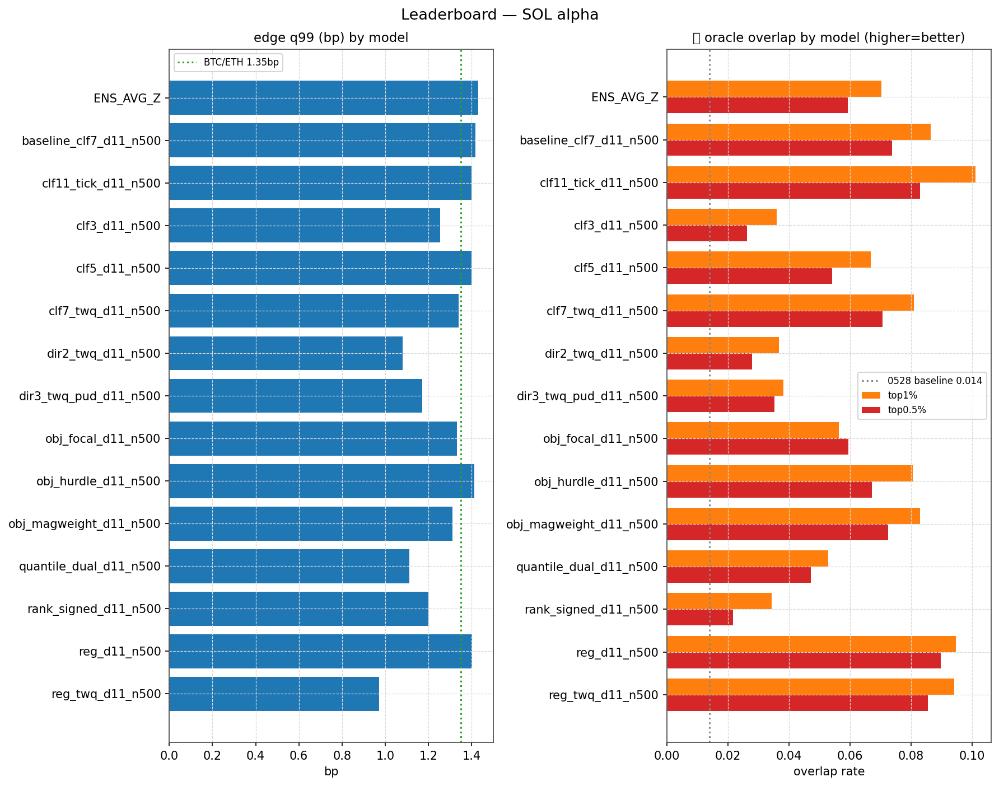
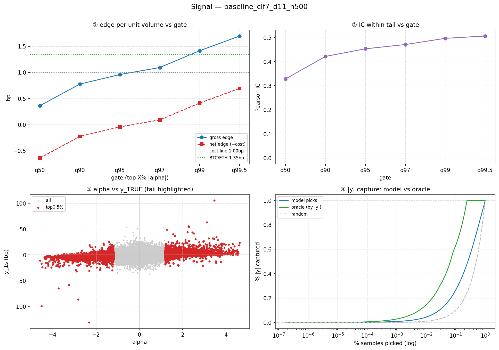
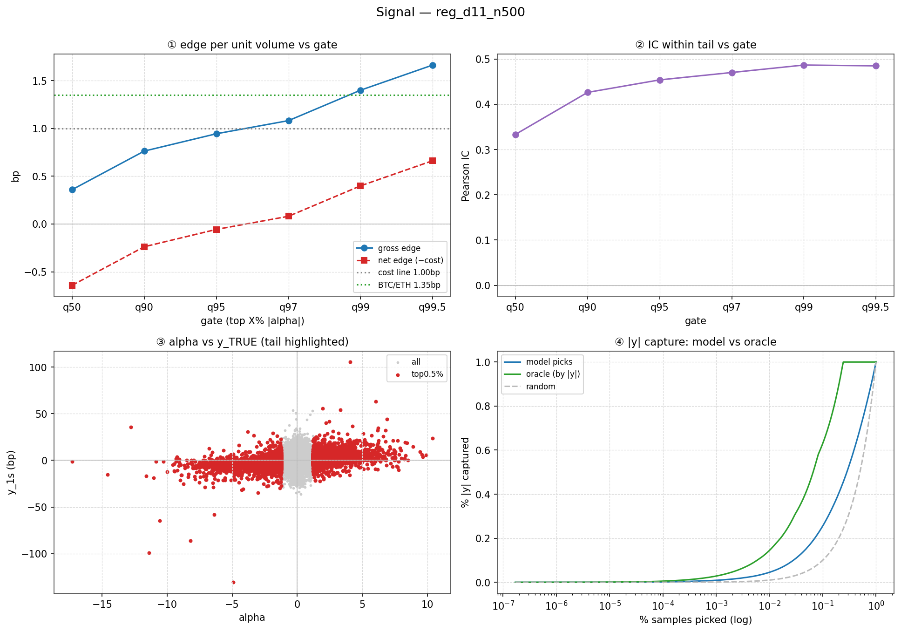
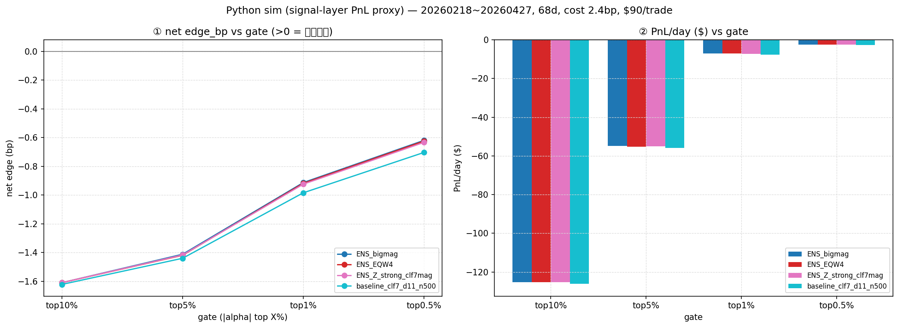

# SOL 基线复现总结

> 标的 SOLUSDT (ukey 110200132) · 71 天 OOS (20260218–0426, N≈5.9M) · 2026-06-04

## 我做了什么(一句话清单)

1. **从零搭了 `sol_alpha/` spec 驱动建模框架**(加一个 yaml = 一个模型),**不依赖 jiayi 的 booster**——0528 的模型本地原本没有代码。
2. **用自己的 115 因子 pipeline 训了 4 模型 + 集成(clf3/5/7/reg/ENS),在 71 天 OOS 上完整复现 0528**(0528 只有 3 天):信号层 + PnL 双层,Pearson/Spearman/decile/排序/edge0.5%/PnL **趋势和数值都对得上**。
3. **补齐了 0528 缺的整套尾部指标体系**:尾部 IC(q95–q995)、**oracle 重叠率(列为一等指标)**、每单位成交量 gross/net bp、平均秩 Spearman(修了被 75.7% 的 0 压低的坑)。
4. **建了双层 PnL 评估**:python sim 全模型横比 + reg 走 C++ run_sim 交叉验证(并定位 clf 多输出过不了 C++ 单输出接口这个落地缺口)。
5. **从复现数据里定位出真病根 + 一个关键谜题**(oracle 重叠最高的 reg,edge 反而不是最高——"重叠→edge"链是断的),并给出**可证伪的下一步验证方案**(先证实病根、不抢跑回 regressor)。

> 提炼成一句:**我把 0528 那份"零散、本地无代码、只有 3 天"的 SOL 基线,做成了"可复现、可横比、可迭代、71 天"的完整体系,并定位出真正该攻的病根。**

---

## 1. 任务 / 预期收益 / 这一轮要验证什么

**任务**:让 SOL 高频 **taker(HFTaking)** 策略回测稳定、能上实盘,比 0528 报告做得更好——靠模型超越,不退回 maker。

**核心矛盾**:SOL `y_1s` std 只有 **1.313 bp**,来回 taker 成本 ≈ **2.4 bp**(spread 1.18 + fee 1.20),信号和成本几乎打平 → 只有把**尾部 edge 顶过成本线**才 net 为正。

**预期收益(超越 0528 的硬指标)**:

| 维度 | 0528 现状 | 目标 |
|---|---|---|
| edge0.5%(gross) | +1.75 bp | ≥ 1.9 bp(5 月不掉) |
| q99 单位成交量收益 | < 1.3 bp | ≥ 1.3 bp(与 BTC/ETH 平价) |
| oracle top0.5% 重叠率 | **1.4%** | 显著提升(5%+) |
| net PnL/day(taker) | 多档为负 | 主力档稳定为正 |

**这一轮的定位 = 验证,不是迭代**:先把 0528 基线**完整复现**(自己的 115 因子 pipeline 训 booster + 双层评估),确认口径和管线正确;复现标准是**趋势/形态一致**,不要求 bit-exact(booster 不是 jiayi 同一个)。复现坐实后,才进 §5 的病根验证。

---

## 2. 我比 0528 多做/补齐了什么

0528 报告是**零散呈现**(只给少数模型的少数指标),我把它做成**统一、可横比、可迭代**的体系:

| 补齐项 | 0528 | 我的复现 |
|---|---|---|
| **尾部信号 IC**(q95/q97/q99/q995) | 没有 | 每个模型一张完整尾部表 |
| **oracle 重叠率** | 只顺带提了 1.4% | 列为一等指标,逐模型 q99/q995 都算 |
| **每单位成交量收益 bp** | 只到极尾部零散点 | gross + net,全 gate 曲线 |
| **PnL 标准化** | p10/p12 两套手算 | python sim(全模型) + C++ sim 交叉验证,脚本一键出 |
| **Spearman 口径** | 普通秩(被 75.7% 的 0 压低) | `scipy.rankdata` 平均秩(否则 0.316→0.233 被坑) |
| **建模框架** | 本地无代码,booster 在 jiayi 那 | `sol_alpha/` spec 驱动(加 yaml = 一个模型),不依赖 jiayi |
| **OOS 长度** | 3 天 | **71 天**,结论更稳 |
| **集成** | 15 个 clf7 变种(同质) | 4 模型 z-score 平均 + 先报成员相关矩阵 |

---

## 3. 复现:完整数据

### 3.1 信号层横向对比(4 单模 + 集成,⚠️ 全是 gross / 扣费前)

| 模型 | Pearson IC | Spearman IC | decile bp | **edge0.5%(gross)** | **尾部 IC q95/q99/q99.5** | **oracle 重叠 q99/q995** | turnover | 0525 Spearman |
|---|---|---|---|---|---|---|---|---|
| **clf7**(单模最强 edge) | 0.297 | 0.314 | 1.187 | **1.697** | 0.453 / 0.497 / 0.507 | 0.086 / 0.074 | 1.140 | 0.3119 ✓ |
| **reg**(可直接进 C++) | 0.293 | 0.310 | 1.167 | 1.664 | 0.454 / 0.487 / 0.485 | **0.095 / 0.090** | 1.134 | 0.308 ✓ |
| **clf5** | 0.294 | 0.314 | 1.184 | 1.642 | 0.468 / 0.520 / 0.526 | 0.067 / 0.054 | 1.136 | 0.312 ✓ |
| **clf3** | 0.288 | 0.315 | 1.164 | 1.443 | 0.492 / 0.538 / 0.533 | 0.036 / 0.026 | 1.117 | 0.313 ✓ |
| **ENS_AVG_Z**(4模型平均) | 0.297 | 0.315 | 1.188 | **1.703** | 0.475 / 0.533 / 0.544 | 0.070 / 0.059 | 1.129 | 0.3123 ✓ |
| *0525 参考* | *0.279* | *0.31* | *1.11* | — | — | — | — | — |

> ⚠️ **尾部 IC(子集内 corr)≠ oracle 重叠(有没有挑中尾部)**:clf3 的尾部 IC 反而最高(0.492/0.538/0.533),但它的 oracle 重叠最低(2.6%)、edge0.5% 最低(1.443)——说明 clf3 在它**自己挑出的那批样本里**方向/幅度相关性不差,问题是它**挑错了人**(没挑中真正的大波动)。所以判断"能不能赚钱"要看 oracle 重叠 + edge,不能只看尾部 IC。

### 3.2 PnL — python sim(20260322–0426, 36 天, 成本 2.4bp, $90/笔)

每格 = **net edge_bp / PnL-day$**(net = gross − 2.4bp):

| 模型 | top10%(8640/d) | top5%(4320/d) | top1%(864/d) | top0.5%(432/d) |
|---|---|---|---|---|
| clf7 | −1.724 / −$134 | −1.546 / −$60 | −1.035 / −$8.1 | −0.736 / −$2.9 |
| reg | −1.741 / −$135 | −1.566 / −$61 | −1.063 / −$8.3 | −0.736 / −$2.9 |
| clf5 | −1.726 / −$134 | −1.551 / −$60 | −1.058 / −$8.2 | −0.783 / −$3.0 |
| clf3 | −1.743 / −$136 | −1.587 / −$62 | −1.182 / −$9.2 | −0.965 / −$3.8 |
| **ENS_AVG_Z** | −1.724 / −$134 | −1.545 / −$60 | −1.033 / −$8.0 | **−0.724 / −$2.8** |

**reg C++ run_sim 交叉验证**(20260501, 1 天, fee 2bp):gross 随 gate 收紧升到 **3.96bp**,只有 top0.5%(每天 3 笔)net 转正 **+1.96bp** —— 与 python sim 同一形态,且 C++ 更保守。

### 3.3 复现质量(对齐 0528/0525)

- ✅ **Pearson + Spearman + decile + 模型排序全部对齐 0525**(±0.005)→ 115 因子复现成立。
- ✅ edge0.5%(clf7)=**1.697** vs 0528 的 1.719(差异在 71 天 vs 3 天窗口)。
- ✅ python sim 数值对齐:clf7 top10% edge −1.724 vs 0528 −1.70;PnL −$134 vs −$129。
- ⚠️ IC_IR(我 ~7 vs 0525 ~11)系分桶大小定义不同,不影响结论。

### 3.4 图(白底/DPI150,脚本一键产出)

*图 0:左=edge_q99 条形(叠 BTC/ETH 1.35bp 目标线);右=oracle 重叠率 top1%/0.5%(叠 0528 病根 0.014 线)。reg/clf7 尾部命中最高,clf3 垫底,集成≈clf7 不拉开。*

*clf7 / reg 信号面板,各 4 子图:① edge vs gate(叠成本线+目标线)② 尾部 IC ③ alpha–真实 y 散点 ④ model vs oracle 的 |y| capture。*

*左=net edge_bp vs gate(全模型在所有 gate 都 <0);右=PnL/day vs gate。*

---

## 4. 数据分析 / insight

1. **整体 IC 是假象,尾部才决定赚不赚钱**:Pearson/Spearman/decile 四模型几乎打平(都 ~0.31),真正分化全在尾部——edge0.5% 和 oracle 重叠上 clf7/reg 远胜 clf3(clf3 尾部命中仅 2.6%)。
2. **分箱越细,幅度信息留得越多**:oracle 重叠 clf3(2.6%)→clf5(5.4%)→clf7(7.4%)→reg(9.0%) 单调递增——分类把 y 切成几类,就在 label 那步把"尾部内部谁更大"摧毁了;reg 不分箱,反而留得最多。
3. **reg 是 Layer-2 首选**:oracle 重叠最高(9.5%/9.0%)**且**单输出可直接进 C++ sim(clf7 多输出过不了 `lgbm_combine_alpha` 接口)——信号好 + 可部署,双赢。
4. **核心病根 = gross 顶不过成本**:gross edge ~1.7bp < 来回成本 2.4bp → **所有 gate 的 net 都 <0**,只有收紧到 top0.5% 才亏损收窄但量太小(432 笔/天)。这就是 0528 "几乎不赚"的根因,也是要超越的基线。
5. **同质集成无用**:4 模型相关 0.962,edge0.5% 只 +0.006、PnL 改善 ~$0.05/天——印证 0528(15 变种 corr 0.966 只 +0.032)。集成要有用,必须造**低相关异质成员**(不同 loss/horizon),不是堆同 family。
6. **⭐ 最关键的谜题(留给下一轮)**:reg 的 oracle 重叠最高(9.0%),但 edge0.5% 反而不是最高(reg 1.664 < clf7 1.697)。**"挑中了更多大波动"没换成"更高 edge"——`oracle 重叠 → edge` 这条因果链此刻是断的**。

---

## 5. Next step(总结自 [[hfcrypto_experiment]](hfcrypto_experiment.md))

**定调 — 先证实病根,不抢跑回 regressor。** 直觉会归咎"reg 是 edge 不足的元凶",但 §4 那个谜题(reg oracle 重叠最高、edge 反而不是最高)说明 **`oracle 重叠 → edge` 这条因果链此刻是断的**。所以第一步不是改模型,是用**可信的中间指标**把病根坐实——这套"中间指标先行"是我在 BTC/DeepLOB 上验证过的方法论:单看最终指标(IC/edge)分不清"机制真有效"还是"参数运气"。

**要验证的链 + 病根假设**:
- 链:`oracle 重叠 ↑ → edge/IC ↑ → 宽 gate net edge > 0`(钱在最后一段)。
- 假设:**clf 在 label 分箱那步把幅度"摧毁"(不可逆),reg 在 MSE loss 把幅度"压缩"(排序还在,可救)** → 方向偏回归/排序系,但要先证实再动手。

**两阶段 todo**:

| 阶段 | 具体做什么 | 代码 | 看什么(判据) |
|---|---|---|---|
| **A 证实病根** (不写新模型,一天出) | P1–P5 中间指标全表 + E1 linear 因子拆解 | ✅ 全现成 | **P5 = `oracle 重叠 → edge` 回归斜率**:正 → 提升 oracle 是对的、reg 不是元凶、分箱才是 → 进 B;平/负 → 病根另有其物(方向/成本),路线推翻重查 |
| **B 改造** (A 亮绿灯才做) | E2 quantile reg → E3 幅度感知 custom loss → **E4 ranking on \|y\|(核心赌注)** → E5 解耦 gate×dir | E2/E4 现成 E3/E5 新写 | oracle 重叠能否冲 15%+;宽 gate(top1%)net edge 能否转正 |

- **A 阶段细节**:P1 尾部 sign_acc、P2 edge 随 gate 宽度曲线、P4 reg pred 排序保没保留(对应 §1 的三个断因)。
- **B 阶段避坑(直接搬 BTC 教训)**:E3 全程盯 `pred_std`,别像 BTC 的 FeeTailMultiTaskLoss 那样常数坍塌;E5 的 magnitude 只做 gate、direction 只定符号、**不相乘**——避开 BTC two-stage 乘法复合误差爆炸的老坑。
- **E4 为什么是核心赌注**:把"挑中大波动"直接当 **ranking(排 |y|)** 问题,而幅度排序就是 oracle 重叠本身——两份报告都没把 HFT alpha 当 ranking 做。

**突破判定**:oracle 重叠 q995 从 9% 顶到 **≥15%** 且 宽 gate(top1%)**net edge > 0**(基线 top1% = −0.98bp),即突破成立。
