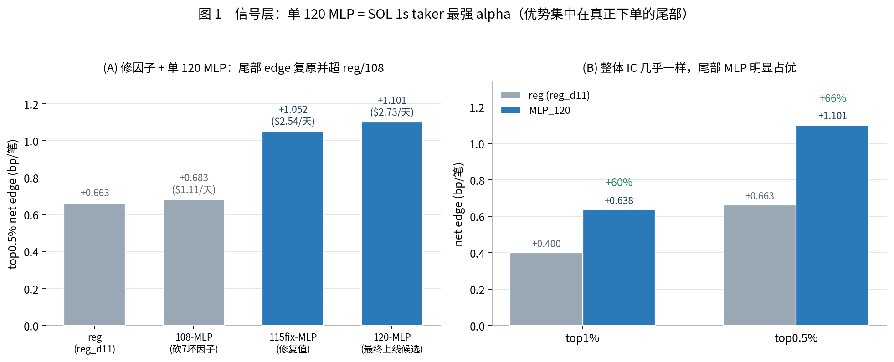
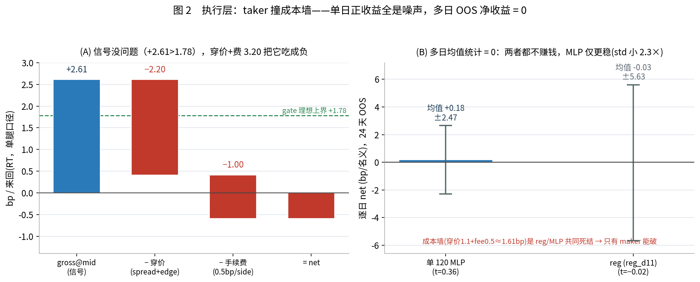

# HF Crypto SOL Week 4  — 四阶段迭代全记录：信号研究 → C++ 回测 → 因子修复迁移 → run_sim 验证

> 标的 **SOLUSDT**（ukey 110200132）· 1 秒前向 taker alpha · OOS 20260218–0426（68 天，N≈5.87M）
> **本文是 4 篇详细文档的合订入口**，分四个 section、每个 section = 一篇详细文档的概览 + 重要进展 + 关键列表；要看某一步的全部细节再点进对应文档。
> 配套（各 section 的详细文档）：①信号研究 [[hfcrypto_experiment]] · ②C++ 回测 [[hfcrypto_trading]] · ③因子修复+迁移 [[hfcrypto_migrate]] · ④run_sim 验证 [[hfcrypto_simulation]]
> 更新日期：2026-06-12

---

## 🎯 执行摘要（先读这一段）

> **本周按「信号 → C++ 对齐 → 因子修复 → run_sim 真实撮合」一条因果链推进，目标是把 SOL 1s taker 最强 alpha 真正落到实盘赚钱。结果：alpha 层与工程层全部做对了——单 120 MLP 是最强 alpha（信号层 top0.5% net +1.101bp / PnL $2.73，尾部比 reg 高 +66%）、C++ 热态完全复现 Python（corr 0.973）、代码 commit-ready。24 天 OOS 自然触发 taker net +0.18，即「信号收益还没被穿价变现」。这是待优化的执行问题，不是信号/模型问题，下一步是压穿价把已验证的信号收益变现**

**四阶段因果链（整份报告的逻辑脊柱）：**

**阶段一  信号研究**                                   → 详见 Section 1
  
五轴迭代 → 单模天花板 ~1.70bp；跨家族集成 ENS_EQW4 +4.7%（1.776）
  C12 砍因子 / C11 序列探针 / linear Ridge → 信息天花板锁死在 115 因子
  └→ 信号已到顶，瓶颈不在"再调信号"，而在"这信号真实撮合能拿到多少" → 接 C++

**阶段二  C++ 开发 + 第一次 run_sim**     → 详见 Section 2

5 step 接入对齐；MLP 在线 corr 0.877 → 逐列对差揪出 6 个坏因子 → drop 成 108 维对齐到 1.0
  第一次 run_sim taker 缺口在穿价；门漏 70% 弱信号 → 修硬门单日 +1.53，但 19 天 OOS = +0.04（p=0.94）
  └→ 单日好看靠不住；drop 6 坏因子砍掉尾部 edge → 等 jiayi 修好因子重验

**阶段三  因子修复 + 迁移**                           → 详见 Section 3

jiayi 修好坏因子 → 用"修复值"重验：**单 MLP 尾部 edge 复原 +54%
  单 120 MLP 最强（信号层 top0.5% PnL $2.73 > ENS3 > reg）**；C++ 热态 corr 0.973 = live=sim
  return 尺度统一（÷1e4）、centers 单一真相源、commit-ready
  └→ 单 120 MLP 定案上线候选；铁律：实盘不用硬门 → 自然触发跑 run_sim 验证执行

**阶段四  尺度对齐 + run_sim 验证**          → 详见 Section 4

单 120 MLP（return 尺度，自然触发，无硬门），从数据出发逐步验证
  信号层已盈利，但 run_sim 自然触发 taker 24 天 OOS = +0.18（t=0.36）= 打平 → 缺口在穿价
  reg 对照：MLP 尾部 > reg（且稳 2.3×），但两者的穿价缺口都没变现
  ⇒ 信号/工程做对了，执行端穿价是待压的缺口 

> ⚠️ **口径提示（看数字前必读）**：全文「net」有多套成本基准——信号层 gate 表用 **1.4bp 往返 / 1.001bp 单边**（乐观上界）、run_sim 真实撮合用 **穿价 1.1 + fee = 1.61bp**（真实）、研究层 [[hfcrypto_experiment]] 用 **2.4bp 往返**。**跨段比 net 先对齐口径**（详见 [[hfcrypto_trading]] §2.1 对照表）。

---

## Section 1 · 信号研究：信号能做多强？

> 详细文档：[[hfcrypto_experiment]]

> **摘要**：把 `/share` 上 115 个 sr 因子组合成 SOL「未来 1 秒」taker 信号的全部研究，围绕两个核心难题——**68% 的 bar 价格不动（零膨胀）**和 **0.8bp 大相对 tick（离散大跳）**——系统试遍了分箱、loss、神经网络、跨家族集成等所有组合层手段。**结论一**：单模型 edge 顶到 **~1.70bp 即封顶**，是「115 因子 + 1 秒」的**信息天花板**（MLP 因子交叉零增益、线性 Ridge 即达 LGBM 的 IC、砍因子单调掉 edge，三路独立夹逼坐实）。**结论二**：跨家族等权 z 集成（**ENS_EQW4 / ENS_bigmag**）靠去相关降噪可挤到 edge **1.776 / 1.781**，是研究层最优。**结论三**：研究层在 2.4bp 成本墙下 net 全负——但**降成本到实盘目标费后，下游单 120 MLP 信号层已转正收益**（见 Section 3/4）。

**这一步做了什么**：在前任实习生 clf7 基线（edge0.5% 1.697）上做"五轴迭代"——①分箱/目标结构（攻大 tick 离散）②regime 特征（攻零膨胀）③loss 改造 ④MLP 换归纳偏置 ⑤跨家族集成。每个改动都先在"两个核心问题"上定位（[[project_sol_two_core_problems]]）。

**关键发现**：
- **单模天花板 ~1.70bp**：clf7_mag（6 regime 特征）单模最高 1.706；C10b 两阶段（先分类→类内回归）是唯一打破"幅度↔方向"守恒曲线的结构（oracle 0.074→0.101），PnL 单模最优 −$2.76（@2.4bp）。
- **集成 +4.7%**：跨家族 4 成员等权 z（ENS_EQW4）edge **1.776（+4.7%）**，机制是 sign 0.706→0.720 降方向噪声（**不是加信息**）；家族内集成（corr 0.97+）无增益。
- **信息天花板锁死在 115 因子**（三路证伪）：MLP 因子交叉对 LGBM 零增益（sign 0.703≈0.706）；线性 Ridge IC 0.301≈LGBM 0.314（信号本质线性）；C11a train≈OOS（树连训练集大波动方向都只 0.66–0.70 → 信息不在因子里，非拟合问题）。

**关键表 — 研究层超越基线的模型（71d OOS，按 edge0.5% 降序）**：

| 模型 | 家族 | edge0.5% | vs 基线 | 一句话 |
|---|---|---|---|---|
| **ENS_bigmag** ⭐ | 集成 | **1.781** | +5.0% | mlp_big + clf7_mag 等权 z，去相关最佳 |
| **ENS_EQW4** ⭐ | 集成 | **1.776** | +4.7% | 跨家族 4 成员等权 z，降方向噪声 |
| **clf7_mag** ⭐ | LGBM | 1.706 | +0.5% | 单模最高：6 regime 特征攻零膨胀 |
| **C10b cls_reg_mix** ⭐ | LGBM | 1.699 | +0.1% | 唯一破守恒曲线（oracle 0.101）；单模 PnL 最优 |
| clf7 基线 | LGBM | 1.697 | — | 实习生最强单模，对照基准 |

**关键表 — ENS3 信号层 gate 全表（68d OOS，成本 1.4bp / $90/笔）**：

| gate | fills/天 | gross_bp | **net_bp** | **PnL/天** | tail IC(S) |
|---|---|---|---|---|---|
| top0.1% | 86 | +3.331 | **+1.931** | **+$1.50** | 0.731 |
| top0.5% | 432 | +1.778 | **+0.378** | **+$1.47** | 0.604 |
| top1% | 864 | +1.489 | **+0.089** | **+$0.69** | 0.569 |
| top2% | 1728 | +1.254 | −0.146 | −$2.27 | 0.547 |

> 盈利线 top0.1%~top1% net 为正——**但这是"信号层 gate 近似"（假设 mid 成交、想交易就成交）的理想上界**，不是真实撮合；真实撮合的穿价缺口在 Section 2/4 验证。

**牵出下一步**：信号能榨的都榨干了，瓶颈不在"信号不够强"，而在"gate 表的 +1.78bp 在**真实下单 + 撮合 + 成本**下能拿到多少"。→ 接 C++ 真实撮合验证（Section 2）。

---

## Section 2 · C++ 开发 + 第一次 run_sim：taker（ENS3）接进真实撮合后？

> 详细文档：[[hfcrypto_trading]]

> **摘要**：把研究层选出的模型接进 C++、用真实撮合引擎（run_sim）做实盘验证。先以三成员集成 **ENS3** 为实盘模型，完成 5 个 C++ 推理类的开发并验证 **C++ 与 Python 数值对齐**（树成员 corr 0.99）。Python sim 在降到 **1.4bp 目标成本**下、top1% 以内 gate 的 net 为正，看着可行；但接进 run_sim 做 **taker（IOC 主动吃单）的缺口在穿价**——可实现 mid-gross 仅 ~0.8bp/名义，暂时盖不过 ~1.1bp 穿价 + 手续费。单日「转正 +1.53bp」经 **19 天 OOS 验证是假阳性**（均值 +0.04、p=0.94，只是打平）。**结论：信号侧有 edge、缺口在真实撮合的穿价这一执行环节，是待优化的执行问题，不是信号死路**；另：实盘最终模型后续由 ENS3 改判为单 120 MLP（Section 3）。

**这一步做了什么**：把 ENS3 接进 `crypto-ts-alpha` C++ 推理链路（5 个 step：clf7 多分类 / magnitude / cls_reg_mix / MLP / ENS3 集成层），每 step 做 C++ vs Python 数值对齐；再第一次跑 `run_sim`（`HFTaking` 策略 + `YATMatchEngine` 撮合），不再是信号层近似。

**关键发现**：
- **5 step 对齐，但 MLP 在线 corr 只 0.877** → 逐列对差（C++ 实时值 vs Python panel）发现 **108/114 列完全对齐、仅 6 列岔开**（`Sr8MACD` 符号反 −0.999、`MT` 尺度偏移、`Sr12TradeImb` 家族 + `Sr5BigOrder` 间歇爆尖 223σ）。消融决定性：6 列换 panel 值 → Pearson **0.877→1.0000**、edge 100% 复原 → **这 6 列是全部病根，无隐藏第二原因**。处置（ENS3 路径）：drop 成 108 维重训，MLP 成员对齐 **1.0000**、ENS3 **0.9964**。
- **第一次 run_sim taker 缺口在穿价**：可实现 gross（~+0.8bp/名义）< taker 穿价（~1.1bp/名义）。亏损**两层**：先是"门漏了"——`alpha_lean` 校准的"top0.5% 门"实际放进 **69.5%** 的弱信号 bar（基差/库存/半价差凑数推过阈值，与 alpha 无关）。
- **修硬门 → 单日 +1.53**：加 `min_alpha=3.47` 硬门（与 my_mp 解耦），漏门 69.5%→**0.0%**，gross@mid +1.3→+3.1 → 单日 net **−0.30 翻到 +1.53bp**。
- **⚠️ 但 19 天 OOS = 0**：train 标定硬门跑 19 天，均值 net **+0.039bp（t=0.075, p=0.94）**，逐日从 +4.53 到 −4.70 乱跳——**+1.53 是单日运气 + 没代表性样本的假阳性**。
- ⚠️ **min_alpha 硬门后被定为实盘不用**（铁律自然触发，[[project_hfcrypto_no_hard_gate]]）；本阶段硬门结论作"门控漏洞诊断 + 反事实"记录。

**关键表 — run_sim gate 收紧 + 19 天反事实（ENS3，2/18，目标费 0.5bp/side）**：

| gate | fills | gross@mid | net@目标费 | | 19 天 OOS | 无门 | 硬门 |
|---|---|---|---|---|---|---|---|
| q99.5 | 932 | +0.609 | −0.996 | | 均值 net | **−0.381** | +0.039 |
| q99.9 | 322 | +0.742 | −0.872 | | 日 std | 0.277 | 2.274 |
| q99.99 | 70 | +0.951 | −0.672 | | 正/负天 | **1/18** | 9/10 |
| | | | | | t / p | **−5.98 / 1.2e-5** | 0.07 / 0.94 |

> 左：穿价 1.11bp 恒定，收紧 gate 到 q99.99 gross@mid 也只 +0.95<1.11。右：无门是"系统性失血"（p=1.2e-5），硬门修掉失血（省 +0.42bp/天）但只到"高方差打平"（均值仍 = 0）。**缺口是穿价，不是门。**

**牵出下一步**：①taker(ENS3)单日好看靠不住，多日打平；②为对齐 C++，6 个坏因子被 drop 成 108 维、**砍掉了尾部 edge**。jiayi 已重生成坏因子的"修复值 CSV" → **用修复值重验**，把砍掉的尾部 edge 找回来，再定最终上线 alpha（Section 3）。

---

## Section 3 · 因子修复 + 迁移：谁是最强 alpha？

> 详细文档：[[hfcrypto_migrate]]

> **摘要**：把实盘相关代码迁到独立 git 仓 `hfcrypto_junjie`。迁移途中做了关键一步：jiayi 修复了之前 C++ 与训练 panel 对不上的 6~7 个坏因子后**重新验证**，发现**单个 MLP（115fix）反而显著强于原集成 ENS3**。最终选定 **120 维单 MLP（115fix + 6 magnitude − Sr8MACD）** 为实盘 alpha——尾部 edge 最强、C++ 热态 corr **0.973**、top0.5% 实测可服务。同时统一了 alpha 输出尺度（bp → return，对齐 reg 口径），并定下**实盘不用 min_alpha 硬门**的铁律。代码已整理成 **MLP-only、commit-ready**（crypto-ts-alpha + crypto-ts-strategy 零 C++ 改动、待 user 自提；sol_alpha 仍待迁）。

**这一步做了什么**：用 jiayi 的"修复值"（列名参数真变了：`b6→b60`、`a1→a100`）按新 param 重训 `mlp_strong_115fix`，再 +6 magnitude − 噪声因子 Sr8MACD = **120 维终态**；做 C++ 实时对齐实测；把 MLP 输出 `÷1e4` 从 bp 尺度统一到 return 尺度（对齐 reg/`ult_lgbm` ~2e-5 口径），整理成 commit-ready 迁进 `hfcrypto_junjie`。

**关键发现**：
- **单 MLP 尾部 edge 复原 +54%**：top0.5% net **108 的 +0.683 → 115fix 的 +1.052**；归因（115broken 对照）**93% 来自"修复值"**，仅 7% 来自多出的维度。
- **单 120 MLP 是最强 alpha**：top0.5% PnL **$2.73/天（信号层全场最高）** > ENS3_115（$1.99）> ENS3_108（$1.52）；115fix 家族集成效应**反转**（单模已够强 → 集成反稀释，+54% 摊薄到 +15%）；单 MLP 自带 bp 尺子、**免 min_alpha 补丁**。
- **C++ 热态 corr 0.973 = live=sim**：120 维 114 因子逐列 C++ vs panel 全部 Pearson ≥0.9918（无坏因子），0.973 是 MLP 把"0.99 而非 1.0"的微小差累积放大（非单因子坏）；**top0.5% 运营 gate 实测 PnL $2.04 ≈ Python $1.83，几乎不损 → 信号层收益在 C++ 实时路径已复现**。
- **尺度统一 + commit-ready**：genaAC 实测 q99.5(\|α\|)=1.477e-4、全 <1e-3（return 尺度生效）；centers 改单一真相源（cfg 不再覆盖 weights.json）；alpha/strategy 两仓 commit-ready、零 C++ 改动。

**关键表 — alpha 选型对比 + 单 120 MLP gate 全表 + C++ corr（68d OOS）**：

| 版本 | top1% net | top0.5% net | PnL/天 | | 单120MLP gate | gross | net | IC_s(尾) |
|---|---|---|---|---|---|---|---|---|
| 108-MLP | +0.421 | +0.683 | $1.11 | | q95 (5%) | +0.983 | −0.018 | 0.526 |
| 115fix-MLP | +0.626 | +1.052 | $2.54 | | q97 (3%) | +1.154 | +0.152 | 0.554 |
| 121-MLP | +0.640 | +1.080 | $2.65 | | q99 (1%) | +1.639 | +0.638 | 0.622 |
| **120-MLP** ⭐ | +0.638 | **+1.101** | **$2.73** | | **q99.5 (0.5%)** | **+2.102** | **+1.101** | 0.671 |
| reg(reg_d11) | +0.400 | +0.663 | — | | C++ 冷态 | corr 0.926 | 热态 | **0.973** |

*图 1：(A) 修 6 个坏因子 + 单 MLP 重训，把阶段二被砍掉的尾部 edge 逐步找回——top0.5% net 从 108 的 +0.683 到 120 的 +1.101，PnL/天 $1.11→$2.73；(B) 整体 IC reg≈MLP（0.3114 vs 0.3124），但在真正下单的尾部 MLP 明显占优（top1% +60%、top0.5% +66%）——"不是整体远远更好，而是 MLP 在尾部更好"。*

**牵出下一步**：单 120 MLP 定案上线候选、信号层已盈利、工程 live=sim。但阶段二的 taker 验证用的是 ENS3 + 硬门，而**铁律：实盘绝不用 min_alpha 硬门**（自然触发卡 top0.5%）。→ 用单 120 MLP + return 尺度 + **自然触发（无硬门）**重跑 run_sim，验证信号收益能否变现到真实撮合（Section 4）。

---

## Section 4 · 尺度对齐 + run_sim 验证：信号收益变现到真实撮合了吗？

> 详细文档：[[hfcrypto_simulation]]

> **摘要**：从数据出发、一步步验证「单 120 MLP 能否在真实撮合 run_sim 下上线」。先确认单 MLP 与实习生最好的 lgbm 回归**估的是同一个 E[y]**，但 MLP 在尾部（真正下单的分位）明显更优（top0.5% net **+66%**）、且输出有界更鲁棒。再确认 **C++ 热启动后完全复现 Python**（corr **0.973**、top0.5% PnL 基本打平）。最后按实盘铁律（**不用硬门、纯自然触发**）跑 run_sim taker：24 天 OOS net **+0.18 ≈ 0**（t=0.36，目标费下打平、未显著）——**信号层已盈利，缺口在真实撮合的穿价（~1.1bp）这一执行环节**。**结论：单 120 MLP 信号层已取得正收益（top0.5% net +1.101 / PnL $2.73），落地核心待办是压低真实撮合的穿价成本（候选：maker 去穿价、同所去基差、收紧触发），把已验证的信号收益变现到 run_sim。**

**这一步做了什么**：单 120 MLP（return 尺度，`alpha_lean=2.87` 落回 reg 同量级）、**自然触发无硬门**，从数据出发逐步验证——Python 信号层 → reg/MLP 输出数值对比 → C++ 冷/热 → run_sim 自然触发 take_thres 扫描 → 多日 OOS → reg 对照。

**关键发现**：
- **信号层 MLP 尾部 > reg**：整体 IC 几乎一样（0.3114 vs 0.3124），但尾部（真正下单的分位）MLP 明显占优（top0.5% net +66%、top1% +60%）；reg 与 MLP 估同一 E[y]、94% 一致，差别在 MLP **有界鲁棒**（±4.72）、reg 无界偶尔过冲（到 17）。
- **C++ 热态完全复现 Python**：corr 0.973，top0.5% PnL 热态 $2.04 ≈ Python $1.83——**信号层收益在 C++ 实时已变现**。
- **run_sim 自然触发 taker 的缺口在穿价**：基差漏单 → realized gross 仅 +1.14（理想 top0.5% 是 +2.10）→ 暂时过不了成本墙 1.61bp（穿价 1.1 + fee 0.5）；只有极尾 **tt=7（top0.12%）单日才翻正 +3.25**，但 **24 天 OOS = +0.18bp（t=0.36，不显著）**——即信号收益还没被穿价变现。
- **reg 对照坐实"MLP 尾部 > reg"**：reg 在自己 49 笔极尾看着 +7.86（2 天），交易到 MLP 量级（≥259 笔）立刻转负，24 天塌成 **−0.027**，方差 5.63 是 MLP 的 **2.3 倍**；MLP 有界鲁棒、更稳、更易调。
- **pos_lean 调参不足以独自变现**：甜点 0.002 已最优，24 天仍 ≈0；穿价是把信号收益变现的主要执行缺口，需更彻底压穿价（候选 maker / 同所 / 收紧触发），非靠 pos_lean 微调。
- **诚实**：以上是**乐观 0.5bp 费率**；生产/bybit 真实 taker 费 2bp，真实费率下变现更难——**信号层已盈利是前提不变，真实费率只是加大了执行端待办**。

**关键表 — run_sim take_thres 扫描 + 24 天 OOS 对照（单120MLP，自然触发，成本墙 1.61bp）**：

| take_thres | 成交% | gross@mid | net@fee | | 24 天 OOS | net 均值 | std | t |
|---|---|---|---|---|---|---|---|---|
| 3.5 | 1.24% | +1.48 | −0.13 | | **MLP_120** | **+0.180** | 2.47 | +0.36 |
| 5 (≈top0.5%) | 0.43% | +1.14 | −0.47 | | reg(reg_d11) | −0.027 | **5.63** | −0.02 |
| **7 (top0.12%)** | 0.12% | **+4.87** | **+3.25** | | | 均≈0（打平）| MLP 稳 2.3× | 都不显著 |

*图 2：(A) taker 单笔账（统一到 gate +1.78 单腿/RT 口径）——gross@mid +2.61 其实**高于** gate 理想 +1.78（持仓跨多 bar 吃 swing），**信号 mid-capture 没问题、亏的是成本不是信号**；穿价 −2.20 + 手续费 −1.00 = 3.20bp/RT 是待压的执行缺口。(B) 多日 OOS 逐日 net 均值±std：单 120 MLP +0.18±2.47（t=0.36）、reg −0.03±5.63（t=−0.02），自然触发 taker 多日打平，误差棒横跨零线；MLP 更稳（std 小 2.3×）。**缺口在穿价执行（~1.61bp 成本墙），首选候选是 maker 去穿价。**

**这一步的定论**：**信号 / 工程都做对了，单 120 MLP 信号层已盈利**；taker 在真实撮合下的缺口集中在**穿价**这一执行环节（自然触发多日打平、真实费更难）。这是待优化的执行问题，不是信号 / 模型问题——下一步压穿价变现，**maker 是首选候选**。

---

## 经验与教训（沿主线的提炼）

**✅ 有效**：①逐列对差 + 消融换 panel 值，精确定位 6 个坏因子（修复后尾部 edge +54%）——可复用到任何 C++↔Python 对齐问题；②"成员够强就别集成"（115fix 家族单 MLP > ENS3）；③centers 单一真相源，杜绝 cfg 覆盖模型导出的尺度漂移；④把 MLP 输出统一到 return 尺度，与 reg/strategy 同口径、免 min_alpha 补丁。

**📌 锁死的认知**：①loss 层改造创造不出方向信息（信息天花板在 115 因子）；②收紧 gate / magnitude alpha / sizing / pos_lean 都不改穿价比例（穿价是结构性的、要靠不穿价的执行方式去压）。

**⚠️ 副作用 & 方法论**：①零膨胀场景禁用"方向感知/降权错向"类 loss（触发零吸引子，sign 崩 0.533，[[project_sol_zero_inflated_rank]]）；②**HFT 单日方差 ±6bp，任何单日结论一律不可信**——本周最值钱的教训：单日 +1.53/+3.25 全被多日 OOS + t 检验"打平"（t=0.36、p=0.94）订正（[[feedback_debug_dont_giveup]] / [[feedback_correctness_over_cost]]）；③**机制有效 ≠ 指标有效**：min_alpha 门把漏门 69.5%→0%（机制对）但只换来高方差打平 → taker 的穿价缺口要靠执行方式（maker）去压，不是调门。

---

## 终判与后续 TODO

整条因果链走完，结论收束为一句话：**alpha 层 + 工程层都做对了——单 120 MLP 信号层已取得正收益（top0.5% net +1.101 / PnL $2.73）、C++ 热态 corr 0.973 实时复现、代码 commit-ready；当前唯一缺口在 taker 真实撮合的「穿价」执行环节（24 天 OOS 自然触发 net +0.18 ≈ 0，目标费），即信号收益还没被穿价变现。** 本周确知三件原来只是"怀疑"的事：(1) SOL 1s 方向信息上限锁死在 115 因子，要再提信号上限必须加原始 LOB 新信息；(2) 训练↔实盘分叉根因是少数子因子版本漂移，可逐列定位、可工程修复；(3) **taker 在 SOL（大相对 tick 标的）真实撮合下的瓶颈是穿价成本墙**——信号层已盈利、执行端待压穿价变现，**maker 是首选候选方向**（挂单不穿价：spread −1.22→+1.22 赚、fee −2bp→+0.2bp 返佣，约 +3bp/RT 余量，足以盖过缩水后的 +0.8bp 信号）。

**后续 TODO**：
- **TODO 1（核心）**：用 `HFMaking` 接单 120 MLP 信号跑真 C++ run_sim 多日 OOS——把已验证的信号层收益（top0.5% net +1.101）通过"不穿价"的 maker 执行变现；实习生只参数化假设过 maker、从未真 sim 验证，这是当前最有结构性盈利余量的候选，优先级最高。
- **TODO 2（信号天花板，长线）**：若要再提信号上限，唯一出路是加**原始 LOB 特征**（115 因子已被 C12/C11 证明信息饱和、无冗余可榨）——需与 senior 确认数据可得性。
- **TODO 3（工程收尾）**：`crypto-ts-alpha`（`samson_dev_alpha`）+ `crypto-ts-strategy`（`samson_dev_strategy`）均 commit-ready、待 user 自提；`sol_alpha` Python 链路仍待迁入 `hfcrypto_junjie`。
- **TODO 4（风险诊断副产品）**：最差日（0414/0221）的亏损是**信号当天方向就错**（gross@mid 为负），非执行成本——若日后要救尾部，应做"滚动 realized-edge 熔断"（信号转负就降仓），而非执行层调参。
