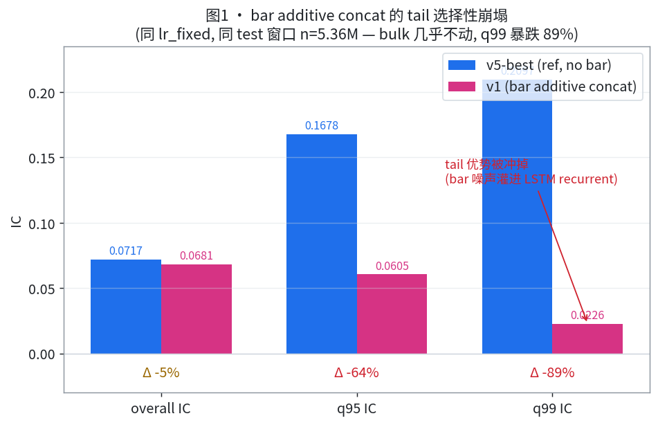
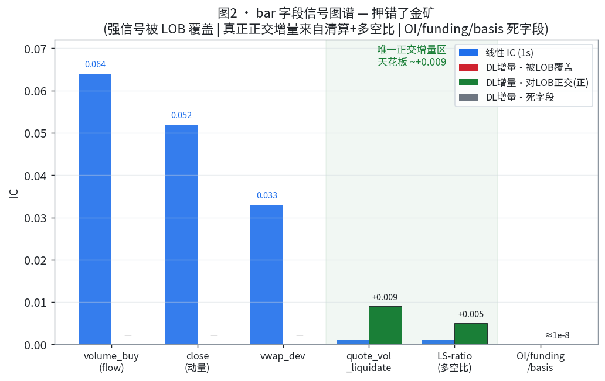
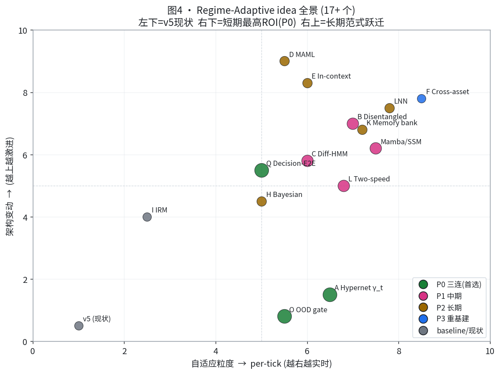
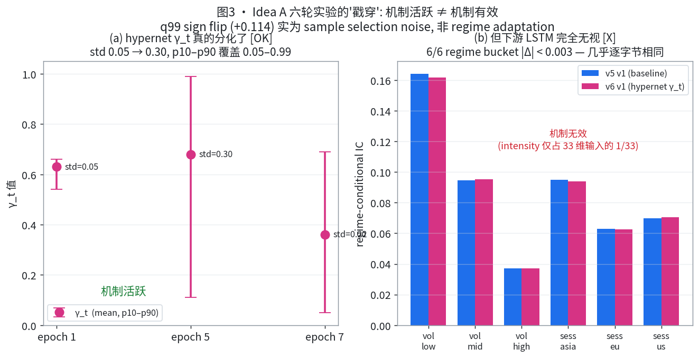

# Week 23 模型工作汇总：新数据范式 + Regime-Adaptive 动态形态调研

> 两条主线：
> **Part A — 新增数据接入范式**：把"bar 能不能用"提炼成「任何新数据源接入 DL pipeline 前都跑的一套多范式评估」（来源 [new_data_trade.md](../new_data/new_data_trade.md)）。
> **Part B — Regime-Adaptive 模型动态形态调研**：让模型在推理时具备"我此刻在什么 regime、该如何调节自己"的元能力，跳出 ERM（来源 [regime_adaptive_paradigm.md](../new_idea_brainstorm/regime_adaptive_paradigm.md)）。
>
> 文档结构：**最上面是贴近周报的浓缩版**，下面两节是各自的详细展开。

---

# 📋 快速总结

## A. 新增数据接入范式

**一句话**：本周把"bar 数据行不行"从一次性问答，沉淀成一套**可复用的多范式评估框架**——任何新数据源（bar / 未来恢复的 trade / 其他源）接入前都先跑这五个范式，避免在错的轴/错的 horizon 上把一个数据源误判生死。

**为什么要"多范式"**：单一轴（IC）会下错结论。同一份数据在不同范式下结论可能相反——bar 实证就是 **IC 持平、PnL 却 +17%**（成本侧降换手）。

**五个范式（按成本从低到高）**：
| 范式 | 干什么 | 关键产出 |
|---|---|---|
| 0 完整性 probe | 覆盖天数 / 逐秒对齐 / schema / 新鲜度 | trade 在此被废弃（仅 198 天 + 滞后 2.5 月） |
| 1 线性正交-IC 天花板 | 单因子 IC + bar-only + combined vs LOB-only | 字段级信号图谱；**三必查：泄漏 / 冗余 / 正交上限** |
| 2 horizon 扫描 | 同字段 1s / 1min / 60min IC | 慢变量（OI/funding/LS-ratio）秒级死、分钟级才醒 |
| 3 DL 融合阶梯 | additive → FiLM/modulation → bagging | 每档带 tail 守卫门 + 机制验证 |
| 4 多目标（IC≠PnL） | 回测复检 | bar：OLS net +17%，纯换手收益非 IC |

**bar 实例结论（本周进展）**：
- **v1 additive concat = Gate G1 灾难性失败**：同 lr 干净对比，IC 0.0717→0.0681，**q99_IC 0.2097→0.0226（-89%）**。tail 选择性崩塌——bar 14 维（清算尖峰+噪声）灌进 LSTM recurrent 输入，在 tail 时刻污染最重（与 A3 seq60 伤 q99 同源）。
- **押错了特征**：原以为金矿的 OI/funding/basis 经 DL ablation 确认 **≈1e-8 零贡献**；真正正交增量来自**清算名义额（quote_volume_liquidate +0.009）+ 多空比（+0.005）**，天花板 ~+0.009。flow/momentum 有信号但**被 LOB OFI 覆盖**。
- **⚠️ 泄漏隐患（最高优先）**：bar[t] 聚合窗口 [t,t+1) 与 target close_1m[t] 同区间 → **bar 偷看了 target 第 1 秒**，相对 LOB 有 1 秒 lookahead，cache.py 当前**没 shift**。**查清前任何 bar 增量都不可信**。
- **下一步**：T1 查/修对齐泄漏 → T2 重定义证据驱动特征集（删死 G3） → T4 FiLM（identity-init 不伤 tail）on 干净特征做终审。

**逐档进展（combined IC，越往后越接近正增量）**——失败点 → 定位增量来源 → 干净注入逼近正收益：
| 迭代 | 机制 | combined IC | q99 IC | 状态 |
|---|---|---|---|---|
| 参照 | LOB-only v5-best | 0.0717 | 0.2097 | ✅ 实测基线 |
| 线性地板 | bar-only OLS | 0.046（bar 独立信号确实存在） | — | ✅ 实测（alpha-zoo） |
| v1 | bar additive concat | 0.0681 | 0.0226 | ✅ 实测：机制错、tail 崩（最低点） |
| v1 + ablation | 锁定正交字段（清算+多空比） | 可榨 **+0.009** 天花板 | — | ✅ 实测：找到真增量来源 |
| v2 FiLM | identity-init 干净注入 | **≥0.0767**（目标 Δic ≥ +0.005） | **≥0.20**（守 tail） | 🎯 预期（最坏退化=基线，下行零） |

> 轨迹读法：从 v1 的 0.0681（跌破基线、tail 崩）→ ablation 定位到 +0.009 可榨空间 → FiLM identity-init 目标把 combined IC 抬到 0.0767 且守住 q99。**每一档都在排除一种"错误注入"，逐步逼近正增量**。

**更深一层反思（Stage 4）**：bar 失败的根因可能不是"bar 无信号"，而是整条 pipeline 的**输入编码是截面导向的**（都在回答"这一秒长什么样"，而非"价格/流动性怎么演化"）。本周已完成 lob_delta 编码（Δz 而非绝对 z）的代码改造（TODO-4.1，4 文件 47 行，冒烟通过），待 HPC 跑 Run 1 诊断"截面编码本身是否是缺陷"。

**v2 FiLM 核心逻辑**： v1 把 bar 噪声灌进 LSTM 的 recurrent 通路，在 tail 时刻（hidden state 最饱和）累积爆炸，所以 q99 -89%。v2 把 bar 改成只在序列末端调制 pooled 输出（FiLM），绕过 recurrent，bar 噪声永远进不了 cell state，理论上下行风险为零。

## B. Regime-Adaptive 模型动态形态调研

**一句话**：我们过去训的模型本质都是 "ERM on past distribution"——把训练分布当真相、祈祷测试分布一样。LOB 公然违反 i.i.d./平稳性，这个祈祷必然失败。**真正的范式跃迁不是加 feature/加深网络，而是让模型在推理时感知 regime 并主动调整自己**。v5 的 learnable γ 只是"全局常数"，仍是 ERM。

**两个 seed（用户原始思路）**：
- Seed 1 — **inter-model router**：根据新 tick 调模型间权重（= 经典 MoE；现 B2-mean 的 0.5/0.5 是其常数弱版）。
- Seed 2 — **intra-model subspace router**：同一 LSTM 内切 K 个 state subspace，input 决定哪个"人格"主导（= disentanglement / Mamba 的工业级实现）。

**17 个 idea + 现代架构**，二维排布（架构变动 × 自适应粒度）。P0 三连：
1. **Idea A · Hypernetwork γ_t**（seed 最干净落地，1 day，已实现并跑了 6 轮实验）
2. **Idea O · OOD Confidence Gate**（决策层、零架构改动、可能突破 alpha ceiling）
3. **Idea Q · Decision-Aware E2E**（直接对齐 P&L 而非 IC，回应 IC=0.21 但 alpha=0.66bp 的 gap）

**Idea A 六轮实验主线（本周核心实证）**：
| 轮 | 关键发现 |
|---|---|
| 4（4-seed paired） | overall IC ≈ v5，**tail q99 反向**；infra 三个 P0 fix 跑通（可复用） |
| 5（sequential 8/8） | **唯一有效配对 q99_IC 从 -0.028 翻 +0.086（sign flip +0.114）**；但 3/4 v6 训练崩，根因 yaml 漏传 `lr_fixed` |
| 6（temporal_pool 诊断） | **戳穿假象**：γ_t 真分化（std=0.30）**但 LSTM 完全无视**——intensity 只占 33 维输入的 1 维；v6 v1 与 v5 v1 在 6/6 regime bucket 上 \|Δ\|<0.003，q99 sign flip 实为 **sample selection noise**。Fix：temporal_pool `last`→`intensity_weighted`，让 γ_t 经 attention 门控放大 ~60×，过夜验证 |

**关键指标轨迹（逐轮收敛，tail 与机制有效性同步抬升）**：
| 轮 | 配置 | tail q99_IC（最佳有效 run） | q95_hit | γ_t 分化 std | 解读 |
|---|---|---|---|---|---|
| 4 | 4-seed paired 首版 | ≈ -0.02 → 0（反向） | 60% → **64%** (+4pp) | — | ✅ 实测：机制起作用但 tail 反向 |
| 5 | + lr_fixed sequential | **+0.086**（vs v5 的 -0.028，Δ +0.114） | 维持 +3~4pp | — | ✅ 实测：单点强信号（后证含采样噪声） |
| 6a | + 诊断工具拆穿 | （识别出是噪声，非真增量） | — | **0.30** ✅ | ✅ 实测：机制活跃已坐实，缺的是下游通路 |
| 6b | + temporal_pool fix | 🎯 目标 regime IC Δ > 0.01 | 🎯 守住 +4pp | 维持 >0.1 | 🎯 预期：γ_t 经 attention 放大 ~60× 真正影响输出 |

> 轨迹读法：q99_IC 从第 4 轮的反向 → 第 5 轮 +0.086（但查出是噪声）→ 第 6 轮确认"机制真分化(std=0.30)、只差下游通路"并给出 fix。**q95_hit 的 +4pp 是全程稳定的真实正面信号**；第 6 轮的 fix 把"机制活跃"转化为"机制有效"，是这条线从"看着像变好"走向"真的变好"的关键一跃。

**本周最重要的方法论收获**（比任何 IC 数字都重要）：
1. **单一指标会骗你**——q99 sign flip 看似大胜，对比 v5 regime profile 才看出是采样噪声。
2. **机制活跃 ≠ 机制有效**——hypernet 真的学了（std=0.30），但下游不用它就是无效。必须 mid-training scalar（γ_t 收敛）+ post-training regime IC **双重验证**。
3. **idea-agnostic 工具 ROI 最高**——`analyze_v6_alone.py` 一次投资，同时拆穿噪声 + 暴露 LSTM 忽略 intensity，B/C/L/O/Q 都能复用。

**两条主线的统一点**：Part A 的范式 3（FiLM/modulation 干净注入）正是 Part B 的 regime-conditioning 机制落地——FiLM = lstm_ideaA shrinkage gate 的推广 = regime_adaptive 的最小可行形态。新数据（bar 的清算/funding regime 信号）的最佳归宿不是"加更多维"，而是"作 regime context 影响模型如何解读动力学"。

---

# 📖 详细展开

## Part A · 新增数据评估范式（multi-paradigm）

### A.1 核心定位与绝对约束

- **唯一问题**：bar 数据能否给当前 snapshot-only DL pipeline（SOTA: B2-mean IC=0.0763）带来增量？
- **固定参照**：v5-best = `runs/deeplob_v4_roll_1m/v5`，seq30/bs8192/learnable-γ intensity/rolling 6-2，**ic=0.0717 / q99=0.2097 / q95=0.1678**。q99=0.2097 是必须守住的 tail 强度。
- **绝对约束**：snapshot 现有路径一字节不动；所有改动通过 `include_bar=False` 默认关闭；cache_key 向后兼容（SHA1 不变，已用 invariant 测试守护）。

### A.2 五范式框架（核心资产，可复用）

**范式 0 · 完整性 probe（最便宜，先做）**
覆盖天数 / 与 snapshot 逐秒对齐 / schema / 新鲜度。
- snapshot 870 天、bar 870 天（逐秒同步），trade 仅 198 天 + 滞后 2.5 月 → **trade 在这步被废弃**。
- bar schema：1 秒粒度 86400 行/天，32 列，仅 vwap 0.15% NaN；26 数值分 3 组（G1 价格-成交对 / G2 流动性消费 / G3 衍生品独有 14 维，G3 与 snapshot 物理正交）。

**范式 1 · 线性正交-IC 天花板（CPU，alpha-zoo 式，关键过滤）**
单因子 IC + bar-only OLS/LGBM + combined(LOB+new) vs LOB-only。三个必查：
- **泄漏**：单因子 lag(+1)，IC 暴跌即泄漏（bar buy_vol_ratio 0.30→0.06）。
- **冗余**：combined IC 增量 ≈0 → 信号被 base 覆盖（bar flow/momentum 被 LOB OFI 覆盖）。
- **正交上限**：combined IC ≤ √(IC_base²+IC_new²)，超了必泄漏。
- 产出：字段级信号图谱（强/弱/死/冗余/正交），DL 之前就知道天花板。

**范式 2 · horizon 扫描**
同字段 1s / 1min / 60min IC。慢变量（OI/funding/LS-ratio）秒级是死的、分钟级才醒（liq/LS-ratio 1s≈0 → 1min +0.005~0.009）。**别在错 horizon 上证死一个数据源**。

**范式 3 · DL 融合阶梯**
additive concat（tail 污染测试）→ FiLM/modulation（identity-init 干净注入，不伤 tail）→ bagging。每档带 tail 守卫门 + 机制验证（γ 收敛、ablation、γ_film 偏离）。identity-init 保证最坏退化到 base（下行风险零）。

**范式 4 · 多目标（IC ≠ PnL）**
一个数据源可能 IC 平但 PnL 增（成本侧：平滑预测→降换手→降费用）。bar：OLS net +17%，纯换手收益非 IC，且强模型依赖（OLS 成立、LGBM 反害）。**必跑回测复检，别只看 IC 判死**。

**决策矩阵**：
| 线性正交IC | DL-IC增量 | PnL | 结论 |
|---|---|---|---|
| >0 且不冗余 | >0 | — | 真增量，接入 |
| ≈0（冗余） | ≈0 | >0 | IC 无用但成本侧有用 → OLS/轻模型 ship |
| ≈0 | ≈0 | ≈0 | 该 horizon 证死 → 换 horizon 或结案 |
| 含泄漏 | — | — | 修对齐重测，泄漏前结论全废 |

### A.3 bar 实例：应用范式后的实证

**DL 融合阶梯实测（范式 3）**——v1 additive concat 干净归因（同 lr_fixed=8.32e-5，同 test 窗口 n=5.36M）：
| | v5-best (ref) | v1 (concat) | Δ |
|---|---|---|---|
| IC | 0.0717 | 0.0681 | -0.0036 |
| q95 IC | 0.1678 | 0.0605 | -64% |
| q99 IC | 0.2097 | 0.0226 | **-89%** |
| hit | 0.5458 | 0.5477 | +0.002 |

- **诊断**：tail 选择性崩塌（bulk IC 几乎不动，q99 暴跌 89%，pred_std 仅 -10% → 模型仍做极端预测但失准）。机制 = bar 14 维（清算尖峰+噪声）灌进 LSTM recurrent 输入，在 tail 时刻（hidden 最满载）污染最重。
- **probe.json 坐实**：γ_bar_final=0.729（没丢弃，还略涨）+ encoder_sparsity=0 → 模型主动用 bar，不是忽略。结合 q99 -89% → 坐实是「bar 有信号但被 additive 错误注入摧毁 tail」，不是纯噪声 → FiLM 有依据。

*图1：v5-best vs v1 在 overall/q95/q99 三档 IC 对比。bulk（overall）几乎不动，但越往 tail 跌越狠（q95 -64%、q99 -89%）——这是"选择性"崩塌的视觉证据，说明 bar 不是全局变差，而是专门冲掉了 v5 的极端值优势。*

**特征图谱修正（范式 1+2 交叉，与用户 alpha_zoo 对齐）**：
| 类别 | 字段 | 线性 IC(1s) | DL ablation(1min) | 对 LOB 正交性 |
|---|---|---|---|---|
| flow 不平衡 | volume_buy/quote_volume_buy | 0.064（最强） | — | ❌ 被 LOB OFI 覆盖 |
| 动量 | close mom | 0.052 | — | ❌ 被 LOB 动量覆盖 |
| vwap_dev | vwap | 0.033 | — | ❌ LOB 可近似 |
| **清算名义额** | quote_volume_liquidate | ~0(1s) | **+0.009** | ✅ LOB 拿不到 |
| **多空比** | global/top LS-ratio | ~0(1s) | +0.005 | ✅ LOB 拿不到 |
| OI/funding/basis | open_interest/funding/index/mark | ≈0 | **≈1e-8 死字段** | ✅ 但死 |

**核心修正**：原 14 维 G3 押错——OI/funding/basis 是 zoo 明确证死的（60-300s 才更新，秒级常数），DL probe 独立确认 ≈1e-8。bar 对 DL-IC 唯一可能的正交增量 = **清算名义额 + 多空比**，天花板 ~+0.009。

*图2：横轴是 bar 各字段。线性 1s IC 最强的 flow/动量/vwap（蓝），DL 增量却为 0——被 LOB OFI 覆盖（红）；真正能给 DL 加增量的只有清算名义额 + 多空比（绿，对 LOB 物理正交），但天花板仅 ~+0.009；原以为是金矿的 OI/funding/basis 是死字段（灰，≈1e-8）。一句话：押错了金矿。*

**⚠️ 泄漏隐患（T1，最高优先）**：bar[t] 聚合 [t,t+1) 而 LOB snapshot[t] 是 t 点快照；target close_1m[t]=[t,t+60] → **bar[t] 偷看了 target 第 1 秒**，相对 LOB 有 1 秒 lookahead，cache.py 对齐没 shift。修法：bar 整体 shift(+1) 或确保窗口 ≤ t。**不查清，后面所有 bar 实验都不可信**。

### A.4 下一步 TODO（bar）
- **T1（本质）**：查 + 修 bar 对齐泄漏，对比修前/修后 v1 IC。若修后增量消失 → 之前都是泄漏，结案。
- **T2**：重定义证据驱动特征集（正交弱信号 quote_volume_liquidate + LS-ratio 类 / flow-momentum-vwap / 删死字段），`bar_signal_group` 配置隔离 cache_key。
- **T3（可选）**：bar-only DL sanity（确认 DL 能复现 zoo bar-only ~0.046 IC，区分"冗余"vs"读不了"）。
- **T4**：FiLM v2（identity-init 不伤 tail）on 干净特征终审。判定 Δic ≥ +0.005 且 q99 守住 → 有正交增量；否则结案（保留 zoo §7 的 PnL/换手价值）。
- 执行顺序：T1 → T2 → T4；**绝不在死 G3 上跑 FiLM**。

### A.5 Stage 4 反思：从截面编码到动力学编码

bar 失败的根因可能不是"bar 无信号"，而是整条 pipeline 的**输入编码就是截面导向的**：LOB snapshot / bar / intensity 都在回答"这一秒长什么样"，而真实信号在"价格怎么演化、清算从稀疏到浓密的轨迹"——即序列动力学本身。绝对坐标空间里的时间依赖本来就弱（价格 88000→88100 两截面离得远，但 Δ 一样），tail 时段价格跳跃大、绝对坐标剧变 → 加 bar 稀疏噪声 → recurrent 通路饱和 → tail 崩塌。

**三层诊断实验**（用 bar 诊断"LOB 编码是否有问题"）：
- 层 1 lob_delta（Δz 而非 z）：IC 或 q99 > baseline → 截面编码本身有缺陷。
- 层 2 lob_delta + bar_delta：q99 > 层 1 → 动力学对齐有效，bar 可帮助。
- 层 3 bar velocity（相对背景偏离）：> 层 2 → bar 作 regime 信号有价值 → 重设计成"速度 + regime"编码。

**进展（2026-06-08）**：TODO-4.1 已完成（pipeline/config.py + feature/dataset.py + datamodule.py + 新 config，47 行，code review 修了 3 个 High 问题含 WithBar 同步、AMP+BCE 不兼容），冒烟全绿，待 HPC 跑 Run 1。决策点：Run 1 > baseline? → 继续动力学重设计；否则结案转 tail-aware 训练。

---

## Part B · Regime-Adaptive 模型动态形态调研

### B.1 问题本质：为什么"学习过去 pattern"在 LOB 下根本错

经典 ML：`θ* = argmin E_{P_train}[L]`，推断时假设 P_test=P_train。成立需要 i.i.d. / 平稳性 / 弱漂移+频繁重训，**LOB 三条全违反**（强 autocorr、vol/liquidity/sentiment 多 regime、FOMC 等离散冲击、heavy-tail target、concept drift）。ERM 学到的是"训练窗口内的妥协"，对每个具体 regime 都不是最优。

现有"硬抗"做法（rolling retrain 有滞后、加正则只是更不自信、bagging 稀释极端预测 q99 0.210→0.159、加 feature 只是更高维妥协）都没解决本质。**v5 的 learnable γ 是第一次部分跳出 ERM**（tail-loss 梯度引导而非数据平均），但 γ 仍是训练完冻结的全局常数——本质还是 ERM。

### B.2 自适应范式光谱

按"什么在适应"：激活值（FiLM/SE/GLU）、权重（Hypernet/Adapter/LoRA）、整个子模型（MoE）、隐状态（diff-HMM/regime-switching）、prediction（Bayesian/Conformal）、训练流程（MAML/continual）、数据（TTA/TTT）。
按"适应频率"：训练时一次 → 每天（rolling）→ 每分钟（online）→ **每 tick（input-dependent gating/MoE router/FiLM，延迟 0，表达力最强最难做对）** → 每 batch（TTT）。两个 seed 都属于"每 tick"层级。

### B.3 两个 seed 解构

- **Seed 1 inter-model router** = 经典 MoE：`w_t=softmax(R(LOB_state_t))`, `pred=Σ w_t[k]·f_k(x_t)`。现 v16+v5+B2-mean 是其弱版（router=常数 0.5/0.5，B2-diag 桶图证明非 regime-optimal）。最小升级：`α_t=router(spread/vol/intensity)`, `pred=(1-α_t)·v16 + α_t·v5`。
- **Seed 2 intra-model subspace router**：LSTM hidden 切 K 个 subspace，`α_t=softmax(G(LOB_state_t))`, `h_final=Σ α_t[k]·h^(k)`。难点是 disentanglement（显式标签 / augmentation-guided / 信息论约束）。是 v5 的 intra-model 推广（v5=1 expert+1 scalar γ；seed 2=K expert 各自 γ）。

### B.4 创新 idea 全集（A–Q + 现代架构）

**第一轮 9 个**：
- **A · Hypernetwork γ_t**（🥇P0）：γ 从全局标量升级为 `γ_t=sigmoid(MLP(spread,vol,|Δmid|,|Δdepth|...))·2`。FiLM/Hypernet 根基，完美延续 v5，~1 day。
- **B · Disentangled subspaces**（P1）：LSTM hidden 切 K，augmentation（vol-scaling/depth-perturb/OFI-shift/time-stretch）强制专家化。seed 2 完整版。
- **C · Differentiable HMM**（P1）：LSTM 后加 HMM 层显式建 K regime，前向算法可微，regime posterior 可解释。金融 native。
- **D · MAML**（P2）：学"易于在新 regime 快速适应的初始化"，推理时几步 SGD 适应。范式跃迁。
- **E · In-context learning**（P2）：最近 K 分钟作 context，attention 检索最像的历史 regime。
- **F · Cross-asset lead-lag routing**（P3）：BTC/ETH/SOL 同步采集，按领先关系路由。唯一真正引入新信息、可突破 alpha ceiling，但数据基建重。
- **G · IB regime codes**（P3）：信息论强制 subspace 沿 regime disentangle（B 的严格版）。
- **H · Bayesian uncertainty routing**（P2）：MC dropout 估不确定度，σ 高的 tick 让位 → 提升 hit。
- **I · IRM**（baseline）：反向哲学，学跨 regime invariant 信号。

**第二轮（现代架构 + unconventional）**：
- **Mamba/SSM**（P1）：transition 矩阵本身 input-dependent，= seed 2 工业级实现。
- **Liquid NN**（P2）：神经元 ODE，时间常数 τ_t input-modulated，= EventTimeLSTM(v6/v7) 的数学修复版。
- **Slow-Fast weights**（P2）：慢权重训练 + 快权重推理时 SGD（test-time learning，比 MAML 简单）。
- **BOCPD**（feature）：Bayesian changepoint 检测，零架构改动作 feature 喂 A/C。
- **CNP**（P2）/ **Adaptive Filtering (RLS/Kalman)**（baseline）。
- **J Counterfactual aug** / **K Regime memory bank**（episodic retrieval，极高新颖）/ **L Two-speed hierarchical**（🥈P1，macro 10min × micro tick，能解释 US-session 现象）/ **M Next-regime predict**（proactive）/ **N Adversarial router** / **O OOD confidence gate**（🥇P0）/ **P Imitate trader personality** / **Q Decision-aware E2E**（🥇P0）。

**三个最本质**：Q（对齐 P&L 而非 IC，attack alpha-ceiling gap）、K（显式 episodic memory 处理 recurrent regime）、Mamba（input-dependent dynamics）。

**P0 三连**：A（seed 最干净落地）、O（决策层、零架构改动、可能破 ceiling）、Q（P&L as loss）。

*图4：把 17+ 个 idea 放进「自适应粒度（横，越右越 per-tick 实时）× 架构变动（纵，越上越激进）」二维空间。左下是 v5 现状；右下角是短期最高 ROI 的 P0 三连（A/O/Q，绿）；右上是长期范式跃迁（D MAML / E in-context / F cross-asset）。点的大小≈推荐优先级。*

### B.5 与 alpha ceiling（0.66bp/side）的关系
A/B/C/G 部分突破（10-50%，提升尾部信号质量/分 regime 捕获）；D/H 大部分（30-50%，跨时段适应/不确定度过滤）；**F 完全可能突破**（信息源扩张=真新信号）；Q 直接从 loss 层 attack IC→PnL gap。

### B.6 Idea A 六轮实验实证（本周核心）

**第 4 轮 · 4-seed paired 首轮**（4 seeds × {v5, v6 hypernet γ_t}=8 proc）：
- overall IC v6≈v5（在 seed 抖动内）；**tail q99 显著反向**（v6 v3 q99_IC≈0）；hit_rate 高信号区 +4pp（唯一正面，但"方向对幅度小"）；pred 中性化；IR seed 敏感度激增（hypernet 105 新参数对 fold 噪声敏感）。
- **infra ROI**：跑通 3 个 P0 fix（launcher PID capture / prebuild per-fold cache / qyas backtest race skip），B/C/L/O/Q 复用每轮省 ~3 天。

**第 5 轮 · sequential 8/8**：
- 有效配对仅 1（v1, seed=3407），3/4 v6 + 1/4 v5 崩。
- 唯一配对：overall IC 持平（0.0744→0.0742），**q99_IC -0.0281 → +0.0863（sign flip，绝对量 +0.114）**，q95~q99 avg +173%。看似 Idea A 大胜。
- **崩溃根因**：yaml 漏传 `lr_fixed`，Optuna 在 [1e-5,1e-2] 抽到 hypernet sigmoid 双向饱和区。v6 collapse rate 3/4=75%（v5 仅 25%）。修法：`lr_fixed: 5e-4`。

**第 6 轮 · temporal_pool 诊断（戳穿假象）**：
- 写 `analyze_v6_alone.py` 做 regime-conditional IC。v6 v1 vs v5 v1 在 6/6 regime bucket（vol low/mid/high × session）上 **\|Δ\|<0.003，几乎逐字节相同**。
- `inspect_v6_gamma.py` 证 γ_t **真分化**（epoch5 std=0.30，p10-p90 覆盖 0.05-0.99）**但下游 LSTM 无视**——intensity 只占 33 维输入的 1/33=3%，LSTM 训练后学会忽略。
- **结论**：q99 sign flip 是 **sample selection noise**（top 1% |pred| 子集在 v5/v6 间不完全重叠），不是 regime adaptation。spec 因果链断在第 3 步（γ_t 变 → intensity 变 → LSTM 不当回事 → pred 没变）。
- **Fix**：temporal_pool `last` → `intensity_weighted`，让被 γ_t 调制的 intensity 直接控制 60 步 attention 权重，影响放大 ~60×。yaml 一行，`sequential_v6_only` 模式复用 v5 metrics 不重训，过夜验证。判定门槛：任一 vol_bucket IC |Δ|>0.01 → 因果链通；<0.005 → Idea A 在 BTC 1s LOB 死亡，转 Idea O。

*图3：左 (a) γ_t 跨 epoch 的分布——std 从 0.05 撑到 0.30、p10–p90 覆盖 0.05–0.99，**机制确实活跃**（hypernet 真的学了）。右 (b) 同一对 run 的 regime-conditional IC——v5 v1 与 v6 v1 在 6/6 bucket 上几乎完全重合（|Δ|<0.003），**下游 LSTM 完全无视 γ_t**。两图合起来就是本周最重要的方法论：机制活跃 ≠ 机制有效；q99 sign flip 是采样噪声而非真 regime adaptation。*

### B.7 方法论收获（比 IC 数字更重要）
1. **单一指标会骗你**：q99 sign flip 需对比 v5 regime profile 才看出是采样噪声。
2. **机制活跃 ≠ 机制有效**：γ_t std=0.30 机制活，下游无视即无效 → mid-training scalar（γ 收敛）+ post-training regime IC **双重验证**缺一不可。
3. **不要在未排查时下"idea 失败"结论**：temporal_pool fix 正是从"为什么 γ_t 没影响 output"反推出来的。
4. **idea-agnostic 工具 ROI 最高**：一个 `analyze_v6_alone.py` 同时拆穿噪声 + 暴露缺陷，多 idea 复用。

### B.8 推荐推进顺序
1. 先把 Idea A 在 intensity_weighted pool 下定生死（过夜，~3-6h）。
2. 若死 → 转 **Idea O（OOD gate，零训练后处理）** + 写 idea-agnostic `analyze_run.py`。
3. 中期 P1：L（two-speed）/ Mamba / B / C。
4. 长期 P2：Q（decision-aware E2E，需可微 backtest）/ D / K。
5. 任何 idea 之前先跑必做 probe（oracle γ_t per tick / hidden K-means / subspace disentanglement test），1-2 day 零代码风险验证假设。

---

## 两线交汇

Part A 范式 3 的「FiLM/modulation 干净注入」与 Part B 的「regime-conditioning」是同一机制的两面：
- FiLM = lstm_ideaA shrinkage gate 的推广 = regime_adaptive 的最小可行落地。
- 新数据（bar 的清算/funding regime 信号）的最佳归宿不是"加更多输入维"（additive 已证伤 tail），而是**作 regime context 调制模型如何解读 LOB 动力学**——这正是 Stage 4「速度 + regime 编码」与 Idea A/L/C 的共同方向。
- 两条线最终统一在一句话：**别让模型继续假设"未来=过去"，让它在推理时知道自己在哪个 regime、并据此重读微观结构。**

---

*汇总日期：2026-06-08*
*来源：[new_data_trade.md](../new_data/new_data_trade.md)（Part A）、[regime_adaptive_paradigm.md](../new_idea_brainstorm/regime_adaptive_paradigm.md)（Part B，含 6 轮实验补充）*
