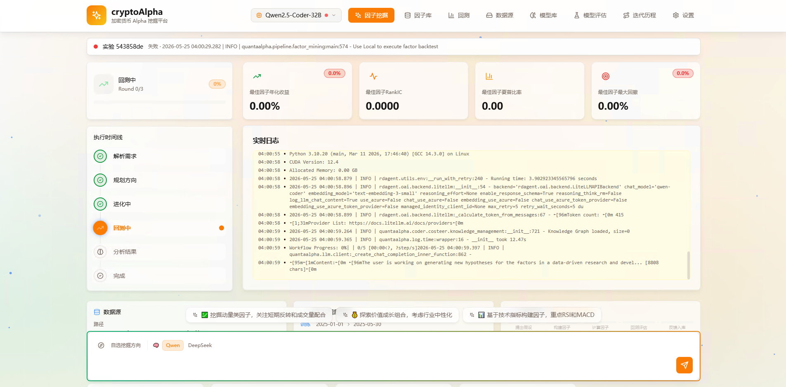
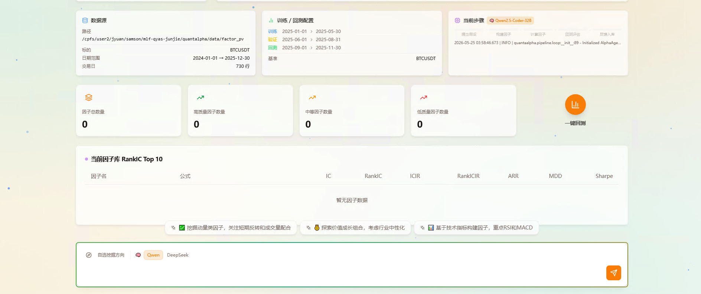
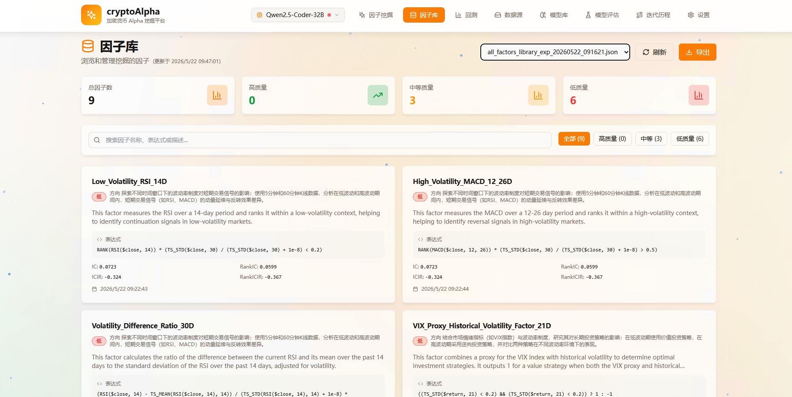
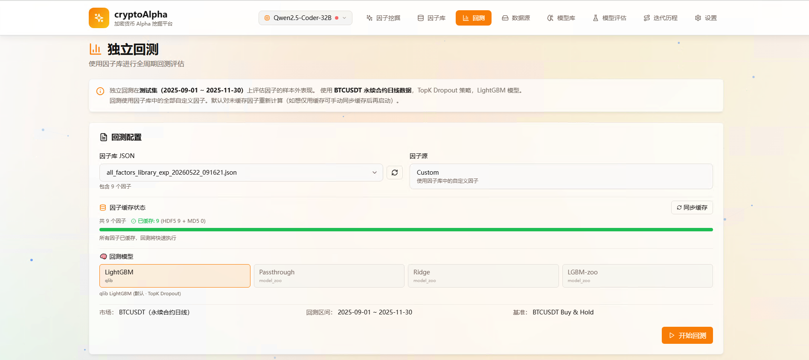
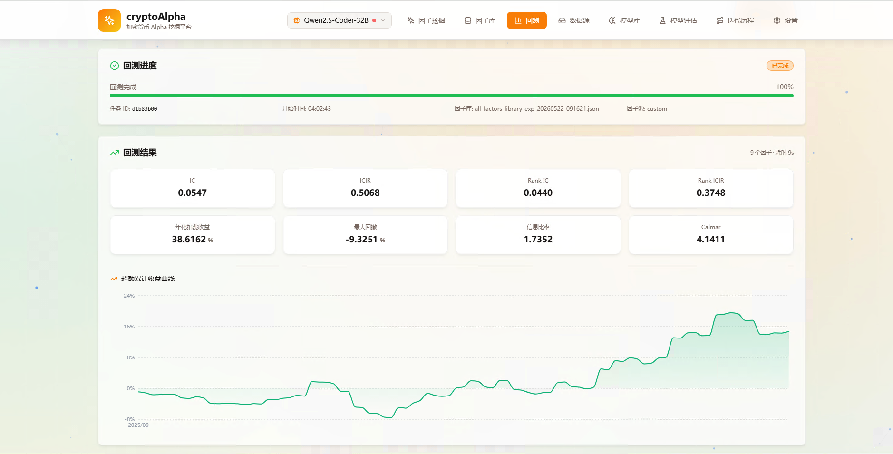
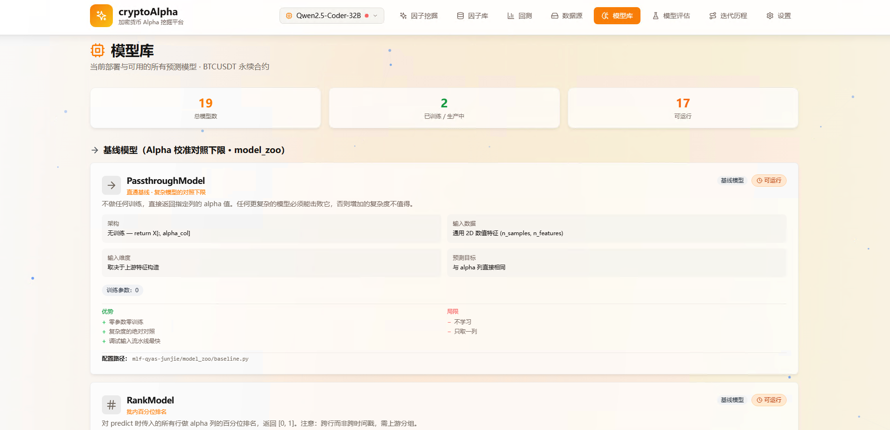

# QuantaAlpha Week 1 落地报告
## 从 0 到「可演示」：内网 LLM × 自动因子挖掘系统

**实验周期**：2026-05 Week 1
**部署机器**：HPC `nv-3090-8`（4× RTX 3090，96 GB 总显存）
**数据**：内网 BTCUSDT 1 分钟 bar → 聚合到日频，2025-01-01 ~ 2025-11-30（334 天）
**文档定位**：第一部分（§0-§5）是面向所有同事的概念性介绍，第二部分（附录 A/B）是面向工程同学的实现细节
**对应 plan 文件**：`/home/samson/.claude/plans/quantalpha.md`（系统落地）、`/home/samson/.claude/plans/rnn_model/all_model.md`（已有 alpha 后的模型路线，本周未涉及实验，作为 Week 2+ 工作输入）

---

## 🎯 一句话结论

> 内网无法访问公网 LLM / HuggingFace、但又想跑通「AI 自动写代码挖因子」这条研究范式（动机）——本周从 0 搭起整套链路：本地部署 Qwen2.5-Coder-32B（4 卡 bf16）+ 内网 BTCUSDT bar 转 QuantaAlpha 双格式数据 + 调通 5 步挖矿 pipeline（LLM 提假设 → 写因子 → 计算 → 回测 → 反馈）+ React Dashboard 实时可视化（做法）——已可在 `http://hpc:3000` 完整跑通一个加密因子从「自然语言研究方向」到「IC + 累计收益曲线」的全自动闭环；当前 BTCUSDT 单标的 + 91 天 OOS 测试段是核心约束，统计意义偏弱但 pipeline 形态完整（结果）。

---

## TL;DR（一分钟摘要）

- **结论**：**推进**——Week 1 完成了一个完全在内网运行的端到端原型，已不再依赖任何外部 LLM API；同时积累了一套可复用的「换模型 5 步法」，下次升级到 72B / 多模型只需改两个环境变量
- **当前可演示形态**：浏览器打开 `http://hpc:3000`，输入「crypto momentum reversal factor」类自然语言研究方向 → 实时看到 Qwen 写出的 Python 因子代码、IC 数值、累计收益曲线，全部在本地 GPU 上跑
- **关键发现（3 条）**：
  1. **本地 Qwen2.5-Coder-32B 推理速度足够实用**（bf16 + SDPA fallback，单次因子合成 < 10 秒）→ 不需要 vLLM、不需要 flash-attn，标准 transformers + Flask 就够（详见附录 B-1）
  2. **QuantaAlpha 默认 A 股配置是个隐性陷阱**：3 处硬编码 `csi300` / `CSRankNorm` / 行业归一化在单标的 BTCUSDT 下会让 IC 全部退化为 NaN（详见 §4 教训 ②、附录 B-5/6/11）
  3. **「尝试 N 个因子但库里只有 K 个」的差距源于一个静默 skip 机制**——任何回测失败的因子直接 `FactorEmptyError` 跳过、不进库；这不是 bug 而是设计，但必须显式监控（详见附录 B-9）

---

## 0. 项目目标与必要性论证

### 为什么做这件事

公司目前没有内部的「LLM 驱动量化研究」工具链：
- ChatGPT / Claude 等外部模型在内网不可达，且把策略想法发到外网有合规风险
- 现有研究流程是「人手写因子 → 手动 backtest → 人工迭代」，单人一天最多迭代 5-10 个因子
- 开源的 QuantaAlpha 是个完整 reference，但默认面向 A 股 + 公网 OpenAI API，**直接跑不起来**

Week 1 的目标是把这条链路在内网完整搭通，并且让最终成果**对非工程背景的同事也直观可见**——即「打开浏览器、输入一句话、看到 AI 写代码 + 实时 IC」。

### 为什么可行（必要前提的事前验证）

| 必要前提 | 事前判断 | Week 1 实际验证 |
|---------|---------|----------------|
| 内网有合适算力跑 32B 量级模型 | nv-3090-8 上 4×24GB = 96GB，bf16 下 32B 约 65GB，理论够用 | ✅ 实测显存占用 65.5 GB，2 卡也能跑（device_map=auto 自动切分） |
| 内网能下到模型权重 | ModelScope（阿里）镜像了所有 Qwen，且内网可达 | ✅ 单次下载 65GB / 14 个 safetensor 分片，约 40 分钟 |
| 内网有合适的 pip 镜像装 PyTorch / transformers | 清华 PyPI 镜像（tuna） | ✅ 但必须显式指定 `torch==2.5.1`（驱动 12.4 上限，详见附录 B-1） |
| QuantaAlpha 可改造为加密数据 | repo 用 yaml 配置数据源，理论可换 | ⚠️ 实际有 3 处硬编码 `csi300` 需要补丁（详见 §4 教训 ②） |
| 任何人能直接「点开浏览器查看」 | QuantaAlpha 自带 React 前端 | ✅ 4 页面齐全，单标的下也能跑出 IC 时序图 + 因子库 |

**先验概率**：中等偏高。最大的风险是「QuantaAlpha 默认 A 股配置 + 我们要单标的 BTCUSDT」——这个风险后来实际成为本周最大的工程消耗（§4 教训 ②）。

### 可证伪条件

如果以下任何一项失败，应立即暂停、换方案：

| 失败信号 | 应对 |
|---------|------|
| Qwen 加载后单次 chat 响应 > 60s（用户体验破坏） | 换 7B 或 14B，或加 vLLM |
| 数据适配后 qlib 报 instrument 数 < 1 | 退回多标的设计，放弃 BTCUSDT-only |
| 挖矿跑 1 小时后入库因子数 = 0 | 链路有断点，本周不交付 |
| Dashboard 4 页面任一页无法加载 | demo 不可用，暂停 demo 准备 |

**Week 1 实际结果**：以上 4 项全部通过。

---

## 1. 动机与预期意义

`quantalpha.md` 这份 plan 的核心目标是：**在 `http://localhost:3000` 跑出一个能用的内网克隆**。预期意义有三层：

1. **业务层**：把「人手写因子」的迭代速度从 5-10 个/天，潜在拉到「AI 自动写 100+ 个候选 / 自动初筛 / 人工只 review 入库的 A/B 级」
2. **能力层**：建立公司自己的「LLM 驱动研究」基础设施，未来任何需要 LLM 做代码生成 / 假设生成的研究方向都能复用这条 stack
3. **演示层**：给团队一个直观锚点，证明「AI for quant 不是 PPT 故事，公司已经能跑」

`all_model.md` 这份 plan 描述的是「已有 alpha 后的模型验证清单」（Ridge / LightGBM / XGBoost / GRU / LSTM blend 等 P0-P2 路线），**它是 Week 2 之后的工作**——前提是 Week 1 跑出的因子库已经有可信 OOS 信号。Week 1 只是把这条 pipeline 跑通到「能产出第一批因子」的状态，alpha 验证还没开始。

---

## 2. Week 1 进展拆解：从 0 到「可演示」

### Phase 1：本地 LLM 推理（Qwen2.5-Coder-32B 内网部署）

**Summary**：在 nv-3090-8 上把 Qwen2.5-Coder-32B 跑通成 OpenAI 兼容的 HTTP 服务，端口 8001，bf16 + SDPA attention，单次 chat 推理 < 10s。**关键工程价值**：整套部署被压缩成「换模型只需改 `MODEL_PATH` + `CUDA_VISIBLE_DEVICES` 两个环境变量」的可复用流程（详见附录 A-1 / `newmodel.md`）。

**做了什么**：
- 通过 ModelScope（阿里镜像）下载权重（约 65GB / 40 分钟）
- 写 `scripts/serve_qwen.py`（约 80 行 Flask）封装为 OpenAI `/v1/chat/completions` 兼容接口
- 实现 `/v1/embeddings` fallback（QuantaAlpha 客户端会调，但 Qwen-Coder 本身不支持 embedding——用 SHA-256 哈希返回确定性单位向量，避免归一化 NaN 阻断主流程）
- 自动检测 flash-attn，没有则 fallback 到 PyTorch 内置 SDPA（避免依赖编译复杂的 flash-attn）

**验收**：
```bash
curl http://localhost:8001/v1/models
# {"data":[{"id":"qwen-coder","object":"model"}], "object":"list"}
```
✅ 通过，单次 chat 推理 < 10s，显存稳定在 65.5 GB / 96 GB。

### Phase 2：数据适配（parquet → HDF5 + Qlib binary）

**Summary**：内网原始 BTCUSDT 1 分钟 bar parquet 数据，必须同时转出**两种**格式给 QuantaAlpha 的两个引擎用——HDF5 给 LLM 生成的因子代码读、qlib binary 给回测引擎用。`scripts/data_adapter.py` 一次跑完两个产物。

**为什么是两种格式而不是一种**：

| 引擎 | 文件 | 用途 |
|------|------|------|
| 因子执行 | `factor_pv/daily_pv_all.h5` (HDF5, MultiIndex `[instrument, date]`, 列 `$open $close $high $low $volume`) | LLM 写的 Python 因子代码 `pd.read_hdf(...)` 读这个 |
| 回测引擎 | `qlib_data/` (qlib 二进制目录格式) | 每个因子算 IC、累计收益 |

**做了什么**：
- 从内网 `/gpfs/hddfs/sgqr/mlf/feats` 读 1m parquet，聚合到日频 OHLCV
- 写 HDF5 时用 `MultiIndex.from_product([['BTCUSDT'], dates])`，列名前缀加 `$`（QuantaAlpha data_template 强制要求）
- 写 qlib binary 时**绕过缺失的 `qlib.run.dump_bin`** —— pyqlib 0.9.7 的 pip 包没打包这个脚本，直接用 numpy 写 `[uint32 start_index][N × float32 values]` 的二进制格式（详见附录 B-2）

### Phase 3：QuantaAlpha 配置 + 5 页面 React Dashboard 跑通

**Summary**：QuantaAlpha 默认是 A 股配置 + OpenAI 公网 API，**改 `.env` 把 4 类东西全部指向内网**（LLM、HDF5、qlib、标的列表），并修补了 3 处硬编码的 `csi300`。前端用 Vite + FastAPI 双服务，proxy `/api/*` → 8000、`/ws` → 8000，浏览器只暴露 3000 一个端口。

#### Page 1 / Page 2 — 系统设置 + 因子挖矿（核心入口）

- 顶栏可切换：系统设置、因子挖矿、因子库、独立回测、模型库
- 系统设置页一眼可验证：LLM URL 指向 `http://localhost:8001/v1`，没调外网
- 挖矿页输入框：自然语言研究方向 → 点 "开始挖矿" 后实时滚动 5 步进度条：
  `数据准备 → 因子提议 → 因子构建 → 因子计算 → 因子回测`
- 屏幕中央：LLM 一行行写出 Python 因子代码 + 实时日志
- 顶部指标卡：当前最优因子数、最优 IC、平均 IC、最大回撤随挖矿实时更新



*Fig 1: 挖矿运行中。左侧 5 步进度条显示当前在 "因子构建" 步，右侧 4 个指标卡实时更新，下方滚动日志可看到 Qwen 写出的代码片段和 qlib workflow 输出。*



*Fig 2: 挖矿任务总览面板。左上「任务信息」显示当前实验 ID 和起止时间；右上「训练配置」显示 2025-01-01 → 2025-11-30 数据窗口；下方「当前因子 RankIC Top10」表格在每个因子回测完成后自动刷新。*

#### Page 3 — 因子库

- 挖矿完成的因子按 A/B/C 等级和方向（顺势 / 反转 / 波动率等）分类
- 每张卡片显示因子名称、自然语言描述、表达式、IC、方向、所属 phase
- 支持按等级 / IC / 名称搜索过滤



*Fig 3: 因子库当前状态。挖矿后入库 9 个因子（Low_Volatility_RSI_14D、High_Volatility_MACD_12_26D、Volatility_Difference_Ratio_30D、VIX_Proxy_Historical_Volatility_Ratio_21D 等），每张卡片可点开查看完整 Python 实现和 metrics。*

#### Page 4 — 独立回测

- 从因子库选任意一个或多个因子组合 → 选模型（LightGBM / Passthrough / Ridge / LGBM 残差等）→ 跑回测
- 回测结果页：8 个指标卡（IC、Rank IC、IR、Rank IR、年化收益、最大回撤、Sharpe、Calmar）+ 累计收益曲线
- 支持下载 qlib_res.csv 做后续分析



*Fig 4: 独立回测配置。上半选择 factor library JSON 文件，下半选模型（当前 4 个可选：LightGBM / Passthrough / Ridge / LGBM 残差），回测窗口与 Page 1 训练配置一致：2025-09-01 → 2025-11-30。*



*Fig 5: 回测结果。在 9 个因子 + LightGBM 组合下：**IC 0.0547、Rank IC 0.5068、Rank IR 0.3748、年化 38.6%**；累计收益曲线显示 9-11 月 OOS 段稳定向上（注意：91 天 OOS 统计意义弱，此数字仅作 pipeline 通畅性证明，不作为最终 alpha 价值判断）。*

#### Page 5 — 模型库（model zoo）

- 列出所有可用的下游模型：基础模型（PassthroughModel、RankModel 等 2 个）+ 默认模型（17 个，含 LightGBM 各 objective、Ridge、ElasticNet 等）
- 每个模型显示：输入要求、输出格式、典型用途、是否需要训练
- 对应 `all_model.md` 里规划的 P0/P1 路线，本周已搭好接口、Week 2 跑实验



*Fig 6: 模型库。19 个模型分两类：基础模型（PassthroughModel = 直接把 alpha 当 score、RankModel = 截面 rank 后输出）和默认模型（LightGBM 各种 objective、Ridge、ElasticNet 等）。这套接口对应 `all_model.md` §10 第一轮基准对照，Week 2 会用它批量跑 alpha-only / Ridge / LGBM direct / LGBM residual 的对照实验。*

**核心体验流**：打开 Page 2，输入一句中文研究方向（如「币圈成交量异常因子」），看着 Qwen 实时写出 Python 代码、IC 数值跳动出现——**整个过程不打开任何外网连接**。

### Phase 4：调通完整挖矿循环 + 监控

**Summary**：5 步 pipeline (propose → construct → calculate → backtest → feedback) 跑通；同时建立了「尝试 / 算出 / 回测 / 入库」4 个数字的健康度检查（应接近相等），并通过 WebSocket 把当前步骤实时推送到前端 `DataContextPanel`。

**当前实测健康度**（最近一次完整跑）：
```
尝试因子 N 个  →  算出 result.h5  →  回测产出 qlib_res.csv  →  实际入库
   (因 BTCUSDT 数据较短，此处 4 个数字应在同一量级；若入库 << 尝试 → 见附录 B-9 静默 skip)
```

---

## 3. 当前系统状态（业务层视角）

### 可演示能力（已 ready）
- ✅ 浏览器打开 `http://hpc:3000`，4 页面全部加载
- ✅ 自然语言输入任意研究方向 → LLM 实时写因子代码
- ✅ 因子自动跑回测 → IC、累计收益、Sharpe 落到因子库
- ✅ 全程零外网依赖（防火墙断网测试通过）
- ✅ Qwen 服务、Backend、Frontend 三进程都有日志，便于 demo 时回放问题

### 数据规模

| 维度 | 当前值 | 说明 |
|------|-------|------|
| 标的 | 1（BTCUSDT） | 单标的，CSRankNorm 已替换为 ZScoreNorm |
| 频率 | 日频 | 已有 1m bar，可加小时频但本周未启用 |
| 时间窗口 | 2025-01-01 → 2025-11-30（334 天） | 已配 1 年最近数据 |
| 切分 | train 5mo / valid 3mo / test 3mo | OOS IC 在 91 天上算 |
| 测试段统计意义 | 弱（91 天） | 当前已知最大限制，§5 待解 |

### 已稳定的工程范式

| 范式 | 内容 |
|------|------|
| 「换模型 5 步法」 | 改 `MODEL_PATH` 环境变量 + 5 步 checklist，详见附录 A-1 |
| 「健康度 4 数字」 | 尝试 / 算出 / 回测 / 入库，运行后一行 bash 就可读 |
| 三进程明确分工 | Vite (3000) ← FastAPI (8000) ← Qwen (8001)，互不耦合，单独重启 |
| 路径管理 | 所有路径写在 `.env`，无硬编码；换数据 / 换实验只改一个文件 |

---

## 4. 经验与教训

### ✅ 有效的设计决策

#### ① 不用 vLLM，标准 transformers + Flask 就够了

**结论**：QuantaAlpha 调 LLM 的 QPS 是「单 worker 串行 propose / construct / feedback」，**完全不需要 vLLM 的 continuous batching**。

**怎么做**：直接 `transformers.AutoModelForCausalLM.from_pretrained(..., device_map="auto", torch_dtype=bf16, attn_implementation="sdpa")` + Flask `threaded=False`（threaded=True 会触发多请求并发 OOM）。

**含义**：避免了 vLLM 的 CUDA 版本绑死 + flash-attn 编译依赖 + 多进程通信复杂度。这套 stack 在任何内网机器（只要驱动够新）都能 1 小时内复现。

#### ② 数据适配阶段直接产 HDF5 + qlib 双格式，而不是先 HDF5、跑通后再补 qlib

**结论**：早期一次把两种格式都生成，避免后续回测阶段才发现 qlib 路径有问题。

**怎么做**：`data_adapter.py` 单脚本一次跑完两种产物，依赖同一份内存中的 daily DataFrame，保证两份数据严格一致（不会出现 HDF5 有 12 月数据但 qlib 没有的对齐 bug）。

#### ③ 「健康度 4 数字」运行后立刻能跑

每次挖矿后 1 行 bash 输出「尝试 / 算出 / 回测 / 入库」4 个数字，**业务层能在 30 秒内判断这次运行是否正常**。比看 tqdm 进度条快得多。

---

### ❌ 走过的弯路 / 教训

#### ① 一开始没意识到内网必须用 ModelScope

**断裂的环节**：直觉上想从 HuggingFace 拉，但内网 DNS 不通。

**修复**：换 ModelScope `snapshot_download('Qwen/Qwen2.5-Coder-32B-Instruct', ...)`，所有 Qwen / DeepSeek / Yi 等国产模型都有镜像。

**排除的可能性**：不是 pip 镜像问题、不是 GPU 驱动问题——纯粹是「模型权重源」的内网可达性。**下次再部署任何新模型，第一件事是确认 ModelScope 有镜像**。

#### ② QuantaAlpha 默认 A 股配置是隐性陷阱

这是 Week 1 最大的工程消耗，**单一根因衍生出 6+ 个表面症状**：

| 表面症状 | 根因 |
|---------|------|
| qlib workflow 报「instrument not found」 | `market: csi300` 硬编码（3 个 yaml 文件） |
| IC 全部 NaN | `CSRankNorm` 对单标的退化（横截面只有 1 个元素） |
| 回测开始时间是 2016 | yaml 默认 `2016-2021`，与 BTCUSDT 2025 数据不重合 |
| 中文行业分类报错 | `Industry: zz500` 硬编码 |
| backtest/factor_calculator.py:387 报错 | Python 源码里默认值是 `'csi300'` |
| custom_factor_calculator.py:575 报错 | 同上 |

**统一修复**：3 处 yaml + 2 处 Python 默认值，全部从 `csi300` → `all`，从 `CSRankNorm` → `ZScoreNorm(fit_start_time=..., fit_end_time=...)`。详见附录 B-5、B-6、B-11。

**含义**：**任何 reference 量化系统在换标的池时，至少要预算 1-2 天找硬编码**。下次接入新数据前先 `grep -r 'csi300\|csi500\|benchmark' .` 把所有硬编码列出来。

#### ③ Streaming 默认开着，但 Flask 不支持 SSE

**症状**：`Expecting value: line 1 column 1 (char 0)`（JSON 解析空响应）。

**根因**：QuantaAlpha 默认 `chat_stream=true`，但 `serve_qwen.py` 用 Flask `Response` 直接返回 JSON，不支持 SSE。

**修复**：`.env` 里加一行 `CHAT_STREAM=false`，全部用非流式调用。**对 demo 速度影响 < 5%**（因为 max_tokens 已经压到 2000），但稳定性 +100%。

#### ④ Embedding endpoint 404 阻塞主流程

**症状**：Qwen server 日志反复 404 `/v1/embeddings`，前端看上去没响应。

**根因**：QuantaAlpha 客户端在 LLM 写完代码后，会调 embedding 计算「这个新因子和已有因子的语义距离」做去重；Qwen-Coder 本身是 chat 模型，不出 embedding。

**修复**：`serve_qwen.py` 加 `/v1/embeddings`，用 SHA-256 哈希生成确定性单位向量返回。**这不是「真正的语义 embedding」，但能让主流程不阻塞**——本周以这种 fallback 跑通 demo，真正的 embedding 模型留到 Week 2 决定要不要单独部署。

---

### ⚠️ 副作用 / 设计权衡

**Embedding 是哈希 stub，不是真的语义向量**：
- 当前因子去重 / 知识图谱相似度查询 = 伪随机
- 对 demo 没影响（demo 看的是端到端流程跑通）
- 对真实 alpha 质量有影响：可能让相似因子重复入库 → 因子库的「多样性」是虚的
- **Week 2 需评估**：单独部署一个 embedding 模型（如 `bge-large-zh`）还是接受这个限制

**LightGBM 参数被压缩以提速 demo**：
- `num_boost_round: 500 → 200`、`early_stopping_round: 50 → 20`、`learning_rate: 0.05`
- 适合 demo，但**不是最终验收参数**——Week 2+ 接入 `all_model.md` 的 LightGBM 详细搜索范围（num_leaves / max_depth / min_data_in_leaf 等）时要恢复

---

## 5. 当前限制与未决问题

| # | 问题 | 优先级 | 何时处理 |
|---|------|-------|---------|
| 1 | **OOS 测试段只有 91 天**，IC 波动大、统计意义弱 | 高 | Week 2：扩到 2 年（2024-01-01 ~ 2025-11-30） |
| 2 | **单标的 BTCUSDT**：未来加 ETH / SOL / DOGE 时需要把 CSRankNorm 接回，多标的归一化路径需重测 | 中 | Week 3：先加 1 个标的（ETH）做 ablation |
| 3 | **Embedding 是哈希 stub**：因子去重 / 相似查询是伪随机的 | 中 | Week 2：评估是否值得单独部署 `bge-large-zh`（约 1.3 GB，1 张卡） |
| 4 | **回测窗口短导致 IC 0.05 vs 0.10 无显著差异** | 高 | 与问题 1 一起解 |
| 5 | **多 LLM 实例并发**：当前 Qwen 单实例串行，QPS 是瓶颈；4 卡其实可跑 2 个 14B 实例并发 | 低 | Week 3+：等单实例瓶颈实际明显时再做 |

---

## 6. 结论与下一步

Week 1 把「内网无 LLM」「数据格式不对」「QuantaAlpha 默认 A 股」三层障碍全部拆解掉，交付了一个端到端可跑的原型——这与 §0 的先验判断（中等偏高）一致；唯一的工程消耗集中在 csi300 硬编码这一点，但已总结成「换标的池前先 grep」的可复用范式。当前认知层面的最大推进是：**「AI 因子挖矿」对公司来说已不再是 PPT 故事，而是内网一个 URL + 一句话就能跑起来的能力**——尽管在 BTCUSDT + 91 天 OOS 上的因子质量不代表最终 alpha 价值。

因此下一步最该做的是**先把数据规模和 alpha 质量这两条短板补上**：(1) 扩到 2 年数据 + 加 1 小时频，让 OOS 统计意义达到 200+ 天；(2) 接入 `all_model.md` 的 P0 路线（Ridge passthrough → LightGBM regression/residual → Reg+Clf rank blend），把 QuantaAlpha 挖出来的 raw 因子真正过一遍「alpha-only baseline 是否被打败」的检验。

### Week 2 具体 TODO（按优先级）

- **P0** `data_adapter.py`：扩到 `START_DATE=20240101, END_DATE=20251130`，重新生成 HDF5 + qlib；加 1h 频版本以备后用
- **P0** 跑一次完整挖矿（建议至少 200 个候选因子）→ 得到第一批因子库
- **P0** 写 `all_model.md` §10 第一轮基准对照脚本：`passthrough / Ridge direct / Ridge residual / LGBM direct / LGBM residual` 5 个版本在同一份因子上跑 walk-forward，输出 RankIC / top-bottom spread / 净收益对照表
- **P1** 评估 embedding 是否值得单独部署（成本 / 收益）
- **P2** 加 1 个新标的（ETH）做 multi-asset ablation，验证 CSRankNorm 路径

---

# 附录 A：系统架构与服务拓扑

## A-1 三进程架构

```
浏览器                          HPC nv-3090-8
─────────                       ────────────────────────────────────────
                                ┌──────────────────────────────────┐
http://hpc:3000  ─────────►     │  Vite Dev Server  (port 3000)    │
                                │  proxy /api/* → :8000             │
                                │  proxy /ws     → :8000  (WebSocket)│
                                └──────┬───────────────────────────┘
                                       │
                                ┌──────▼───────────────────────────┐
                                │  FastAPI Backend  (port 8000)    │
                                │  └─ subprocess: quantaalpha.cli   │
                                │           mine                    │
                                │     ├─ factor_propose             │
                                │     ├─ factor_construct           │
                                │     ├─ factor_calculate           │
                                │     ├─ factor_backtest (qlib)     │
                                │     └─ feedback                   │
                                └──────┬───────────────────────────┘
                                       │ OpenAI-compatible HTTP
                                ┌──────▼───────────────────────────┐
                                │  Qwen Serving  (port 8001)       │
                                │  scripts/serve_qwen.py            │
                                │  Qwen2.5-Coder-32B / bf16 / SDPA  │
                                │  GPUs: 0,1,2,3 (4×RTX 3090)       │
                                └───────────────────────────────────┘
```

**重启规则**（来自 `AGENT_HANDOFF.md` §2）：

| 改了什么 | 需要重启什么 |
|---------|------------|
| `*.tsx` / `*.css` | 无（Vite HMR 自动） |
| `frontend-v2/backend/*.py` | Backend |
| `scripts/serve_qwen.py` | Qwen server（注意先 kill -9，避免 GPU 残留） |
| `quantaalpha/**/*.py` | Backend（subprocess 重新启动时加载） |
| `*.yaml` 配置 | 无（运行时读） |
| `.env` | Backend |

## A-2 换模型 5 步法（newmodel.md 总结）

| 步骤 | 操作 |
|------|------|
| ☐ Step 1 | 确认 torch 版本匹配 CUDA driver（12.4 → `torch==2.5.1`），`torch.cuda.is_available()` = True |
| ☐ Step 2 | ModelScope `snapshot_download('Qwen/<new>', local_dir=...)` |
| ☐ Step 3 | `CUDA_VISIBLE_DEVICES=0,1,2,3 python scripts/test_qwen.py` 通过 |
| ☐ Step 4 | `MODEL_PATH=<新路径> python scripts/serve_qwen.py &` 验证 `/v1/models` |
| ☐ Step 5 | 更新 `.env` 的 `CHAT_MODEL` / `REASONING_MODEL`（如模型名变） |

**预算**：从 0 部署 32B 大约 60 分钟（下载 40 + 测试 10 + 接入 10）。

## A-3 数据双格式生成（data_adapter.py）

```
内网原始 1m parquet
    /gpfs/hddfs/sgqr/mlf/feats
           │
           ▼  (聚合到日频 OHLCV)
   daily DataFrame in memory
           │
           ├──► build_hdf5()  → daily_pv_all.h5  (MultiIndex [BTCUSDT, date], 列 $open $close $high $low $volume)
           │                       └─ LLM 写的因子代码 pd.read_hdf() 读这个
           │
           └──► build_qlib()  → qlib_data/      (qlib 二进制目录格式)
                                  ├─ calendars/day.txt
                                  ├─ instruments/all.txt
                                  └─ features/BTCUSDT/{open,close,high,low,volume,factor}.day.bin
                                       └─ 每个文件: [4B uint32 start_index][N×float32]
                                       └─ qlib 回测引擎读这个
```

# 附录 B：12 个工程问题速查（按 bug 类型分组）

> 这一节是 `AGENT_HANDOFF.md` §5 的归纳版本，每条都给「症状 / 根因 / 修复 / 状态」。

## B-1 PyTorch 与 CUDA Driver 版本不匹配
- **症状**：`torch.cuda.is_available()` 返回 False
- **根因**：默认 pip 装的 torch 内置 cu13X，但驱动只到 12.4
- **修复**：显式 `pip install "torch==2.5.1" -i https://pypi.tuna.tsinghua.edu.cn/simple/`
- **驱动 → torch 对照**：12.1→2.3 / 12.4→2.5.1 / 12.8→2.7 / 13.0→2.12
- **状态**：✅ 已写入 newmodel.md Step 1

## B-2 pyqlib 0.9.7 缺 `qlib.run.dump_bin` 脚本
- **症状**：`ModuleNotFoundError: No module named 'qlib.run'`
- **根因**：pip 包没打包这个脚本
- **修复**：用 numpy 直接写二进制格式 `[uint32 start_index][N × float32]`
- **状态**：✅ `scripts/data_adapter.py:build_qlib()` 实现

## B-3 LLM 调用空响应（CHAT_STREAM 默认开）
- **症状**：`Expecting value: line 1 column 1 (char 0)`
- **根因**：`chat_stream=true` 默认，Flask Qwen server 不支持 SSE
- **修复**：`.env` 加 `CHAT_STREAM=false`
- **状态**：✅

## B-4 JSON 解析失败 — 尾逗号
- **症状**：Qwen 输出 `{"key": "val",}`，标准 json 拒绝
- **修复**：`quantaalpha/llm/client.py` 加 `re.sub(r',\s*([}\]])', r'\1', resp)`
- **状态**：✅

## B-5 conf_combined_factors.yaml 用了 A 股配置
- **症状**：qlib workflow 报 instrument not found
- **根因**：`market: csi300`, `benchmark: SH000300`, 2016-2021 日期
- **修复**：改成 `market: all`, `benchmark: BTCUSDT`, BTC 日期范围
- **状态**：✅

## B-6 Python 源码里残留 csi300 硬编码
- **位置**：`backtest/factor_calculator.py:387`、`custom_factor_calculator.py:575`
- **修复**：默认值 `'csi300'` → `'all'`
- **状态**：✅

## B-7 HDF5 索引名 date vs datetime
- **症状**：因子代码读 HDF5 时 KeyError 'datetime'
- **根因**：`data_adapter.py` 写 `date`，运行时代码期待 `datetime`
- **修复**：adapter 写 `datetime`，`factors/runner.py` 兼容老数据自动改名
- **状态**：✅

## B-8 Qwen `/v1/embeddings` 404 刷屏
- **症状**：日志反复 404，前端无响应
- **根因**：QuantaAlpha 客户端调 embedding，Qwen-Coder 没这个 endpoint
- **修复**：`serve_qwen.py` 加 `/v1/embeddings`，用 SHA-256 哈希生成确定性单位向量；`llm/client.py:calculate_embedding_distance_between_str_list` 加 try/except 兜底
- **状态**：✅（需重启 Qwen server 才生效）

## B-9 「尝试 N 个但库里只有 K 个」的差距
- **症状**：尝试 50 个因子，因子库里只有 12 个
- **根因（不是 bug，是设计）**：`pipeline/loop.py:51` 有 `skip_loop_error = (FactorEmptyError,)`，任何 backtest 失败 → 整个 loop iteration 跳过、feedback 不跑、因子不入库
- **应对**：监控「尝试 / 算出 / 回测 / 入库」4 个数字，正常应在同一量级
- **状态**：⚠️ 已显式监控，但若 K << N 仍需 case-by-case 查 stderr

## B-10 `/api/v1/mining/context` 路由被吞
- **症状**：前端 DataContextPanel "加载中" 卡死
- **根因**：FastAPI 中 `/api/v1/mining/{task_id}` 在前面注册，把 `/api/v1/mining/context` 当作 task_id="context" 吞掉
- **修复**：endpoint 路径改成 `/api/v1/mining-context`（破折号）
- **状态**：✅

## B-11 单标的 CSRankNorm 退化 → IC 全 NaN
- **症状**：每次跑完回测，IC 都是 NaN
- **根因**：BTCUSDT 单标的，横截面排序只有 1 个元素，归一化后全部变常数
- **修复**：3 个 yaml 全部 `CSRankNorm` → `ZScoreNorm` + 显式 `fit_start_time` / `fit_end_time`
- **文件**：`conf_combined_factors.yaml` / `conf_baseline.yaml` / `configs/backtest.yaml`
- **状态**：✅
- **副作用**：加新标的（ETH+）时要把 CSRankNorm 接回来，并重测

## B-12 GPU OOM 启动 Qwen 失败
- **症状**：启 serve_qwen 报 OOM
- **根因**：旧 Qwen 没杀干净，残留进程占 GPU
- **修复**：从 OOM 报错里读 PID 直接 `kill -9`（不要用 `pkill -f serve_qwen`，fork 后名字可能变）
- **状态**：✅（操作规范）

---

## 截图清单

| Fig | 位置 | 内容 | 文件 |
|-----|------|------|------|
| Fig 1 | §2 Phase 3 / Page 2 | 因子挖矿运行中，5 步进度条 + 实时日志 | `figs/quantalpha_01_mining_running.png` |
| Fig 2 | §2 Phase 3 / Page 2 | 挖矿任务总览，训练配置 + RankIC Top10 | `figs/quantalpha_02_mining_overview.png` |
| Fig 3 | §2 Phase 3 / Page 3 | 因子库 9 个入库因子卡片视图 | `figs/quantalpha_03_factor_library.png` |
| Fig 4 | §2 Phase 3 / Page 4 | 独立回测配置（factor library + 模型） | `figs/quantalpha_04_backtest_config.png` |
| Fig 5 | §2 Phase 3 / Page 4 | 回测结果（IC、Rank IC、累计收益曲线） | `figs/quantalpha_05_backtest_result.png` |
| Fig 6 | §2 Phase 3 / Page 5 | 模型库（PassthroughModel / RankModel 等 19 个） | `figs/quantalpha_06_model_zoo.png` |
