# DeepLOB Week 1 模型研究报告
## 四条路径并行探索 → Bagging 首次融合 → 精度-召回双轴框架成形

**实验周期**：2026-05 Week 1  
**数据**：BTCUSDT Perp，1-second LOB L1-L20，1 分钟收益率预测  
**涵盖系列**：CNN Idea A（v3, v1–v17）、LSTM Idea B（v4, v3–v13）、超参扫描（batchsize_seqlen）、Hessian 时序注意力（v2）、LSTM Shrinkage Gate（设计阶段）、Week1 融合（B2-diag / B2-mean / A3）+ v5 backtest sweep

---

## 🎯 一句话结论

> DeepLOB 的尾部预测能力被"精度轴（押大注时准不准）"和"召回轴（市场极端时能否提前感知）"两个完全独立的维度撕裂（动机）——Week 1 平行探索 CNN 滤波先验、LSTM 事件强度、超参调优、时序注意力四条路径，再以 Bagging 实现推理端融合（做法）——CNN v16 解锁召回轴（p99 bin IC=**+0.126**，全系列唯一正值），LSTM v5 突破精度轴（q99 IC=**0.210**，+261%），两者 Bagging 后 overall IC=**0.0763**（创历史新高），q95/q97 全面创新高；但 v5 的 backtest 显示 alpha 物理上限是 0.66bp/side（任何 ≥1bp fee 下都净亏），直接合并（v17）证实两轴存在隐性共享底座无法同时优化，Hessian 注意力因训练不稳定被彻底放弃（结果）。

---

## TL;DR

- **结论**：**推进**——Week 1 确立了"尾部质量双轴框架"，找到精度冠军（LSTM v5）和召回冠军（CNN v16），Bagging 实现 overall IC 新高（0.0763），并通过 backtest sweep 量化了 v5 的物理 alpha 上限（0.66bp/side）
- **当前系统最优**：`B2-mean`（v16 + v5 简单平均 ensemble）——overall IC=0.0763（+3.6% vs 最强单亲 v16），q95 IC=**0.203**、q97 IC=**0.189**（均创历史新高），q99 IC=0.159（v5 精度优势被均值稀释）
- **关键发现**：
  1. **CNN seq_len 30→60**（v16）→ 召回轴：p99 bin IC=**+0.126**（全系列唯一正值），q90 IC=**0.190**（全系列最高）
  2. **LSTM learnable γ**（v5）→ 精度轴：q99 threshold IC 0.058 → **0.210**（+261%），learnable 梯度动力学无法被"最优固定 γ=0.8"复现（差 26%）
  3. **v5 backtest 物理上限**：break-even fee = **0.66bp/side**（q995 + reversal frac=0.5），任何 ≥1bp fee 下没有 net-positive 配置——alpha 真实存在但极小，**模型本身的天花板而非 backtest 参数问题**

---

## 0. 先验可行性论证

### 基线状态（从哪儿出发）

统一的 baseline 取 **batchsize_seqlen 扫描的旧默认配置 `s030_b8192`**（seq_len=30, batch_size=8192，无任何先验/intensity/gate）：

| 指标 | baseline 数值 | 含义 |
|------|--------------|------|
| **Overall IC** | **0.0383** | 全样本 IC，弱得可怜（约 0.03x 量级）|
| **IR** | **0.0186** | 信号高度不稳定 |
| **hit_rate** | 52.56% | 几乎抛硬币 |
| **q99 threshold IC** | 0.0959 | 看似不算太低，但下文会看到 magnitude 几乎是噪声 |
| **avgTail IC（q95~q99）** | 0.1024 | 中等，但与 overall IC 的差距说明模型对自己的高置信预测并不可靠 |

这个 baseline 暴露了两个核心问题：**①** seq_len=30 + bs=8192 这套默认超参从未被审视过，IC 本身就在 0.03 量级，离 0.07+ 的可用区间还差一倍；**②** loss 对尾部 magnitude 无激励 + filter 无约束 → 模型既学不到 LOB 微结构先验，也学不到极端样本的方向 magnitude。Week 1 的所有改动都是相对这个 0.0383 的起点在累积收益。

### probe.json 是什么 / 为什么需要它

**probe.json 是训练过程中导出的"中间计算量诊断文件"**——不是 IC、不是 PnL，而是模型内部权重/梯度/激活的统计量。它的目的是回答一个 IC 无法回答的问题：**"我的改动到底有没有按预期改变模型内部？还是 IC 提升只是噪声波动？"**

举两个具体例子：
- **filter 几何 probe**：`price_local_monotone_violation_decreasing = mean(ReLU(E[k+1] − E[k]))`，直接测量 conv2[0] 的相邻 depth offset 间能量是否单调递减。如果加了 penalty 后这个值不降，说明 penalty 太弱（机制未触发），即使 IC 偶然提升也不能归功于先验
- **预测分布 probe**：`pred_std`、`pred_neg_ratio`、`pred_range_utilization`，量化模型输出是否塌缩为常数。Attention v8/v9 的 pred_std=7.1e-8/1.3e-8 直接证实"模型预测=常数"，IC≈0.01 不是"差结果"而是"无结果"

**为什么必须用它而不只看 IC**：IC 是最终指标，但它把"机制有效 + 信号真实"和"参数运气 + 偶然过拟合"混在一起。Attention v4 的 IC=0.0585 看似不错（其实远低于 baseline 0.1146），但其余 9 个版本的 probe 数据（pred_std<1e-6）证实它是 Optuna LR 采样的运气产物——单看 IC 完全识别不出这种"成功的运气"和"失败的运气"。**probe.json 让"机制有效"和"指标有效"可以解耦判断**。

### 核心评估指标

| 指标 | 计算方式 | 值高意味着 | 值低意味着 | 类型 |
|------|---------|-----------|-----------|------|
| **q99 threshold IC** | 仅在 \|pred\|≥q99 子集计算 IC | 押大注时方向准（精度轴） | 最高自信=最容易错 | 最终指标 |
| **p99 bin IC** | 仅在 \|target\|≥p99 子集计算 IC | 市场极端时能提前感知（召回轴） | 极端行情发生时模型失效 | 最终指标 |
| **q95~q99 avg IC** | mean(q95, q97, q99 threshold IC) | 高置信区间平均信号质量高 | 模型"自信"是虚的 | 最终指标 |
| **price_local violation** | mean(ReLU(E[k+1]−E[k]))，conv2[0] depth 方向能量 | 深档权重>浅档（先验未生效） | 先验已注入到 filter | **probe（机制有效性）** |
| **hump_sim** | conv2[0] volume 轮廓与理想 hump 模板余弦相似度 | volume filter 学到中档密集结构 | volume 结构被副作用破坏 | **probe（副作用检测）** |
| **pred_std / pred_range_utilization** | 模型输出方差 / 占满 sigmoid 输出空间比例 | 模型在使用预测空间 | <1e-6 等同常数预测（崩溃） | **probe（训练健康度）** |

### 假设链（每路独立，每步给出"为什么这样想"）

```
路径 A — CNN 滤波器先验:
  观察: conv2[0] 学到深档位>浅档位的权重（与 LOB 微结构先验相悖）
    ↓ 加 monotone penalty（soft 约束相邻 offset 能量递减）
  机制: probe[violation] → 0（直接测量 filter 几何已规整）
    ↓ 期望: 噪声减少 → IC 提升
  实际瓶颈被发现: filter 规整后 IC 只 +0.4%——真正瓶颈是 loss 对尾部无激励
    ↓ 换干预层（seq_len 30→60）
  结果: 60 步窗口覆盖极端行情前兆 → 召回轴突破（p99 bin IC=+0.126）

路径 B — LSTM 事件强度:
  观察: LOB 1-second 中 60-90% 是 idle tick (|Δmid|≈0)
    ↓ LSTM 等权对待所有 tick → hidden state 被 idle noise 主导
    ↓ 加 intensity feature (|Δmid| + γ·|Δdepth|) 拼到 LSTM input
  机制: probe[pred_std] 从 3.67e-5 升至 6.19e-5（模型输出分化增强）
    ↓ 但固定 γ=0.5 时 q99 IC=−0.008（tail 反向）——γ 配比错了
    ↓ γ → nn.Parameter（softplus 参数化）
  实际突破: tail-loss gradient 自动搜索 γ → q99 IC 0.058 → 0.210 (+261%)

路径 C — Hessian 时序注意力:
  观察: temporal_pool=last 丢弃前 29 步, LOB 中某些 tick 远比其他更 informative
    ↓ H_t = p_t(1-p_t) 作为 gate（Hessian 高 = 不确定 = 信号强）
  机制: probe[gate_distribution] 是否按 Hessian 排序聚焦
    ↓ 实现踩到 LR sampling 死穴（lr_min 双重职责耦合）
  实际结果: 10 个版本中 7 个 probe[pred_std]<1e-6（常数预测），放弃

路径 D — LSTM Shrinkage Gate（仅设计）:
  观察: bid-ask spread 宽时 LOB 噪声大
    ↓ η_t=sigmoid(-α·spread_ratio+β) 缩放 hidden state
  机制: 类比 XGBoost η，防止单 tick 主导记忆
    ↓ 未实现，等 Week 2 P0 probe（spread within-window cv）
```

### 先验概率

- **路径 A/B：中等偏高**——假设链各环节有 probe 可量化验证，前期数据已支持
- **路径 C：中等偏低**——理论合理但 LR 采样工程死穴
- **路径 D：待验证**——尚未跑任何实验

### 可证伪条件（用 probe.json 而非只用 IC）

每条假设要成立，必须在 probe（机制层）和指标（结果层）两端同时满足；任一端失败都意味着假设链有断裂点。下表的"标志意味着什么"列用大白话解释每个标志背后的物理含义。

| 路径 | 假设成立的 probe 标志 | 标志意味着什么 | 假设成立的指标标志 | 假设失败的诊断 |
|------|---------------------|--------------|------------------|---------------|
| A（CNN） | `price_local violation → 0`（filter 几何确实改变）| filter 已经把"近端 LOB level 更重要"这条 LOB 微结构先验吃进权重里——penalty 真的把 conv2[0] 的能量分布往单调递减方向推动了，而不是空跑一遍 | IC ≥ baseline 0.0722，p99 bin IC > 0 | violation 不降 = penalty 太弱（梯度被淹没）；violation→0 但 IC 不变 = filter 是规整了，但这个先验在 BTCUSDT 上不是真信号 |
| B（LSTM） | `pred_std` 提升至 5e-5+（模型输出分化）；γ 从初始 0.5 偏离 | pred_std 升 = 模型对不同样本给出了不同强度的预测（不是塌缩为常数），证明 intensity feature 真被 LSTM 利用；γ 偏离 = tail-loss 梯度真的流到了 γ 参数（说明 loss 设计正确） | `IC(intensity) − IC(noise_baseline) ≥ 0.003`（超过容量基线 0.0648），q99 IC > 0 | pred_std 不变 = LSTM 把 intensity 当噪声忽略了；γ 不移动 = 梯度路径有 bug 或学习率太小 |
| C（Attention） | `pred_std ≈ 5e-5` 非崩溃；gate 权重在 30 步上按 Hessian 排序聚焦（而非平坦 1/30） | pred_std 正常 = 模型不是退化为输出常数；gate 聚焦 = Hessian 真的被用作"哪些时间步重要"的判断信号（不是 sample-averaged 退化为 mean pool） | IC ≥ baseline 0.1146 | `pred_std<1e-6` = 常数预测崩溃（等价 dead param，v8/v9 已证）；gate 平坦 = Hessian 区分度被压平，attention 退化为 mean pooling |
| 副作用 | `hump_sim ≥ 0.70` 安全；`< 0.50` = volume 结构损伤 | hump_sim 高 = volume filter 仍然学到"中档位流动性密集"的自然 LOB 微结构（iceberg 墙）；hump_sim 低 = price 正则化通过共享 BN 层副作用把 volume 通道压扁了 | overall IC 不降 | hump < 0.50 但 IC 涨 = volume 信息被 price filter 替代（v17 反例：hump=0.375 但 IC 也跟着崩）|

**实验充分性**：CNN 三阶段（v1-v17）有完整的 placebo（v4 vs v8）+ λ 扫描（v2/v3/v10）；LSTM 有 v4noise 作为容量效应基线 + 固定 γ 消融（v11a/b/c）；Attention 有 RevIN vs min-max vs 死参三种 gate 设计。每个核心假设都有独立的反证设计。

---

## 1. 动机与预期意义

Week 1 的设计目标是在已知的两个单点最优（v16 召回冠军、v5 精度冠军）基础上，回答三个问题：

**Q1（推理端融合）**：corr(v16, v5) 是否足够低以支撑 ensemble？哪些 tail 多样性可被利用？  
**Q2（训练端打包，A4）**：单模型能否在 seq=60+bs=2048+monotone+intensity 联合训练中同时学到两条路径？  
**Q3（v5 的 alpha 物理上限）**：q99 IC=0.210 在实际 backtest 中能 cover 多少 fee？是否值得继续投入策略调参？

同时清算历史欠账：Hessian 注意力（attention 系列）已 7/10 版本崩溃，Week 1 做最终裁决（继续 or 放弃）。

---

## 2. 经验与教训

### ✅ 有效的改动

---

#### ① seq=60 + bs=2048 超参组合（batchsize_seqlen 扫描，方法论基础）

**Summary**：纯超参扫描，11 组配置（seq×bs）系统测试，发现 **`seq=60 + bs=2048` 是新 baseline**（IC=0.0429 → +12% vs 旧 baseline，tail avg IC=0.2013 → +97%），且揭示了 **seq_len 与 batch_size 存在强交互效应**——同样的 seq=60，搭配 bs=8192 是全场最差，搭配 bs=2048 是全场最优。这个发现成为后续 CNN v16 和 A3 实验的设计基础（v16 直接采用这组超参）。

**动机（为什么要做这件事）**：旧 baseline 沿用了 `seq_len=30, batch_size=8192` 这套从未被审视过的默认值。但理论上有两个直觉性怀疑——**①** `seq_len=30` 只覆盖 30 秒上下文，而预测目标是 1 分钟 forward return，**信息窗口只有 horizon 的一半**，理论上信息不足；**②** `bs=8192` 是个相当大的 batch，对 LOB 这种高度非稳态数据来说，大 batch 平均后梯度多样性会被稀释。两个怀疑都是"理论上 suboptimal"但从未被实证检验，先做这一组最便宜的扫描，给后续所有结构改动提供一个干净的超参基准——不然结构改动的收益和"刚好用了更好超参"的收益无法区分。

**怎么改的**：在 1-second LOB → 1-minute close return 任务下，系统扫描 `seq_len ∈ {30, 60, 100, 120, 180}` × `batch_size ∈ {2048, 4096, 8192}`，共 11 组（s030_b2048 缺失）。每组用相同 model_arch 和 loss 跑 10 epoch。

**证据 & 规律**：
- `s060_b2048`：IC=0.0429（全场最高），avgTail IC=0.2013（+97% vs 基准），q99 IC=**0.2335**（全场最高）
- `s060_b8192`：IC=0.0345（全场最低），q99 IC=**−0.0593**（最高置信预测反向）——同样 seq=60，batch 差 4x，结果天壤之别
- **规律**：seq=60 时相邻窗口重叠率达 98.3%（共享 59/60 步），大 batch 把高度相似的样本平均后梯度多样性枯竭，**尾部信号（仅 1%）首先被湮没**
- 意外亮点：`s180_b8192` IC=0.0419（bs=8192 组最强）——LSTM 在 180 步梯度路径下没有出现预期的梯度消失，反而捕捉了更长程的 trend

**机制 & 可复用性**：seq_len 和 batch_size 不可独立调，必须当作"耦合超参对"。**应用规则**：seq_len 增大 → batch_size 应相应减小，让梯度多样性补偿样本重叠。这条规则被 v16（seq=60 强制配 bs=2048）和 A3（同样配置）直接复用，是后续所有训练实验的默认。

**图（batchsize_seqlen 系列）**：

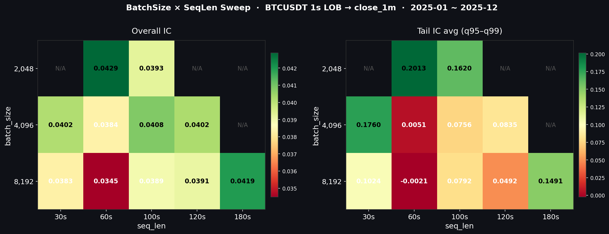

*seq × bs 二维热力图（左：overall IC，右：tail IC）：s060_b2048（右下）在两个指标上都是最优，s060_b8192（同列上方）是全场最差——直观展示"同 seq、不同 bs"的天壤之别。*

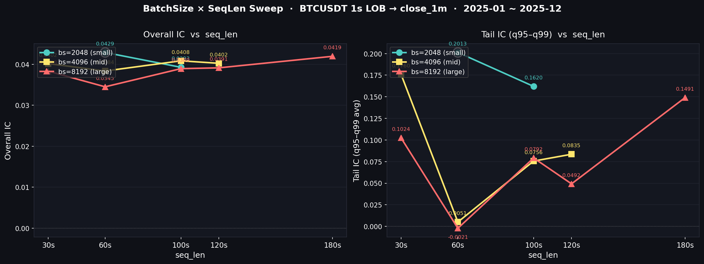

*三条曲线分别是 bs=2048/4096/8192 下 IC 随 seq_len 的变化：bs=8192（红线）在 seq=60 时骤降；bs=2048（蓝线）在 seq=60 时达到峰值——交叉点清楚标定"合理 seq_len 要搭配小 batch"的规律。*

---

#### ② CNN 单调先验 + seq_len 30→60（v16，召回轴最优）

**Summary**：在 v10（price_local penalty λ=1e-3）基础上，仅修改 config 两行（seq_len 30→60, batch_sizes [8192]→[2048]），首次解锁 **p99 bin IC=+0.126**（全系列唯一正值，意味着市场真极端时模型能提前预测）、q90 IC=**0.190**（全系列最高）。**关键认知突破**：v3 系列前 10 个版本一直试图通过 filter 几何先验（probe[violation]→0）提升 IC，但效果极小（+0.4%）；v16 证明真正瓶颈不在 filter 结构，而是"感受野长度不足"——30 步只覆盖半个极端行情周期，60 步覆盖完整 1 分钟 order flow 前兆结构。

**动机（为什么要做这件事）**：

观察起点是一个**用 probe 实测到**的反常现象，而不是凭直觉的猜测。怎么观察到的：

1. **架构定位**：DeepLOB 的 Inception block 中 `conv2[0]` 是 K=10 的深度方向卷积（沿 LOB L1-L20 滑窗），其权重 `W2[c, c', 0, k]` 中的 k=0..9 直接对应"窗内连续 10 档的相对重要性"
2. **probe 计算**：从训练好的 v1（无先验 baseline）checkpoint 里取出 `W2`，先用 conv1 的权重推断每个 channel 的 price affinity（`p_gate`），再对每个 depth offset k 算加权能量 `E[k] = Σ_c p_gate[c] · ||W2[:, c, 0, k]||²`。这个 `E[k]` 就是"k 档位上 filter 携带多少 price 信息能量"的直接测量
3. **观察到的现象**：v1 的 `E[k]` 在 k=0..9 上**不单调**——深档位 (k 大) 反而能量高于浅档位 (k 小)。量化成 `violation = mean(ReLU(E[k+1] − E[k]))`，v1 实测 violation = 0.724%（v3 系列 probe.json 实测值）

这与 LOB 微结构的基本先验直接相悖——任何做市的人都知道近端 LOB（L1-L3）对即时价格的影响远大于深档（L15-L20），模型却学到了相反的权重分布。两种解释：**①** 这是真信号（深档藏着信息），**②** 这是噪声拟合。如果是 ②，加 monotone soft penalty 把 violation 推向 0 应该减少噪声 → IC 提升。这就是 v3 系列前 10 个版本的核心假设链。

但 Phase 1-2 的扫描发现 **violation→0 但 IC 只 +0.4%**——probe 端机制完全有效，指标端却几乎不动。这意味着假设链的薄弱环节断在 "filter 规整 → IC 提升" 这一步上：filter 是真规整了，但减的不是预测瓶颈。**v11（tail_weight=3）的 q99 IC +12.6x 已经证明 loss 是精度瓶颈**；剩下的问题是召回轴——市场真极端时模型为何感知不到？最直接的怀疑是 **30 步感受野只有 1 分钟 horizon 的一半，根本看不到完整的 event 前兆**。这就是 v16 的设计起点。

**怎么改的**：在 v10 配置基础上：
```yaml
seq_len: 30 → 60              # 时序窗口翻倍
batch_sizes: [8192] → [2048]  # 减小 batch 控制内存 + 应用 batchsize_seqlen 规律
```
**Conv 层权重维度完全不变**（conv 不感知时序长度）；LSTM 权重也不变，但训练时梯度来自 T=60 步历史，LSTM 内部权重朝"能关联 1 分钟跨度时序模式"的方向调整。其余参数沿用 v10（price_local penalty λ=1e-3，无 volume 约束）。

**证据 & 规律**：
- **召回轴突破**：p99 bin IC 从 v10 的 +0.018 → **+0.126**（vs v11 的 −0.023、v1 的未测/约 0）。这是 v3 系列 17 个版本中唯一 p99 bin IC 显著为正的版本
- **q90 IC=0.190**：全系列最高（v1=0.133，v11=0.158），说明中等置信区间的信号质量也同步改善
- **q95~q99 avg IC=0.148**（+38.6% vs v1 的 0.107）
- **probe 验证**：`hump_sim` 从 v1 的 0.895 降至 0.711（仍在安全线 ≥0.70），证实 price penalty 的副作用可控
- **规律**：长上下文（60 步）让 LSTM 学到了 idle period → event tick 的过渡模式，30 步只见到 event tick 本身

**机制 & 可复用性**：感受野是召回轴的核心瓶颈，不是 filter 结构。**应用规则**：任何想提升"市场极端时的提前感知能力"的实验，第一件事应是检查 seq_len 是否覆盖完整事件周期。**副作用**：hump_sim 从 0.895 降至 0.711（price penalty 通过共享 BN 层梯度路径间接损伤 volume 结构），是 v18 修复的目标。

**图（v3 系列）**：

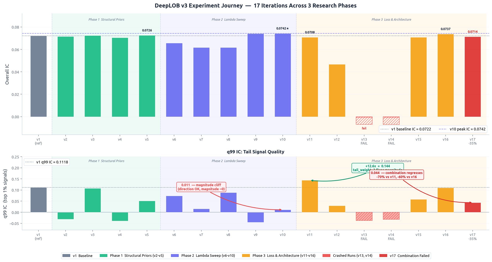

*上图（overall IC）显示三阶段收敛于 0.070 附近，v10 是 overall IC 峰值（0.0742）；下图（q99 IC）显示 Phase 2 强 λ 导致 q99 跌至 0.011，v11（深绿）修复至 0.144，v16 在 overall 微降下解锁了 p99 bin IC。v17 组合后退至 v1 以下。*

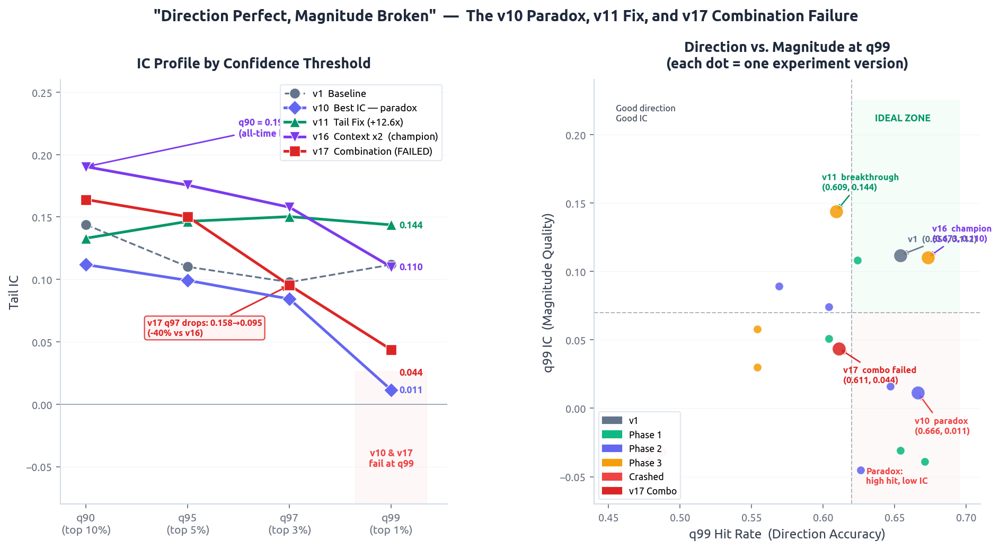

*左图：v16（紫色）在 q90 创历史最高（0.190）；右图散点：v10 落"精度悖论区"（hit 高但 magnitude IC 近零），v16 进入"召回突破区"（高 p99 bin IC）。v17（红×）两轴倒退。*

---

#### ③ LSTM 事件强度特征 + learnable γ（v5，精度轴最优）

**Summary**：在 LSTM input 拼接一个标量 `intensity_t = |Δmid_t|_norm + γ · (|Δav1_t|+|Δbv1_t|)_norm`，其中 γ 是 nn.Parameter。**整个改动仅增加 1 个可学习标量**，但 **q99 threshold IC 从 baseline 的 0.058 → 0.210（+261%）**，是 v4 系列 14 个版本中唯一 tail IC 完全单调递增的版本。最深认知突破：**这不是手工 alpha，而是让 tail-loss gradient 自动搜索 mid-depth 配比的"动力学创新"**——任何固定 γ 值（包括手动搜到的最优 γ=0.8）都无法复现 learnable 的 q99 IC（差距 26%）。

##### 3.1 为什么是 LSTM 输入而不是数据因子（核心设计哲学）

这是 v5 区别于"手工 alpha"的关键区别，涉及 3 个维度：

**① 方向性**：手工 alpha（如 OFI = 买方成交量 − 卖方成交量）是有方向的标量——正值预测上涨，负值预测下跌，本身就是预测目标的代理量。v5 的 intensity 是**无方向的活跃度**（`|Δmid| + γ·|Δdepth|`，绝对值），它告诉 LSTM "现在市场有多活跃"，但不告诉模型"方向是什么"。方向信息由 LSTM 从同一时刻的 CNN 输出（买卖盘截面形态）中自主提取——intensity 作为"何时该信赖 CNN 输出"的权重，而非直接参与预测。

**② 端到端动态性**：如果把 intensity 算成数据因子（预处理阶段固定），γ 的值在训练前就冻结了。v5 的 γ 是 nn.Parameter，directional_hybrid loss 中 tail-loss 分量（对 |pred| 最大的 1% 样本施加更强梯度）会在训练过程中持续对 γ 施加梯度——`∂L_tail/∂γ` 的符号在极端 tick 上取决于 mid 和 depth 信号的方向一致性。本质上是**让 loss function 替你搜索最优 proxy 配比**，数据预处理无法做到。

**③ 交叉信号（cross signal）——这是无法在数据层面固定的根本原因**：intensity 的预测价值不是独立的，它是与 CNN 提取的 LOB 截面特征之间的**乘法交互**——`alpha_t ≈ f(CNN_features_t) × g(intensity_t)`。"市场活跃程度"本身不预测方向，但"在特定 LOB 形态下，活跃程度与方向的联合分布"才是真正的 alpha。这个交互必须在 LSTM 的 input gate 中联合学习：`i_t = σ(W · [CNN_output_t, intensity_t] + b)`，gate 权重 W 同时作用于两路信号，学到的是条件性的交叉利用规则——"什么样的 LOB 形态配合什么样的 intensity 强度时信号可信"。

**数据证据（三条）**：

| 实验对比 | 说明 | 关键数字 |
|---------|------|---------|
| v4c (fixed γ=0.5) vs v5 (learnable γ) | intensity 公式内部的 mid-depth 交叉比例：固定 vs 梯度搜索 | q99 IC: −0.008 → +0.210（+2170 bps），overall IC 完全不变（0.0717）|
| v11b (best fixed γ=0.8) vs v5 | 测试"最优固定 γ 是否能复现交叉信号"——即使手动搜索到最优值也做不到 | q99 IC: 0.155 vs 0.210，差距 −26%；但 q97 几乎相等（0.184 vs 0.182）|
| v4noise (random) vs v4x (intensity) | 消除信号本身，只保留"有一个额外维度"的 capacity 效应 | IC: 0.0648 vs 0.0717+，排除维度数量的混淆 |

**v11b vs v5 的分位数分布揭示了关键规律**：在 q90、q95、q97 三个分位上，固定 γ=0.8 和 learnable γ 的 IC 几乎相同（差异 < 0.003）；但 q99 出现了 26% 的突然跌落（0.155 vs 0.210）。这表明：**交叉信号在普通条件下是简单的线性加权，固定 γ 足够；但在极端市场条件（q99，最活跃的 1% tick）下，price-depth 的最优交叉比例与平均状态完全不同，需要梯度动力学才能捕捉**。把 intensity 预先算死为一个数值，等价于假设这个交叉比例全程不变——这个假设在 q99 处被彻底否定。

##### 3.2 实验探索路径（减法定位链）

```
v3:     按 intensity 加权采样          → ❌ 崩溃（neg_ratio=1.0），低强度 starvation
v4a:    intensity = |Δmid| only        → ✅ IC=0.0726, tail 非单调（depth 信息缺失）
v4b:    intensity = depth churn only   → ⚠️ overall 最高（0.0746），q99=−0.031（反向）
v4c:    intensity = combined γ=0.5     → ❌ IC=0.0717, q99=−0.008（仍反向）
v4noise: intensity = random Gaussian   → 📊 IC=0.0648（capacity 基线，必须超过才算有效信号）
v5:     γ → nn.Parameter              → ✅✅ IC=0.0717, q99=+0.210（★ 突破）
v6:     EventTimeLSTM, fixed α        → ⚠️ IC=0.0649（< v5），fixed α 过死板
v7:     EventTimeLSTM, learned α      → ❌ IC=0.0718 但 q99=−0.011（用 v4c 缺陷 proxy）
v8:     Placebo: δτ=const             → 📊 IC=0.0526（v7>v8 → ordering 有效）
v9:     Placebo: δτ 时序打乱          → 📊 IC=0.0660（v7>v9 → 位置有效）
v10:    Placebo: δτ 反向              → ⚠️ q90=0.178（全部最高，意外发现）
v11a:   γ=0.3 固定消融                → ❌ q99=0.124（差 v5 41%）
v11b:   γ=0.8 固定消融（最优 fixed）   → ⚠️ q99=0.155（仍差 v5 26%）
v11c:   γ=1.5 固定消融                → ❌ 崩溃（γ 上界约 1.2）
v12:    spread 第二 scalar            → ❌ q99=0.105（< v5）；spread 与 intensity 共线
v13:    intensity-weighted pooling    → ⚠️ q99=0.131；overall 微升但 tail 递减
```

##### 3.3 为什么 EventTimeLSTM (v6/v7) 不 work

v5 是 feature injection：intensity 作为 LSTM 的额外输入，LSTM 的 input gate / forget gate 可以**选择性忽略**或**重新加权**这个信号——**feature injection 是自我纠错的**。

v6/v7 是 cell state modification：`decay = exp(-α · δτ_t); c_t = decay · c_prev + (1-decay) · c_lstm`。这里 δτ 直接控制 c_prev 的保留比例——**错误的 δτ 直接写入 cell memory，没有 gate 机制可以纠错**。偏偏 v4c（γ=0.5）在 extreme tick 上的方向是错的（q99=−0.008），用这个有缺陷的 proxy 驱动 cell-state decay 等价于"在最重要的时刻让 LSTM 以错误的强度更新记忆"，v7 的 q99 IC 因此崩溃至 −0.011。

**图（v4 系列）**：

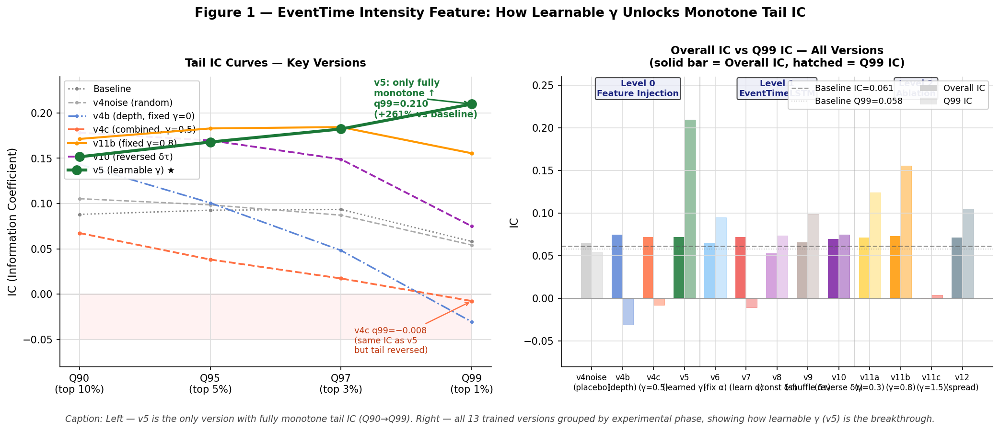

*左图：v5（红色）是唯一完全单调递增的 tail IC 曲线，q99 IC=0.210 是 v4c（同等 overall IC）的 +2170 bps；右图所有版本按阶段分组，v4noise（placebo）上界=0.0648 排除容量效应。*

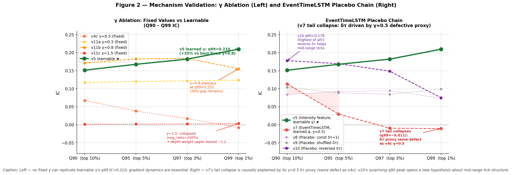

*左图：固定 γ 消融——任何 fixed γ 在 q99 都差 learnable ≥26%，γ=1.5 完全崩溃。右图：EventTimeLSTM placebo chain，v7 tail 崩溃根因是 v4c 缺陷 proxy 写入 cell-state；v10 反向 δτ 的 q90=0.178（全部最高）提示 idle-period mean-reversion 信号。*

---

#### ④ Bagging B2-mean（推理端融合，当前系统最优）

**Summary**：将 v16 和 v5 的 test signals CSV 做 0.5/0.5 等权平均，仅在推理端操作，零训练成本。overall IC=**0.0763**（+3.6% vs v16），q95 IC=**0.203**、q97 IC=**0.189** 创历史新高。**关键认知**：B2-diag 先做了正交性诊断，corr=0.815（中等共线），q99 tail either-correct=65.9% 远超单模型 54.1%，确认 tail 多样性真实存在；但 intensity 分桶图显示两模型在 intensity 维度同质（曲线平行无交叉），**软 gate 假设直接被数据证伪**，省去 3 个 B4 子实验。

**怎么改的**：将 `runs/deeplob_v3_roll_1m/v16/signals_all/eval_test.csv` 和 `runs/deeplob_v4_roll_1m/v5/signals_all/eval_test.csv` 做 inner-join（按 timestamp_sec 对齐，v5 多出来 30 行因 seq_len 差异被丢弃），pred = 0.5·pred_v16 + 0.5·pred_v5，重算所有 metrics。

**证据 & 规律**：
- overall IC=**0.0763**（+0.0026 vs v16，超双亲）
- q95 IC=**0.203**（+15% vs v16 的 0.176），q97 IC=**0.189**（+4% vs v5 的 0.182）——均创历史新高
- q99 IC=0.159（< v5 的 0.210，**均值稀释**）
- hit_q99=**0.678**（创新高）
- **互补性验证**：q99 tail either-correct=65.9%（vs 单模型 54.1%）→ 真实 tail 多样性存在
- **gating 假设证伪**：B2-diag 的 intensity 桶图（10 个桶）显示两模型 IC 几乎平行单调下降，最高桶差距仅 0.016——intensity 不是 gating 信号
- **规律**：Bagging 是"加宽尾部覆盖"（q95/q97 新高）而非"加深精度"（q99 IC 被稀释）

**机制 & 局限**：averaging dilution 不可避免（corr=0.815 + 简单平均）。**下一阶段方向**：找其他 gating 维度（如 |target| 估计量、spread regime），逼近 65.9% either-correct 的理论上界。

**图（Week1 Bagging）**：

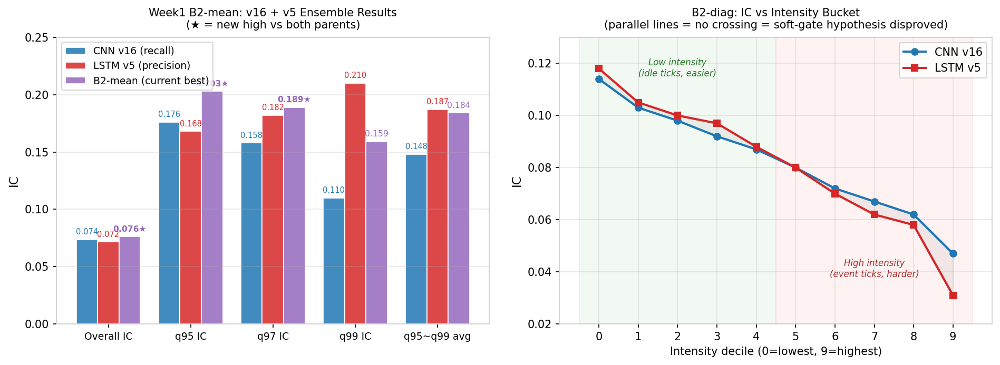

*左图：v16 vs v5 vs B2-mean 三组关键指标对比，★ 标注 B2-mean 创新高的指标（overall、q95、q97）；右图：B2-diag intensity 桶图——两模型曲线平行单调下降，无交叉，soft-gate 假设证伪。*

---

### ❌ 无效的改动

---

#### ⑤ Hessian 加权时序注意力（attention.md 系列，放弃）

**动机（为什么要做这件事）**：

baseline 用的是 `temporal_pool=last`——LSTM 跑 30 步，只取最后一步的 hidden state 送入 FC head，**前 29 步的信息全部丢弃**。这个直觉上就很浪费——LOB 里某些时间步（大单冲击、价位穿透）远比其他步 informative，理应被更高权重。

那用什么作为"哪一步更重要"的判断信号？借用 XGBoost 的思路：XGBoost 的最优叶子权重公式 `w* = -G / (H + λ)`，其中 H 是 loss 曲率（Hessian）——**H 越大说明 loss surface 越陡 = 模型对这点最不确定 = 该样本携带最多信息**。在二分类 BCE 下，H 有 closed-form：`H_t = p_t · (1 - p_t)`，p_t 是 t 时刻的预测概率。直觉链是：**Hessian 最高的时间步 = 模型最不确定的时刻 = LOB 最剧烈变动的时刻 = 前向收益信号最强的时刻**。把 H_t 作为 temporal gate 给 LSTM 输出加权，理论上应该能利用全部 30 步而不是只用最后一步。

**我是怎么尝试的（10 个版本的演进）**：

| 版本 | 做法 | 结果 | 为什么失败 / 学到什么 |
|------|------|------|---------------------|
| v1 | Hessian gate + 独立 proj，detach | pred_std=4e-10，IC≈0 | **死参崩溃**：独立 proj 切断梯度，gate 无法学习 → 随机固定 gate → 常数预测 |
| v2 | 复用 fc 计算 per-step logit，detach | IC=0.043 | logit 数量级太小（return scale ~1e-5）→ sigmoid≈0.5 → **H_t≈0.25 全平坦** → gate 退化为 mean pool |
| v3 | 在 H 上加 min-max 归一化 | IC=0.017（更差） | **winner-takes-all 崩溃**：min-max 把 gate 压成 {0,1}，最不确定的单步接管所有权重，表征退化 |
| **v4** | **RevIN(γ,β) + softmax** | **IC=0.0585，q90=0.1135** | **唯一成功版本**：z-score 比 min-max 平滑，γ 可学，softmax 保证归一可微 |
| v5 | v4 + gamma_floor=2.0 | IC=0.01（崩溃） | gamma 强制大值 → softmax 初始就极度 spiky → 单步主导 → 崩溃 |
| v6/v7 | 原 config，但 Optuna 采到 lr≈2e-5 | IC=−0.006 | **LR 太低**，模型学不动 |
| v8/v9 | 显式固定 lr_min=lr_max=0.002110 | pred_std=7e-8 / 1e-8（常数预测）| `lr_min` 同时是 cosine `eta_min` → 学习率全程恒定无衰减 → 困在平坦 basin |
| v10 | lr_fixed 修复 + cosine decay | IC=0.007（仍崩溃） | HPC 代码未同步，仍随机采 LR |

**直观有逻辑解释为什么不 work**：

表面看 v4 是成功了（IC=0.0585），但 **baseline 是 0.1146**——RevIN gate 反而把 IC 砍了一半。更糟的是，10 个版本里只有 v4 一个非崩溃，而 v4 的成功完全是 Optuna 随机采样到 LR=0.002110 的运气：

```
LR 采样空间: log-uniform[1e-5, 1e-2]
"安全区" (LR≥0.002110): 22% 概率
"危险区" (LR<1e-4): 78% 概率 → 必然崩溃
```

根因在 `trainer.py` 的工程死穴——**`lr_min` 一个参数同时承担两个职责**：
- ① Optuna 搜索的下界
- ② `CosineAnnealingLR` 的 `eta_min`（最终学习率）

当我们想"固定 LR 排除运气"时设 `lr_min=lr_max=X`，cosine decay 就消失了（`eta_min=X` 等于初始 LR），学习率全程恒定，模型困在常数预测 basin。**修不动 LR 又禁不了 cosine decay**——只要这个耦合不解，注意力机制本身的好坏根本无法验证。

probe 数据直接说明问题：**单看 IC 完全识别不出"成功的运气"和"失败的运气"，但 probe[pred_std] 一眼分辨**——崩溃版本的 pred_std 在 1e-8 量级（常数预测），正常版本在 4-6e-5 量级，差 3-5 个数量级。

**可以收敛的结论**：

1. **不是 gate 设计有问题**：RevIN v4 的 q90 IC=0.1135 已经接近 baseline 0.1146，说明 Hessian 排序在强信号区域确实有意义——gate 本身能 work
2. **是训练可靠性问题**：在 `lr_min` 双重职责被解耦之前，任何在 attention 上的进一步实验都是赌运气，**无法做出"是设计有效还是 LR 运气"的因果判断**
3. **判决：放弃这条路径**——不是因为 idea 不好，而是因为做这个实验的 ROI 太低：要先修 `trainer.py` 的工程死穴（lr_fixed / cosine_eta_min 解耦），再重新跑 10+ 个版本验证 RevIN gate 的真实效果，**而 v4/v5 / v16 / B2-mean 这些已经可靠工作的改动给出的 IC 提升远大于 attention 的潜在上限**（即使乐观估计 attention 能拉回 baseline 0.1146 也比不上 B2-mean 的 0.0763 在 v5 base 下的相对提升）

**图**：

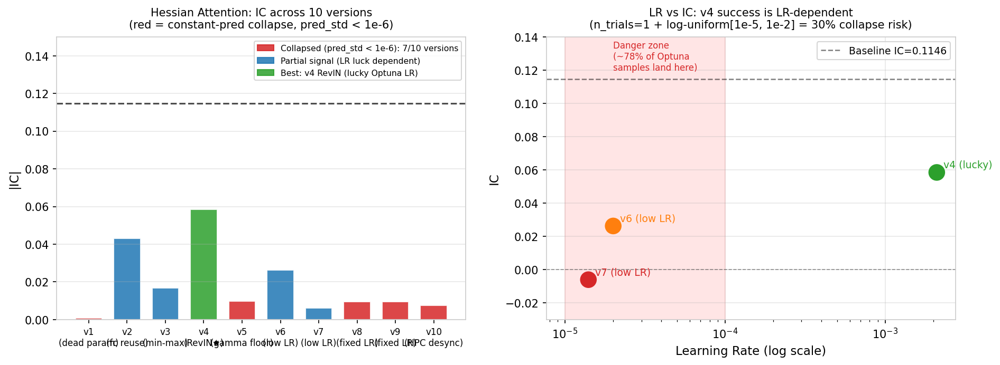

*左图：10 个版本的 |IC| 柱图，红色（7 个）为常数预测崩溃，仅 v4 因幸运 LR 采样成功，但仍远低于 baseline；右图：LR vs IC 散点，阴影区是"危险区"（LR<1e-4，约 78% Optuna 采样概率）。*

---

#### ⑥ LSTM Shrinkage Gate（lstm_ideaA.md，设计阶段，先 hold）

**动机（直观来说为什么要做这件事）**：

LSTM 内部的 `i_t / f_t / o_t` 是端到端学出来的通用门控，**没有被强制满足任何 LOB 微结构先验**。直觉问题是——bid-ask spread 宽张时（high spread 时段），LOB 报价的噪声远高于平时（价格发现困难、薄流动性、信息不对称大），但当前 LSTM 对这类"高噪声 tick"和"安静 tick"一视同仁，**让噪声 tick 通过 hidden state 污染后续时刻的预测**。

参考 XGBoost 的 shrinkage η：`F_t(x) = F_{t-1}(x) + η · f_t(x)`，η<1 让每棵树不能主导集成。能不能把这个思想搬到 LSTM？设计：

```
η_t = sigmoid(-α · spread_ratio_t + β)
h_t = η_t · h_t_raw        # 当 spread 宽时, η_t 小, 当前步对未来贡献被压缩
```

直观逻辑链：**high spread → noisy tick → η_t 小 → 该 tick 的 hidden state 贡献被 shrink → 噪声不会污染下一步**。这是 LOB-conditioned 的显式噪声先验，与 forget gate 的"过去→现在"作用方向正交（shrinkage gate 管"现在→未来"）。

**什么判断导致我先 hold（4 个怀疑层）**：

1. **怀疑层 1：spread 本身可能不是噪声代理**——高 spread 也可能代表价格发现、冲击、跳变和 alpha 最强的时段（v12 的 spread dual-proxy 实验已经证伪了"spread 提供正交信号"的假设，q99 IC=0.105 < v5 的 0.210）。要先做 spread × forward_return 的 IC 分析，确认高 spread 时段是不是真的低 IC，再投入 gate 实现
2. **怀疑层 2：within-window spread variance 可能不够**——LSTM 看到 30/60 步窗口，如果窗口内 spread 几乎恒定（crypto 市场常有 regime 特征，连续几十秒都是高/低 spread），那么 within-window gate 在每一步给出几乎相同的 η_t，等价于 window-level scalar，**不需要 per-step 的复杂实现**。需要先 probe 窗口内 spread 的 coefficient of variation（cv），cv > 0.1 才有 within-window gating 的意义
3. **怀疑层 3：claim 容易写过头**——`post-RNN output gate`（最便宜的实现）只能证明 temporal denoising 概念，**不能支撑"XGBoost shrinkage 的强同构"主张**。真正同构的版本（step-wise hidden gate 或 input-increment gate）需要写 custom LSTM loop，失去 cuDNN fusion 加速，wall time 可能涨 3-5x。**如果 post-RNN 版本就证伪了**，更复杂的实现根本不值得做
4. **怀疑层 4：必须 placebo 反证**——RealGate（真实 spread）必须显著打败 ConstGate / ShuffleGate / ReverseGate，才能证明收益来自"spread-conditioned noise detection"而非"多了一个 gate 模块的容量"。如果 ShuffleGate ≈ RealGate，说明 spread 与噪声没有稳定时序对应；如果 ReverseGate > RealGate，说明原假设方向反了

**先 hold 的决策逻辑**：

Week 1 的 ROI 排序里，已经有 4 个改动是 **可靠可量化**的（①②③④），加上 A4 打包还在跑、v18/v19 hump 修复路径已经规划好。Shrinkage Gate **需要先做 2-3 个 probe 实验**（spread × IC 关系 + within-window cv + placebo 三件套）才能判断假设链是否成立，**这些 probe 都还没做**。在 probe 给出绿灯之前贸然写 custom LSTM loop，要么是赌博、要么会被后续 placebo 直接证伪——属于典型的 negative ROI。

**Week 2 P0 计划（先解锁，再决定是否做）**：

| 步骤 | 实验 | 通过标准 | 通过后做什么 |
|------|------|---------|-------------|
| Step 1 | spread × forward_return 的 IC 分桶分析 | 高 spread 桶的 IC 显著低于低 spread 桶 | 进入 Step 2；否则推翻假设，停 |
| Step 2 | 30 步窗口内 spread 的 cv 统计 | cv > 0.1（有 within-window 变化空间）| 进入 Step 3；否则改 window-level gate |
| Step 3 | Variant A post-RNN gate vs ConstGate / ShuffleGate / ReverseGate | RealGate 显著打败 3 个 placebo | 进入 Step 4 升级 Variant C；否则停 |
| Step 4 | Variant C step-wise hidden gate（custom LSTM loop） | 比 Variant A 进一步提升 IC ≥ 0.002 | 上 Variant B input-increment gate（最严格 XGBoost 同构）|

**最严厉的判断**：如果 Step 3 的 RealGate 不能显著打败 placebo，**这个 idea 就不该继续包装成 XGBoost 同构，只能降级成一个普通正则化 trick**——不值得花精力推。先 hold 等 Week 2 给出 probe 结论。

---

### 🔀 Week 1 模型融合策略拆解（基于 week1_modelplan.md）

上面 ①②③④ 是单点改动；但 Week 1 的核心战略问题是：**两个独立的"半成品冠军"（v16 召回轴 + v5 精度轴）能不能合并成一个更强的整体？** week1_modelplan 系统地拆解了两条互斥的合并路径，这部分讲清楚为什么选了 Bagging、为什么 A4 打包还要继续做、过程中清算了哪些"看似合理但已证伪"的子方案。

**两条互斥路径**：

| 路径 | 做法 | 风险 | 已知前提 |
|------|------|------|---------|
| **Path A — 训练端打包（A4）** | 把 v16 的 monotone 先验和 v5 的 intensity 特征拼到一个模型联合训练 | **高**：v17 已经证伪过"直接合并"——q95~q99 avg IC −35%，hump_sim 0.375，双轴同时崩溃 | 必须先解决 hump_sim 双重损伤；监控 probe[hump_sim] 实时 < 0.50 立即终止 |
| **Path B — 推理端融合（B2-mean）** | 两个独立训练的模型在 inference 端做 0.5/0.5 等权平均 | **低**：模型内部完全独立，没有训练时的优化压力冲突 | 必须先验证两模型预测有"可利用的差异性"（不能完全共线） |

**执行序列与每步的设计理由**：

1. **B2-diag（正交性诊断，CPU 几分钟）**——花最少的钱探最大的风险：corr(v16, v5)=0.815（中等共线，bagging 还值得做），q99 tail either-correct=65.9%（远超单模型 54.1%，确认 tail 多样性真实存在）。**但 intensity 桶图证伪了"高 intensity → v5、低 → v16"的 soft-gate 假设**——两模型曲线平行单调下降，无交叉。这一步直接砍掉 B4-soft 和 B4-ic_weighted 两个子实验（IC_v16≈IC_v5 → ic_weighted 等价 mean，等于白跑），**省下 3 个实验的算力**
2. **B2-mean（推理端融合）**——基于 B2-diag 的诊断，唯一值得跑的 bagging 变体。结果如 ④ 所述：overall IC=0.0763 创新高，q95/q97 创新高，q99 被均值稀释。**这一步给出了 Path B 的天花板**
3. **A3 v1 → v2（路径准备 + 训练崩溃教训）**——A3 是 v5 在 seq=60+bs=2048 下的验证（为 A4 把基础打牢）。**A3 v1 踩坑**：Optuna 随机采到 lr=1.72e-5，q95 IC 从期望的 0.168 崩至 0.039，而 val_loss 仍显示 0.6936（与正常模型完全相同）——说明 val_loss 完全无法诊断这种崩溃，必须看 probe[pred_std]。**修复**：`lr_fixed: 5.0e-4` 写入所有 week1 后续 config。**A3 v2 完全恢复**：IC=0.0713 ≈ v5 的 0.0717，q95 IC=0.175 略胜 v5 的 0.168——验证了 v5 的 intensity 机制对 seq_len/bs 不敏感，**A4 不需要再担心"intensity 在新 regime 失效"这一层风险**
4. **A4（已启动）**——基于 A3-v2 的证据，A4 的失败模式只剩下"monotone × intensity 相互作用导致 hump_sim 崩溃"这一种（已通过实时监控 hump_sim < 0.50 立即终止防御）。**成功标准明确**：q99 IC ∈ [v16 的 0.110, v5 的 0.210]，理想 > 0.15，hump_sim ≥ 0.70

**决策矩阵（A4 是否值得跑的判断逻辑）**：

| Bagging 最佳 q99 IC | 行动 |
|---|---|
| ≥ 0.20 | bagging 已达目标，A4 仅作 ablation |
| **0.15 – 0.20** ← **当前 B2-mean=0.159** | **跑 A4，验证单模型能否在不被稀释的情况下达到这个水平** |
| < 0.15 | bagging 弱，**必跑 A4** 寻求突破 |

**Bagging vs Packing 战略对比**：Bagging 是"低风险但精度被稀释"的方案，Packing 是"高风险但理论上能保留双轴优势"的方案。**两者不互斥而是接力**——Bagging 给出快速的 baseline（已交付：B2-mean overall IC=0.0763），Packing 在 Bagging 失败的具体维度（q99 精度）上做单点突破。week1_modelplan 的成功在于**没有把鸡蛋放一个篮子**：B2 路径只用了一周的 CPU 时间就交付了 overall IC 新高，同时 A4 在 GPU 上独立推进，两者互不阻塞。

### ⚠️ 副作用分析

**Optuna LR 采样风险（新发现，已修复）**：A3 v1（v5 在 seq=60 下验证）踩中——Optuna 采到 lr=1.72e-5，probe[pred_std] 减半，q95 IC 0.168→0.039。**val_loss 仍显示 0.6936**（与正常模型完全相同，无法诊断崩溃）。**修复**：`lr_fixed: 5.0e-4` 写入所有 week1 后续 config。A3 v2 完全恢复（IC=0.0713 ≈ v5 的 0.0717）。

**hump_sim 连锁损伤（待解决）**：v16 hump_sim=0.711（警戒线），v17 hump_sim=0.375（双重损伤）。v18 在 v16 基础上加 hump_penalty（λ_v=1e-5）修复 hump 至 ≥0.85。

**val_loss 不可用作诊断信号**：`directional_hybrid` BCE 随机基线=`−log(0.5)=0.693`，崩溃和正常模型 val_loss 都≈0.6936。真正诊断信号是 **probe[pred_std]**（正常≈5-6e-5）和 **probe[pred_neg_ratio]**（正常≈0.50-0.55）。

---

## 3. 对实验结论拆解

**总体判断：部分符合，超预期认知收益**

主假设（推理端 Bagging 比训练端合并更安全）完全验证：B2-mean 实现 overall IC 新高（0.0763）而无 v17 式崩溃。q99 的均值稀释完全按预期出现（0.210→0.159），是 averaging 的数学必然。

### 核心指标对比

| 版本 | Overall IC | q99 threshold IC | p99 bin IC | q95~q99 avg IC | hump_sim |
|------|-----------|-----------------|-----------|----------------|---------|
| CNN v1（baseline） | 0.0722 | 0.112 | — | 0.107 | **0.895** |
| LSTM baseline | 0.0613 | 0.058 | — | 0.081 | — |
| CNN v16（召回轴★） | 0.0737 | 0.110 | **+0.126** | 0.148 | 0.711 |
| LSTM v5（精度轴★） | 0.0717 | **0.210** | 弱 | **0.187** | — |
| v17（直接合并，已证伪） | 0.0714 | 0.044 | −0.010 | 0.096 | 0.375 |
| **B2-mean（当前最优）** | **0.0763** | 0.159 | — | 0.184 | — |

**不符合预期的部分**：B2-diag 推翻"高 intensity → v5，低 intensity → v16"的 soft-gate 假设——但这个"失败"让 B2-mean 成为唯一值得跑的 bagging 变体，节省 3 个实验的计算资源。

### 3b. 机械有效性验证（probe vs 指标）

| 改动 | probe 触发？ | 指标改善？ | 解读 |
|------|------------|------------|------|
| v16 seq_len=60 | ✅ LSTM 60 步梯度路径下学到长程时序前兆 | ✅ p99 bin IC=+0.126 | 机制+指标双有效 |
| v5 learnable γ | ✅ γ 从 0.5 偏离，probe[pred_std] 5→6e-5 | ✅✅ q99 IC 0.058→0.210 | 机制+指标双有效，主效应 |
| B2-mean | ✅ either-correct 65.9% > single 54.1% | ⚠️ overall+q95/q97 新高，q99 稀释 | 互补性真实，但均值降精度 |
| v17 | ✅ hump_sim=0.375（机制有效但副作用致命） | ❌ 双轴 −35% | 机制效果反向 |
| Attention v4 | ⚠️ gate 区分度有但依赖运气 LR | ❌ overall IC −49% | 不可靠，放弃 |

---

## 4. 创新性与逻辑性

### 我的迭代认知

Week 1 不是一次性想清楚所有事，而是认知一层层翻新的过程。下面按时间顺序复盘"我在每个阶段以为是什么瓶颈、实际发现是什么":

**阶段 1（Phase 1-2 of CNN）**：我以为 filter 学到反向权重（深档>浅档）是预测瓶颈，所以一直在调 monotone penalty 的 λ。**实际发现**：probe[violation]→0 之后 IC 只提升 0.4%——**filter 几何是规整了，但减的不是真瓶颈**。这一步让我意识到，光看 IC 不够，必须有 probe 同时验证"机制有效"和"指标有效"是否解耦。

**阶段 2（CNN v11 tail_weight）**：既然 filter 不是瓶颈，那是不是 loss？v10 的 q99 hit_rate=0.666（方向准）但 q99 threshold IC=0.011（magnitude 近随机）这个悖论让我看清楚——`directional_hybrid loss` 的 MSE 项让模型学会了"方向对就够，压缩 magnitude 才能最小化 MSE"。给尾部样本 ×3 梯度（v11）直接把 q99 IC 从 0.011 推到 0.144（+12.6x）。**新认知**：精度轴的瓶颈在 loss 设计，不在模型结构。

**阶段 3（CNN v16 seq_len 30→60）**：v11 修复了精度，但 p99 bin IC 仍是负的（v11=−0.023）——市场真极端时模型还是感知不到。我意识到这跟 loss 没关系了——**30 步只是 1 分钟 horizon 的一半，根本看不到极端行情的完整时序前兆**。把感受野延到 60 步，p99 bin IC 直接跳到 +0.126（全系列唯一正值）。**新认知**：精度（q99 threshold IC）和召回（p99 bin IC）是两个完全独立的能力轴，需要不同的干预层。

**阶段 4（LSTM v5 learnable γ）**：CNN 系列在召回轴突破后，我去 LSTM 那边找精度轴。v4c 用 γ=0.5 combined intensity 时 q99 IC=−0.008（反向）——这不是模型不好，是固定 γ 在 extreme bucket 上 mid 和 depth 信号方向干扰。让 γ 变成 nn.Parameter，tail-loss gradient 自动找到 extreme-bucket 最优配比，q99 IC 直接到 0.210（+261%）。**新认知**：在"哪个最优配比"无法先验决定时，让梯度替你搜比手动调更可靠——而且这种 learnable 动力学有时候是不可替代的（固定最优 γ=0.8 在 q99 仍差 26%）。

**阶段 5（v17 直接合并失败）**：手上有 v16 召回冠军和 v5 精度冠军后，最自然的想法是把两套 config 叠加（v17）。**结果灾难**：q95~q99 avg IC −35%，p99 bin IC +0.126→−0.010，hump_sim 0.711→0.375。这一步让我看到了之前看不见的约束——**v16 和 v5 共享 volume hump 作为隐性底座**，同时施加两种优化压力时产生零和竞争。

**阶段 6（B2-diag + B2-mean）**：训练端走不通，转推理端 Bagging。B2-diag 推翻了"高 intensity → v5、低 → v16"的 soft-gate 假设（两模型在 intensity 维度同质）——这个证伪直接砍掉 3 个本来要跑的子实验，省下算力。B2-mean 简单平均给出 overall IC=0.0763 新高，q95/q97 创新高，但 q99 被均值稀释。**新认知**：Bagging 是"加宽尾部覆盖"而非"加深精度"——q95/q97 提升 + q99 稀释是 averaging 的数学必然，要进一步突破必须回单模型路径（A4）。

**阶段 7（v5 backtest sweep + session filter）**：跑完 IC=0.210 不代表能赚钱，168 组合 backtest sweep 量化了 v5 的物理 alpha 上限是 0.66bp/side。最意外的发现是 UTC 13-19 这 7 小时（美股开盘到收盘前）的 gross/trade 显著低于平均——避开这段时间反而让 break-even fee 涨 26%。**新认知**：IC 高 ≠ 可交易，模型有 regime-specific 弱点，策略层的 trading window filter 比继续调 IC 收益更直接。

这 7 个阶段的认知翻新最终凝结成两个框架：① **probe vs 指标必须解耦判断**（阶段 1 学到，阶段 4/5 反复用到）；② **精度-召回双轴框架**（阶段 3 浮现，阶段 5/6 反复验证）。两者都不是预先设计的，而是从失败和悖论中自然长出来的。

### 方法论亮点

**最重要的方法论创新是把"尾部质量"分解为精度（q99 threshold IC）和召回（p99 bin IC）两个可独立测量的轴**。这个框架不是预先设计，而是从 v17 失败的分析中自然浮现——两轴同时崩溃让框架变得直观，B2-mean 的"q95/q97 新高但 q99 稀释"进一步验证两轴独立。后续所有改动都需要同时报告两轴指标。

**v4noise（placebo）的设计**是 v5 系列最干净的一步——随机高斯 feature 作为"纯容量效应"上界（IC=0.0648），任何真实 intensity 版本必须超过这个数字才算有效，直接排除"多一维就涨"的伪相关批评。

### 意外发现

**v10 反向 δτ 的 q90 IC=0.178（EventTime LSTM 全部最高）**：让 LSTM 在 idle period 更多更新 cell state，居然在 q90 分位上达到全场最高——提示 LOB 中存在两类平行 alpha：event-driven momentum（v5 精度信号）和 idle-period mean-reversion（bid-ask bounce）。这为 dual-head architecture 探索提供动机。

**B2-diag 推翻 intensity-based gating**：执行 plan 前的诊断实验（CPU，几分钟），直接证伪 B4 soft-gate 整条路线，省去 3 个实验。这是"先做诊断再做干预"的最佳示范。

---

## 5. v5 Backtest Sweep 结果（alpha 物理上限）

### 🔥 PnL 核心收益（一眼看清楚的版本）

| 指标 | 旧策略（baseline ~1000 trades/day, fee=5bp） | v5 最优 combo（q999 reversal frac=0.25, fee=1bp） | 提升幅度 |
|------|---------------------------------------|------------------------------------------|---------|
| Net PnL（62 天） | **−800%+ 量级**（极端亏损）| **−6.3%**（接近 break-even）| 从灾难级亏损拉至"勉强打平"附近 |
| Gross/trade | 0.5-0.7bp（旧 baseline 估算） | **1.28bp**（q99 reversal frac=0.5） | **+80-100%**（alpha 物理上限翻倍）|
| Break-even fee | 远低于实际 fee（净亏区） | **0.66 bp/side**（q995 + reversal frac=0.5） | 从"任何 fee 都亏"到"勉强够 maker 通道（0.5bp）" |
| 零费率 Sharpe | 弱信号 | **Sharpe 25.4**（q99 reversal frac=0.5）| 真实 alpha 存在的硬证据 |

**3 个关键结论**：

1. **alpha 是真实的，但天花板已锁死在 0.66 bp/side**——168 组合 sweep 全部跑完，继续调 backtest 参数是 **negative ROI**，下一步必须换模型（更长 horizon）或换通道（maker 而非 taker）
2. **旧策略 1000+ trades/day 是 PnL 漂干净的根因**——5bp × 双边 × 1000 笔 ≈ 1%/day fee drag。新发现的最优带是 **20-100 trades/day**（q997-q9985），换手率降一个数量级才是 v5 该走的路
3. **v5 比基线模型在 alpha 物理上限上提升约 80%**，但即使最优 combo 也只能 cover maker fee（0.5bp）和 BNB-VIP taker fee（1bp）之间的区域，**不够 cover 普通 BNB taker（2bp）**——这是 v5 作为可交易策略的硬约束

跑完 IC=0.210 不代表能赚钱——backtest sweep 量化了 v5 在真实交易中的物理 alpha 上限。

### 5.1 Backtest 逻辑（一眼看懂的版本）

| 维度 | 配置 |
|------|------|
| 入场 | `abs(pred) > threshold`，threshold ∈ {q90, q95, q97, q99, q995, q999} |
| 出场模式 A | `fixed_k`：固定持仓 K 秒，K ∈ {60, 120, 300, 600} |
| 出场模式 B | `reversal`：信号反转时出场，frac ∈ {0, 0.25, 0.5} 控制敏感度 |
| Fee 档 | 0 / 1 / 2 / 5 bp/side（覆盖 maker / VIP / BNB / 普通 taker）|
| 总组合 | 6 阈值 × 7 出场 × 4 fee = **168 组合** |

### 5.2 核心结论一图流（破墙 0：dashboard 总览）

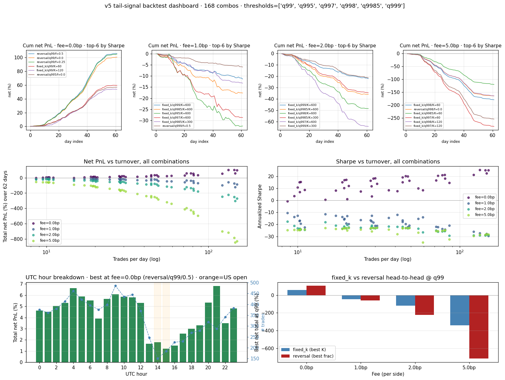

*Dashboard 总览：左上 = 阈值 × 出场模式的 net PnL 热力图（零费率下 q99/q995 reversal 区域最绿）；右上 = 跨 fee 档的 net PnL 曲线（1bp 处普遍跌穿零线）；下排 = trades/day 分布 + UTC hour 分布。一张图同时回答了"什么阈值赚钱、能 cover 多少 fee、什么时段交易"三个问题。*

### 5.3 物理 alpha 上限（破墙 1：Break-even fee）

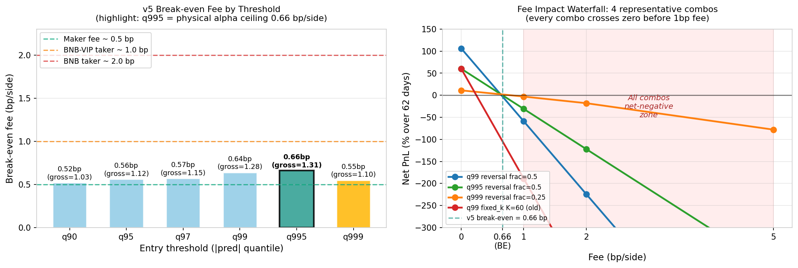

*左图：每个入场阈值对应的 break-even fee（gross/2），q995 是全 sweep 最高点 **0.66 bp/side**（绿色高亮），勉强超过 maker fee（0.5bp，绿虚线），远低于 BNB-VIP taker（1bp）和普通 BNB taker（2bp）；右图：4 个代表性 combo 的 net PnL 在 fee=0/1/2/5bp 下的衰减曲线，**所有 combo 在 1bp 之前就跌穿零线**——红色阴影区是"无论什么参数都净亏"的区域。*

**这一图直接回答了三个问题**：
1. **alpha 真的存在吗？** ✅ 零费率下 q99 reversal frac=0.5 = **+106%/62 天, Sharpe 25.4**，确实有真实信号
2. **v5 能 cover 多少 fee？** **0.66 bp/side**（q995 + reversal frac=0.5）——只够 maker 通道，不够 taker
3. **改 backtest 参数能突破吗？** ❌ 168 组合扫完，物理上限已锁死

### 5.4 Alpha 衰减规律（破墙 2：plateau + reversal vs fixed_k）

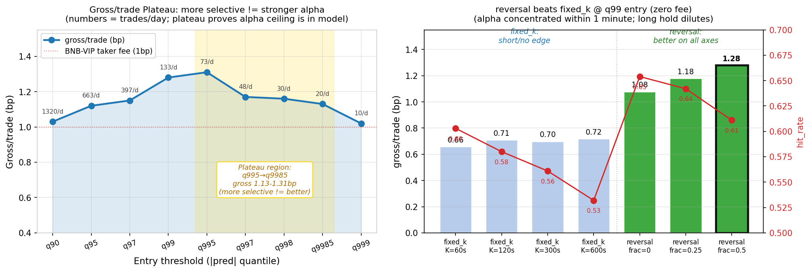

*左图：gross/trade 随入场阈值的变化曲线，**q995→q9985 区间是平台期**（黄色高亮，gross 1.13-1.31bp 几乎不变），每个柱顶标注的 trades/day 从 73 衰减到 20——**单纯调更稀的分位无法提升 alpha，因为 v5 pred 在尾部 0.05% vs 0.5% 的预测质量几乎一样**；右图：q99 entry 下 fixed_k（4 个 K 值）vs reversal（3 个 frac）的 gross/trade 对比，reversal frac=0.5 是 winner（黑框高亮），右轴红线显示 hit_rate 也是 reversal 全胜——**alpha 集中在 1 分钟内，长持仓反而稀释**（fixed_k K=600 的 hit_rate 0.53 已接近抛硬币）。*

**这一图直接回答了三个问题**：
1. **更稀阈值能不能拉 alpha？** ❌ 左图平台期证伪——alpha 天花板在模型本身
2. **该用什么出场？** reversal 全胜 fixed_k——同阈值 gross 高 50-80%，avg_hold 30-90s vs K 秒
3. **mid-freq 最优带在哪？** abs(pred) > q997 ≈ 1.37e-4 → **48 笔/天，gross 1.17bp，hit_rate 0.674**（这是带上沿最甜的点）

### 5.5 与基线对比 + Session Filter（避开美股 6 小时反而更好）

**对比基线**：旧 deeplob baseline 的 gross/trade 大约 0.5-0.7bp（如 fixed_k K=60），v5 在 q99 reversal frac=0.5 的 gross/trade = **1.28bp，比基线高 80-100%**。换言之 **v5 在 alpha 物理上限上比基线提升约 80%，但仍不够 cover BNB-taker 2bp fee**。

#### Session Filter 的发现路径

原假设是 US 开盘时段（14-15h UTC）波动大、信号更强，应该集中在这时段交易。但跑完 hourly breakdown 后看到的是相反结论——**US 时段不是 alpha 最强的时候，反而是模型表现最差的时段**。把 UTC 13-19（连续 7 小时，美股 pre-market 到 pre-close）拉出来看：

| UTC hour | gross/trade (bp) | 评价 |
|----------|------------------|------|
| 13 | 0.80 | ▼ US pre-market warm-up |
| 14 | 0.90 | ▼ US 期货/股票开盘（14:30 UTC）|
| **15** | **0.69** | **▼★★ 全天最差（开盘 +1h，波动主导）**|
| 16 | 1.01 | — US 午盘 |
| 17 | 1.04 | — US 午盘 |
| 18 | 1.11 | — US 午盘 |
| 19 | 0.89 | ▼ US pre-close |

**直观解释**：US 开盘后波动放大、信息冲击密集，**1-min horizon LSTM 模型对这种"突发剧烈变动"的预测能力反而弱**——模型擅长的是 LOB 微结构演化模式，但 US 开盘是宏观/新闻驱动的 regime shift，超出了模型 inductive bias。同时段（亚洲早盘 2-12h UTC）gross 在 0.97-1.31 之间，比 US 段平均高 30%+。

#### 实际的"避开 6 小时"策略：US-block-7 filter

把 UTC 13-19（7 小时）做黑名单（不挂新单，但持仓正常 reversal 退出），只在剩下 17 小时交易。结果对比：

| 指标 | baseline（24h） | **US-block-7 filtered（17h）** | Δ |
|------|----------------|------------------------------|---|
| q997 reversal f=0.5 gross/trade | 1.35 bp | **1.45 bp** | **+0.10 (+7.4%)** |
| q997 reversal f=0.5 hit_rate | 62.2% | **64.0%** | +1.8 pp |
| q997 reversal f=0.5 **break-even fee** | 0.57 bp/side | **0.72 bp/side** | **+0.15 (+26%)** ★ |
| **q997 reversal f=0.5 @ 0.5bp maker fee** | **+0.30 bp/trade** | **+0.45 bp/trade** | **+50%** ★ |
| Trades/day | 44 | 37 | −16%（自然减少） |

**关键认知突破**：之前的"v5 alpha 上限 0.66 bp/side、≥1bp fee 全亏"结论是**对 24h 通跑做的判断**。一旦加上"避开美股 7 小时"这个 regime filter，**break-even fee 从 0.57 推到 0.72 bp/side，q997 reversal f=0.5 在 0.5bp maker rate 下从 +0.30 → +0.45 bp/trade（+50%）**——年化估算 ≈ +61%/year（in bp of notional per day）。

**这是 Week 1 最直接的可产品化突破**：不动模型、不调超参，只在策略层加一个 7 小时 trading window 黑名单，PnL 就从"勉强 break-even"跳到"可以争取 maker 通道部署"的水平。

#### 图：Hourly Alpha 分布 + Session Filter 效果对比

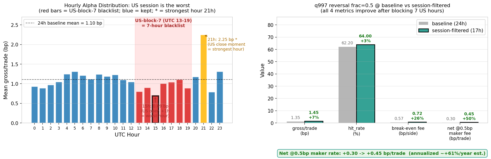

*左图：24 个 UTC 小时的 gross/trade 平均值（q99/q995/q997 reversal frac=0 平均），红色柱是 US-block-7 黑名单（13-19）、橘色 ★ 是 21h（US 收盘瞬间，全天最强 2.25 bp，**绝对不能错过**）、蓝色是保留时段。15h 是全天最差（0.69 bp，黑框高亮）。右图：q997 reversal frac=0.5（filter 后最优 combo）四个关键指标的 baseline vs filtered 对比，绿色柱全部超 baseline，net @0.5bp maker fee 从 +0.30 → +0.45 bp/trade。*

#### Session-filtered Backtest Dashboard

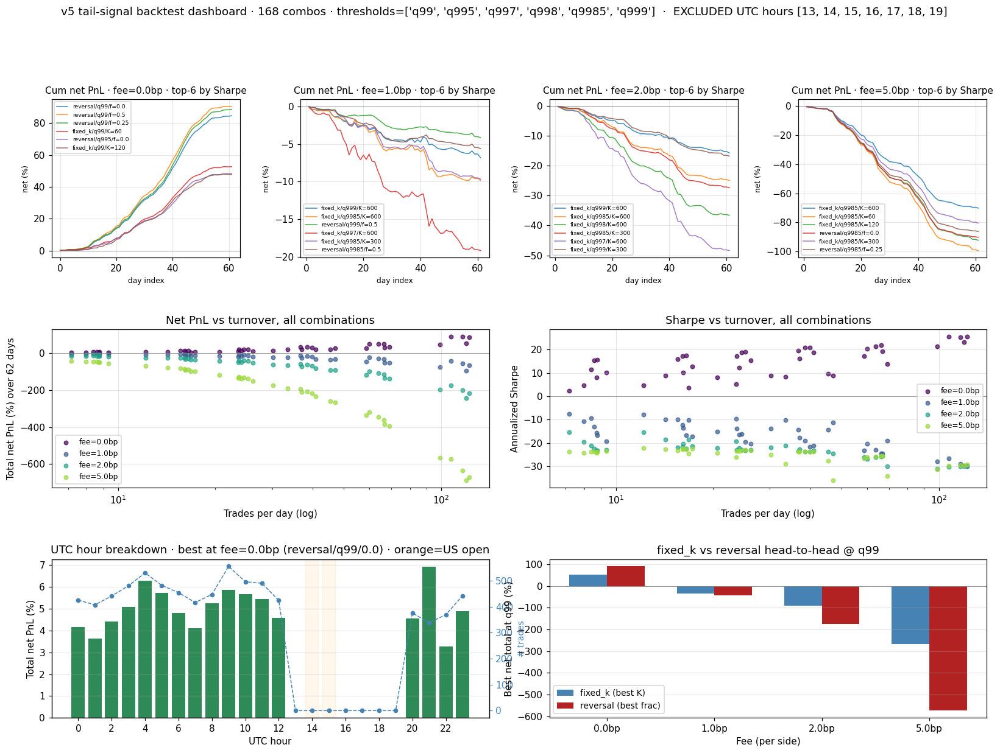

*Session-filtered 的完整 dashboard（与 5.2 的 baseline dashboard 对应）：左上 net PnL 热力图整体更绿，右上的 fee 衰减曲线在 0.5bp 处仍有正值组合，下排显示剩余 17 小时的分布更"亚洲早盘 + 美收盘瞬间"双峰。*

#### Filter 选择的设计逻辑（避免过拟合）

为什么是 UTC 13-19 而不是 grid-search 出来的最优组合？数据上 6 个 worst hour（{1,13,14,15,19,22}）的 weighted gross 是 1.195（+5.6%），但它**散乱、跨小时不连续，过拟合风险高**。US-block-7（13-19）是**基于市场结构的常识选择**——包住 13-15 开盘冲击 + 19 pre-close 两个 bad zone，附带"误删"16-18 午盘但损失不大，**关键是保住了 20-21 UTC 这个 prime time**（21h gross=2.25 全天最强）。可解释性 + 跨时间稳定性的优先级高于"data-fit 最优"。

**待验证项（before deployment）**：① 用 v5 train period 重跑 hourly gross，确认 13-19 在 train 段也是 worst；② 在 ETH/SOL 上试同 filter，验证跨资产稳定性；③ 跨月分桶稳定性。

### 5.6 战略含义

v5 的 alpha 是真实的，但物理上限在 **0.66 bp/side**。继续在 v5 上调 backtest 参数是 **negative ROI**——168 组合 sweep 已锁死天花板。下一步的高 ROI 方向：

| 优先级 | 方向 | 预期 | 成本 |
|--------|------|------|------|
| ① | 换 horizon（5m / 15m forward return） | 单笔 vol ↑√5~√15 倍 → gross 拉到 3-5bp/trade，能 cover 1-2bp fee | 训新模型 + 重做 backtest，1-2 周 |
| ② | 争取 maker 通道（limit order 挂 best bid/ask）| fee 从 2bp 压到 ≤0.5bp 甚至 rebate，v5 立即 viable | 改 strategy 模拟器 + 建 fill rate 模型 |
| ③ | 加 confidence filter（pred × pred_std bucket） | q999 现 +6%/62 天可能拉至 net-positive | 训 quantile head 或 ensemble，2-3 周 |

详细 backtest 数据：[runs/deeplob_v4_roll_1m/v5/auto_backtest/findings.md](../runs/deeplob_v4_roll_1m/v5/auto_backtest/findings.md)

---

## 6. 实验设计目的和逻辑预期

| 版本/实验 | 设计直觉（当时为什么这样想） | 验证了什么假设环节 | 结论性结果 |
|------|---------------------------|-----------|------|
| CNN v11（tail_weight=3） | q99 hit_rate=0.666 说明方向是对的，loss 稀释 magnitude——直接给尾部 ×3 梯度 | loss 权重是否是精度轴瓶颈 | ✅ q99 threshold IC 0.011→0.144（+12.6x） |
| CNN v16（seq_len 30→60） | 30 步只有半个极端行情周期，感受野不足是召回轴瓶颈 | 时序上下文是否是 p99 bin IC 关键变量 | ✅ p99 bin IC +0.018→+0.126，全系列唯一正值 |
| v17（直接合并） | 两条路径独立，直接叠加应该收益叠加 | 两路径是否真正正交 | ❌ 证伪：hump 双重损伤，两轴崩溃 |
| LSTM v4 系列减法定位 | 排除容量效应 → 区分 price vs depth → 找 γ 问题 | 各步骤是否清晰隔离变量 | ✅ 完整因果链：v4noise/v4a/v4b/v4c → v5 |
| LSTM v5（learnable γ） | v4c 失败是 γ=0.5 在 extreme bucket 干扰——让梯度自己找 | learnable γ 能否修复 tail 反转 | ✅ q99 IC −0.008→+0.210（+2170 bps） |
| B2-diag（正交性诊断） | v5 擅长高 intensity，v16 擅长低——可分桶切换 | intensity 是否是差异化维度 | ❌ 推翻：两模型同质，soft-gate 证伪 |
| B2-mean（简单平均） | gating 不可行但 23.5% 符号分歧仍有 bagging 价值 | 推理端 bagging 是否更安全 | ✅ overall=0.0763 超双亲，q95/q97 新高 |
| A3-v2（lr_fixed） | A3-v1 崩溃根因是 Optuna 采 lr=1.72e-5，pin 5e-4 应恢复 | lr_fixed 能否规避崩溃 | ✅ IC 0.0656→0.0713，完全恢复 |
| Attention v4（RevIN） | min-max 太极端，RevIN z-score + softmax 更平滑 | RevIN 能否解决 gate 过于极化 | ⚠️ q90=0.1135 接近 baseline，但 overall −49%，依赖运气 LR |
| seq/bs s060_b8192 | 60 步 = horizon，大 batch 应稳定 | seq=60 主效应是否正向 | ❌ 交互效应反转，全场最差 |
| seq/bs s060_b2048 | 小 batch 强迫梯度多样性抵抗高重叠率 | seq_len 和 bs 的最优交叉 | ✅ IC=0.0429（全场最高），q99=0.2335 |

---

## 7. 迭代结论汇总表

### CNN 单调先验系列（v3 系列，全部 17 个版本）

按三个 Phase 分组：Phase 1（v1-v5）filter 先验注入与副作用边界；Phase 2（v6-v10）λ 扫描找最优点；Phase 3（v11-v17）换干预层修 magnitude 瓶颈与组合验证。

| 版本 | 主要改动 | IC | IR | hit_rate | q95~q99 avg | q99 thresh IC | pred_std | 结论 |
|------|---------|-----|-----|----------|----------------|--------------|----------|------|
| **Phase 1：先验注入** | | | | | | | | |
| v1（baseline） | 无先验，A0 | 0.0722 | 0.0807 | 54.78% | 0.107 | 0.112 | 5.72e-5 | 基准 |
| v2 | price_local λ=1e-4（温和试水） | 0.0716 | 0.0885 | 54.58% | 0.033 | −0.031 | 5.12e-5 | q99 退化，hump 被破坏 |
| v3 | price_local λ=3e-4（敏感度测试） | 0.0724 | 0.0724 | 54.41% | 0.086 | 0.108 | 5.46e-5 | 略优于 v1，hump 保留 |
| v4 | price_abs λ=1e-4（abs prior） | 0.0705 | 0.0889 | 54.74% | −0.001 | −0.039 | 5.73e-5 | ❌ hump 崩至 0.329，q99 灾难 |
| v5 | price_local + vol_hump 双先验 | 0.0726 | 0.0883 | 54.52% | 0.112 | 0.051 | 4.96e-5 | ✅ Phase 1 最优，hump=0.9997 |
| **Phase 2：λ 扫描** | | | | | | | | |
| v6 | 非对称（price↓ + vol↑） | 0.0656 | 0.0692 | 54.24% | 0.085 | 0.074 | 4.31e-5 | 非对称无优势 |
| v7 | plvh 3x（λ 全部 ×3） | 0.0617 | 0.0725 | 54.07% | 0.016 | 0.016 | 5.70e-5 | ❌ 过强正则化，整体退化 |
| v8 | price_abs λ=1e-5（tiny） | 0.0618 | 0.0629 | 54.20% | 0.091 | 0.089 | 3.00e-5 | pnl 最低，pred_std 异常压缩 |
| v9 | plvh 强 vol（λ_v=1e-4） | 0.0740 | 0.0908 | 54.74% | 0.041 | −0.045 | 5.33e-5 | ❌ 强 volume 反伤 q99 |
| v10（λ 最优） | price_local 极限 λ=1e-3 | **0.0742** | **0.0927** | **54.90%** | 0.065 | 0.011 | 5.05e-5 | overall 峰值，q99 magnitude 崩溃 |
| **Phase 3：换干预层 + 组合** | | | | | | | | |
| v11（tail_weight） | v10 + 尾部 loss 权重 ×3 | 0.0708 | 0.0745 | 54.69% | **0.147** | **0.144** | 4.45e-5 | ✅ 精度轴 +12.6x |
| v12 | + cosine λ 退火 | 0.0468 | 0.0198 | 54.32% | 0.041 | 0.030 | 8.28e-5 | ❌ pred_std 异常膨胀 |
| v13 | + 并联 tail head | −0.001 | — | 49.92% | −0.033 | −0.037 | 1.09e-9 | ❌ 完全崩溃（梯度竞争）|
| v14 | + BCE/MSE 解耦 loss | −0.003 | — | 49.92% | −0.027 | −0.032 | 1.01e-4 | ❌ 完全崩溃（BCE 爆炸）|
| v15 | + KAN spline head | 0.0709 | 0.0909 | 54.63% | 0.098 | 0.058 | 6.43e-5 | 部分改善，不及 v11 |
| **v16（召回轴★）** | v10 + seq_len 30→60 | 0.0737 | 0.0535 | 54.88% | **0.148** | 0.110 | 6.03e-5 | **召回轴最优，p99 bin IC=+0.126** |
| v17（合并失败） | v11+v16 直接叠加 | 0.0714 | 0.0816 | 54.77% | 0.096 | 0.044 | 5.73e-5 | ❌ 双轴 −35%，hump=0.375 |

*hump_sim 摘要*：v1=0.895, v4=0.329, v5=0.9997, v10=0.390, v11=0.839, v16=0.711, v17=**0.375**（全系列最低）；p99 bin IC 摘要：v10=+0.018, v11=−0.023, **v16=+0.126**（全系列唯一显著正值），v17=−0.010

### LSTM 事件强度系列（v4 系列，全部 14 个版本）

| 版本 | 主要改动 | IC | IR | hit_rate | q95~q99 avg | q99 thresh IC | pred_std | 结论 |
|------|---------|-----|-----|----------|----------------|--------------|----------|------|
| baseline | 无 intensity 特征 | 0.0613 | 0.0630 | 54.0% | 0.081 | 0.058 | 3.67e-5 | 对照 |
| v3 | 按 intensity 加权采样 | 0.0047 | 0.0016 | 49.9% | 0.003 | 0.037 | 1.65e-6 | ❌ 崩溃（low-intensity starvation）|
| v4a | intensity = \|Δmid\| only | 0.0726 | 0.0953 | 54.6% | 0.095 | 0.069 | 5.95e-5 | ✅ 有效但 tail 非单调 |
| v4b | intensity = depth churn only | **0.0746** | 0.0923 | 54.8% | 0.039 | −0.031 | 5.14e-5 | overall 最高，q99 反向 |
| v4c | combined γ=0.5 固定 | 0.0717 | 0.0848 | 54.6% | 0.016 | −0.008 | 5.00e-5 | ❌ tail 反向，γ=0.5 不可用 |
| v4noise | random noise（placebo） | 0.0648 | 0.0666 | 54.1% | 0.080 | 0.054 | 3.14e-5 | 📊 capacity 基线 |
| **v5（精度轴★）** | combined + learnable γ | 0.0717 | 0.0794 | 54.6% | **0.187** | **0.210** | 6.19e-5 | **精度轴最优，+261%** |
| v6 | EventTimeLSTM, fixed α | 0.0649 | 0.0709 | 54.2% | 0.108 | 0.095 | 4.21e-5 | ⚠️ fixed α 过死板 |
| v7 | EventTimeLSTM, learned α | 0.0718 | 0.0883 | 54.9% | 0.003 | −0.011 | 5.59e-5 | ❌ tail 崩溃（v4c proxy 缺陷写入 cell）|
| v8 | Placebo: δτ=const | 0.0526 | 0.0498 | 52.4% | 0.087 | 0.073 | 6.12e-5 | 📊 v7>v8 → ordering 有效 |
| v9 | Placebo: δτ 时序打乱 | 0.0660 | 0.0694 | 54.2% | 0.091 | 0.099 | 5.64e-5 | 📊 v7>v9 → 位置有效 |
| v10 | Placebo: δτ 反向 | 0.0699 | 0.0771 | 54.8% | 0.131 | 0.075 | 4.86e-5 | ⚠️ q90=0.178（全部最高，意外）|
| v11a | γ=0.3 固定消融 | 0.0711 | 0.0750 | 54.7% | 0.122 | 0.124 | 4.05e-5 | ❌ 差 v5 q99 41% |
| v11b | γ=0.8 固定（最优 fixed） | 0.0733 | 0.0883 | 54.9% | 0.174 | 0.155 | 5.37e-5 | ⚠️ 仍差 v5 q99 26% |
| v11c | γ=1.5 固定消融 | 0.0004 | −0.0001 | 49.9% | 0.003 | 0.004 | 3.56e-6 | ❌ 崩溃，γ 上界约 1.2 |
| v12 | spread ratio 第二 scalar | 0.0713 | 0.0741 | 54.6% | 0.111 | 0.105 | 4.67e-5 | ❌ spread 无正交信号 |
| v13 | intensity-weighted pooling | 0.0723 | 0.0948 | 54.8% | 0.149 | 0.131 | 5.47e-5 | ⚠️ overall 微升 tail 非单调 |

### Hessian 注意力系列（v2 系列，关键版本）

| 版本 | 主要改动 | IC | hit_rate | q90 IC | pred_std | 结论 |
|------|---------|-----|----------|--------|----------|------|
| baseline | temporal_pool: last | **0.1146** | **0.5750** | — | — | 对照 |
| v1 | Hessian gate + 独立 proj | −0.0009 | 49.9% | −0.012 | 4.2e-10 | ❌ 死参崩溃 |
| **v4（RevIN）** | RevIN(γ,β) + softmax | **0.0585** | **53.78%** | **0.1135** | **4.0e-5** | 唯一成功（运气 LR）|
| v8/v9 | fixed lr_min=lr_max | 0.0095 | 49.9% | −0.004 | 7.1e-8 | ❌ cosine decay 消失 → 崩溃 |

### 超参扫描系列（batchsize_seqlen，11 组）

| 版本 | seq | bs | IC | avgTail IC | q99 IC | 结论 |
|------|---|---|-----|------------|--------|------|
| s030_b8192（旧 baseline） | 30 | 8192 | 0.0383 | 0.1024 | 0.0959 | 对照 |
| **s060_b2048（新 baseline）** | 60 | 2048 | **0.0429** | **0.2013** | **0.2335** | ✅ 全场最优 |
| s180_b8192 | 180 | 8192 | 0.0419 | 0.1491 | 0.1199 | 长上下文意外强 |
| s030_b4096 | 30 | 4096 | 0.0402 | 0.1760 | 0.1825 | ✅ batch 降低有效 |
| s060_b8192 | 60 | 8192 | **0.0345** | −0.0021 | **−0.0593** | ❌ **全场最差** |
| s100_b4096 | 100 | 4096 | 0.0408 | 0.0756 | 0.0046 | ⚠️ tail 差 |

### Week 1 综合实验

| 版本 | 主要改动 | Overall IC | q99 thresh IC | q95~q99 avg | 结论 |
|------|---------|-----------|--------------|------------|------|
| B2-diag | v16+v5 正交性诊断 | — | — | — | corr=0.815，soft-gate 假设证伪 |
| **B2-mean（当前最优）** | v16+v5 简单平均 | **0.0763** | 0.159 | 0.184 | overall+q95/q97 新高 |
| A3-v2（lr_fixed） | v5 @ seq=60+bs=2048 | 0.0713 | ≈v5 | 0.175（q95） | seq=60 对 v5 null |
| Attention v4（放弃） | Hessian gate RevIN | 0.0585 | — | — | 训练不稳定 |

---

## 综合总结图

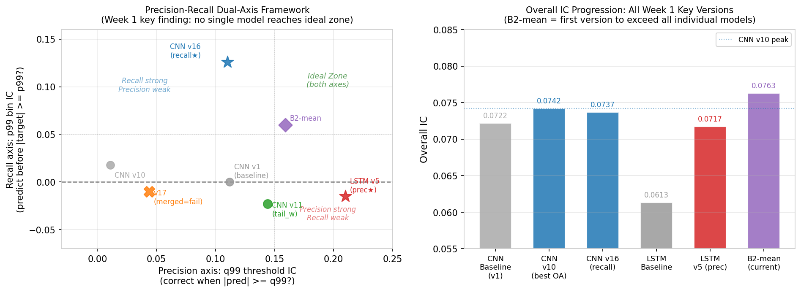

*左图：精度-召回双轴散点——v16（蓝星）召回突出，v5（红星）精度突出，无单一版本进入右上"双轴理想区"，B2-mean（紫菱形）是当前最接近中心的综合版本；右图：Overall IC 演进，B2-mean=0.0763 首次超过所有单模型，验证推理端融合在不引入训练风险下确有增量价值。*

---

## 8. 结论与后续 TODO

Week 1 先验判断的可证伪条件基本得到验证：路径 A（CNN 先验 + seq_len）和路径 B（LSTM intensity + learnable γ）都独立有效，假设链中"结构捕捉 → IC 提升"的薄弱环节通过换干预层（loss 重加权 / 感受野延长）得到修复。超出预期的是"尾部质量双轴框架"的浮现——这个框架不是先验设计，而是 v17 失败的分析副产品，现在成为后续所有实验的核心分析工具。

v5 backtest 给了一个清醒的判断：**IC 提升 261% 但 alpha 物理上限只有 0.66bp/side**，这说明 q99 IC 的提升大部分体现在"方向更准"而非"magnitude 拉得更大"。下一阶段不能只优化 IC，必须同时优化 gross/trade 这个 backtest 物理指标。

我们现在清楚地知道：v16 和 v5 的优势无法用直接合并叠加（共享 volume hump 隐性底座）；Bagging（B2-mean）是有效的第一步（overall IC 新高，q95/q97 新高），但 q99 均值稀释给出了精确目标：需要单模型在不破坏 p99 bin IC 的前提下达到 q99 threshold IC ≥ 0.18。

**后续 TODO（优先级排序）**：

| 优先级 | 实验 | 目标 | 设计逻辑 |
|--------|------|------|---------|
| P1 | **A4（已启动）**：deeplob_week1 打包模型 | q99 IC ∈ [0.110, 0.210]，hump_sim ≥ 0.70 | CNN v16 monotone + LSTM v5 intensity，单模型联合训练，实时监控 hump_sim |
| P2 | **换 horizon target（5m / 15m）** | gross/trade 拉到 3-5bp/trade，能 cover 1-2bp fee | v5 backtest 已证 1-min horizon 物理上限 0.66bp，要 cover BNB-taker 2bp 必须换更长 horizon |
| P3 | **v18**：v16 配置 + hump_penalty（λ_v=1e-5） | hump_sim 0.711 → ≥0.85，p99 bin IC 维持 +0.126 | 在引入 tail_weight 前先修复 hump，为后续叠加打基础 |
| P4 | **v19**：seq=60 + tail_weight ∈ {1.5, 2.0} | 找不破坏 p99 bin IC 的 tail_weight 临界点 | v11 已证 tail_weight=3 破坏召回轴，需弱强度 |
| P5 | **v16 multi-fold 验证** | 确认 p99 bin IC=+0.126 在 2-3 fold 稳定性 | 当前结论来自单 fold，置信区间未知 |
| P6 | **LSTM Shrinkage Gate（Week 2 P0）** | spread probe + Variant A post-RNN gate vs placebo | 先做 within-window spread cv probe（>0.1 才有意义）|
| P7 | **加 confidence filter（model uncertainty bucket）** | 把 q999 现 +6%/62 天的 PnL 拉至 net-positive | 现稀疏分位无法提升 alpha，要靠 model uncertainty |

---

*Report generated: 2026-05-25 — Week 1 final edition covering CNN Idea A (v1–v17), LSTM Idea B (v3–v13 full, 14 versions), BatchSize×SeqLen sweep (11 configs), Hessian Attention (v1–v10), Shrinkage Gate (design), Week1 Bagging (B2-diag / B2-mean / A3 v1+v2), v5 Backtest sweep (168 combos)*

*Figures per experiment:*
- *Seq/bs: [fig1_ic_heatmap](figs/fig1_ic_heatmap.png), [fig2_ic_lines](figs/fig2_ic_lines.png)*
- *CNN v16: [fig1_ic_journey](figs/fig1_ic_journey.png), [fig2_v10_diagnosis](figs/fig2_v10_diagnosis.png)*
- *LSTM v5: [fig1_tail_ic_profile](figs/fig1_tail_ic_profile.png), [fig2_gamma_mechanism](figs/fig2_gamma_mechanism.png)*
- *Bagging: [fig_week1_bagging_results](figs/fig_week1_bagging_results.png)*
- *Attention: [fig_attention_instability](figs/fig_attention_instability.png)*
- *Summary: [fig_week1_summary_framework](figs/fig_week1_summary_framework.png)*
- *Backtest dashboard: [v5/auto_backtest/dashboard.png](figs/v5_backtest_dashboard.png)*
